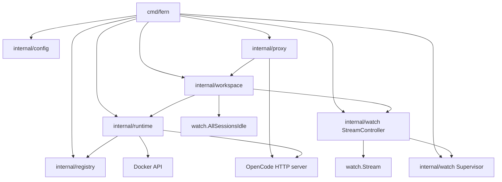
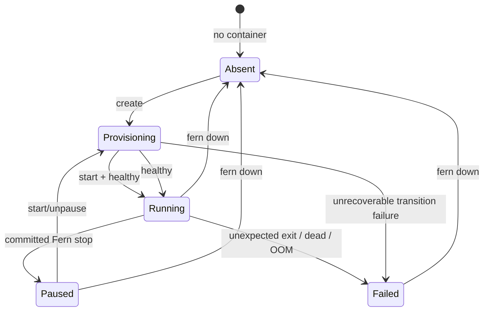
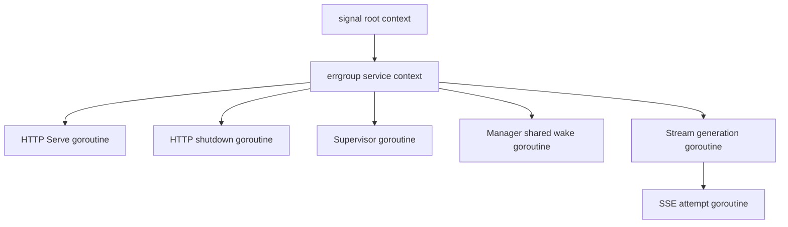

# Fern Architecture Deep Dive

**Code snapshot:** repository HEAD as inspected on 2026-08-15  
**Purpose:** explain the current implementation from process startup through wake, proxying, activity tracking, pause, persistence, failure, and shutdown.  
**Authority:** code is authoritative. This document distinguishes implemented behavior, tested behavior, assumptions, and known limitations.

## 1. The Shortest Accurate Mental Model

Fern is one native Go process controlling one OpenCode process inside one Docker container.

Fern gives clients a stable HTTP address. The OpenCode container has an ephemeral loopback address because Docker can assign a different host port after lifecycle changes. Fern starts or resumes the container before forwarding work, watches OpenCode session activity over SSE, and stops the container only after a conservative idle protocol.

```text
                     stable address
                          |
                          v
Client --------------> Fern proxy
                          |
                          | dynamic loopback address
                          v
                    OpenCode container
                          |
                          v
                    model providers
```

The central distinction is:

```text
workspace identity != container identity != backend endpoint
```

- The workspace name is stable configuration.
- A container has an immutable Docker ID and may be removed and recreated.
- The OpenCode backend uses a dynamically published loopback port.
- Fern's proxy listener is intended to remain stable while those implementation details change.

Fern is not a remote-development platform, scheduler, sandbox fleet, identity provider, or replacement OpenCode client. OpenCode owns sessions and coding behavior. Docker owns the container primitive. Fern owns admission to that container and the conservative stop/wake policy.

## 2. What Runs Where

### 2.1 Process And Storage Topology

```mermaid
flowchart LR
    subgraph ClientMachine[Client machine]
        Browser[Browser]
        Attach[opencode attach child process]
    end

    subgraph Host[Docker host]
        Fern[fern up native Go process]
        Lock[~/.fern/locks]
        Intent[~/.fern/state]
        Repo[Host repository]
        Docker[Docker daemon]

        subgraph Container[Fern-owned container]
            OC[opencode serve :4096]
            Work[/home/user/workspace]
            Data[/home/user/.local/share/opencode]
        end

        Volume[Docker named volume]
    end

    Browser -->|HTTP to stable proxy| Fern
    Attach -->|HTTP to stable proxy| Fern
    Fern -->|Docker API| Docker
    Fern -->|HTTP to dynamic 127.0.0.1 port| OC
    Docker --> Container
    Repo -->|read/write bind mount| Work
    Volume -->|read/write volume mount| Data
    Fern --- Lock
    Fern --- Intent
    OC -->|HTTPS and other egress| Providers[Model providers, Git, package registries]
```

Fern itself is not containerized. `fern up` runs on the host as the long-lived controller. The image starts:

```text
opencode serve --hostname 0.0.0.0 --port 4096
```

The container port is published to a Docker-selected host port bound to `127.0.0.1`. Fern discovers that port and talks to it directly for health, events, status, and proxy forwarding.

### 2.2 Network Paths

```text
Client
  |
  | HTTP, configured Fern listener (default 127.0.0.1:8080)
  v
Fern net/http server
  |
  | httputil.ReverseProxy
  v
127.0.0.1:<Docker-selected-port>
  |
  | Docker port publication
  v
OpenCode :4096 inside the container
```

There are three distinct addresses:

| Address | Stability | Owner | Purpose |
|---|---|---|---|
| Fern listener | Configured and normally stable | Fern | Client ingress |
| Client-visible origin | Deployment concern; not represented separately today | External networking/TLS deployment | URL a laptop or phone can actually use |
| OpenCode backend | Dynamic and process-local | Docker runtime | Fern-to-OpenCode traffic |

By default, `fern attach` derives an HTTP URL from the listener and rewrites wildcard listeners to loopback. `fern attach -url https://host.tailnet.ts.net` accepts an explicit absolute HTTP(S) root origin when Tailscale Serve, TLS, or another private reverse proxy gives clients a different address.

### 2.3 Filesystem Paths

```text
Host repository
  -> bind mounted read/write
  -> /home/user/workspace

Docker named volume
  -> mounted read/write
  -> /home/user/.local/share/opencode

Host ~/.fern/locks
  -> cross-process workspace lease files

Host ~/.fern/state
  -> durable pending/committed pause intent

Container writable layer
  -> tools and files outside the two mounts
  -> survives Docker stop/start
  -> removed by fern down
```

## 3. Component Map



| Package | Responsibility | Important files |
|---|---|---|
| `cmd/fern` | CLI dispatch, dependency wiring, process lifetime, signals and HTTP server | `main.go`, `up.go`, `commands.go`, `attach.go`, `helpers.go` |
| `internal/config` | Strict YAML, defaults, flags, environment expansion and validation | `config.go` |
| `internal/registry` | Host-local exclusive lease and durable pause intent | `lock.go`, `intent.go` |
| `internal/runtime` | Docker lifecycle, ownership, desired-spec checks, health and runtime observations | `runtime.go`, `docker.go`, `health.go` |
| `internal/workspace` | Request admission, wake coalescing, endpoint cache and pause authorization | `manager.go` |
| `internal/watch` | OpenCode SSE parser, stream generations, activity reducer, timer and status snapshot | `event.go`, `controller.go`, `supervisor.go`, `status.go` |
| `internal/proxy` | Request classification and streaming reverse proxy | `proxy.go` |

## 4. Important Domain Values

Understanding Fern is easier when its values are kept separate.

### 4.1 Desired Runtime: `runtime.Spec`

```go
type Spec struct {
    Name        string
    Image       string
    RepoPath    string
    MemoryBytes int64
    Env         map[string]string
}
```

This is normalized desired state. Authentication is not a separate field. `Spec.ServerAuth()` derives it from `OPENCODE_SERVER_USERNAME` and `OPENCODE_SERVER_PASSWORD` inside `Env`.

### 4.2 Observed Runtime: `runtime.Observation`

```text
Fern state
container ID
raw Docker status
running/frozen/OOM facts
exit code
resolved endpoint, if any
desired-spec fingerprint label
```

This value prevents policy from reducing every non-running container to the same condition. An intentional Fern stop, external clean exit, OOM, Docker freezer pause, and incomplete stop transaction need different handling.

### 4.3 Request Intent

| Intent | Typical request | Wakes compute | Holds admission lease | Invalidates previous idle boundary |
|---|---|---:|---:|---:|
| `observe` | canonical GET event stream | no | no | no |
| `read` | GET/HEAD health or session status | yes | yes | no |
| `work` | everything else, including WebSocket upgrades | yes | yes | yes |

Exact observation paths are `/event`, `/global/event`, and `/api/event`. Exact read paths are `/global/health` and `/session/status`. Unknown requests are conservatively classified as work.

### 4.4 Two Different Generations

Fern has two counters with different jobs:

| Counter | Owner | Protects against |
|---|---|---|
| Manager endpoint generation | `workspace.Manager` | An old proxy failure clearing a newer cached backend endpoint |
| Watcher epoch | `watch.StreamController` | Old SSE activity authorizing pause for a newer endpoint generation |

They are intentionally separate today. There is no single persisted lifecycle generation joining them.

### 4.5 Durable Pause Intent

The host-side pause record contains:

```json
{
  "containerID": "immutable-docker-id",
  "committed": false
}
```

`committed: false` means Fern began a stop transaction. `committed: true` means Fern observed the stop complete or reconciled it as complete. Binding the record to the immutable container ID prevents stale state from classifying a replacement container as intentionally paused.

## 5. Configuration To Running Process

### 5.1 Configuration Precedence

```text
defaults
  overridden by fern.yaml
    overridden by explicitly supplied flags
      followed by selected host environment forwarding
        followed by validation and normalization
```

Important behavior:

- The default workspace is `demo`.
- The default image is `fern/opencode:dev`.
- The default repository is the invocation working directory.
- The default memory limit is `8Gi`.
- The default idle duration is 10 minutes.
- The default listener is `127.0.0.1:8080`.
- Unknown YAML fields and trailing YAML documents are rejected for `up`.
- YAML-relative repository paths resolve relative to the YAML file.
- Flag-relative repository paths resolve relative to the invocation directory.
- Missing `$VAR` and `${VAR}` references are errors; `$$` is a literal dollar.
- Selected provider and OpenCode credentials are forwarded only when not already configured.

### 5.2 Startup Call Stack

```text
main
  -> run(args)
     -> runUp(args, logger)
        -> config.Load
        -> forwardedEnvironment
        -> config.Validate
        -> config.ParseMemoryBytes
        -> net.Listen                         # before Docker effects
        -> signal.NotifyContext
        -> errgroup.WithContext
        -> registry.Acquire                  # host-local flock
        -> newDocker
           -> registry.NewIntentStore
           -> runtime.NewDocker
              -> Docker client.FromEnv
        -> watch.NewStreamController
        -> workspace.NewManager
        -> manager.EnsureRunning             # initial create/resume
        -> create watch.Supervisor
        -> create proxy handler and HTTP server
        -> start supervisor goroutine
        -> start HTTP Serve goroutine
        -> start shutdown goroutine
        -> group.Wait
        -> manager.Close
        -> streamController.Stop
```

### 5.3 Side-Effect Ordering

Fern deliberately binds the proxy listener before acquiring the workspace lease or mutating Docker. An invalid or occupied listen address therefore fails without creating or starting compute.

The initial `manager.EnsureRunning` happens before the HTTP server begins serving. A successful `fern up` therefore starts with OpenCode healthy and its event stream attached.

## 6. Docker Runtime Model

### 6.1 Created Container

Fern creates a container with:

| Setting | Current behavior |
|---|---|
| Name | Workspace name |
| User | Image's non-root `user` |
| Command | Image command: `opencode serve` |
| Memory | Configured byte limit |
| Init | Docker init enabled |
| Restart policy | None |
| Repository | Read/write host bind mount |
| OpenCode data | Read/write named volume |
| Backend port | Container 4096 published dynamically to daemon loopback |
| Network | Default Docker network with outbound access |
| Credentials | Environment variables |

### 6.2 Ownership

Fern labels managed containers and volumes:

```text
dev.fern.managed=true
dev.fern.workspace=<workspace-name>
```

Containers also have:

```text
dev.fern.spec=<desired-spec-sha256>
```

Existing same-name resources without matching labels are refused. Mutations use the immutable container ID returned by inspection rather than relying on the mutable Docker name.

These labels protect against accidental mutation of cooperative resources. They are not a security boundary against someone with Docker API access, because that principal can forge labels and inspect or alter the container.

### 6.3 Desired-Spec Drift

The fingerprint includes workspace, image reference, repository path, memory, environment, init behavior, expected port, and data-volume identity. Resume also inspects selected actual Docker settings.

The check is deliberately conservative but not a complete container attestation. It does not establish immutable image identity when a mutable tag is reused, and it does not compare every possible Docker setting.

### 6.4 Runtime State Classification



The exact classification also depends on Docker facts and pause intent:

| Docker facts | Matching pause intent | Fern state |
|---|---|---|
| No container | any stale record | `absent` |
| Restarting | any | `provisioning` |
| Running and not frozen | any | `running` |
| Docker freezer-paused | any | `paused` |
| Exited/created | committed | `paused` |
| Exited/created | pending | `provisioning` |
| Exited | none | `failed` |
| Dead or OOM-killed | any | `failed` |

An unexpected exit code 0 is still `failed`. Fern does not infer intentional pause from a clean exit; it requires the matching durable record.

### 6.5 `Docker.EnsureRunning`

```text
Docker.EnsureRunning(spec)
  -> Status(workspace)
     -> inspect by name
     -> verify Fern ownership
     -> read matching pause intent
     -> classify runtime facts
  -> switch state
     absent       -> create(spec)
     paused       -> resumeObserved(spec, observation)
     provisioning -> resumeObserved(spec, observation)
     running      -> verify desired/actual spec + health
     failed       -> return ErrFailed
```

Create and resume resolve the dynamic endpoint and poll authenticated `GET /global/health`. Health polling has an outer 60-second budget, attempts approximately every 200 ms, and an HTTP attempt timeout.

If Fern transitioned compute but later health or observer attachment fails, it uses an independent bounded cleanup context to stop the container. This rollback is independent so cancellation of the initiating client cannot abandon newly started compute.

## 7. Request Handling

### 7.1 Proxy Call Stack

```text
net/http Server
  -> proxy.New(manager).ServeHTTP
     -> requestIntent(request)
     -> manager.AcquireRequest(request.Context, intent)
        -> admitRequest                       # read/work only
        -> ensureTarget                       # read/work
           OR runningTarget                   # observe only
        -> onRequest + supervisor ack         # work only
     -> httputil.ReverseProxy.ServeHTTP
     -> release admission lease               # after full response lifetime
```

`FlushInterval: -1` makes streaming responses flush immediately. A request lease lasts for the complete proxied lifetime, not merely until response headers arrive.

### 7.2 Warm Cached Request

This path is important because it is shorter than the old architecture document implied.

```mermaid
sequenceDiagram
    participant C as Client
    participant P as Fern proxy
    participant M as Manager
    participant S as Supervisor
    participant O as OpenCode

    C->>P: HTTP request
    P->>M: AcquireRequest(intent)
    M->>M: increment inFlight
    M->>M: return cached endpoint generation
    opt work request
        M->>S: ObservationRequest
        S-->>M: acknowledged after idle invalidation
    end
    M-->>P: target + release function
    P->>O: forward request
    O-->>P: streamed response
    P-->>C: streamed response
    P->>M: release; decrement inFlight
```

A cached request does **not** re-inspect Docker, rerun health, or prove that the watcher remains connected. If the watcher disconnected, the supervisor has cleared pause eligibility, so Fern fails safe by keeping compute running. If the backend endpoint has become stale, the request may receive a `502`; the proxy error handler invalidates that exact manager endpoint generation so a later request performs reconciliation.

### 7.3 Cold Wake

```mermaid
sequenceDiagram
    participant C as Client
    participant P as Proxy
    participant M as Manager
    participant D as Docker runtime
    participant O as OpenCode
    participant W as StreamController
    participant S as Supervisor

    C->>P: ordinary request
    P->>M: AcquireRequest
    M->>M: admit request; inFlight++
    M->>M: create or join shared wakeCall
    M->>D: EnsureRunning(spec)
    D->>D: inspect ownership, state and spec
    D->>D: start/create if needed
    D->>O: authenticated /global/health
    O-->>D: 200 healthy
    D-->>M: endpoint, transitioned=true/false
    M->>W: Reconnect if transitioned; Connect otherwise
    W->>O: authenticated GET /event
    O-->>W: SSE response connected
    W->>S: connected(epoch)
    W-->>M: exact generation connected
    M->>M: publish cached endpoint generation
    opt work request
        M->>S: request invalidation
        S-->>M: handled
    end
    M-->>P: target + release
    P->>O: forward original request
    O-->>C: response through proxy
    P->>M: release; inFlight--
```

### 7.4 Shared Wake

`wakeMu` protects exactly one `wakeCall`. Concurrent requests wait on the same `done` channel. A caller can cancel its own wait, but the service-owned wake continues under a 90-second context derived from Fern's service lifetime.

This prevents one impatient caller from canceling work shared by other callers. `Manager.Close` joins the registered wake before Docker dependencies are released.

### 7.5 Endpoint Failure

Each forwarded request carries the endpoint and manager generation it used. If transport fails, `ReverseProxy.ErrorHandler` calls `InvalidateEndpoint` with that pair. The manager only clears its cache if the pair is still current. A late failure from an older request therefore cannot erase a newer endpoint.

Fern does not retry the original request after a proxy transport failure. It returns `502`; a later request wakes or reconciles.

## 8. Authentication And Trust Boundaries

### 8.1 Current Authentication Flow

Fern's health, SSE, status, and ingress proxy use one `runtime.ServerAuth` value. When a password is configured, Fern validates Basic credentials before request classification, admission, or wake. Valid credentials remain on the request so OpenCode enforces the same boundary upstream.

```mermaid
sequenceDiagram
    participant C as Client
    participant F as Fern
    participant M as Manager
    participant O as OpenCode

    C->>F: request with missing/wrong credentials
    F-->>C: 401; manager is not called
    C->>F: request with valid Basic credentials
    F->>M: classify, admit, and wake if required
    M-->>F: current endpoint generation
    F->>O: forward request with Authorization intact
    O-->>C: response through Fern
```

If no password is configured, Fern preserves the existing unauthenticated loopback behavior. Config validation still refuses a non-loopback listener without a password. This is application authentication, not TLS; remote credentials still require a private encrypted outer transport.

### 8.2 TLS

Fern serves plain HTTP. Basic credentials are not safe over an untrusted network without external TLS. A private tailnet or identity-aware TLS proxy is an operational requirement for remote use, not functionality Fern currently supplies.

### 8.3 Direct Backend Bypass

Fern prints the dynamic direct endpoint at startup. Local traffic sent directly there bypasses:

- request admission;
- work-request idle invalidation;
- stable endpoint handling.

Fern's conservative stop claim assumes work enters through the Fern proxy. Internal health, SSE, and status traffic intentionally use the direct endpoint; external mutation should not.

### 8.4 Container Trust Model

The current product is suitable only for a trusted-user, trusted-repository, single-host model. The container has a writable repository, provider credentials in its environment, persistent OpenCode data, and outbound network access. Fern does not configure a read-only root filesystem, custom seccomp/AppArmor policy, user namespace, or broad capability dropping.

Docker access is itself a privileged boundary. Docker-capable users can inspect credentials, mount data, mutate resources, and forge Fern labels.

## 9. Activity Observation

### 9.1 SSE Transport

`watch.Stream` opens authenticated `GET /event`, validates HTTP status and content type, parses complete SSE frames, supports multiline `data:` fields, limits frame size, decodes JSON, and emits generic events.

The lifecycle controller only converts `session.status` events into policy observations. Token and message events are not sent through the lifecycle queue.

### 9.2 Stream Controller

```text
StreamController
  owns one endpoint generation
  owns one monotonically increasing epoch
  serializes Connect/Reconnect/Stop
  cancels and joins replaced generations
  retries transport failures with backoff
  publishes connected/disconnected/status observations
```

`Connect` reuses the current generation only when the URL matches and it is currently connected. `Reconnect` always replaces it. Replacement cancels and joins the old generation before incrementing the epoch.

Automatic SSE reconnects to the same backend retain the same epoch. Each reconnect still publishes a fresh `connected` observation, and the supervisor clears old activity at that boundary.

Malformed or unknown `session.status` values produce `ObservationInvalidated`. They invalidate pause eligibility but do not terminate the SSE attempt.

### 9.3 Activity Reducer

The supervisor goroutine is the sole owner of:

```text
current epoch
connected flag
seenBusy flag
active session ID set
idle timer shell
```



```mermaid
stateDiagram-v2
    [*] --> Unknown
    Unknown --> Watching: connected(epoch)
    Watching --> Busy: busy/retry(session)
    Busy --> Busy: busy/retry(other session)
    Busy --> Countdown: final active session becomes idle
    Countdown --> Busy: busy/retry
    Countdown --> Unknown: request/invalidation/disconnect
    Watching --> Unknown: request/invalidation/disconnect
    Busy --> Unknown: request/invalidation/disconnect
    Countdown --> PauseCheck: idle timer fires
    PauseCheck --> Unknown: pause succeeds
    PauseCheck --> Countdown: pause deferred; short retry
```

Reducer rules:

| Observation | Effect |
|---|---|
| `connected(epoch)` | Select non-stale epoch, mark connected, clear prior activity |
| `disconnected(epoch)` | For a non-stale epoch, clear all pause eligibility |
| `request` | Clear prior idle eligibility and require a fresh busy-to-idle boundary |
| `invalidated` | Conservatively clear prior idle eligibility |
| `busy` or `retry` | Add session to active set, mark `seenBusy`, cancel timer |
| `idle` | Remove only a session previously observed active |
| Last active becomes idle | Arm the idle timer |
| Status from wrong epoch | Ignore |

An unsolicited idle event cannot arm pause. Fern must first have observed that session as busy or retry in the current connected activity boundary.

### 9.4 Timer Semantics

The timer is not proof of idleness. It only schedules a pause attempt.

When it fires, the supervisor first drains observations already waiting in the channel. This gives queued requests, disconnects, and busy observations a chance to invalidate the deadline before pause is considered.

`OnPause` runs synchronously under a 30-second default timeout. On failure, the supervisor keeps the earlier eligibility and retries after the shorter of five seconds and `IdleAfter`. Every retry still performs the manager's current-state checks.

## 10. Pause Safety Protocol

The normal running-container pause protocol layers multiple independent conditions:

```text
current connected watcher epoch
  + observed busy/retry
  + observed all known active sessions become idle
  + idle timer elapsed
  + queued invalidations drained
  + zero held proxy requests
  + lifecycle transition serialized
  + fresh Fern-owned Docker inspection
  + authenticated /session/status says every session idle
  + exact container-ID stop transaction
  = authorization to stop
```

### 10.1 Pause Sequence

```mermaid
sequenceDiagram
    participant O as OpenCode SSE
    participant S as Supervisor
    participant M as Manager
    participant A as Admission gate
    participant D as Docker runtime
    participant Q as /session/status
    participant I as Pause intent store

    O->>S: busy(session A)
    O->>S: idle(session A)
    S->>S: arm IdleAfter timer
    S->>S: timer fires; drain queued observations
    S->>M: Pause(30s context)
    M->>A: beginPause
    A->>A: require inFlight == 0; block new held requests
    M->>M: acquire lifecycle token
    M->>D: Status(workspace)
    D-->>M: current owned running container + endpoint
    M->>Q: authenticated GET /session/status
    Q-->>M: all sessions idle
    M->>D: Pause(workspace)
    D->>I: BeginPause(container ID)
    D->>D: ContainerStop(timeout=10s)
    D->>I: CommitPause(container ID)
    D-->>M: stopped
    M->>M: clear cached endpoint
    M->>A: endPause; admit requests again
    M-->>S: success
```

### 10.2 Admission Gate

Read and work requests increment `inFlight` before wake and decrement it after the complete proxied response. Pause does not wait for active requests; `beginPause` returns `ErrRequestsActive`, and the supervisor retries later.

Once pause marks `pausing`, new held requests wait on `pauseDone`. This closes the race where a request could enter between the authoritative all-idle snapshot and Docker stop.

Observation streams do not hold admission and do not wake stopped compute. Stopping OpenCode disconnects those streams.

### 10.3 Authoritative Status

`watch.AllSessionsIdle` performs authenticated `GET /session/status` with a bounded client and response body. It requires a JSON object. Every returned session value must have type `idle`. A `null` response, malformed JSON, network error, authentication failure, or busy session prevents the normal stop.

The SSE history establishes that a meaningful busy-to-idle boundary occurred. The status request establishes current all-session state after admission is closed. Neither alone is the complete policy.

### 10.4 Provisioning Exception

If the manager's fresh runtime observation is `provisioning`, `Manager.Pause` asks the runtime to finish/reconcile pause without querying `/session/status`. This supports an interrupted pending stop transaction. Therefore, “every pause always queries session status” is not literally true.

### 10.5 Docker Stop Transaction

```text
write pending intent and fsync
  -> unfreeze if Docker-paused
  -> Docker ContainerStop with 10-second grace
  -> reconcile an ambiguous stop result if needed
  -> write committed intent and fsync
```

Docker may force-kill after the 10-second graceful-stop period. Fern's idle protocol reduces the chance that this interrupts OpenCode work; it does not prove every child process or filesystem write is durable.

### 10.6 Commit-Failure Recovery

If Docker stop succeeds but committing pause intent fails, `runtime.Pause` returns an error and the durable record remains pending. The manager invalidates the endpoint generation captured before every attempted runtime pause, including errors. A later request therefore reinspects runtime reality instead of forwarding to the old endpoint. Generation-conditional invalidation prevents a delayed pause result from erasing a newer endpoint.

## 11. Concurrency Ownership

Fern avoids one global mutex. Different synchronization domains own different facts.

### 11.1 Goroutines



| Goroutine | Lifetime owner | Mutable state owned |
|---|---|---|
| HTTP server | `errgroup` service context | `net/http` connection/request lifecycle |
| Shutdown coordinator | `errgroup` service context | graceful then forced connection closure |
| Supervisor | `errgroup` service context | activity model and idle timer |
| Shared wake | Manager/service context with 90s timeout | one create/resume result |
| Stream generation | StreamController child context | one endpoint epoch and retry loop |
| SSE attempt | Generation child context | one HTTP event stream attempt |

### 11.2 Synchronization Domains

| Primitive | Owner and purpose |
|---|---|
| Filesystem `flock` | One mutating Fern CLI process per workspace on one host |
| Manager `wakeMu` | Shared wake pointer, cached endpoint/generation, closing flag |
| Manager lifecycle token channel | Serialize create/resume and pause |
| Manager `admissionMu` | Pause gate, held request count and completion channels |
| Controller operation token channel | Serialize Connect, Reconnect and Stop |
| Controller mutex | Current stream state and epoch counters |
| Observation channel, capacity 64 | Controller/request producers to one supervisor consumer |
| Connection-tracker mutex | Accepted TCP connections for forced shutdown |

### 11.3 Context Tree And Time Budgets

```text
background
  -> signal context (SIGINT/SIGTERM)
     -> errgroup service context
        -> HTTP request base contexts
        -> supervisor
        -> manager wake: 90s
           -> runtime health: up to 60s
           -> initial activity connection: up to 10s
        -> stream generation and attempts
        -> supervisor pause: 30s

independent bounded cleanup contexts
  -> HTTP shutdown: 5s
  -> stream join: 5s
  -> manager observer rollback: 15s
  -> runtime transition rollback: 15s
  -> uncertain stop reconciliation: bounded polling + final inspect
```

Independent cleanup contexts are intentional: cleanup must not disappear merely because the caller that caused a partial transition disconnected.

## 12. Persistence And Recovery

| Data | Storage | Docker stop/start | `fern down` | Fern process restart |
|---|---|---:|---:|---:|
| Repository and agent edits | Host bind mount | survives | survives | survives |
| OpenCode data directory | Docker named volume | survives | survives | survives |
| Process memory and in-flight provider stream | OpenCode process | lost | lost | lost |
| Container writable layer | Container | survives | removed | survives |
| Desired-spec fingerprint | Container label | survives | removed | survives |
| Pause intent | `~/.fern/state` | survives | cleared by destroy | survives |
| Workspace lease | Kernel `flock` | unaffected | command-specific | released on process death |
| Activity model | Fern memory | remains while Fern runs | n/a | lost and rebuilt |
| Endpoint caches and generations | Fern memory | invalidated/rediscovered | n/a | lost and rebuilt |

Important limits:

- A named volume is persistence, not backup.
- Fern does not implement backup, restore, migration, replication, or corruption repair.
- OpenCode session persistence does not imply recovery of partial streamed text or active tool execution.
- The idle status protocol does not prove SQLite WAL checkpoint completion, background child-process quiescence, or machine-power-loss durability.
- The repository is host state and can be changed outside Fern.

## 13. CLI Commands And Their Architectural Meaning

| Command | Long-lived controller | Acquires workspace lease | Wakes/starts compute | Starts proxy/watcher | Removes container |
|---|---:|---:|---:|---:|---:|
| `fern up` | yes | yes | yes | yes | no |
| `fern attach` | child client only | no | through proxy traffic | no | no |
| `fern status` | no | no | no | no | no |
| `fern logs` | no | no | no | no | no |
| `fern debug events` | no | no | no | direct event connection only | no |
| `fern resume` | no | yes | yes | **no** | no |
| `fern down` | no | yes | no | no | yes |

### 13.1 `up`

`up` is the actual controller. Its process lifetime owns the stable proxy, manager, watcher, supervisor and idle policy. Exiting `up` does not automatically stop the OpenCode container.

### 13.2 `attach`

`attach` starts the separately installed local `opencode attach <derived-url>` process with inherited terminal I/O. It sanitizes inherited OpenCode server username/password and reapplies configured values.

### 13.3 `resume`

`resume` calls the Docker runtime directly and prints the direct backend URL. It does not start Fern's proxy, watcher, activity policy, or idle stop loop. It is therefore an emergency/direct runtime operation, not equivalent to restoring the Fern service.

### 13.4 Command Coordination

`up`, `resume`, and `down` all acquire the same nonblocking host-local lease. While `fern up` is running, a separate `fern down` cannot send it a control request; it fails lock acquisition. The user must stop the controller first and then run `down`. There is no daemon control socket today.

`status`, `logs`, and debug events are observation commands and do not acquire the lease.

## 14. Shutdown

```mermaid
sequenceDiagram
    participant Signal as Signal/component error
    participant Group as Service context
    participant HTTP as HTTP server
    participant M as Manager
    participant W as StreamController
    participant D as Docker client
    participant L as Workspace lease

    Signal->>Group: cancel
    Group->>HTTP: cancel request base contexts
    Group->>HTTP: Shutdown(5s)
    alt graceful shutdown times out
        Group->>HTTP: close tracked and hijacked connections
    end
    Group->>M: Close(background)
    M->>M: reject new work; wait requests/pause/lifecycle/wake
    Group->>W: Stop(5s join)
    Group->>D: deferred Close
    Group->>L: deferred Release
```

The stream generation context is already derived from the service context, so cancellation begins its shutdown before the later explicit `Stop` join.

`Manager.Close` is called with `context.Background()` to avoid releasing Docker dependencies while manager-owned work still exists. This means the top-level manager join has no explicit deadline, although its internal production operations use cancellation and bounded cleanup contexts.

Fern shuts down its control process; it does not automatically stop the workspace container.

## 15. Failure Matrix

| Failure | Current behavior | Safety consequence |
|---|---|---|
| Invalid config | Fail before Docker mutation | Safe |
| Proxy port occupied | Fail before Docker mutation | Safe |
| Workspace lock held | Mutating command fails | Prevents cooperative concurrent writers |
| Foreign same-name container/volume | Refuse mutation | Safe against accidental takeover |
| Desired-spec drift | Refuse resume | Leaves existing compute unchanged |
| Failed/OOM container | Refuse automatic restart | Requires logs and recreate |
| Health failure after start | Bounded rollback stop | Avoids abandoned running transition |
| Watcher attachment failure after transition | Bounded rollback stop | Endpoint is not published |
| SSE disconnect after publication | Clear idle eligibility and retry | Compute remains running; cached traffic may continue |
| Malformed/unknown status | Clear idle eligibility | Compute remains running |
| Active proxy request at pause | Defer pause | Compute remains running |
| Busy/failed `/session/status` | Defer pause | Compute remains running |
| Docker stop returns uncertain result | Reinspect and reconcile | Preserve unknown/failure if unresolved |
| External clean exit without intent | Classify `failed` | No silent auto-restart |
| Stop succeeds, intent commit fails | Return error, leave pending intent, invalidate captured endpoint | Next request reinspects runtime reality |
| Proxy transport fails | Invalidate exact endpoint generation, return `502` | Next request reconciles |
| Unauthorized request while stopped | Fern returns `401` before calling manager | Compute remains stopped |

## 16. What The Safety Claim Does And Does Not Mean

### 16.1 Implemented Safety Argument

Fern is designed not to stop a running container merely because a timer elapsed. A normal automatic stop requires current-epoch activity history, a quiet period, closed admission, zero held requests, a fresh owned runtime observation, and an authenticated all-session-idle snapshot.

Unknown activity, uncertain ownership, status failure, active requests, or busy sessions leave compute running.

### 16.2 Not Guaranteed

Fern does not guarantee:

- safety for work sent directly to the backend port;
- recovery of in-flight model streams or tools;
- durability against host power loss;
- that all child/background processes are quiescent when sessions report idle;
- cryptographic container or image attestation;
- hostile-repository sandboxing;
- distributed coordination across hosts;
- support for a remote Docker daemon topology;
- TLS, tailnet publication, or identity-aware access;
- automatic replay of an original request after a proxy transport failure.

## 17. Local Docker Assumption

Before creating a Docker client, Fern permits the default local endpoint or an explicit absolute Unix socket and rejects other `DOCKER_HOST` topologies. This enforces the architecture's local-daemon assumptions:

- the repository bind path is a path on the Fern host;
- the dynamic backend is published to daemon loopback and contacted from Fern;
- `~/.fern/locks` coordinates writers on the Fern host;
- `~/.fern/state` records intent on that same host.

With a remote daemon, those paths and loopback interfaces refer to different machines and independent Fern hosts do not share locks. Fern now fails before lifecycle mutation rather than attempting that unsupported topology.

## 18. Verification And Evidence Levels

### 18.1 Checked-In Automated Tests

The Go tests cover substantial component behavior:

| Area | Examples covered |
|---|---|
| Config | strict fields/documents, path resolution, environment expansion, memory units, listener validation |
| Registry | cross-process host lock, intent identity, pending/committed state |
| Runtime | ownership refusal, selected spec drift, pause reconciliation, volume races through a fake Docker API |
| Manager | shared wake, caller cancellation, admission/pause race, lifecycle serialization, rollback, generation invalidation |
| Watch | authenticated SSE, frame parsing, epochs, reconnect, reducer transitions, status validation |
| Proxy | intent classification, streaming flush, lease lifetime, generation-safe invalidation |
| CLI helpers | attach URL/environment and connection tracking |

### 18.2 Historical Manual Evidence

`CODE_REVIEW.md` and `IMPLEMENTATION.md` record historical real-Docker checks. The repository now includes GitHub CI for Go checks and image construction plus an explicit black-box harness under `integration/lifecycle`. The harness uses a deterministic OpenCode-compatible seam and preserves raw timing and failure evidence, but its full Docker scenarios still require execution against an available daemon.

### 18.3 Important Unverified Or Under-Verified Areas

- The checked-in Docker harness has not yet completed on the current machine because its Docker daemon is unavailable.
- Power loss, disk full, intent fsync failure, and SQLite recovery are not tested end to end.
- Request-body stalls, unlimited concurrency, and long-lived resource pinning lack an explicit policy.
- Remote Docker, rootless Docker, SELinux, Windows, and filesystem portability are not established.
- Image tag retargeting is not detected through immutable image identity.
- Phone, Tailscale Serve, TLS origin, reboot, upgrade, rollback, backup and restore remain deployment evidence work.

## 19. Supported Envelope

The implementation should currently be understood as:

| Dimension | Current envelope |
|---|---|
| User model | One trusted developer |
| Repository model | One trusted writable repository per Fern process |
| Coordination | One host-local lifecycle writer per workspace |
| Host | Unix-like host; direct `syscall.Flock` is used |
| Container | Linux, image supports `amd64` and `arm64` |
| Docker | Effectively local Docker daemon |
| OpenCode | Pinned V1 `1.18.16` HTTP/event/status behavior |
| Networking | Plain HTTP; loopback by default; external TLS/private publication delegated |
| Persistence | Host bind mount, Docker volume, host pause-intent file; no backup guarantee |
| Availability | Conservative stop/wake, not highly available or distributed |

## 20. Reading The Source In Order

For a code-first walkthrough, use this order:

1. `cmd/fern/up.go`: composition root and process lifetime.
2. `internal/runtime/runtime.go`: desired and observed runtime values.
3. `internal/workspace/manager.go`: request, wake and pause coordination.
4. `internal/proxy/proxy.go`: HTTP request classification and forwarding.
5. `internal/watch/supervisor.go`: pure activity policy and timer shell.
6. `internal/watch/controller.go`: stream generations and retries.
7. `internal/watch/event.go`: SSE transport/parser.
8. `internal/watch/status.go`: authoritative all-session-idle snapshot.
9. `internal/runtime/docker.go`: Docker effects, ownership, state and stop transaction.
10. `internal/registry/intent.go`: durable pause identity.
11. `internal/registry/lock.go`: host-local single-writer lease.
12. `cmd/fern/commands.go` and `attach.go`: one-shot command boundaries.

## 21. Glossary

| Term | Meaning in Fern |
|---|---|
| Workspace | Stable configured identity for one repository/container/data volume |
| Controller | Long-lived `fern up` host process |
| Compute | OpenCode process and container execution resources |
| Runtime observation | Fresh Docker facts classified without discarding failure details |
| Endpoint | Dynamic loopback host/port for OpenCode |
| Endpoint generation | Manager counter protecting cached proxy target invalidation |
| Watcher epoch | StreamController counter protecting lifecycle activity evidence |
| Admission lease | Count held for the complete lifetime of read/work proxy requests |
| Busy boundary | Current-epoch observation that at least one session became busy/retry |
| Idle countdown | Timer armed only after every previously active session becomes idle |
| Authoritative status | Fresh authenticated `/session/status` read while admission is closed |
| Pause intent | Durable pending/committed host record bound to container ID |
| Fail safe | Leave compute running when stopping cannot be justified |

## 22. One Complete Example

```text
1. `fern up` validates config and binds 127.0.0.1:8080.
2. It acquires the workspace flock and connects to local Docker.
3. No container exists, so Docker creates one with repository and data mounts.
4. OpenCode becomes healthy on a dynamic loopback port.
5. Fern connects an authenticated `/event` stream and publishes the backend.
6. The Fern HTTP server begins serving the stable listener.
7. A client submits work through the proxy.
8. The manager holds an admission lease and synchronously invalidates old idle evidence.
9. OpenCode emits `busy`; the supervisor records the session as active.
10. OpenCode emits `idle`; the supervisor sees all known active sessions idle and starts `IdleAfter`.
11. The timer expires with no queued request, disconnect, or busy event.
12. The manager closes admission and confirms zero held requests.
13. It re-inspects the exact Fern-owned container and endpoint.
14. It queries authenticated `/session/status`; every session is idle.
15. The runtime writes pending pause intent for the immutable container ID.
16. Docker stops OpenCode and the runtime commits pause intent.
17. The manager clears its dynamic endpoint cache and reopens admission.
18. A later ordinary request enters admission and creates a shared wake.
19. Docker verifies ownership/spec, starts the stopped container, discovers its endpoint, and checks health.
20. The StreamController replaces the old generation and waits for `/event` to connect.
21. The manager publishes a new endpoint generation and forwards the original request.
22. OpenCode uses the same host repository and named data volume, so committed session state returns.
```

That loop is the whole current product: stable admission around disposable compute and durable workspace state, with conservative evidence required before automatic stop.
