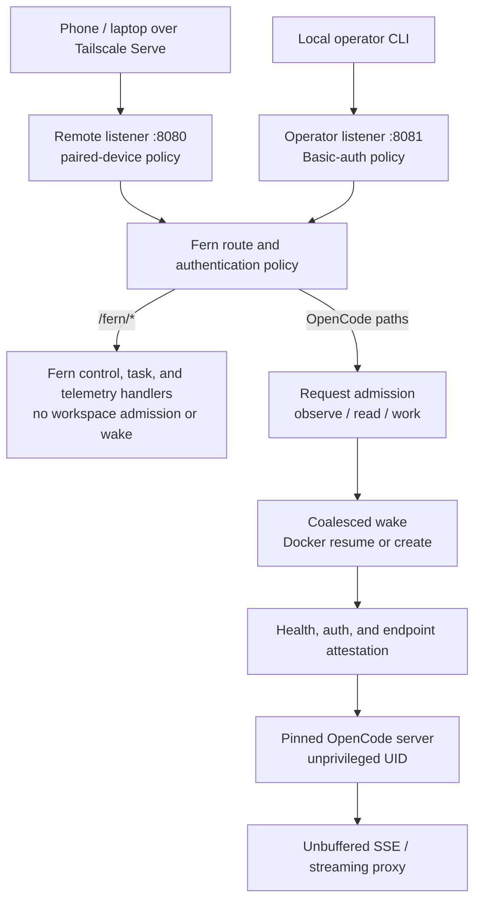

# fern

> Self-hosted OpenCode workspaces that stop when idle and wake on the next HTTP
> request — your Docker host, your tailnet, your keys.

## Why

Remote and self-hosted coding agents are widely available. Fern tests a narrower
OpenCode-native promise: run the real OpenCode on an always-on private host,
leave, return to the exact session, and preserve an exact Git result even when
the runtime is later removed. Today fern is a single Go binary around one
persistent OpenCode workspace. It provides an authenticated wake-aware proxy,
durable task admission, explicit result sealing, host verification, and optional
receipt-backed App publication without replacing OpenCode's UI.

## Demo

> **Demo (recording pending):** 60–90s phone-on-cellular flow — scan pairing QR,
> submit a durable task, watch the wake land, open the resulting draft PR. Will
> be embedded here as an animated GIF rather than a linked video.

<!-- Replace this block with an inline docs/demo.gif image once recorded.
     Reviewers do not click through to videos; an inline GIF at screen one is
     the unit that works. -->

## Measured numbers

| Metric | Value | Source |
| --- | --- | --- |
| Cold wake (stopped -> healthy, proxied first byte) | ~2.8-3.1 s | historical local lifecycle measurement; rerun the harness for current evidence |
| Warm wake (`idle.mode: freeze`, pre-thawed) | implemented; measure with `fern debug wake` | cgroup-freezer pause behind the `idle.mode` config flag |
| Traffic while idle | none - compute stopped or frozen | two-pass all-idle barrier (`internal/workspace`) |

`fern debug wake` prints a per-phase millisecond waterfall of the most recent
wake (admission → lifecycle → Docker mutation → health probe → observer attach)
against a running supervisor.

Every wake above ~100 ms is logged with its duration; the harness measures real
Docker transitions against a deterministic fake OpenCode.

## Architecture



The same ingress carries a durable task pipeline:

```text
phone submit ──► durable admission (persisted receipt and OpenCode IDs)
                      │ wakes compute only after commit
                      ▼
  exact-once-attempted delivery ──► fail-closed execution observation
                      ▼
    user-authorized seal ──► fenced verification ──► receipt-backed App draft PR
```

| fern owns | OpenCode owns |
| --- | --- |
| workspace lifecycle, wake/pause safety, admission | sessions, prompts, tools, terminals |
| durable task intent, receipts, cancellation fences | permissions, forms, provider calls |
| result sealing, verification policy, publication journals | the official UI, files, diffs |

## Scope

Fern is V2-only. It does not build a coding PWA, fork or consume
`@opencode-ai/app`, or reimplement OpenCode screens. OpenCode remains the
authority for the UI, sessions, configuration, providers, permissions and
forms, terminals, files, and diffs. Fern owns workspace lifecycle, paired-device
task admission, exact-once-attempted OpenCode delivery, cancellation,
conservative recovery projections, result provenance, verification machinery,
and repository-scoped GitHub App boundaries. Generic OpenCode terminal
classification and notifications remain incomplete.

## Current Status

The Docker lifecycle and reverse proxy are functional:

- one constrained `fern/opencode:dev` workspace container;
- a writable repository mount at `/home/user/workspace`;
- durable OpenCode state in `fern-<workspace>-v2-data`;
- ownership and desired-state drift checks before lifecycle mutations;
- authenticated activity observation and conservative idle suspension;
- request admission, concurrent wake coalescing, and same-origin proxying;
- streaming SSE and upgraded connections without response buffering;
- intentional-stop, failure, and OOM classification;
- a host-local lease preventing concurrent lifecycle writers.

Fern exposes two distinct loopback listeners. The remote listener accepts only
pairing capabilities and durable device cookies and is the sole Tailscale Serve
target. The operator listener accepts local `opencode:$OPENCODE_PASSWORD` for
the official CLI and host-only `fern:$FERN_CONTROL_PASSWORD` for administration.
Both Basic credentials are rejected remotely before wake, and Fern regenerates
backend auth only after admission. The control password never enters the
workspace container.

Fern reserves `/fern/*` for its phone landing and control plane. A paired
browser receives a restart-safe `HttpOnly` cookie; Fern stores only its digest
and injects the internal OpenCode credential only while proxying upstream. A
paired device can use OpenCode but cannot issue pairings, administer devices,
or use retired workflow/publication controls. Those operations require the
operator listener's `/fern/control` and the host-only Fern control credential.
The separate durable task API can admit an eligible receipt-backed App
publication for a sealed and verified result.

Fern is not yet a complete remote coding product. Durable prompt delivery,
cancellation, App Manifest credential onboarding, conservative execution
observation, explicit user sealing, host verification, receipt-backed App
publication admission/reconciliation, offline backup/rollback, encrypted
credential custody, schema compatibility testing, and release provenance policy
are implemented. The pinned OpenCode API still cannot prove generic terminal
success. Durable approval answers, notifications, complete onboarding selection,
physical fresh-host restore, and abrupt-power-loss characterization remain open.

Fern's chosen GitHub direction is Amp-style unrestricted authenticated `gh`
inside the trusted workspace. An explicit request in an OpenCode prompt may
authorize the agent to push and create a draft PR; Fern does not claim that a
separate phone button can exclusively gate publication when OpenCode has the
same credential. The image includes checksum-pinned `gh`, and Fern persists its
isolated config volume. App-broker mode remains available for narrow,
receipt-backed publication.

## Documentation

- [Strategy and direction map](./docs/STRATEGY.md): current reality, candidate directions, owner doubts, product gates, rejected paths, and cross-agent decision context.
- [Background Mode TODO](./todo/opencode-background-mode.md): active comparison, prototype, dogfood, acceptance, and kill checklist.
- [Background Mode goal design](./docs/BACKGROUND_MODE.md): target architecture,
  data model, Go and concurrency patterns, fault matrix, implementation slices,
  graphics, and demo plan.
- [Conditional Kubernetes architecture](./docs/TARGET_ARCHITECTURE.md): deferred k3s and Agent Sandbox backend proposal, not the current target.
- [Personal task computers research](./research/fern-personal-task-computers-2026-08-30.md): Docker-first substrate analysis, reusable primitives, UX, security gates, and implementation sizing.
- [Architecture](./docs/ARCHITECTURE.md): implemented authentication, lifecycle, proxy, publication, and persistence boundaries.
- [Architecture explained](./docs/ARCHITECTURE_EXPLAINED.md): an implementation tour of the modules, fences, state machines, and design reasoning.
- [OpenCode](./docs/OPENCODE.md): the V2 server contract, official web UI, persistence, and verification.
- [Deployment](./docs/DEPLOYMENT.md): private systemd and Tailscale Serve runbook.
- [Phone field demo](./docs/FIELD_DEMO.md): exact preflight, phone sequence, evidence, abort, and cleanup checklist.
- [Product direction](./docs/REMOTE_PRODUCT.md): current boundary and the
  OpenCode Background Mode product hypothesis.
- [Next phase](./docs/ROADMAP.md): Background Mode sequence, acceptance gates,
  and trigger-based later work.
- [Durable task model](./docs/TASK_MODEL.md): normative IDs, implemented persistence, state machines, reconciliation, and remaining fault gates.
- [GitHub integration](./docs/GITHUB_INTEGRATION.md): workspace `gh`, App onboarding, receipt-backed publication, and retired-state handling.
- [Security boundary](./docs/SECURITY.md): current controls, residual findings, and external acceptance gates.
- [Credential recovery](./docs/CREDENTIAL_RECOVERY.md): encrypted export/import/rotation and external revocation duties.
- [Release policy](./docs/RELEASE_POLICY.md): tag admission, attestations, compatibility, and external gates.
- [Lifecycle harness](./integration/lifecycle/README.md): real-Docker lifecycle test details.
- [OpenCode contract harness](./integration/opencode-contract/README.md): zero-cost exact-ID, restart, approval, and cancellation observations.
- [Task UI fixtures](./integration/task-ui/README.md): isolated read-only inbox/detail contract renderer.
- [Upgrade harness](./integration/upgrade/README.md): schema-4 baseline, schema-7 upgrade, and byte-restore rollback contract.
- [Release harness](./integration/release/README.md): reproducibility, integrity, and deployment safety checks.
- [Production rehearsal](./integration/production-rehearsal/README.md): recorder for operator-supplied physical evidence; self-test is synthetic.

The files under [`product-docs/`](./product-docs/) are historical audits, not
current contracts.

## Requirements

- Go 1.27 or newer
- a local Docker daemon with at least 8 GiB available; remote `DOCKER_HOST` endpoints are rejected
- an account or provider connection supported by the pinned OpenCode release
- Tailscale on the host and phone for the private phone demo
- configured GitHub authority when durable tasks or publication are enabled

## Quick Start

```bash
make image
go run ./cmd/fern init --repo .
go run ./cmd/fern up --config fern.yaml --env-file fern.env
```

In another terminal, open the official OpenCode client and use its `/connect`
flow to connect an OpenCode account or any other provider supported by the
pinned release:

```bash
go run ./cmd/fern attach --config fern.yaml --env-file fern.env
```

This default is local-only. Before remote publication, set
`proxy.remoteOrigin` in `fern.yaml` to this host's exact canonical Tailscale
Serve HTTPS root, for example `https://fern-host.example.ts.net` with no slash
or explicit `:443`, then restart Fern. Alternatively pass that value to
`fern init --remote-origin`. Fern stays in the foreground because it owns both proxy listeners, the watcher,
idle supervisor, and workspace lease. It prints the remote/device origin,
typically `http://127.0.0.1:8080`, and operator origin, typically
`http://127.0.0.1:8081`.

In another terminal, publish Fern privately and create a one-time phone pairing
QR:

```bash
tailscale serve --bg http://127.0.0.1:8080
go run ./cmd/fern doctor --config fern.yaml --env-file fern.env --phone
```

Phone and field-demo diagnostics fail unless the configured origin exactly
equals both the root origin reported by `tailscale serve status` and this host's
tailnet HTTPS origin. `doctor --url` is only an exact assertion; it is not an
origin override. Only `proxy.listen` may be published.

Scan the QR within five minutes in the browser that should retain access. The
GET renders a confirmation page so scanner previews cannot consume the code;
tap **Pair this phone** to exchange it for a secure `HttpOnly` device cookie.
Fern opens the landing page; tap **Open OpenCode** to enter the official UI
without typing the generated Basic password. Pairing sessions survive Fern
restarts for up to 30 days and can be listed or revoked by an operator at
`http://127.0.0.1:8081/fern/control`. Active requests are canceled on revoke or
grant expiry.
Clients must use the Fern origin rather than Docker's dynamic backend port so
requests can wake compute and participate in pause admission.

For diagnostics:

```bash
curl --user "opencode:$OPENCODE_PASSWORD" http://127.0.0.1:8081/api/health
curl --no-buffer --user "opencode:$OPENCODE_PASSWORD" http://127.0.0.1:8081/api/event
```

`fern attach --env-file fern.env` remains available for the official OpenCode
terminal client. It loads the configured proxy origin and OpenCode credential
rather than connecting to the container directly. The browser UI needs no
Fern-built frontend.

Connect accounts and providers through the official OpenCode `/connect` flow;
OpenCode stores the connection in its persistent volume. The web UI exposes
the same OpenCode-managed provider state. Fern also implicitly forwards
`OPENCODE_PASSWORD` and optional provider variables such as
`ANTHROPIC_API_KEY` and `OPENAI_API_KEY`. Additional values
must be declared under `workspace.env` in `fern.yaml`; `${NAME}` references
resolve from the protected env file. `FERN_CONTROL_PASSWORD` and GitHub
credentials are host-only and rejected from workspace configuration.

## Commands

```bash
go run ./cmd/fern init --repo .
go run ./cmd/fern doctor --phone
go run ./cmd/fern up
go run ./cmd/fern github publish --dry-run --title "Describe the change"
go run ./cmd/fern attach
go run ./cmd/fern status
go run ./cmd/fern logs
go run ./cmd/fern version
go run ./cmd/fern debug events
go run ./cmd/fern debug wake
go run ./cmd/fern debug quarantine-publications
go run ./cmd/fern backup create --output /secure/fern-backup
go run ./cmd/fern credentials export --recipient age1... --output credentials.age
go run ./cmd/fern down
```

`up` is the long-running supervisor. Starting it preserves absent or
intentionally paused compute; the first authenticated OpenCode request wakes or
creates the workspace. `down` removes compute but deliberately
retains OpenCode state. `status --json` emits stable machine-readable state;
inspect its `state` field rather than treating a stopped or failed workspace as
a command invocation failure.

Workspace GitHub access is disabled by default. To enable Amp-style `gh`, bind
the workspace explicitly; the ID is GitHub's positive numeric repository ID and
the full name is exact-case canonical `owner/repository`:

```yaml
workspace:
  github:
    mode: workspace-gh
    hostname: github.com
    repository:
      id: 123456789
      fullName: owner/repository
```

Authenticate and publish directly from the OpenCode terminal:

```bash
gh auth login --hostname github.com
gh auth setup-git --hostname github.com
git push --set-upstream origin HEAD
gh pr create --draft --base main --fill
```

Fern persists only this workspace's `gh` config in its dedicated Docker volume.
Run `gh auth status --hostname github.com` to inspect it and `gh auth logout
--hostname github.com` to remove it. Fern does not wrap ordinary push or PR
creation with a second publication API.

Durable tasks remain disabled unless a complete execution policy and explicit
GitHub authority are configured. Provider and model IDs are always explicit:

```yaml
workspace:
  env:
    OPENCODE_PASSWORD: ${OPENCODE_PASSWORD}
  github:
    mode: workspace-gh
    hostname: github.com
    repository:
      id: 123456789
      fullName: owner/repository
tasks:
  agent: build
  model:
    provider: replace-with-provider-id
    id: replace-with-model-id
  attemptTimeout: 30m
  leaseDuration: 2m
  budget:
    maxTurns: 100
  # Optional; no check is inferred when this block is absent.
  verification:
    checkName: repository-tests
    argv: [/usr/bin/make, test]
    workingDirectory: ""
    timeout: 15m
    environment:
      CI: "true"
    outputBytes: 65536
```

With `github-app-broker`, `proxy.remoteOrigin` configured, and no App credentials present, the
operator-only `/fern/control` page starts GitHub's App Manifest flow. Fern
validates configured installation/repository authority at task-service startup.
The verification command is shell-free, host-owned policy and runs only after a
sealed immutable result. A paired client can then admit publication for that
exact result and successful verification; Fern derives and journals the branch
and draft-PR tuple. The pinned OpenCode profile still prevents generic terminal
success classification. Fern includes a separate quiesced result path for a
future authoritative observer but never activates it from idle state.

The alternative `workspace-gh` mode mounts a dedicated authenticated `gh`
configuration into the trusted workspace. User- or prompt-authorized `git` and
`gh` effects in that mode are direct workspace mutations and are outside Fern's
receipt journal. The two GitHub modes are explicit and mutually exclusive;
omitting an App installation ID does not select a host-token mutation path.
`fern github publish --dry-run` retains retired preparation diagnostics, but
standalone non-dry-run publication is rejected because it would bypass the
durable task coordinator.

Common overrides are:

```bash
go run ./cmd/fern up \
  -name demo \
  -image fern/opencode:dev \
  -repo /absolute/path/to/repository \
  -memory 8Gi \
  -idle 10m \
  -listen 127.0.0.1:8080 \
  -operator-listen 127.0.0.1:8081
```

Configuration precedence is flags, YAML, then defaults. Values explicitly set
in `workspace.env` override `--env-file`; selected process variables fill keys
that remain absent. Changing an existing container's image, repository, memory,
or environment produces a spec-drift error. Run `fern down` and then `fern up`;
`fern-<workspace>-v2-data` is retained.
Delete it only when its sessions and configuration are no longer needed:

```bash
docker volume rm fern-demo-v2-data
```

## Development

```bash
make format
make test
make test-race
make vet
make lint
make build
make image
./scripts/test-lifecycle.sh
FERN_OPENCODE_IMAGE=fern/opencode:dev ./scripts/test-opencode.sh
PYTHONDONTWRITEBYTECODE=1 python3 integration/opencode-contract/contract_harness.py
./integration/release/run.sh
go test ./integration/task-ui
```

CI runs formatting, unit and race tests, vet, the binary and image builds, the
real-Docker lifecycle harness, pinned OpenCode smoke test, and reproducible
release harness. Build release binaries, deployment assets, metadata, and
checksums from a clean tree with:

```bash
./scripts/build-release.sh v0.1.0
shasum -a 256 -c dist/SHA256SUMS
```

## Safety Boundary

Fern arms an idle timer only after a connected OpenCode event epoch reports
work and all observed activity drains. Disconnects, unknown states, and requests
that may start work invalidate that evidence. Before stopping or freezing, Fern
blocks new held requests and checks the V2 activity surfaces for sessions,
shells, PTYs, permissions, forms, and questions. Any active, malformed,
unauthorized, or unavailable response leaves compute running.

This protects traffic using Fern's proxy. A host or Docker administrator can
discover the loopback backend and is already inside the trusted-host boundary.
Fern cannot recover process-local provider streams or tool execution after a
crash and does not claim mid-turn crash recovery.

Publish only the remote/device listener through a private TLS edge such as
Tailscale Serve. Never publish the operator listener. The remote listener rejects
both Basic credentials and relies on selective Fern device grants; Basic auth is
not transport security.

No checked-in evidence claims that a physical phone rehearsal, host reboot,
replacement-host restore, real TLS/WSS exercise, independent ACL denial, release,
or tag occurred. The production rehearsal self-test uses synthetic facts only.
