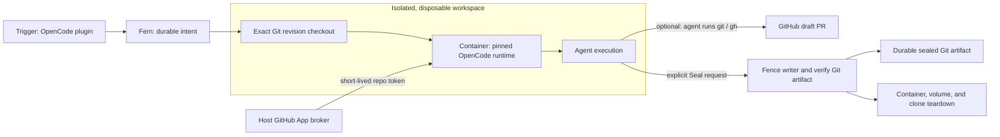

# Fern

Fern is a self-hosted Go control plane for engineers who want to run coding-agent jobs in disposable containers, steer them live, and retain a verified Git artifact after the workspace is removed.

## Why it exists

Coding-agent runs are long-lived processes that edit repositories, invoke tools,
and handle credentials. They can lose a network response, outlive a client, or
crash halfway through an operation. A message from the agent saying “done” does
not establish which process wrote the result, whether the work survived, or
whether retrying will repeat an external effect.

Fern treats completion as a control-plane operation rather than an agent claim.
Its job is to preserve intent, identify the exact writer, retain its work, and
remove disposable compute safely. The agent remains responsible for the coding
workflow: edits, tests, commits, pushes, and pull requests.

## What Fern does differently

- **Intent before effect.** SQLite records admission, claims, and lifecycle
  transitions before the corresponding external mutations. Recovery reconciles
  observed effects with durable intent. If evidence cannot establish what
  happened, the run becomes uncertain rather than blindly replaying a prompt.
- **Exact writer, exact result.** A run binds its repository revision, image,
  session, and container process identity. Explicit sealing stops and fences
  that writer, verifies the Git snapshot and bundle, commits retained-result
  authority, then tears down the workspace. “Verified” means artifact integrity
  and identity—not that repository tests passed.
- **Scoped credential delivery.** A host-side GitHub App broker mints short-lived,
  repository-scoped installation tokens and refreshes them in the run's private
  storage. The App private key stays on the host. Git and `gh` read rotating
  credentials without personal `gh` configuration or tokens in Docker config,
  repository files, command arguments, or retained artifacts.
- **Live inspection without a second writer.** `fern attach` opens the existing
  exact OpenCode session through an expiring capability. You can inspect and
  steer the work before deciding to seal it.

## Architecture


```mermaid
flowchart LR
    Trigger["Trigger: OpenCode plugin"] --> Intent["Fern: durable intent"]
    Intent --> Checkout["Exact Git revision checkout"]
    subgraph Workspace["Isolated, disposable workspace"]
        Checkout --> Container["Container: pinned OpenCode runtime"]
        Container --> Agent["Agent execution"]
    end
    App["Host GitHub App broker"] -->|"short-lived repo token"| Container
    Agent -->|"optional: agent runs git / gh"| PR["GitHub draft PR"]
    Agent -->|"explicit Seal request"| Seal["Fence writer and verify Git artifact"]
    Seal --> Retained["Durable sealed Git artifact"]
    Seal --> Teardown["Container, volume, and clone teardown"]
```

**PR creation is not a post-seal Fern operation.** The agent may create a draft
PR while running; sealing independently retains the final work. A previously
pushed PR may therefore differ from the sealed artifact. Cancellation via Stop
is also distinct from sealing: choose Seal when you want retention.

See [ARCHITECTURE.md](ARCHITECTURE.md) for the authority and recovery boundaries.

## Quickstart

### Build and inspect on a clean machine

These commands target a fresh **Ubuntu 24.04 machine with sudo access and
network access**. They install Git and Docker and build Fern with Go 1.27 inside
a container, so no existing Go installation is required.

```sh
sudo apt-get update
sudo apt-get install -y ca-certificates git docker.io
sudo systemctl enable --now docker

git clone https://github.com/nebler/fern.git
cd fern
sudo docker run --rm \
  -e CGO_ENABLED=0 -v "$PWD:/src" -w /src \
  golang:1.27 go build -o /src/fern ./cmd/fern

./fern version
./fern --help
```

To build the source-verified runtime image on that machine:

```sh
sudo docker build -t fern/opencode-background-source:local \
  images/opencode-background-source
sudo docker image inspect fern/opencode-background-source:local \
  --format '{{.Id}}'
```

Record the image ID for host qualification and configuration. Building the image
does not qualify the host or make a run ready to execute.

### Execute a job: prerequisites still required

**There is not yet an honest one-command, clean-machine execution quickstart.**
The current execution contract requires:

1. Native Linux amd64/arm64, kernel 5.14+, and a same-host Docker Unix socket.
2. Operator-provisioned XFS project storage with enforced byte and inode hard
   limits, separate from the durable-state filesystem, plus host-space reserve.
3. Permission to query those project limits. Linux requires `CAP_SYS_ADMIN` for
   the query used here; **the stock unprivileged service cannot execute it
   unchanged**. Fern neither grants that capability nor installs a helper.
4. A qualified image, a bound host Git repository, private HTTPS control and
   attachment origins, and a repository-bound GitHub App installation.
5. A usable credential-free model provider for the pinned runtime. Arbitrary
   provider API-key environment injection is currently rejected. A GitHub token
   does not supply model-provider authentication.

Follow **[the usage guide](docs/usage.md)** for configuration, App onboarding,
local plugin installation, and the daily workflow:

```text
/fern → Run → inspect with fern attach → Seal → Result
```

The plugin targets OpenCode **1.18.16** and is not published to npm yet. It must
be built and installed locally. There is no `fern run` CLI command; submission
uses the plugin. See [the plugin README](plugins/opencode/README.md).

## Engineering discipline

The repository carries checks for the properties this design depends on, not
just successful agent output:

- **Concurrency and static checks:** Go race detection, `go vet`, formatting,
  package coverage floors, and function-level gates for critical coordinator
  paths. These are release gates, not proof that every failure path is covered.
- **Runtime qualification:** a digest/ID-bound image and exact source profile
  are exercised against session identity, response loss, prompt replay,
  attachment, writer replacement, and retained-result reconstruction. Local
  image IDs are distinguished from published registry digests.
- **Source authentication:** the image build verifies the pinned OpenCode commit
  against a vendored GitHub web-flow signing key before dependency installation.
  This authenticates GitHub-signed content, not independent maintainer approval.
- **Reproducible packaging and signed release machinery:** release scripts use
  source-derived timestamps, trimmed build paths, and deterministic packaging.
  The release workflow verifies signed tags and binds assets/images to SPDX
  SBOMs, build provenance, and verified Cosign signatures/attestations. These
  controls make source and artifact claims inspectable; they are not a claim
  that the complete image supply chain is bit-for-bit reproducible.

Review the [release workflow](.github/workflows/release.yml),
[coverage gates](scripts/test-critical-coverage.sh), and
[local performance evidence](docs/performance.md). The machinery demonstrates
engineering rigor; it does not erase the deployment and qualification gaps below.

## Known limitations

- **Pre-release deployment:** the quota-query privilege arrangement remains an
  operator security decision. Actual XFS byte/inode exhaustion and recovery have
  not been qualified on the local development host. The stock hosted release
  runner is not provisioned with that storage boundary either; the full release
  qualification path needs it. Docker Desktop is not an execution fallback.
- **Capacity one:** Fern is a single-host runner, not a fleet scheduler.
- **Trusted code and network:** bridge isolation is not a hostile-code sandbox.
  An agent can misuse or exfiltrate its scoped GitHub token until expiry. Quotas
  bound project allocation, not all other host writers or global free space.
- **No authoritative publication or test result:** Fern does not guarantee
  exactly-once PR creation, successful repository tests, or equality between a
  PR and the later sealed artifact. The qualification suite does not mutate a
  live GitHub repository; credential responses are synthetic.
- **Upstream uncertainty remains explicit:** question recovery after replacement,
  automatic completion authority, and durable provider-turn start remain
  blocked/unproven in the OpenCode qualification contract.
- **Client and result gaps:** submission refuses an explicit remote `--server`
  TUI; the plugin is unpublished; result reads expose metadata, not an artifact
  download URL or a `fern result download` command.
- **Breaking development formats:** older state formats may be rejected without
  migration. Preserve offline backups; do not delete state to bypass an error.

## Documentation

- **[Usage guide](docs/usage.md):** setup, run, attach, seal, results, and recovery.
- **[Phone demo guide](docs/phone-demo.md):** private Tailscale pairing and an end-to-end demo checklist.
- **[Go package guide](docs/go-packages.md):** package READMEs and suggested reading order.
- **[Architecture](ARCHITECTURE.md):** ownership, persistence, and effect boundaries.
- **[Review findings](docs/go-review.md):** remaining maintenance and performance concerns.

## License

[MIT](LICENSE).

### About the name

*Fern* is German for “far away” or “distant”: work runs in a separate disposable
workspace, and sealing brings back the verified Git artifact before removing it.
