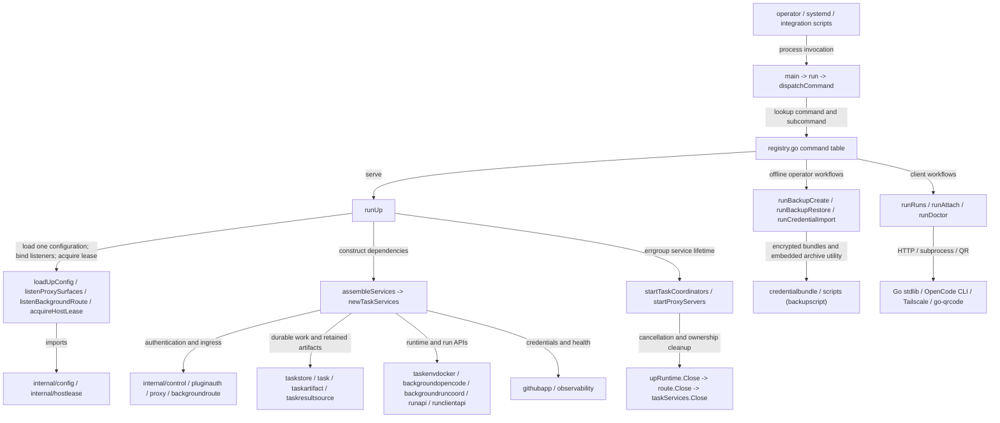

# fern command

See the [Go package map](../../docs/go-packages.md) and [maintenance review](../../docs/go-review.md).

`cmd/fern` is the executable composition root for Fern's disposable Background
Run control plane. It owns command dispatch, operator workflows, service wiring,
and process lifetime. Durable state transitions, Docker ownership, artifact
retention, and HTTP authorization remain in their respective internal packages.

The current model uses one configuration (`fern.yaml`, optionally supplemented
by a protected environment file), task-store schema **4**, control-state schema
**2**, and runtime resource spec **10**. There is no host publisher or host
verification coordinator. The container harness owns Git/PR work; Fern refreshes
repository-scoped GitHub credentials and retains sealed results independently of
the disposable runtime.

## Entrypoints and callers

Operators, systemd, integration scripts, and release-built binaries invoke
`main`; no other Go package imports this `main` package. `registry.go` is the
single command table used by dispatch, usage, help, and typo suggestions.

| Command | Responsibility |
| --- | --- |
| `init` | Write a new Background Run configuration and protected environment inputs. |
| `doctor` | Diagnose configuration, host tools, readiness, and phone/pairing topology. |
| `up` | Assemble stores, routes, APIs, coordinator, and HTTP surfaces. |
| `runs` | Query the authenticated run-client list API. |
| `attach` | Select a live run and launch the OpenCode TUI with scoped attachment credentials. |
| `backup create/restore/rollback` | Offline state staging, verified archive handling, and recoverable filesystem activation. |
| `credentials export/import/rotate` | Encrypted GitHub credential transfer and rollback-safe activation. |
| `version` | Print build-stamped version information. |

Arrows group direct imports and representative call paths, not every function.
Third-party direct Go imports include Docker's client, `filippo.io/age`,
`github.com/skip2/go-qrcode`, `golang.org/x/sync/errgroup`,
`gopkg.in/yaml.v3`, and the `modernc.org/sqlite` driver. Most other imports are
standard-library CLI, filesystem, crypto, networking, and process facilities.

## Startup and ownership

`runUp` parses flags and loads/validates bootstrap configuration before acquiring
runtime resources. It binds remote, operator, and background listeners, creates
a signal-cancelled errgroup context, and acquires the repository binding's host
lease. Deferred closures cover errors during assembly as well as normal exit.

`assembleServices` opens control/plugin authentication state, creates the
background route and fixed-cardinality status registry, and prepares GitHub App
onboarding when needed. An unbound installation or missing onboardable credentials
keeps the control plane available but marks the GitHub dependency blocked; run
handlers return unavailable until onboarding configuration is completed and the
host restarts. Bootstrap readiness is not permission to accept durable work.

`newTaskServices` performs the heavier startup path:

1. Open the schema-3 store and create private background runtime/CAS/work roots.
2. Load GitHub App credentials, construct a signer and installation-token client.
3. Inspect every referenced retained artifact before declaring services ready.
4. Ensure the durable workspace binding without replacing its existing identity.
5. Construct a pinned-image Docker provider with clone, disk, CPU, memory, PID,
   timeout, and log bounds, plus repository-scoped GitHub credential authority.
6. Construct the retained-result source, serial coordinator, run API, and
   run-client API; connect accepted work to `coordinator.Wake`.
7. Mark the disposable profile qualified and transfer resource ownership to
   `taskServices` only after successful construction.

Only the Background Run serial coordinator is started here. GitHub credential
refresh happens through the provider/coordinator lifecycle; there is no separate
host publication or verification worker. The base verifier in `runapi` checks
admission Git identity and is not the removed result-verification pipeline.

## Serving and shutdown

Remote/device and operator handlers are assembled by `proxy.NewHandlers`; the
background route owns its separate listener. HTTP servers have header timeouts
and share the service context. `goComponent` records fatal component errors and
lets errgroup cancellation stop the process; normal context cancellation is not
reported as a fatal service failure.

Shutdown gives the two HTTP surfaces a bounded graceful period and force-closes
them if necessary. Connection tracking also covers accepted connections that
may outlive normal HTTP accounting. Runtime cleanup fences attachment admission
and closes route connections **before** closing the artifact engine, Docker
provider, and task store. The host lease is released after runtime cleanup.

## Client and offline paths

`runs.go` resolves endpoint/authentication configuration, bounds HTTP response
handling, and can read a keyring credential. `runAttach` obtains a scoped live
attachment, then `launchOpenCodeAttach` starts the external TUI. Keep secrets out
of diagnostics and preserve the distinction between Fern control credentials
and runtime attachment credentials.

Backup commands acquire the same host lease as startup, checkpoint SQLite state,
stage state/configuration, and invoke the embedded Python archive utility unless
an explicit override is supplied. Restore uses staged filesystem paths and
durable rollback metadata; these operations do not promise a transaction spanning
the host, containers, or GitHub. Current backups do not export runtime volumes.

Credential workflows bind encrypted `credentialbundle` payloads to the configured
repository/installation, validate candidates against GitHub, and stage rollback
material before activation. External GitHub validation and age encryption are
operational dependencies, not local-only parsing steps.

## Naming review

- The executable name and `run<Command>` dispatch convention are clear.
- `tasks.go`, `taskServices`, and `newTaskServices` retain historical “task” names
  while now assembling only Background Runs. A future `backgroundServices`
  terminology pass could clarify scope, but should be coordinated with the
  domain/store vocabulary rather than performed as cosmetic churn.
- `gitHubAuthority` presently wraps installation tokens, not a host publisher.
- `registry.go` comments now name the current `backup`/`credentials` namespaces;
  the command table remains authoritative.
- `helpers.go` is a mixed support file; grouping by config/topology/lease concern
  may help navigation if it grows, without requiring another public package.

## Performance review and validation

The important costs are startup store/artifact reconciliation, filesystem
durability, Docker/Git calls, HTTP requests, and long-lived connection handling.
The one-second coordinator polling interval is paired with explicit wakeups;
timeouts and resource bounds are part of correctness, not arbitrary overhead.
Referenced-artifact startup inspection grows with retained state, so profile it
with realistic inventories before introducing caching or concurrency.

The small command registry and edit-distance typo suggestion path are not hot
service paths. Replacing their linear scans would add complexity without an
observed payoff. Connection-tracker locking and shutdown cleanup merit load tests
if attachment concurrency grows; do not infer a bottleneck from a mutex alone.

Run `go test ./cmd/fern` for command, configuration, backup, credential, doctor,
run-client, and lifecycle tests. Package performance is unmeasured.
Docker, Git, GitHub, age, QR generation, SQLite, Tailscale, Python archive work,
and OpenCode are unmeasured external dependencies; no throughput or startup
speed claim is made here.
