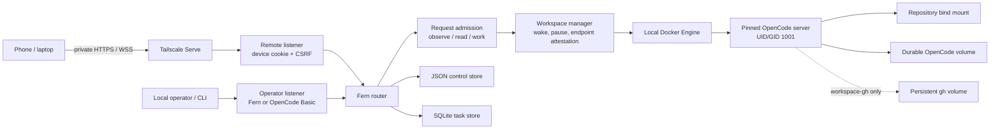
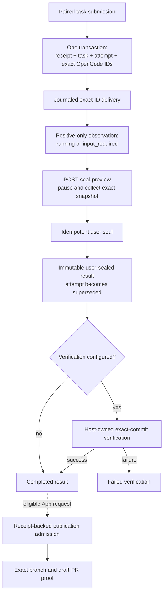
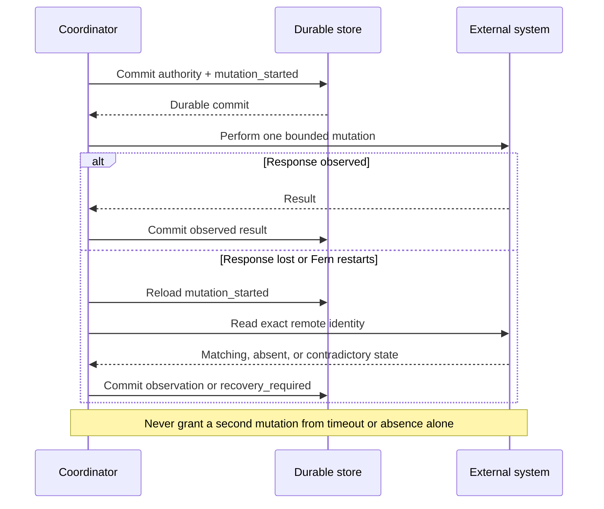

# Fern Architecture

This document describes the implemented production composition on the current
branch. Code and tests are authoritative where they differ from prose.

## Scope And Status

Fern is a single-host, single-owner Go service supervising one durable OpenCode
workspace in local Docker. A private TLS edge exposes the remote loopback
listener to paired devices. A separate loopback-only listener carries operator
and official OpenCode CLI traffic.

OpenCode owns its UI, sessions, prompts, providers, tools, terminals, files,
diffs, permissions, and forms. Fern owns ingress policy, lifecycle intent,
durable task commands, repository evidence, host verification policy, App-broker
publication admission and reconciliation, backup/recovery, and release policy.

Implemented production paths include:

- stop/freeze, wake, Docker ownership checks, failed-start classification, and
  conservative idle shutdown;
- paired-device task admission, exact-ID OpenCode delivery, cancellation, and
  positive-only execution projections;
- persisted browser submission identity for exact lost-response replay;
- explicit user snapshot sealing and optional host verification;
- receipt-backed GitHub App publication admission and one-shot reconciliation;
- an alternative trusted-workspace `gh` authority mode;
- offline backup create/restore/rollback and encrypted GitHub credential
  export/import/rotation;
- schema-7 compatibility gates and a tagged release workflow for attested
  assets and a signed, attested OCI image.

The pinned OpenCode contract still has no generic durable terminal-success
fact. Fern never converts inactivity, an empty inbox, missing process-epoch
input, or a disconnected event stream into success.

Fern Gateway and Fern Labs are conditional and not implemented. No production
code currently routes provider traffic, issues model-access tokens, meters model
usage/cost, creates experiments, provisions benchmark runs, or scores them. See
[Fern Roadmap](./ROADMAP.md) for that future boundary.

## Authority Model

| Concern | Authority |
| --- | --- |
| Desired workspace | Strict Fern configuration |
| Container identity and process state | Docker inspect, revalidated by Fern |
| OpenCode UI and execution behavior | Pinned OpenCode profile |
| Durable task intent and effects | Fern SQLite task store |
| Device grants and retired audit records | Fern JSON control store |
| Repository objects and clean state | Host Git object database and index |
| Repository, ref, and PR identity | GitHub numeric identities and API reads |
| Verification command | Host-owned Fern policy |
| User snapshot completion | Exact authenticated seal request |
| Observed-success completion | Injected authoritative observer, not currently composed |
| App publication mutation | Receipt plus committed publication phase |
| Workspace `gh` mutation | Workspace credential and explicit prompt/user intent |
| Operator access | Loopback listener plus Fern/OpenCode Basic credentials |

Consistency evidence is not authority. Checkout `origin`, an image tag,
browser forwarding headers, current `HEAD`, and OpenCode inactivity cannot
select an effect or outcome.

## Topology



Only the remote listener is a supported Tailscale Serve target. The operator
listener must remain host-local. Fern does not infer policy from source IP,
`Host`, `Forwarded`, or `X-Forwarded-*` input.

The trust model assumes one trusted owner, host, repository, image, Docker
daemon, and tailnet. Docker access is root-equivalent. This is not a hostile
multi-tenant sandbox.

## Production Composition

`cmd/fern/up.go` composes one workspace lease, Docker client, manager, activity
controller, supervisor, remote server, operator server, JSON control store,
telemetry registry, and optional task services. Task services include delivery,
execution, user-result, optional verification, and App-publication coordinators.

Startup is deliberately ordered:

1. Parse and validate strict configuration and protected environment values.
2. Bind both listeners before Docker side effects.
3. Acquire the exclusive workspace lease.
4. Open Docker, lifecycle intent, and control state.
5. Reconcile Docker without waking absent or intentionally paused compute.
6. Construct onboarding and task services.
7. Open and migrate the task store, persist the explicit GitHub authority, and
   compose the coordinators enabled by policy.
8. Build the two ingress policies and start all long-lived services in one
   errgroup.

App credentials are loaded locally during task composition, but remote
repository identity is resolved at task admission. If App credentials are
missing and onboarding is available, Fern remains live, marks
`github-task-dependency` blocked, serves onboarding, omits task routes, and
reports not ready. This is a dependency block, not a process crash.

On shutdown Fern drains both servers, force-closes tracked connections after a
bounded grace period, stops coordinators, records a short-lived Docker shutdown
intent only for process signals, closes the manager, stops the stream, then
closes SQLite and Docker. It does not intentionally stop OpenCode on ordinary
service shutdown.

## Configuration And Credentials

Precedence is `CLI flag > YAML > default`. YAML rejects unknown fields and
multiple documents. Both listener addresses must be distinct numeric loopback
addresses. `proxy.remoteOrigin`, when set, is one canonical HTTPS root.

OpenCode Basic is `opencode:$OPENCODE_PASSWORD`; Fern operator Basic is
`fern:$FERN_CONTROL_PASSWORD`. The control password is at least 32 characters
and cannot equal a forwarded workspace value. Automatic environment forwarding
is limited to `ANTHROPIC_API_KEY`, `OPENAI_API_KEY`, and `OPENCODE_PASSWORD`.
Fern rejects control and common GitHub token names and aliases.

Provider keys forwarded this way are readable by trusted workspace code. The
conditional Gateway would replace that provider-key path with a scoped Fern credential
and host-side provider custody; it is not part of the current composition.

Task policy fixes the agent, provider/model, attempt timeout, delivery lease,
turn budget, GitHub authority, and numeric repository identity. Verification is
optional host policy: a shell-free argv, immutable native executable outside the
workspace, bounded environment, timeout, working directory, and output cap.

## Ingress And Routes

The remote listener permits pairing and the App callback without a device grant.
A valid paired grant permits the OpenCode UI/API, `/fern/`, `/fern/tasks`, task
API routes, and the paired readiness page. It rejects Basic credentials,
operator controls, pairing issuance, telemetry, device administration, and
retired workflows before wake.

The operator listener accepts Fern Basic for controls and OpenCode Basic for the
official CLI. It is not a supported OpenCode browser origin after Fern Basic has
been entered, because that would create a same-origin confused-deputy boundary.

Current durable task routes are:

```text
GET  /fern/api/v1/tasks?limit=<1..200>
POST /fern/api/v1/tasks
GET  /fern/api/v1/tasks/{taskId}
POST /fern/api/v1/tasks/{taskId}/cancel
POST /fern/api/v1/tasks/{taskId}/seal-preview
POST /fern/api/v1/tasks/{taskId}/seal
POST /fern/api/v1/results/{resultId}/publications   # App-broker only
GET  /fern/api/v1/events?after=<cursor>&limit=<1..500>
GET  /fern/api/v1/csrf?method=<method>&path=<route>
```

Submission, cancellation, sealing, and publication require
`Idempotency-Key`. Browser mutations also require exact-origin/Fetch-Metadata
checks and a short-lived device-bound CSRF token. `seal-preview` is a POST
because it pauses compute and is not a safe, prefetchable read.

Fern strips incoming credentials and forwarding authority, creates a
server-owned actor snapshot, and regenerates backend OpenCode Basic. Upstream
cannot mint Fern's reserved device cookies.

## Wake, Idle, And Runtime Classification

Upstream requests are classified as observe, read, or work. Unknown routes are
work. Read/work requests hold admission; observe traffic does not. Concurrent
wakes coalesce, canceled waiters do not cancel shared wake, and endpoints are
published only after immutable image, loopback port, positive health, negative
authentication, and stream-attachment checks.

Idle eligibility requires a connected event epoch that observed busy/retry and
then a complete drain. Disconnects, malformed/unknown state, and stale epochs
invalidate eligibility. The final pause barrier closes admission and performs
two complete all-idle passes across sessions, shells, PTYs, permissions, forms,
and questions.

Runtime states are:

| State | Meaning |
| --- | --- |
| `absent` | No managed container |
| `provisioning` | Lifecycle outcome remains unresolved |
| `running` | Healthy running compute |
| `paused` | A committed pause/shutdown intent explains stopped or frozen compute |
| `failed` | Crash, OOM, unexplained exit, or committed failed-start outcome |

Fern writes intent before stop/freeze. A backend that Fern started or resumed
but could not make healthy is rolled back with a distinct committed
`failedStart` intent and continues to classify as failed, not paused. Recovery
requires inspection and explicit `fern down` before recreation.

The runtime fixes UID/GID 1001, two CPUs, 512 PIDs, configured memory, Docker
init, dropped capabilities, `no-new-privileges`, no restart policy, writable
root, repository bind mount, OpenCode data volume, and optional `gh` volume.
Every managed object is label- and immutable-ID-attested. Tags and names are not
sufficient ownership proof.

## Durable Stores And Compatibility

The JSON control store at `$HOME/.fern/control/<workspace-hash>.json` retains
device grants, pairing limiter support, an operator credential identifier, and
read-only retired workflow/publication audit records. Retired routes return
`410 Gone`.

Unresolved retired publication records block operator readiness through the
fixed `legacy-publication` component. With `fern up` stopped, an operator may
run `fern debug quarantine-publications`; the command holds the workspace lease
and atomically marks unresolved records quarantined without replaying effects.

The SQLite store at `$HOME/.fern/tasks/<workspace>.db` uses WAL, foreign keys,
`synchronous=FULL`, `BEGIN IMMEDIATE`, integrity checks, and a checksummed
migration ledger. Current schema is 7:

1. `initial_task_store`
2. `execution_projection_and_results`
3. `verification_and_publication_journals`
4. `user_authorized_snapshot_seals`
5. `explicit_workspace_github_authority`
6. `publication_admission_receipts`
7. `background_run_intents`

Schema 6 requires each mutable publication to reference an exact
`result.publish` receipt. Pre-schema-6 publication rows migrate with a null
receipt and are quarantined by SQL triggers: workers do not discover them and
updates are rejected.

`baseline-v1` is the first supported repository-established compatibility
fixture. It is schema 4 and explicitly is not evidence of a historical release
or tag. `integration/upgrade/run.sh` verifies semantic upgrade to schema 7,
restores the verified pre-upgrade bytes for rollback, and upgrades again.
Rollback means restoring a pre-upgrade backup; older code must never open the
migrated database.

## Durable Task Path



The browser stores one pending submission body and idempotency key in
`localStorage` before sending. It reuses both after a lost response or reload and
removes them only after an accepted response. If durable browser storage is
unavailable, it refuses to send. Cancellation and seal UI actions use fresh keys
per explicit invocation; their durable API replay contract remains available to
clients that retain keys.

Task list/detail snapshots safely project the current attempt, latest seal
request, sealed result, verification list, and publication/PR summary. They omit
prompts, transcripts, event payloads, command output, credentials, and raw
evidence.

Delivery commits `claimed -> session_create_started -> session_ready ->
prompt_started` before corresponding effects. Exact IDs and bytes are
read-reconciled. Prompt mutation is never retried after the start fence. The
execution observer projects only `running`, `input_required`, deadline-driven
cancellation, or `recovery_required`; it does not infer completion.

## External Effect Pattern

Delivery, verification, and App publication use the same core rule: persist
authority and the mutation-start phase before crossing an external boundary.
After a lost response, perform an exact read reconciliation; do not repeat the
mutation merely because the response was lost.



## Two Result Fences

The two result paths are intentionally different:

| Path | Fence | Authority | Production status |
| --- | --- | --- | --- |
| User snapshot seal | `AcquirePaused` | Authenticated user authorizes one exact previewed clean snapshot | Composed |
| Observed execution success | `AcquireQuiesced` | Two identical authoritative success observations while admission is closed, then compute is stopped | Infrastructure only; no production observer |

For a user seal, preview pauses compute and collects the exact snapshot. The
seal command persists the immutable tuple and receipt. The asynchronous
coordinator claims it, reacquires `AcquirePaused`, rechecks ownership and
recollects the snapshot, then seals. The attempt becomes `superseded`, result
authority is `user_seal`, and the task becomes completed. This says “accept this
repository snapshot,” not “OpenCode succeeded.”

The observed-success path is stronger because its observer must inspect running
compute twice inside `AcquireQuiesced`; the manager then stops compute and holds
the lifecycle/repository fence through collection and commit. Fern does not
compose this path for the pinned profile.

## Verification And App Publication

Verification begins only from a sealed result. Its command and environment are
host policy, not client input. Fern descriptor-pins native executables, inserts
no shell, runs a bounded process group, proves clean exact commit state before
and after, and stores only output counts, truncation flags, and full digests.
`running` verification is never rerun after restart; it becomes
`recovery_required`.

App publication admission accepts only the result ID in the path and the exact
successful verification ID in the body. One SQLite transaction verifies active
App authority, current uncanceled ownership, a changed clean user- or
execution-sealed result, successful verification of the same commit, absence of
another publication, and then writes receipt, actor, journal event, and derived
publication tuple. Clients cannot select repository, installation, ref, commit,
branch, or broker policy.

Publication phases are `none -> push_started -> push_observed ->
pr_create_started -> published`. Each mutation-start phase commits first. After
an ambiguous response or restart, only exact branch/PR reads occur; neither push
nor PR creation is retried. Contradictions become conflict or
recovery-required. App tokens are short-lived and repository-scoped and reach
Git through a private askpass file.

In `workspace-gh` mode, the trusted workspace has a persistent `gh` credential
and direct GitHub mutations are outside Fern's publication receipts. App and
workspace authority modes are mutually exclusive.

## Retry And Telemetry Semantics

Delivery, execution, result, verification, and publication loops use shared
equal-jitter exponential retry. The first failure waits in the half-to-full
poll interval range; the ceiling doubles and is capped at 30 seconds. Success or
an ordinary no-work/open observation resets retry to the one-second poll
interval. Durable effect phases, not retries, determine whether mutation is
allowed.

The fixed telemetry registry contains runtime, supervisor, task coordinators,
GitHub task dependency, and legacy-publication components. It accepts no dynamic
labels or raw errors.

| State | Ready | Meaning |
| --- | --- | --- |
| `disabled` | yes | Component not configured |
| `healthy` | yes | Last pass succeeded/no work |
| `degraded` | yes | Transient operation failed; retry is scheduled |
| `blocked` | no | Required dependency is unavailable, such as missing App credentials |
| `failed` | no | Component exited fatally or legacy state requires offline action |

`GET|HEAD /fern/live` is a process-liveness probe and stays 200 while the
process serves. `GET|HEAD /fern/ready` is 200 only when no fixed component is
blocked or failed. On the operator listener probes are available without Basic
auth for local supervision. Authenticated operator routes `/fern/status` and
`/fern/metrics` expose the fixed snapshot and bounded OpenMetrics gauges and
counters. Sleeping compute is healthy and telemetry never wakes it. The paired
remote readiness page is not the operator component registry.

## Backup, Restore, And Credential Recovery

`fern backup create`, `restore`, and `rollback` are offline, lease-protected
one-shot operations. Create destroys compute while retaining volumes,
checkpoints SQLite, stages Fern state/config/repository, exports the exact
managed volume set, and invokes the checksum/epoch archive utility. Detected
credentials and all opaque volume exports go to a separate credential tar. That
tar is mode 0600 but is not encrypted by Fern; custody must be encrypted storage
or approved external media.

Restore verifies and stages the archive, records a durable pre-restore
operational rollback generation including managed volumes, activates filesystem
paths with per-path rename, validates SQLite, then replaces Docker volumes using
verified staging volumes. Rollback reactivates that retained generation. Compute
remains offline after restore and rollback.

This is not cross-filesystem or cross-Docker atomicity. Filesystem paths and
volumes activate sequentially; in-process rollback is best effort, and abrupt
power loss requires operator inspection. A retained
`recovery/operational-rollback` directory intentionally blocks another restore
until the operator has validated, archived, and explicitly removed it.

`fern credentials export` creates an age-X25519 encrypted bundle for the active
App key or workspace-`gh` volume. Import/rotate require absent compute and the
offline lease, decrypt only in memory, bind candidates to exact workspace and
GitHub identity, and perform live GitHub identity/permission validation. Import
can initialize an empty App store or absent workspace-`gh` volume; bootstrap
creates no rollback artifact and activation failure restores absence.
Replacement writes an encrypted rollback artifact first and automatically
restores App credentials on a failed save. Rotation requires an active prior
generation and `--acknowledge-external-revocation`: Fern cannot revoke the
superseded App key or OAuth token at GitHub. See
`docs/CREDENTIAL_RECOVERY.md`.

## Release And Evidence

The local builder emits reproducible Linux amd64/arm64 binaries, a deterministic
deployment bundle, release manifest schema 2, and SHA-256 inventories from a
clean tree. Local output is checksummed but neither signed nor provenance-
attested.

The tag workflow accepts only a signed annotated semantic-version tag whose
peeled commit equals the workflow commit. It reruns source, coverage,
deployment, upgrade, synthetic rehearsal, real-image, and Docker lifecycle
gates. It then publishes a multi-architecture GHCR image by digest, generates an
SPDX SBOM, records GitHub build provenance, keylessly signs the OCI image with
Cosign, attests the SBOM, verifies all image attestations, builds a digest-bound
bundle, attests every release asset, and only then creates the GitHub Release.
Binary assets have GitHub provenance attestations but no separate binary
signature. See `docs/RELEASE_POLICY.md`.

The production rehearsal harness records and validates operator-supplied,
redacted physical evidence. Its self-test uses synthetic facts only. No checked-
in evidence establishes that a physical reboot, replacement-host restore, real
TLS/WSS phone exercise, or ACL-negative rehearsal occurred.

## Commands

| Command | Role |
| --- | --- |
| `fern init`, `doctor`, `up`, `attach`, `status`, `logs`, `down` | Configuration, diagnostics, service, and runtime lifecycle |
| `fern backup create|restore|rollback` | Offline operational recovery |
| `fern credentials export|import|rotate` | Encrypted GitHub credential custody and rotation |
| `fern debug events|wake` | Backend event and wake diagnostics |
| `fern debug quarantine-publications` | Offline retirement of unresolved legacy publications |
| `fern github publish --dry-run` | Retired non-mutating publication preflight |
| `fern version` | Embedded version and commit |

## Remaining Gap Register

1. **Physical production evidence:** target Ubuntu/systemd boot, real reboot,
   replacement-host restore, real private TLS/WSS, physical phone revocation,
   and independent tailnet ACL denial remain unverified by checked-in evidence.
2. **External provider behavior:** provider-funded terminal execution, billing,
   provider interruption semantics, and organization-specific GitHub policy are
   external acceptance obligations.
3. **Generic OpenCode completion:** the pinned profile has no durable generic
   terminal-success/failure proof. Automatic observed-success sealing remains
   blocked on an authoritative primitive.
4. **Durable approvals and notifications:** Fern records `input_required` but
   has no durable approval-answer API, notification delivery, PR/CI polling, or
   review continuation service.
5. **Atomicity limits:** backup restore/rollback is intentionally offline and
   staged but is not atomic across filesystem mount points and Docker volumes;
   abrupt-power-loss behavior requires physical rehearsal.
6. **External credential revocation:** encrypted custody and rollback-safe local
   replacement are implemented, but superseded GitHub keys/tokens must be
   revoked and verified outside Fern.
7. **GitHub onboarding selection:** installation/repository discovery exists,
   but operators still configure the selected numeric installation/repository;
   onboarding activation requires a Fern restart.
8. **Operator browser CSRF:** operator mutations enforce exact origin and Fetch
   Metadata but HTML forms do not have device-style per-request tokens. The
   operator listener remains host-only and is not a supported OpenCode browser
   origin.
9. **App publication UX:** the paired task API admits receipt-backed
   publication, and task snapshots expose its status, but the current embedded
   phone task page has no publication action. A client must call the API and
   retain its publication idempotency key.
10. **Provider credential boundary:** provider credentials may still be
    forwarded into trusted workspace code. No host-side LLM Gateway, scoped
    model token, provider routing, rate/budget enforcement, usage/cost ledger,
    or model trace exists.
11. **Experiments and evaluation:** Fern has no experiment/case/arm/run model,
    disposable benchmark-run provider, hidden evaluator, model comparison, or
    row-level Labs report. These are future product work, not current claims.

## Source Map

| Area | Source |
| --- | --- |
| Composition and shutdown | `cmd/fern/up.go`, `cmd/fern/tasks.go` |
| Runtime and failed-start intent | `internal/runtime/`, `internal/registry/intent.go` |
| Ingress and telemetry | `internal/proxy/`, `internal/observability/` |
| Task API/store | `internal/taskapi/`, `internal/taskstore/` |
| Delivery/execution/result | `internal/taskdelivery/`, `internal/taskexecution/`, `internal/taskresultcoord/` |
| Verification/publication | `internal/taskverification/`, `internal/taskpublicationcoord/`, `internal/taskpublication/` |
| Backup and credentials | `cmd/fern/backup.go`, `internal/runtime/backup.go`, `cmd/fern/credentials.go`, `internal/credentialbundle/` |
| Compatibility/release | `integration/upgrade/`, `integration/release/`, `.github/workflows/release.yml` |
| Future product and execution order | `docs/REMOTE_PRODUCT.md`, `docs/ROADMAP.md` |

`docs/TASK_MODEL.md` owns detailed task semantics,
`docs/GITHUB_INTEGRATION.md` owns GitHub authority, and `docs/SECURITY.md` owns
the security gap register.
