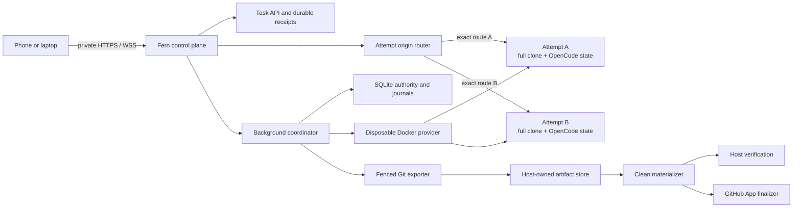
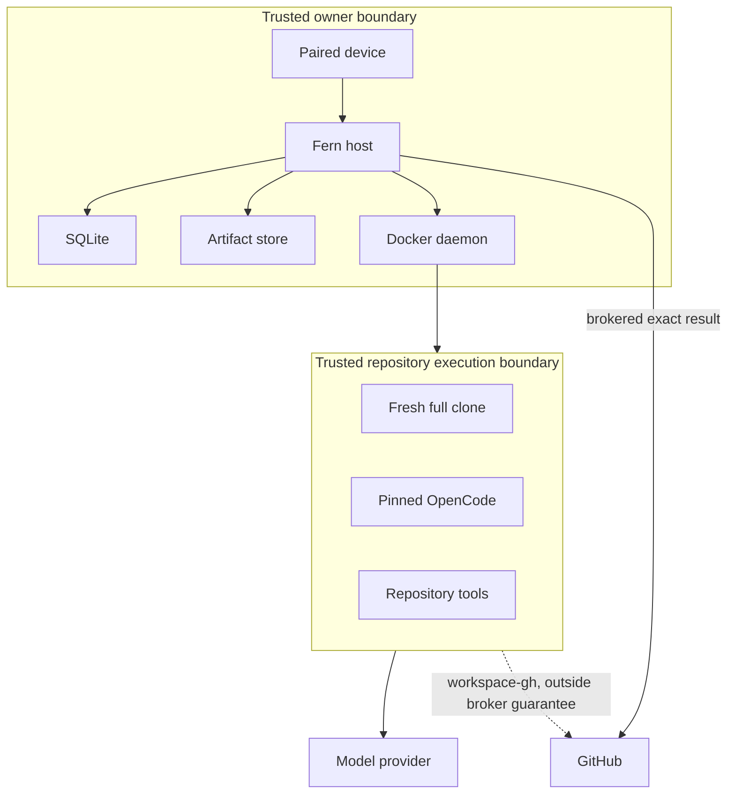
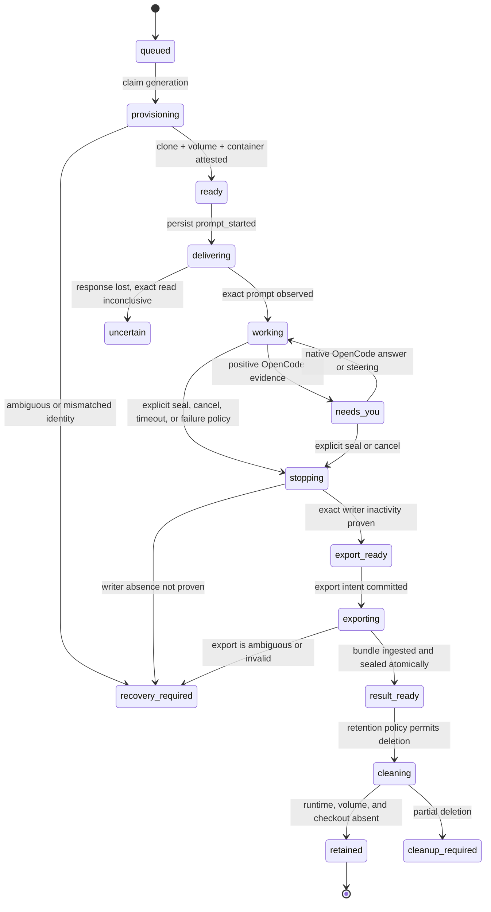
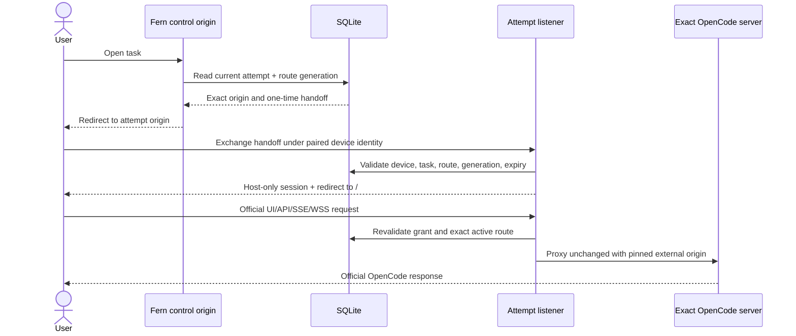
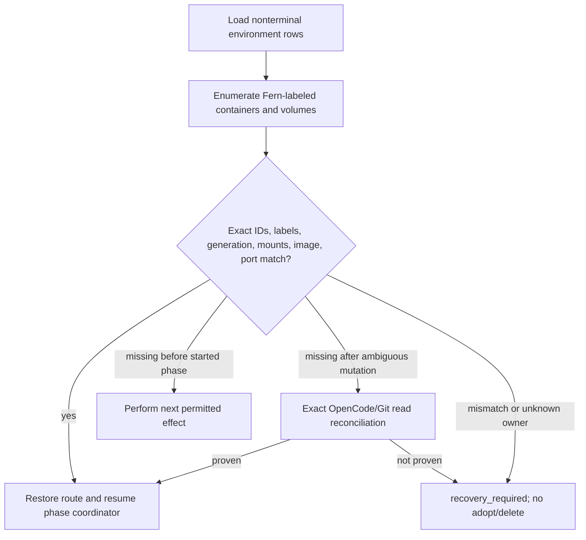
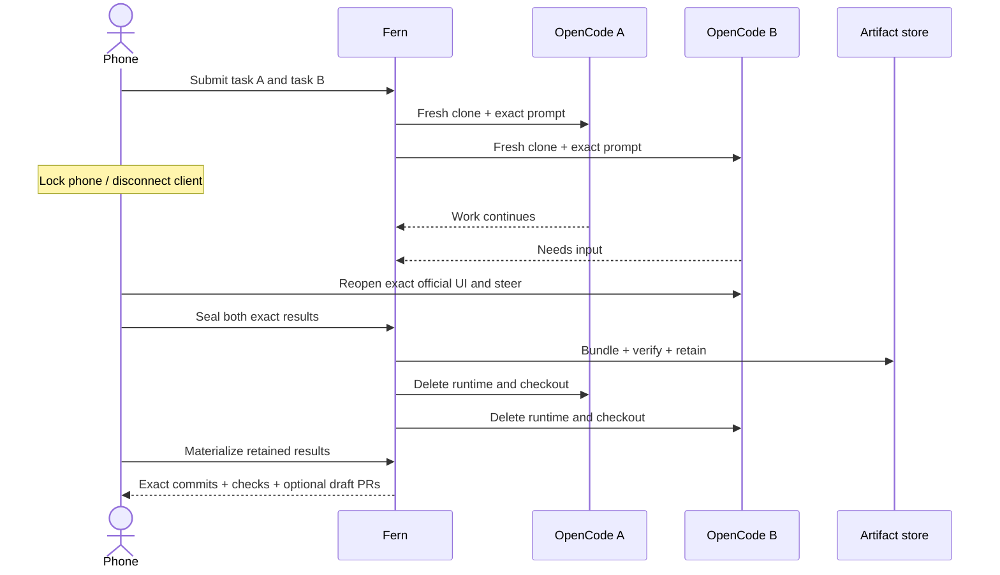

# OpenCode Background Mode Goal Design

**Status:** serial execution and private run routing implemented; result artifacts remain proposed

**Updated:** 2026-08-31
**Implementation checklist:**
[`todo/opencode-background-mode.md`](../todo/opencode-background-mode.md)

## 1. Goal

OpenCode Background Mode should let one trusted owner:

1. Select a configured repository and exact base commit.
2. Submit two independent tasks to an always-on private Linux host.
3. Leave every client disconnected while work continues.
4. Reopen the exact official OpenCode session for either task from another
   device.
5. Inspect, answer, steer, interrupt, or explicitly seal without creating a
   replacement session.
6. Stop every writer, export an immutable Git result, and delete the container,
   state volume, and checkout.
7. Reconstruct, verify, and optionally publish the exact selected commit using
   only host-owned retained artifacts.

The experiment is successful only if this native journey is repeatedly more
useful than OpenHands custom ACP or a managed cloud agent. Engineering
correctness is necessary but does not establish product value.

### Current Qualification Boundary

`images/opencode-background` provides the separate published
`opencode-ai@1.18.16` negative qualification. A distinct source candidate in
`images/opencode-background-source` builds exact commit
`39fb919a054190498f6d5b7985bde231f93ad7a6` as profile
`source-39fb919a054190498f6d5b7985bde231f93ad7a6`, and
`integration/opencode-background-source-contract` qualifies its public HTTP
behavior with real Docker and a zero-cost local provider. Package metadata at
that commit also says `1.18.16`, but the source profile does not claim
equivalence to the published package. `internal/taskenvdocker` now implements
the serial clone, volume, container, authenticated-health, stop, and separate
cleanup effects for one schema-9 run. `integration/background-run-docker`
qualifies that lifecycle against the operator-pinned local source image.
`internal/backgroundopencode` now implements the separate, deadline-required,
loopback-only client for this exact source profile. Its writes are one-shot;
session and prompt reconciliation are read-only, and prompt reconciliation uses
only finite advancing durable-history pages. Resuming delivery is exact only
after one matching durable admission and one later matching version-1 promotion;
admission alone is a distinct non-working observation. Active/question/permission
reads are conservative process-local observations, and interrupt response loss
stays ambiguous. A context already canceled before dispatch is returned directly,
but cancellation, deadline, or transport failure after dispatch is sanitized
transport ambiguity. `Resume=false` suppresses wake by that admission call; it
does not assert that another call cannot promote the prompt later.
`integration/background-run-opencode` qualifies those
properties by discarding the real prompt response after the server effect, then
proving admission/promotion, provider/client reconstruction, one exact provider
request, and no prompt replay against the real image and a zero-cost local
provider. The production-wired serial coordinator now claims one run at a time,
reconciles exact external identities, dispatches behind a durable at-most-once
prompt fence, periodically observes clone usage and positive OpenCode activity,
and performs stop/cleanup finalization. A crash after the prompt fence but before
HTTP dispatch cannot distinguish absence from an unobserved request: restart
retains `uncertain`, performs read-only reconciliation, and sends no second POST.
Private routing is implemented; retained Git export remains unimplemented. Persistent workspaces,
`internal/opencodeapi`, and the plugin remain unchanged.

Clone disk policy is admission plus repeated observed-byte monitoring, not a
kernel quota. The bind-mounted clone and Docker `local` state volume have no
portable hard byte quota in this provider; Docker Desktop does not expose a
per-local-volume quota or bounded usage reading through this lifecycle API.
Host filesystem exhaustion therefore remains a residual operational risk. The
coordinator periodically monitors bounded clone usage and stops conservatively,
but local-volume quota and usage remain unavailable. Container logs do
retain Docker-enforced `max-size` and `max-file` bounds.

The current dogfood configuration requires both `tasks.backgroundImage` and an
operator-pinned canonical local `tasks.backgroundImageID`. Qualification is
read-only and verifies the exact image ID, source/revision/version/profile
labels, runtime user, command argv, exposed port, and absence of a baked server
password. Registry-digest promotion remains required before external image
distribution.

That image pair also requires `tasks.backgroundRoute`: one fixed exact loopback
listener and one exact private HTTPS origin using the `proxy.remoteOrigin`
hostname on a distinct non-443 port. A concrete `internal/backgroundroute`
manager owns the pre-bound HTTP server, paired-device authentication, exact
forwarded-origin proxying, SSE/WebSocket behavior, and immutable
task/attempt/generation/runtime binding. It returns no-store 404/503 while
unbound, strips browser credentials before provider-owned Basic auth, and
re-attests the exact Docker process epoch and published port before each
upstream request. It removes the route before container deletion. The coordinator reconstructs an
active binding after restart from committed runtime identity; listener reuse is
fenced until route removal is durably observed.

Admission also commits the SHA-256 identity of the exact explicit
`tasks.backgroundEnvironment` map. A later image, model, or environment change
cannot resume the old execution: recovery claims the run, moves it to cleanup,
and uses its persisted resource tuple to remove the old runtime. Environment
values themselves do not enter the task database, evidence, or logs.

The published 1.18.16 qualification proves durable generated sessions and
message history across replacement, but records hard limitations: Session IDs
cannot be caller-selected and duplicate message IDs are not conflict-safe. The
source candidate passes the required identity and retry gates: caller-selected
Session and prompt IDs are preserved; agent, model, and location reconcile
exactly; finite durable history records exact prompt admission; exact retry is
side-effect free before and after replacement; and conflicting reuse returns
`409`. Active execution and unanswered questions/permissions remain
process-epoch state. A hanging provider turn has durable admission and promotion
but no durable step-start or settlement event before replacement, so execution
loss remains uncertain and inactivity is not completion authority. Official
deep-link routes, paired listener authentication, exact external-origin headers,
SSE flushing, WebSocket upgrade shape, and coordinator route cleanup are locally
qualified. Actual Tailscale multi-port/private TLS behavior and installed-device
acceptance remain external and unverified. Result-boundary acceptance remains
open.

### Required Properties

| Property | Goal |
| --- | --- |
| Native continuity | One Fern attempt maps to one authoritative OpenCode session and official UI. |
| Background execution | No connected browser, phone, or laptop is required after admission. |
| Freshness | Every attempt receives a full clone and distinct OpenCode state. |
| Exact identity | Repository, base, image, environment, session, prompt, result, and artifact identities are immutable. |
| Honest state | Silence, idle, process exit, and stream loss never imply success. |
| Writer fencing | Stop/cancel/seal/export reject stale attempt generations. |
| Durable result | Accepted Git objects survive runtime, volume, and checkout deletion. |
| Independent proof | Verification and publication consume a clean materialization, not agent state. |
| Bounded operation | Queue, concurrency, resources, time, retention, and cleanup are explicit. |
| Restart recovery | Fern reconciles exact external identities without replaying an admitted prompt. |

### Non-Goals

- A replacement OpenCode frontend.
- Generic ACP, multiple agents, or a lowest-common-denominator runtime API.
- Automatic generic completion.
- Hostile-repository or multi-tenant isolation on ordinary Docker.
- Kubernetes, Agent Sandbox, remote worker pools, or hosted scheduling.
- Gateway, model routing, accounting, evaluations, previews, or automation.
- A native phone application.

## 2. Goal Architecture

### Component Topology



Fern remains the durable authority. Docker and OpenCode are observed external
systems. The repository clone and OpenCode volume are disposable. The artifact
store is not.

### Trust Boundaries



Docker separates task state and resources but is not a security boundary for
hostile code. The first release accepts only configured repositories trusted to
execute on the owner host.

### Attempt Lifecycle



`result_ready` describes a Fern-sealed result, not an inferred OpenCode success.
Cancellation may end without a result. Failed attempts may preserve explicitly
labeled partial artifacts, but those are not publication eligible.

### Durable Versus Disposable State

| Durable host state | Disposable attempt state |
| --- | --- |
| Task and attempt rows | Full repository clone |
| Prompt/session IDs and digests | OpenCode database and config volume |
| Environment identity and generation | OpenCode process and child processes |
| Effect phases and leases | Container writable layer |
| Events and conservative projections | Tool caches scoped to the attempt |
| Export requests and artifact metadata | Dynamic host port/listener |
| Git bundle and manifest bytes | Runtime logs beyond retained bounds |
| Verification and publication journals | Temporary export refs and staging files |

### Proposed Repository Layout

Keep new code narrow and parallel to the current persistent workspace path:

```text
internal/
  taskenv/             IDs, specs, states, validation
  taskenvstore/        schema, transitions, claims, reconciliation queries
  taskenvdocker/       disposable Docker implementation
  taskenvcoord/        provisioning, observation, stop, cleanup loops
  taskroute/           task-to-attempt origin routing and proxy policy
  taskartifact/        Git bundle export, CAS ingestion, materialization
  taskartifactcoord/   export and cleanup reconciliation
integration/
  background-mode/     real-Docker lifecycle and fault harness
```

Do not add a general `Provider[T]` framework, scheduler package, Kubernetes
types, remote protocol, or generic agent adapter before a second accepted
implementation exists.

## 3. Goal Data Model

The exact names may change during migration design. The authority and uniqueness
constraints should not.

### `task_environments`

One row per task attempt generation:

```text
attempt_id                primary key, references attempts
workspace_id              immutable owner scope
generation                positive monotonic writer fence
state                     lifecycle projection
desired_state             running | stopped | deleted
repository_id             configured numeric identity
base_commit               full object ID
image_digest              immutable OCI digest
spec_digest               canonical complete spec digest
checkout_id               Fern-generated immutable ID
checkout_relpath          host root-relative, never client supplied
volume_name               Fern-derived exact Docker name
container_name            Fern-derived exact Docker name
container_id              observed exact Docker ID, nullable before creation
opencode_session_id       caller-selected exact ID
opencode_prompt_id        caller-selected exact ID
prompt_digest             SHA-256 of admitted prompt bytes
route_id                  unguessable immutable route identity
listen_port               reserved host port, nullable before allocation
provision_phase           none | clone_started | volume_started |
                          container_started | ready
stop_phase                none | intent_committed | interrupt_started |
                          container_stop_started | inactivity_proven
cleanup_phase             none | route_removed | container_removed |
                          volume_removed | checkout_removed | complete
lease_owner               nullable process identity
lease_generation          monotonic claim fence
lease_expires_at          bounded lease
revision                   optimistic concurrency revision
created_at / updated_at   server timestamps
```

Required constraints:

- unique `(workspace_id, generation, checkout_id)`;
- unique container, volume, route, and active port identities;
- immutable repository/base/image/spec/prompt/OpenCode identities after
  provisioning starts;
- state/phase combinations enforced by SQL triggers;
- terminal rows cannot regress;
- only the current task attempt and generation may acquire an effect lease.

### `artifact_exports`

The export journal exists before Git or filesystem mutation:

```text
id                         immutable export ID
task_id / attempt_id       exact source
environment_generation     stale-writer fence
state                      prepared | writing | ingested | sealed |
                           failed | recovery_required
phase                      intent_committed | snapshot_created |
                           bundle_written | bundle_verified |
                           cas_installed | result_committed
base_commit / result_commit / result_tree
manifest_digest
bundle_digest / bundle_size
storage_key                digest-derived, never client supplied
policy_version
lease_owner / lease_expires_at
last_error_code            bounded stable classification
created_at / updated_at
```

The mutable export journal is not the immutable Result. The final transaction
inserts the sealed Result, changed-file manifest, result-artifact reference, and
task/attempt completion events together. A crash after CAS installation but
before that transaction leaves an unreferenced object that garbage collection
may safely remove after a grace period.

### Artifact Manifest

Canonical JSON, hashed before storage:

```json
{
  "schema_version": 1,
  "repository_id": 123456,
  "task_id": "tsk_...",
  "attempt_id": "att_...",
  "environment_generation": 1,
  "base_commit": "<full oid>",
  "result_commit": "<full oid>",
  "result_tree": "<full oid>",
  "object_format": "sha1",
  "image_digest": "sha256:...",
  "spec_digest": "sha256:...",
  "opencode_session_id": "ses_...",
  "opencode_prompt_id": "msg_...",
  "completion_authority": "user_seal",
  "changed_files": [],
  "bundle": {
    "sha256": "...",
    "size": 0
  }
}
```

Canonicalization must reuse or extend `internal/jsoncanon`; no digest may depend
on Go map iteration, local paths, or wall-clock formatting.

## 4. Native OpenCode Routing

Multi-attempt routing is the largest UI-specific contract risk. OpenCode serves
its official app and APIs at one origin and may use absolute routes and upgraded
connections. Do not assume a path prefix works and do not rewrite compiled UI
assets.

### Prototype Choice: Port-Scoped Private Origins

The first contract spike should attempt one private HTTPS origin per attempt on
the same tailnet hostname with a distinct port:

```text
https://fern-host.example.ts.net:8444/  -> attempt A
https://fern-host.example.ts.net:8445/  -> attempt B
```

Each Fern listener maps one reserved port to one immutable route ID and exact
environment generation. It proxies `/`, `/api/*`, SSE, and upgraded connections
unchanged to that attempt. Browser origins differ by port, while the hostname and
certificate remain stable.

Before implementation, prove all of the following with the pinned OpenCode build
and actual Tailscale/TLS path:

- multiple private HTTPS ports can be published and revoked predictably;
- OpenCode redirects, absolute URLs, API calls, SSE, and WSS retain the correct
  external port;
- paired-device authentication and CSRF origin checks bind to the exact port;
- a stopped or deleted attempt cannot inherit a replacement attempt's port;
- two tabs can remain attached to different attempts simultaneously.

If the private edge cannot support multiple HTTPS ports, use distinct private
hostnames under an owner-controlled wildcard domain with DNS-01 TLS and one-time
device handoff. Do not fall back to global selector cookies, fragile HTML/JS
rewriting, public ingress, or a replacement OpenCode UI.

### Routing Flow



The handoff is single-use, short-lived, task/route/generation-bound, and stored
as a digest. Device revocation invalidates both control and attempt-origin
sessions. Route removal precedes container deletion.

## 5. Goal Go APIs

These interfaces express the minimum external boundaries. They are not intended
as generic plugin APIs.

### Disposable Docker Provider

```go
package taskenvdocker

type Spec struct {
    AttemptID        task.AttemptID
    Generation       uint64
    RepositoryID     int64
    BaseCommit       gitref.OID
    ImageDigest      string
    CheckoutID       taskenv.CheckoutID
    VolumeName       string
    ContainerName    string
    OpenCodePassword secret.Value
    Limits           Limits
}

type Observed struct {
    ContainerID string
    Running     bool
    OOMKilled   bool
    ExitCode    *int
    HostPort    uint16
    Labels      map[string]string
}

type Provider interface {
    Ensure(context.Context, Spec) (Observed, error)
    Inspect(context.Context, Spec) (Observed, error)
    Stop(context.Context, Spec, string) (Observed, error)
    Delete(context.Context, Spec) error
}
```

`Ensure` is idempotent only for the same complete spec and generation. Existing
resources with mismatched labels, image digest, mounts, UID, network, or limits
return an identity error and are quarantined. `Delete` removes only resources
whose exact IDs and labels match the committed spec.

### Store Claims

```go
type Claim struct {
    Environment taskenv.Environment
    LeaseOwner  string
    LeaseUntil  time.Time
}

type Store interface {
    ClaimProvision(context.Context, string, time.Time) (Claim, error)
    RecordProvisionPhase(context.Context, Claim, taskenv.ProvisionPhase, Evidence) error
    MarkReady(context.Context, Claim, taskenv.ReadyEvidence) error

    RequestStop(context.Context, task.AttemptID, uint64, taskenv.StopReason) error
    ClaimStop(context.Context, string, time.Time) (Claim, error)
    RecordWriterInactive(context.Context, Claim, Evidence) error

    ClaimExport(context.Context, string, time.Time) (ArtifactClaim, error)
    CommitSealedArtifact(context.Context, ArtifactClaim, SealedArtifact) error

    ClaimCleanup(context.Context, string, time.Time) (Claim, error)
    RecordCleanupPhase(context.Context, Claim, taskenv.CleanupPhase, Evidence) error
}
```

Every mutating store call validates lease owner, lease expiry, attempt
generation, task cancellation epoch, current attempt ownership, expected state,
and row revision in one transaction.

### Artifact Exporter

```go
type Exporter interface {
    Export(context.Context, ExportSpec) (StagedArtifact, error)
    Verify(context.Context, StagedArtifact) (VerifiedArtifact, error)
    Install(context.Context, VerifiedArtifact) (StoredArtifact, error)
    Materialize(context.Context, StoredArtifact, string) (MaterializedResult, error)
}
```

The exporter accepts only server-derived paths and object IDs. It executes Git
with argv arrays, a fixed environment, bounded output, timeouts, and no shell.
It does not receive GitHub or provider credentials.

## 6. Concurrency And Correctness Patterns

### Coordinator Shape

Use the repository's existing coordinator style:

- one coordinator loop per effect class: provision, observe, stop, export, and
  cleanup;
- a process-local `runMu` prevents overlapping scans by one coordinator;
- short SQLite transactions claim exact rows with expiring leases;
- external I/O runs after the claim transaction commits;
- a second transaction records exact observations and advances one phase;
- startup and periodic scans reclaim expired leases conservatively;
- `errgroup` owns long-lived loops and shutdown;
- a weighted semaphore caps active environments at two;
- keyed singleflight may coalesce read-only health probes, never mutations.

Do not hold a database transaction across Docker, OpenCode, Git, filesystem, or
GitHub I/O.

### Intent Before I/O

```mermaid
sequenceDiagram
    participant C as Coordinator
    participant DB as SQLite
    participant X as Docker/OpenCode/Git

    C->>DB: Claim exact row and commit effect_started
    DB-->>C: Lease + generation + immutable spec
    C->>X: Perform one bounded mutation
    alt response received
        X-->>C: Exact observation
        C->>DB: Validate lease/generation and commit next phase
    else response lost or process exits
        C->>DB: Lease expires; phase remains started
        C->>X: Read exact external identity
        C->>DB: Reconcile, quarantine, or require recovery
    end
```

Silence never authorizes repeating a mutation. Reconciliation asks whether the
exact intended object exists and matches the immutable spec.

### Generation Fencing

Every attempt environment has a generation. A replacement increments it. All
claims, Docker labels, route records, export requests, result seals, cleanup
operations, and publication admissions carry that generation.

```go
if observed.Generation != claim.Environment.Generation {
    return taskenv.ErrStaleGeneration
}
```

This check is necessary at every Fern-controlled write boundary. It cannot fence
direct provider, shell, network, or workspace-`gh` effects; those remain outside
Fern's exactly-selected-result claim.

### Cancellation

`context.CancelFunc` stops local waiting but is not task authority. The durable
order is:

1. Commit task `cancel_requested`, increment the cancellation epoch, and fence
   new delivery/export/publication claims.
2. Commit exact environment stop intent.
3. Interrupt the exact OpenCode session if still addressable.
4. Stop the exact container if writer inactivity is not otherwise proven.
5. Inspect until the exact container is inactive or enter
   `recovery_required`.
6. Mark cancellation acknowledged. Preserve prior effects honestly.

An explicit result seal uses the same stop path but, after inactivity, proceeds
to export rather than cancellation completion.

### Queue And Capacity

Start with serial execution. Later use a fixed capacity of two:

```go
limit := semaphore.NewWeighted(2)
```

Capacity admission occurs before provisioning but after durable task admission.
A queued task consumes no Docker mutation lease. Disk admission checks the
configured reserve and worst-case clone/artifact budget before claiming a slot.
Fairness is oldest accepted task first, with no priority API in the first
release.

### Filesystem Atomicity

Artifact installation follows:

1. Write bundle and manifest under a host-owned staging directory on the same
   filesystem as the artifact store.
2. `fsync` each file.
3. Verify digests and `git bundle verify` from staging.
4. Create a digest-named CAS directory with exclusive creation.
5. Atomically rename staged files into it and `fsync` the parent directory.
6. Commit the result/artifact database transaction.

Existing digest content must match byte-for-byte. A mismatch is corruption and
forces recovery. Database references prevent garbage collection; unreferenced
objects are removed only after a startup-spanning grace period.

### Git Bundle Construction

After writer inactivity is proven:

1. Revalidate repository identity, object format, exact base, and worktree.
2. Create the selected result commit using the existing seal policy.
3. Create temporary namespaced refs for base and result under the export ID.
4. Run `git bundle create` over those refs so an empty repository can obtain all
   required objects.
5. Remove temporary refs after the bundle is installed or on reconciliation.
6. Verify the bundle in a clean temporary repository.
7. Materialize the exact result commit and compare its tree and manifest.

Raw SHA arguments alone are not accepted as proof that `git bundle` included the
necessary refs and objects.

### Restart Reconciliation

At startup:



Fern also finds labeled Docker resources absent from SQLite. It reports them as
orphans and does not delete them automatically until ownership and retention
policy are explicitly reconciled.

## 7. HTTP And CLI Surface

Proposed control routes, all under existing paired-device policy and CSRF rules:

```text
POST /fern/api/tasks                         existing admission, extended repo selection
GET  /fern/api/tasks/{taskID}                include environment/artifact projection
POST /fern/api/tasks/{taskID}/open           issue exact route handoff
POST /fern/api/tasks/{taskID}/stop            durable cancel or explicit stop
POST /fern/api/tasks/{taskID}/seal-preview    existing concept, attempt-aware
POST /fern/api/tasks/{taskID}/seal            existing concept, artifact-aware
GET  /fern/api/tasks/{taskID}/artifact        metadata only, no raw arbitrary path
POST /fern/api/tasks/{taskID}/materialize     operator-only or explicit bounded action
```

Proposed operator commands:

```text
fern task environments
fern task inspect <task-id>
fern task reconcile <task-id>
fern task materialize <task-id> --destination <empty-directory>
fern task cleanup <task-id>
fern debug background-contract
```

The first UI change should be small: environment status, an `Open OpenCode`
link, explicit stop/seal controls, retained artifact proof, and cleanup state.
Conversation, terminal, file, permission, and diff UI remain OpenCode-owned.

## 8. Concrete Implementation Slices

### Slice 0: Contract And Comparison

- Pin OpenHands, OpenCode, images, and API hashes.
- Complete the native capability matrix and routing-origin spike.
- Add newer OpenCode fixtures without changing the production pin.
- Decide go/no-go using real owner tasks.

**Exit:** native attachment has repeated value and one exact routing strategy is
proven through private TLS, SSE, and WSS.

### Slice 1: Schema And Fake Provider

- Add environment/export IDs, enums, canonical specs, validation, migrations,
  SQL triggers, and store tests.
- Build an in-memory/fake provider that injects lost responses and identity
  mismatches.
- Add coordinator claims, lease expiry, restart scans, and stale-generation
  tests.

**Exit:** every transition and ambiguous effect is testable without Docker.

### Slice 2: Serial Real Docker

- Implement full clone, state volume, exact container labels, limits, health,
  stop, and delete.
- Start one pinned OpenCode server and admit one exact prompt.
- Restart Fern during every provision/delivery phase.
- Route the official UI through the selected private origin.

**Exit:** one serial task survives restart without prompt replay and can be
steered through the exact official UI.

### Slice 3: Artifact Boundary

- Add export journal, writer fence, Git snapshot, canonical manifest, full
  bundle, CAS ingestion, and clean materialization.
- Extend `SealAuthorizedResult` or add one composed transaction so result,
  artifact, attempt, task, and events commit together.
- Delete all disposable state and prove exact reconstruction.

**Exit:** 100% reconstruction under normal and interrupted-export tests.

### Slice 4: Fault-Complete Serial Lane

- Cover Docker response loss, Fern restart, OpenCode restart, OOM, timeout,
  cancellation races, disk exhaustion, cleanup interruption, and orphan
  detection.
- Add bounded metrics and operator diagnostics.
- Add artifact backup and replacement-host restore.

**Exit:** zero mutation replay and no manual database edits across the fault
suite.

### Slice 5: Concurrency Of Two

- Add weighted capacity, disk admission, oldest-first queueing, and two active
  routes.
- Run same-base tasks with separate clones, volumes, credentials, ports, and
  OpenCode IDs.
- Kill/restart one attempt without affecting the other.
- Seal and reconstruct both results independently.

**Exit:** no writable sharing, route crossover, stale write, or result mix-up.

### Slice 6: Verification, Publication, Notification

- Materialize retained artifacts for host verification.
- Bind App publication to the verified artifact commit and generation.
- Keep direct workspace `gh` explicitly outside receipt-backed guarantees.
- Add one outbox-backed notification destination if dogfood shows a recurring
  attention need.

**Exit:** one exact artifact reaches one verified draft PR under lost-response
and restart injection.

### Slice 7: Dogfood And Release

- Run six real tasks over two weeks, including two concurrent pairs and one
  forced failure.
- Apply recurrence, native-use, unattended-yield, reconstruction, repair-time,
  and preference gates from the TODO.
- If gates pass, complete signed Ubuntu install/doctor, retention defaults,
  backup/restore, and one external installation.

**Exit:** continue, narrow, or stop based on recorded use rather than demo
quality.

## 9. Verification Matrix

| Boundary | Required test |
| --- | --- |
| Admission | Duplicate request returns one task/attempt/environment identity. |
| Provision | Lost Docker response reconciles exact labels and never creates a second container. |
| Delivery | Lost OpenCode response performs exact read reconciliation and never resends admitted text. |
| Route | Two origins remain bound to the correct session through SSE/WSS and restart. |
| Stop | Task remains canceling/stopping until exact writer inactivity is proven. |
| Generation | Every stale provision/route/export/cleanup/result write is rejected. |
| Export | Crash at every phase yields either a verified artifact, safe resumable phase, or recovery state. |
| Retention | Bundle reconstructs exact commit/tree after checkout, volume, and container deletion. |
| Verification | Check runs only against clean materialization of the artifact commit. |
| Publication | Lost push/PR responses reconcile one exact branch and draft PR. |
| Cleanup | Partial deletion resumes by exact identity; unknown resources are quarantined. |
| Restart | Every accepted task reaches a truthful state without prompt replay. |
| Isolation | Same-repository attempts share no writable checkout, Git common dir, state volume, or route. |

## 10. Demo Plan

### Demo Repository

Use a disposable private repository with:

- a small Go service;
- one deterministic failing test for task A;
- one bounded feature request touching different files for task B;
- a verification command committed in Fern configuration;
- GitHub App mode enabled only for the final draft-PR step.

Record exact Fern release, source commit, OpenCode image digest, repository ID,
base commit, host identity, and private origins before starting.

### Ninety-Second Product Demo



Screen sequence:

1. Show no active attempt containers.
2. Submit two real tasks from the phone or a narrow browser.
3. Show two distinct environment/session/base identities and two active
   containers.
4. Close the client and show host-side progress continues.
5. Reopen task B from another device directly into its official OpenCode UI.
6. Give one steering instruction and show task A remains unaffected.
7. Explicitly seal both tasks.
8. Show bundle digest, result commit, tree, and successful clean verification.
9. Delete both containers, volumes, and checkout directories.
10. Materialize both results into empty directories and show matching commit/tree
    IDs.
11. Optionally create two distinct draft PRs from the retained verified
    artifacts.

Do not claim autonomous completion; say that the owner explicitly selected each
result.

### Extended Failure Demo

Run a five-to-eight-minute engineering version:

1. Submit two same-base tasks.
2. Kill Fern after task A's prompt is admitted.
3. Restart Fern and show the same session/prompt IDs with no duplicate message.
4. Force-kill task B's OpenCode container while task A continues.
5. Show task B as failed, uncertain, or recovery-required rather than completed.
6. Restart or recover task B only through its exact committed generation.
7. Begin task A export, kill Fern after bundle installation but before result
   commit, restart, and reconcile without a second selected result.
8. Attempt a stale-generation cleanup/export write and show rejection.
9. Delete runtime state and reconstruct both accepted results.
10. Lose a publication response and show exact GitHub read reconciliation to one
    branch and one draft PR.

### Demo Evidence

Retain:

```text
demo/
  identity.json
  task-a-events.json
  task-b-events.json
  environment-inspect-before.json
  environment-inspect-after.json
  artifact-a-manifest.json
  artifact-b-manifest.json
  bundle-verification.txt
  materialization-proof.txt
  verification-results.json
  publication-proof.json
  screenshots/
  redaction-review.txt
```

Redact prompts, repository content, credentials, cookies, private hostnames, and
provider payloads. Preserve hashes and exact state transitions needed to support
the claim.

## 11. Where To Go Next

If dogfood fails, keep Fern as a strong single-workspace personal appliance and
either contribute OpenCode ACP integration improvements to OpenHands or narrow
Fern to exact result/finalizer tooling.

If dogfood passes:

1. Harden install, doctor, upgrade, retention, backup, and replacement-host
   restore for one owner-operated Ubuntu appliance.
2. Obtain one external OpenCode user and observe an unassisted installation and
   real task before broadening architecture.
3. Add only the attention/question type repeatedly observed in dogfood.
4. Add a remote outbound runner only when a second host or placement need
   recurs.
5. Add Kubernetes/Agent Sandbox only for a customer cluster, multi-node
   placement, workload identity, NetworkPolicy, RuntimeClass, or measured
   capacity need.
6. Add Gateway only for credential custody, budgets, accounting, routing,
   fallback, or an explicit portfolio objective.
7. Add another runtime only after OpenCode-specific value and a second pinned
   contract justify an abstraction.

The next architecture decision should follow observed usage. Passing the fault
suite without recurring native OpenCode use proves an engineering artifact, not
a standalone product.
