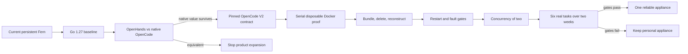

# Product Direction

This document owns Fern's product direction. [Architecture](./ARCHITECTURE.md)
and code own current implementation behavior.

## Direction

Fern is a self-hosted control plane for durable remote coding tasks, using
OpenCode as its first agent runtime:

> Submit work remotely, disconnect, return to the same task, authorize an exact
> repository result, verify it under host policy, and publish it safely from a
> workspace that can stop, wake, reboot, and recover.

Fern should not become another model loop or rebuild OpenCode's coding UI.
OpenCode remains authoritative for conversations, tools, process-epoch input,
terminals, files, and diffs. Fern owns the durable journey around those
capabilities.

The candidate next product mode is **OpenCode Background Mode**:

> Submit work to an always-on private host, leave, inspect or steer the exact
> native OpenCode session from another device, and retain an exact recoverable
> Git result after the runtime disappears.

This authorizes a bounded comparison and disposable-Docker experiment, not a
generic Fern 2.0 platform. It proceeds only if native OpenCode is materially more
useful than OpenHands custom ACP for repeated owner work. The ordered plan lives
in [Fern Roadmap](./ROADMAP.md) and the concrete checklist lives in the
[Background Mode TODO](../todo/opencode-background-mode.md).

## Product Boundary

| Concern | Authority |
| --- | --- |
| Task receipt, delivery, attempts, cancellation | Fern SQLite |
| Conversation and tool execution | Pinned OpenCode profile |
| Compute lifecycle and recovery | Fern Docker runtime |
| Repository content | Git and the workspace |
| User-authorized result | Exact Fern seal request and Git evidence |
| Automatic execution result | Future authoritative observer; inactivity is insufficient |
| Verification | Host-owned Fern policy and exact commit proof |
| App publication | Fern receipt/effect journal plus GitHub exact reads |
| Direct workspace publication | Explicit user/prompt intent plus workspace `gh` |
| Repository identity | Configured numeric GitHub identity, revalidated live |
| Model credential custody and metering | Conditional Fern Gateway; provider credentials currently may enter the trusted workspace |
| Experiment definitions and evaluation | Conditional Fern Labs; no production experiment service is currently composed |

The two GitHub modes are explicit and mutually exclusive. `workspace-gh`
matches the Amp-style workflow: trusted workspace code receives an authenticated
`gh` CLI and direct effects are outside Fern's receipts. `github-app-broker`
keeps credentials on the host and permits receipt-backed publication of one
exact sealed and verified result. Fern must not describe its phone action as an
exclusive publication gate in workspace-`gh` mode.

## Current Product Path

The implemented journey is:

1. Pair a device through one canonical private HTTPS origin.
2. Submit one task with a browser-persisted idempotency key and body.
3. Commit task, attempt, receipt, actor, base SHA, and exact OpenCode IDs before
   wake or delivery.
4. Deliver through journaled phases and reconcile exact IDs without mutating a
   prompt after ambiguity.
5. Project only positive `running` or `input_required` evidence; never infer
   generic completion.
6. Preview and authorize one exact clean snapshot under `AcquirePaused`.
7. Seal that snapshot as `user_seal`, mark the attempt `superseded`, and complete
   the task without claiming OpenCode success.
8. Optionally verify the exact commit with host-owned shell-free policy.
9. In App mode, atomically admit one publication receipt and reconcile one exact
   branch and draft PR through the paired API. The embedded task page currently
   displays but does not initiate publication. In workspace-`gh` mode, use
   ordinary explicit `git`/`gh`.
10. Read coherent task, seal, result, verification, publication, and PR status
    from the phone task page.

Lifecycle, offline backup/rollback, encrypted GitHub credential custody,
schema-4 to schema-6 compatibility fixtures, readiness telemetry, and an
attested tag-release workflow support that journey.

## Evidence Boundary

Checked-in automated evidence includes unit/race tests, deterministic browser
and lifecycle harnesses, a zero-cost pinned OpenCode contract harness, release
reproducibility, schema upgrade/byte-restore/upgrade, backup archive and
operational recovery tests, and a synthetic self-test of the physical evidence
recorder.

It does not prove a physical Android or iOS rehearsal occurred. It also does not
prove target Ubuntu/systemd boot, physical reboot, replacement-host restore,
abrupt-power-loss behavior, real private TLS/WSS, physical stream/PTY revocation,
independent tailnet ACL denial, provider-funded execution, or live
organization-specific GitHub policy. Those require operator-controlled evidence
tied to an exact build. See [Phone Field Demo](./FIELD_DEMO.md) and
`integration/production-rehearsal/README.md`.

## Remaining Product Milestones

### Physical Acceptance

Run and retain one complete source-host to replacement-host rehearsal:

- exact release/source/image preflight;
- physical reboot and service recovery;
- verified offline backup;
- old-host service and origin fence;
- replacement-host restore and health;
- real external TLS/WSS browser and terminal traffic;
- physical phone task journey and revocation;
- independent ACL-negative observation;
- redacted final evidence review.

The recorder validates supplied observations but does not perform these steps.

### OpenCode Background Mode

Keep the current persistent workspace unchanged and add a separate per-attempt
Docker lane only after the OpenHands comparison. Each attempt gets a full clone,
OpenCode state volume, pinned server, immutable route, exact identities, explicit
writer stop, Git bundle and manifest, runtime deletion, and clean independent
reconstruction. Start serially and add concurrency of two only after restart,
lost-response, cancellation, stale-generation, export, disk, and cleanup gates
pass.

The owner has already demonstrated the phone flow. Background execution,
cross-device native takeover, exact result retention, and recurring owner use are
the next product questions.

### Conditional Gateway Credential And Measurement Boundary

Provider keys can currently be forwarded into the trusted OpenCode workspace.
If credential custody, cost, budget, routing, fallback, or portfolio goals become
important, Fern may add a small host-side Gateway that proves one real OpenCode path with scoped
tokens, host-held provider credentials, correct streaming, explicit model
policy, usage/cost records, and cancellation. A universal translation layer,
adaptive routing, and provider breadth are not prerequisites.

The normal personal deployment should keep an in-process limiter and SQLite
ledger. Redis, PostgreSQL, multiple replicas, and Kubernetes belong to a
separate measured scale profile, not the default single-owner release.

### Conditional Fern Labs

Labs is not on the Background Mode critical path. Before implementing it, run the no-build evaluation gate in
[Fern Roadmap](./ROADMAP.md) against a direct private-repository tool and an
open-source runner. Labs is not a standalone product thesis until that test
shows recurring value.

If promoted, the first Labs release remains trusted, serial, and reproducible:
a small set of versioned benchmark cases, two model/provider arms, a fresh
checkout and OpenCode state per run, exact image/base identities, deterministic
visible and hidden checks, hard-failure gates, and row-level reports. It does
not accept arbitrary hostile repositories or claim public multi-tenancy.

Labs should prefer mechanical evaluation over LLM judges. Where a judge is
unavoidable, its model, prompt version, input digest, and output are part of the
evaluation record and cannot override deterministic hard failures.

### Generic Completion

The pinned OpenCode profile has no durable generic terminal-success/failure
object. Automatic observer-authorized sealing remains blocked until an exact,
restart-safe primitive can provide two identical success observations inside
`AcquireQuiesced`. Idle, empty inbox, process death, and volatile events remain
invalid evidence.

### Durable Input And Notifications

Fern records `input_required` but has no durable approval table or phone answer
API. It must not recreate vanished form/permission options after an OpenCode
process epoch. A future design needs exact context hashes, actor receipts,
delivery reconciliation, and restart semantics.

Notifications, transactional outbox delivery, PR/CI polling, and review
continuation are not implemented. Build them only after durable event and actor
contracts are fixed; external events are hints and current state must be
reconciled.

The paired App publication API is implemented, but the embedded phone task page
has no publication button or persisted publication command. That UX must retain
the exact idempotency key until acceptance, following the submission pattern.

### GitHub Onboarding And Credential Lifecycle

App discovery primitives exist, but installation/repository selection still
requires operator configuration and first activation requires restart. Complete
onboarding should present and persist an exact numeric selection without
creating a mutable confused-deputy path.

Age-encrypted export/import/rotation and local rollback are implemented. Import
can bootstrap an empty App store or absent workspace-`gh` volume; the first
activation has no prior rollback artifact, and failure restores absence. Rotate
still requires an active prior generation. Fern cannot revoke superseded App
keys or workspace OAuth tokens at GitHub, so external revocation and proof
remain an operator obligation.

### Recovery Atomicity

Offline restore and rollback are staged and retain a durable pre-restore
generation, but filesystem roots and Docker volumes activate sequentially.
Physical abrupt-power-loss characterization and explicit operator recovery from
partially activated domains remain necessary. Online cross-store snapshots are
not a current product claim.

### Operator Browser Boundary

The operator listener stays host-only and is not a supported OpenCode browser
origin. Exact origin and Fetch Metadata checks exist, but operator HTML forms do
not have device-style per-request CSRF tokens. Keep controls CLI/host-local or
add a control-only browser surface before broadening support.

## Sequencing

The critical path is now:

Generic completion, durable input, notification, onboarding, and publication UX
remain valid gaps, but they are not prerequisites for the disposable proof. They
should be promoted when Background Mode dogfood shows that they dominate failures. No
future work may weaken current receipt, exact-identity, cancellation, result,
verification, or publication fences.

## Later Backends

Docker remains the supported single-owner backend. Before adding another,
separate workspace policy from Docker-specific status, endpoint, storage, logs,
and lifecycle operations. Kubernetes is useful only for a concrete fleet or
multi-node deployment; it does not supply Fern's durable task semantics or
hostile tenant isolation. A hostile shared service additionally needs workload
identity, secret/egress policy, audit, and a sandbox such as gVisor, Kata, or a
microVM boundary.

## Not Now

- A second coding conversation UI.
- Native Fern mobile applications.
- Multi-agent orchestration or a general workflow builder.
- Kubernetes as a requirement for the personal release.
- Fern Gateway or Fern Labs on the Background Mode critical path.
- Hostile multi-tenancy on ordinary shared-kernel Docker.
- A public sandbox-as-a-service API.
- A universal provider translation layer or more than two initial providers.
- Adaptive model routing before Labs has enough real outcome data.

## Success Criteria

Fern succeeds when the task and its exact evidence survive disconnects and
lifecycle changes, not merely when an HTTP connection or container remains
alive. The next product milestone is two isolated native OpenCode attempts that
survive Fern restart without replay, can be inspected from another device, and
produce Git results that reconstruct exactly after their runtimes and checkouts
are deleted. Product expansion requires at least six real tasks over two weeks,
repeated native-UI value, useful unattended yield, no cross-attempt writable
sharing, and 100% reconstruction of accepted results.
