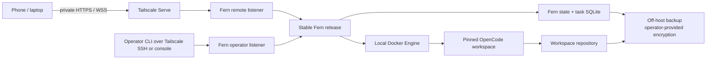
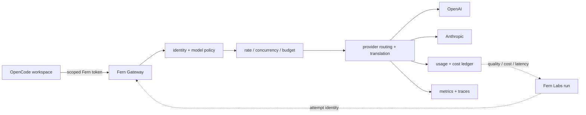
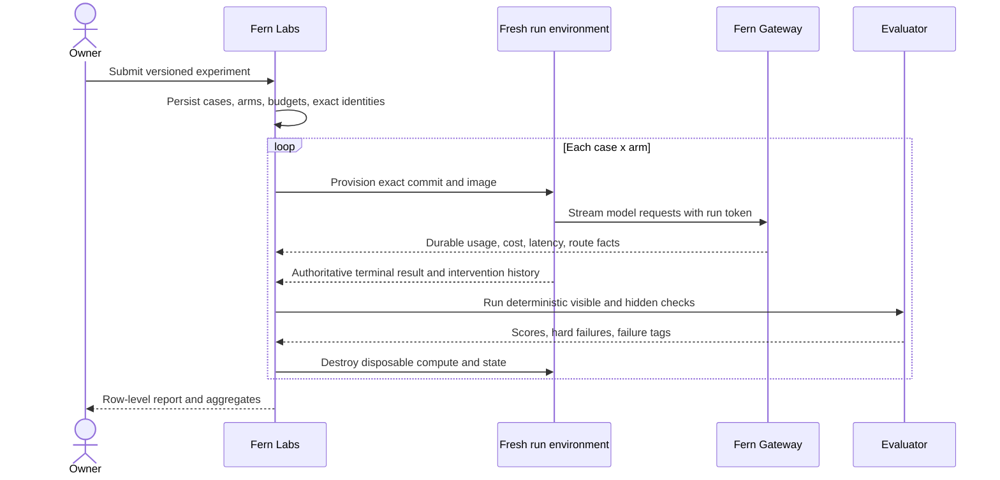

# Fern Roadmap And Conditional Backlog

This document orders future work and keeps later options behind evidence gates.
It does not describe current behavior. [Architecture](./ARCHITECTURE.md) and code
remain authoritative for what is implemented; [Product Direction](./REMOTE_PRODUCT.md)
owns the accepted boundary; and the
[Background Mode TODO](../todo/opencode-background-mode.md) is the executable
checklist for the active experiment.

## Decision Summary

The only active product hypothesis is:

> **OpenCode Background Mode: submit work to an always-on private host, leave,
> inspect or steer the exact native OpenCode session from another device, and
> retain an exact recoverable Git result after the runtime disappears.**

The order matters:

1. Preserve the validated Go 1.27 baseline and current persistent workspace.
2. Prove a documented OpenCode TUI plugin can provide `/fern`, first-use host
   pairing, exact repository/base confirmation, and durable run submission.
3. Compare pinned OpenHands custom ACP with the official OpenCode experience.
4. Pin and characterize one newer OpenCode V2 candidate.
5. If the native difference survives, build one serial disposable Docker
   Background Run with a fresh clone, official OpenCode session endpoint,
   retained Git bundle, restart reconciliation, runtime deletion, and clean
   reconstruction.
6. Add concurrency of two, verification/publication adaptation, notification,
   and retention only after serial fault gates pass.
7. Dogfood at least six real runs over two weeks and apply explicit kill gates.

The owner has completed the phone demo; physical Ubuntu, reboot, replacement-host,
and release evidence remain separate production-acceptance work. This is not a
plan to build another editor, generic agent platform, public sandbox service,
Kubernetes platform, Gateway, or evaluation product.

## Launch And Integration Decision

The primary launch surface is OpenCode itself:

> **Install the Fern OpenCode plugin, run `/fern`, and leave after Fern returns a
> durable Background Run ID.**

The plugin is a client of Fern, not the owner of execution. It may collect the
current repository, exact `HEAD`, clean-worktree status, and prompt; show native
OpenCode dialogs and status; and open the resulting session. Fern must commit
the run before acknowledging submission and must continue without the plugin,
TUI, or initiating device.

Do not build against OpenCode's workspace-provider API for this launch. The
legacy `experimental_workspace` plugin seam observed in OpenCode commit
`39fb919` was replaced during the V2 workspace redesign. At upstream commit
`583a1a2`, workspace providers are embedded host configuration rather than a
documented ordinary-plugin extension, the home OpenCode process remains the
session owner, and the public lifecycle surface is incomplete. That model may
be reconsidered for an intentional always-on, fully remote OpenCode service,
but it does not satisfy local-to-background handoff today.

MCP and skills are secondary conveniences. A skill can explain when to use
Fern, and an MCP tool can request a run from clients without a native plugin,
but neither should be the primary effectful launch because model-mediated tool
selection is not a reliable confirmation or authentication boundary. ACP is an
execution/client protocol option, not the preferred way to add a launch action
to the OpenCode TUI.

### First-User Journey

The first release has no Fern account sign-up. Onboarding pairs one OpenCode
client with a Fern host that the trusted owner already operates. Host bootstrap
remains explicit:

```text
fern init --repo /path/to/repository
fern up --config fern.yaml
fern doctor --phone
```

These existing commands establish the configured repository, service, private
origin, and initial trusted-device path. Background Mode must add a compatibility
check and scoped plugin authorization to that host; plugin installation must not
silently provision infrastructure or register arbitrary repositories.

The exact package name and command syntax must be pinned to the selected
OpenCode release, but the intended journey is:

```text
# One-time installation
opencode2 plugin add @fern/opencode@<pinned-version>

# Normal use
opencode2 /path/to/repository
/fern Fix the cancellation race and add a regression test
```

If the plugin has no Fern credential, `/fern` starts setup instead of failing
with a configuration-file instruction:

1. Ask for or discover the private Fern HTTPS origin.
2. Display a short-lived verification URL and user code.
3. Require approval through an already trusted Fern operator or paired-device
   channel.
4. Store a revocable client credential outside `opencode.json`, scoped only to
   create, read, stop, open, and fetch-result operations.
5. Call Fern readiness and compatibility endpoints and show the exact host and
   supported run profile before declaring setup complete.
6. Match the local canonical Git remote to a repository already configured on
   Fern. Repository registration and credential administration remain explicit
   host-owner actions in the first release.

The first launch confirmation should show:

```text
Run on Fern?

Host          fern-home
Repository    owner/repository
Base          <exact commit OID>
Working tree  clean
Runtime       OpenCode <pinned profile>
Prompt        Fix the cancellation race and add a regression test

[ Run in background ]  [ Cancel ]
```

Initially reject a dirty or unresolved worktree. Fern must clone from the
configured remote at the exact reachable base; it must not silently copy local
files, infer a branch tip, or imply that the local conversation moved. A later
conversation export/import experiment must be labeled a branch and separately
prove its transcript and filesystem boundaries.

After Fern durably accepts the request, the plugin records only safe local
correlation data and shows:

```text
Background Run run_...
State          Setting up
OpenCode       Starting

/fern runs
/fern open run_...
/fern stop run_...
/fern result run_...
```

`open` must resolve the current authoritative endpoint from Fern instead of
caching an attempt URL. Closing OpenCode immediately after acceptance must not
affect provisioning, prompt admission, execution, retention, or cleanup.

### Harness-Neutral Boundary

Fern should be launch-surface independent without pretending all coding
harnesses have the same session semantics. The stable outer request should be
small:

```text
CreateBackgroundRun
  repository identity
  exact base commit
  instruction
  idempotency key
  requested execution profile

BackgroundRun
  durable run ID
  conservative state
  attention state
  harness-specific session locator, when live
  retained Git result locator, when sealed
```

An OpenCode plugin, another harness plugin, a human CLI, or an MCP server may
translate its local context into that request. All of them must receive the same
durable run identity and use the same read, stop, open, and result operations.
Authentication, repository authorization, admission, environment generations,
writer fencing, and artifact retention remain Fern-owned.

Execution is not generic in the first release. OpenCode-specific session IDs,
prompt admission, questions, permissions, event recovery, and deep links belong
to one pinned OpenCode execution profile behind the neutral run boundary. Do
not create a universal harness interface, generic ACP layer, or lowest-common-
denominator conversation model before a second real integration is accepted.

A second harness becomes eligible only when owner use demonstrates a recurring
need and its plugin or CLI can prove:

- exact and idempotent admission;
- continued execution after its initiating client exits;
- restart-safe observation without mutation replay;
- an authoritative live-session or log attachment story;
- positive interruption and writer-inactivity evidence;
- the same fenced Git result export and reconstruction contract.

If those gates pass, extract the smallest shared execution-driver interface from
the two working implementations. Until then, harness neutrality means a stable
Fern run API plus thin launch adapters, not multiple implemented runtimes.

## Phase 0: Publish The Current Baseline

Before renting infrastructure:

- review and merge `harden/production-readiness`;
- push the branch and merged default branch;
- create a verified, signed annotated semantic-version tag;
- let the checked-in release workflow produce attested binaries, deployment
  assets, SBOM, provenance, and the signed OCI image;
- verify the published artifacts using
  [Release Policy](./RELEASE_POLICY.md);
- record the release version, source commit, binary digest, and image digest
  that will be deployed.

Do not deploy an unrecorded moving branch as the stable instance. A source build
is acceptable for staging, but the daily instance should exercise the same
release artifacts that another operator would consume.

### Exit Criteria

- One real GitHub release exists and all release gates passed.
- The release page links checksums, provenance, SBOM, image digest, and install
  assets.
- The README no longer implies a release occurred when it did not.

## Phase 1: Rent And Operate An Ubuntu Host

Rent a replaceable cloud VM instead of buying physical hardware. Fern currently
uses hosted model APIs and does not need a GPU. A rented VM makes replacement,
reprovisioning, firewall policy, backup, and destructive restore testing easier
to demonstrate than a machine on a home network.

Suggested starting envelope:

- Ubuntu Server 24.04 LTS;
- 4 to 8 dedicated vCPUs;
- 16 GiB RAM;
- 100 to 200 GiB NVMe storage;
- a provider region with acceptable latency;
- provider firewall with no public Fern or SSH listener;
- independent object storage or another provider with approved encryption for
  backup custody.

These are starting values, not product requirements. Measure actual active and
frozen memory, disk growth, and provider latency before resizing.

### Deployment Topology



Only the remote listener is published through Tailscale Serve. The operator
listener remains loopback-only. Tailscale Funnel and direct public ingress are
outside the supported deployment.

### Provisioning Checklist

1. Create the VM and retain provider-console break-glass access.
2. Install Docker Engine and Tailscale from their supported Ubuntu repositories.
3. Apply provider firewall rules before placing credentials on the host.
4. Enroll the host in the tailnet with a reviewed tag or device identity.
5. Restrict tailnet grants to the intended owner and test a denied principal.
6. Create the dedicated Fern account and paths from
   [Deployment](./DEPLOYMENT.md).
7. Install the attested release binary and pull the image by digest.
8. Configure distinct Fern and OpenCode credentials and one bounded provider
   account.
9. Install and enable the checked-in systemd unit.
10. Publish only the remote listener with Tailscale Serve.
11. Verify liveness, readiness, status, metrics, phone pairing, SSE, and WSS.
12. Configure approved encrypted off-host custody before using real
    repositories. Fern's credential archive is mode `0600`, not encrypted by
    Fern.

The detailed commands and security caveats remain in
[Deployment](./DEPLOYMENT.md); this document owns order and acceptance, not a
second copy of the runbook.

### Development Model

Do not make the Fern host the only development environment.

```text
laptop -> GitHub CI -> temporary staging/restore VM -> stable Fern VM
```

The laptop remains the fast edit/test and emergency-repair environment. A
temporary second VM is enough for destructive restore rehearsals; it does not
need to run continuously. The stable rule is:

> Fern version N may help build version N+1, but version N+1 must remain
> buildable, deployable, and recoverable without Fern.

Do not run a persistent public-repository GitHub Actions self-hosted runner on
the Fern host. Agent workspaces and CI jobs execute code and should not share a
long-lived credential boundary with the stable control plane.

### Physical Acceptance

Use [Phone Field Demo](./FIELD_DEMO.md) and
`integration/production-rehearsal` to retain evidence for:

- systemd boot and a real host reboot;
- phone access over real private TLS, SSE, and WSS;
- device revocation while a stream or terminal is active;
- one provider-funded task and explicit result seal;
- verification and one draft-PR path;
- idle-stop and idle-freeze wake timings in separate configured rehearsals;
- Fern, OpenCode, Docker, and host interruption behavior;
- backup transferred through approved encrypted custody and a replacement-host
  restore;
- old-host fencing and independent tailnet denial.

The rehearsal recorder validates supplied evidence; it does not perform these
operations. Publish only redacted facts tied to the exact release.

### Dogfooding Period

Operate the stable instance for at least two weeks before changing the product
boundary. Record:

- daily task count and active compute time;
- p50 and p95 stopped/frozen wake latency;
- peak and idle memory;
- input-required and manual-seal frequency;
- provider, OpenCode, Docker, and Fern failures;
- recovery actions and time to recovery;
- backup size, duration, and restore duration;
- every case where the laptop was required to repair the service.

Write short incident notes even for self-inflicted outages. Real operational
evidence should decide which reliability feature is next.

### Exit Criteria

- One stable VM runs an attested release.
- One replacement VM has restored a verified backup.
- Phone TLS/WSS, reboot, revocation, and ACL-negative checks have retained
  evidence.
- At least two weeks of ordinary use and an honest incident log exist.

## Conditional Evaluation Product Gate

Repository-specific agent evaluation is a real job, but that does not establish
that Fern should build another evaluation platform. Stet directly markets local
private-repository agent comparisons; RepoAgentBench mines historical pull
requests; Harbor and Inspect provide runner and evaluator infrastructure. Case
selection, historical dependency reconstruction, hidden-check design, and valid
alternative handling are likely to cost more than run orchestration.

This gate is not on the Background Mode critical path. Before implementing Labs:

1. Trial Stet if its local/authentication boundary is acceptable.
2. Use RepoAgentBench or Harbor as an open-source control on at least two cases.
3. Inspect 20 behavior-changing pull requests from an actively maintained
   private repository and attempt to produce 8 valid cases within four
   engineer-hours.
4. Compare two arms that differ in one variable, with hidden checks outside the
   agent workspace and every disagreement audited manually.
5. Record Fern's proposed exact result, intervention, ambiguity, and recovery
   fields manually; omit cost claims or label pre-Gateway usage as descriptive.
6. Inject one runner crash and one provider timeout to test whether Fern's
   evidence changes diagnosis.

Promote Labs to implementation only if the case-yield gate passes, the report
changes or prevents one real rollout decision, the evaluator has no audited
false acceptance, cases replay after 30 days, and Fern answers a question the
control workflow cannot answer cheaply. Otherwise integrate or document the
existing tool rather than building Labs.

## Phase 2: OpenCode Background Mode

Follow the [executable TODO](../todo/opencode-background-mode.md). Keep the
existing persistent Docker `workspace.Manager` semantically unchanged. Add a
separate disposable Docker lane with one full clone, one OpenCode state volume,
one pinned server, and one authenticated official OpenCode endpoint per run.
Reuse the existing single-origin proxy shape for the serial prototype; add
per-run endpoint mapping only when concurrency of two requires it.

### Phase 2A: Native Launch And Onboarding

Before implementing disposable execution, build the OpenCode plugin against a
fake or existing Fern endpoint and prove the launch contract independently:

1. Install a version-pinned TUI plugin through OpenCode's documented package
   mechanism.
2. Register `/fern` and native run, list, open, stop, and result actions.
3. Complete short-lived, explicitly approved device authorization without
   storing a Fern bearer credential in OpenCode configuration.
4. Read canonical repository identity, exact `HEAD`, and dirty state; reject
   dirty or unreachable bases initially.
5. Show the complete run confirmation before any remote allocation.
6. Submit with a caller-generated idempotency key and render success only after
   Fern returns a committed Background Run ID.
7. Kill the TUI immediately and prove the accepted run remains visible and
   controllable through Fern.

This slice may use a fake execution backend. Its purpose is to establish the
first-user journey and prevent Docker lifecycle work from dictating the client
contract.

### Phase 2 Gates

1. Prove the `/fern` installation, pairing, repository match, confirmation, and
   durable-acceptance journey against one exact OpenCode plugin API.
2. Prove that OpenHands custom ACP is materially worse for repeated owner work.
3. Characterize prompt admission, execution evidence, session errors,
   permissions, questions, cancellation, server loss, Fern restart, and exact
   native UI attachment for one pinned OpenCode release.
4. Run one serial isolated Docker task from exact base commit to retained Git
   bundle.
5. Delete its container, state volume, and checkout, then reconstruct and verify
   the result from host-owned artifacts.
6. Pass lost-response, restart, stale-generation, cancellation, interrupted
   export, disk, and cleanup fault gates without prompt replay.
7. Run two same-repository attempts concurrently without writable sharing or
   interference with the persistent workspace.
8. Reuse Fern's exact-result verification and App publication only after
   artifact materialization is trusted.
9. Add one durable notification destination only after dogfood proves attention
   delivery is needed.

The Docker profile remains a trusted-owner boundary. Do not add Kubernetes, a
remote runner, a second execution harness, warm pools, public previews, or
shared multi-tenancy before these gates pass. Thin clients of the harness-neutral
run API are allowed; they do not establish another supported execution profile.

### Phase 2 Exit Criteria

- Two real tasks can run concurrently in isolated full clones on the intended
  host and preserve useful results across Fern and OpenCode restart.
- A task never becomes review-ready from initial idle, stream EOF, server loss,
  or process exit alone.
- Cancellation is acknowledged only after the exact environment is inactive.
- Artifact-backed verification and publication do not depend on the persistent
  workspace checkout.
- Every accepted result reconstructs after runtime and checkout deletion.
- Normal submission, notification, review, retention, and cleanup require no
  Docker or database repair.

## Conditional Backend: Fern Gateway

Fern Gateway is not active roadmap work. It becomes eligible only when provider
credential custody, budgets, accounting, routing, fallback, or an explicit
portfolio objective justifies the added boundary.

Today provider keys may be forwarded into the trusted OpenCode container. The
Gateway changes that relationship: the workspace receives a scoped Fern token
and a private base URL; Fern retains the provider credential and performs the
credentialed request.



### Gateway Build Slices

#### G0: Prove The OpenCode Boundary

Do not start with provider translation. Extend the pinned black-box contract
harness to prove:

- the exact OpenCode base-URL and credential configuration;
- every path and request shape sent through that configuration;
- token and required-header preservation;
- private container-to-host transport without off-host publication;
- streaming behavior through OpenCode, Fern, and the private TLS edge;
- cancellation behavior when the client disconnects.

G0 may use a fake provider and stores no production credential. Its output is a
versioned contract fixture for the exact OpenCode image digest.

#### G1: One-Provider Vertical Slice

Build the smallest useful production path:

- one provider endpoint and request shape observed by G0 for the selected model;
- streaming and non-streaming passthrough to one matching upstream without
  translation;
- hashed, expiring, revocable credentials at the narrowest scope G0 proves;
- one model allowlist and explicit route;
- one host-held provider credential;
- bounded bodies, headers, timeouts, and redacted errors;
- upstream cancellation propagation;
- one durable logical request and one row per provider attempt, with provider
  mutation-start committed before upstream I/O, nullable usage/cost, and a
  pricing version;
- request, first-token, completion, token, and cost metrics correlated with
  the narrowest workspace/task/attempt/run identity G0 proves;
- contract and fault tests with a fake provider before paid acceptance.

G1 deliberately omits provider translation, fallback, Redis, PostgreSQL, and
Kubernetes.

#### G2: Translation, Budgets, And Safe Fallback

After G1 works under real OpenCode use, add:

- one Anthropic translation target;
- request, token, concurrency, and cost budgets;
- static ordered routing and fallback only before output is externally
  committed;
- OpenTelemetry traces and provider-normalized failure classes;
- fault tests for both provider protocols and translation boundaries.

Once response headers or stream bytes are visible to the caller, Gateway must
not silently replay the request through another provider. A retry at that point
could produce duplicate output and duplicate billable work.

Pre-output fallback is output-safe, not cost-safe. An upstream may accept or
bill an attempt before its response is observed, so every ambiguous and fallback
attempt remains in the ledger and consumes budget conservatively.

### Decisions To Prove Before Building

The pinned OpenCode version is an external contract. Resolve these with a
black-box harness before selecting the final design:

1. Which exact OpenCode configuration redirects each supported provider to a
   custom base URL?
2. Does OpenCode preserve the Fern token and required request headers?
3. Which paths, probes, model-catalog calls, and request bodies actually cross
   that boundary?
4. How does a container reach a host-side private Gateway without publishing it
   off-host?
5. Can OpenCode present a distinct per-session credential or preserved header
   that binds a Gateway request to an exact Fern task attempt or Labs run? If
   not, G1 attribution is workspace-scoped and must not be inferred by time.
6. Which provider usage fields remain available after translation and streaming?

Any unknown remains an explicit assumption with a fallback. Do not implement a
universal OpenAI/Anthropic translator before G0 and G1 prove one real OpenCode
path.

### Local And Distributed Modes

The normal single-owner installation should preserve Fern's small footprint:

- in-process limits;
- SQLite usage ledger;
- one Gateway instance in the Fern process.

The workspace cannot reach a service bound only to host loopback through the
current default Docker bridge. G0 must establish and attest a private
container-to-host transport, likely a Fern-managed bridge and a listener bound
only to that bridge's host-gateway address. Do not replace this proof with an
unaudited `0.0.0.0` listener and an assumed host firewall.

A separate scale profile may demonstrate the architecture required by a larger
service:

- two or more stateless Gateway replicas;
- Redis-backed distributed rate and capacity limits;
- PostgreSQL usage and cost ledger;
- migrations, load tests, and replica-loss tests;
- optional Kubernetes deployment, only for this measured multi-replica case.

Do not describe an in-memory limiter as distributed. Do not make Redis,
PostgreSQL, or Kubernetes requirements for the personal Fern release.

### Gateway Exit Criteria

- G0 fixtures prove the exact pinned OpenCode integration surface.
- A real OpenCode turn reaches one provider in G1 and two providers in G2.
- Provider credentials are absent from the workspace environment, persisted
  OpenCode auth/config, process arguments, logs, task records, evidence, and
  workspace storage.
- Streaming works through Fern and the private TLS edge without buffering.
- Disconnect cancels upstream work within a measured bound.
- Fallback occurs before first output and is prohibited afterward.
- Every started logical request and provider attempt has one terminal or
  explicitly ambiguous record; missing final usage is unknown, never zero.
- Fault tests cover provider timeout, overload, malformed SSE, interrupted
  usage, ledger failure, and Fern restart.

## Conditional Product Mode: Fern Labs

Fern Labs is built only after the evaluation product gate passes. It adds a
repository-specific regression mode to Fern rather than replacing Fern's core
product identity.

> A Fern experiment runs the same versioned coding task against multiple agent
> and model configurations in fresh, bounded environments, evaluates each result
> against an explicit contract, and explains quality, cost, latency,
> intervention, and reliability differences.

### Why Labs Is Useful

Public model leaderboards answer broad capability questions. They do not answer
which configuration is best for one repository, tool contract, budget, or
failure mode. Labs should answer:

- Which model solves this class of Fern task most reliably?
- Does a cheaper model preserve the same hidden repository invariants?
- What did each successful run cost and how long did it take?
- Did the run need a human decision, retry, or recovery action?
- Did the agent pass only visible tests or the full evaluator contract?
- Can the result be reproduced from the same base commit, image, task, and
  policy?

### Core Model

| Entity | Purpose |
| --- | --- |
| Experiment | Versioned comparison definition and evaluation policy |
| Case | Repository, exact base commit, task text, setup, and expected contract |
| Arm | Agent, provider, model, parameters, image, and budget configuration |
| Run | One isolated attempt of one case/arm pair |
| Evaluation | Deterministic checks, hard failures, scores, and failure tags |
| Report | Row-level records plus aggregate quality/cost/latency comparison |

The unit of comparison is one `case x arm` run. Aggregate rankings must never
hide the row-level failure reason.

### Labs MVP

#### Completion Blocker

The current pinned OpenCode server cannot prove generic terminal success. Labs
must not turn idle state, an empty inbox, a stopped process, or a disconnected
stream into a completed benchmark row.

Before unattended experiments, characterize one exact restart-safe execution
contract. Acceptable options are:

- a pinned batch/CLI mode whose process exit, message identity, and repository
  result can be bound to the run; or
- a future OpenCode API primitive that provides an exact durable terminal result.

If neither contract exists, the first Labs pilot must use explicit user sealing
and report itself as manually completed. That pilot can validate experiment
schema and evaluators, plus Gateway accounting if composed, but it cannot claim
autonomous or reproducible terminal execution. A Labs-specific batch adapter may coexist with
the interactive OpenCode server adapter; Fern should not weaken the current
server semantics to force one abstraction over both.

Do not assume the pinned limitation describes every newer OpenCode release. On
2026-08-28, stable `v1.18.25` still had an unavailable `session.wait`, but its
source exposed per-session durable replay and nonzero CLI exit handling that the
Fern pin does not provide. Before choosing the Labs adapter, black-box a newer
server profile and a pinned batch candidate such as `opencode run` or
`codex exec --json`. Process exit still needs exact input, result, cancellation,
and crash binding before it becomes authoritative.

#### Initial Scope

Keep the first release narrow:

- one trusted owner;
- one fixed synthetic or explicitly approved benchmark repository;
- 5 to 10 versioned coding cases;
- two model/provider arms;
- one serial run at a time initially;
- fresh OpenCode session, data volume, and checkout for every run;
- exact base commit and image digest;
- explicit duration, turn, token, and cost budgets;
- deterministic visible tests plus evaluator-owned hidden tests that are never
  mounted into the agent workspace;
- hard failures for test tampering, secret discovery, or modification outside
  the allowed path set;
- row-level JSON records and a Markdown report;
- no automatic publication of experiment results.

Serial execution is intentional. It establishes reproducibility without first
turning the production workspace manager into a fleet scheduler. Parallelism can
follow after run isolation and cleanup are proven.

The production runtime's `Destroy` operation deliberately retains OpenCode
state, and current result rows retain Git identities rather than every Git object
byte. A Labs runner therefore needs a separate disposable lifecycle and must
export a durable patch, Git bundle, or content-addressed result before deleting
the checkout and data volume. Do not weaken production persistence to obtain
benchmark cleanup.

Repository code remains trusted in the first Labs release. Docker is not a
hostile-tenant security boundary. Do not accept arbitrary public repositories or
claim multi-tenant isolation.

### Evaluation Contract

Prefer deterministic checks:

- visible and hidden repository tests;
- exact API/schema compatibility checks;
- changed-path and patch-size policy;
- secret and credential scans;
- test-tampering and case-ID leakage checks;
- cleanup and repository-state validation;
- duration, token, cost, and intervention budgets.

Use an LLM judge only for a property that cannot be checked mechanically. Store
the judge model, prompt/version, input digest, and output beside the score, and
never let the judge override a deterministic hard failure.

### Experiment Flow



### Metrics

Record at minimum:

| Metric | Meaning |
| --- | --- |
| Contract success | All hard evaluator gates passed |
| Pass at one | Succeeded without rerun or corrective prompt |
| Duration | Admission to terminal evaluated result |
| First-token latency | Gateway request to first model output |
| Token usage and cost | Gateway-recorded usage under a pricing version |
| Human interventions | Approval, correction, or manual recovery count |
| Recovery events | OpenCode, container, Fern, or provider interruption |
| Policy violations | Budget, path, network, secret, or evaluator denial |
| Patch size | Changed files and lines, reported rather than rewarded blindly |

### Labs Exit Criteria

- Re-running one experiment from the same inputs produces structurally
  comparable records.
- An exact terminal contract, or explicit manual-seal label, explains why each
  run stopped; no idle or disconnect heuristic grants completion.
- Weak baselines and visible-test-only shortcuts fail.
- Every score can be traced to a versioned evaluator and row-level evidence.
- Gateway cost totals reconcile with experiment totals whenever the report makes
  route or cost claims.
- One published report compares at least two configurations over at least five
  cases and discusses failures, not only winners.

## Conditional Artifact: Portable Evidence

After Labs records stabilize, export a self-contained evidence bundle:

```text
fern evidence export <experiment-or-task-id> --output result.fern-evidence
fern evidence verify result.fern-evidence
```

The verifier should work without the original host. This proves bundle
integrity, Git objects, and host attestations; it does not independently prove a
model executed the recorded work unless a stronger external attestation
authority exists. A bundle can eventually
contain task/run identities, base and result Git objects, evaluator versions and
digests, Gateway route/usage/cost facts, verification evidence, publication
receipts, release/image identity, redacted chronology, and a cryptographic
manifest.

Do not design the final bundle schema before Gateway and Labs establish which
records are stable enough to promise.

## Explicit Non-Goals

- A replacement OpenCode UI or editor.
- A public sandbox-as-a-service API.
- Arbitrary hostile repositories on ordinary Docker.
- Public sign-up, billing, organizations, or RBAC.
- A custom Firecracker or Kubernetes control plane.
- More than two model providers in the first Gateway release.
- Adaptive or learned model routing before enough experiment data exists.
- Agent swarms, supervisor agents, or multi-agent messaging.
- A global model leaderboard detached from Fern-shaped work.
- Automatic success inferred from idle state or a disconnected stream.

## Documentation Ownership

| Document | Status and owner |
| --- | --- |
| [Architecture](./ARCHITECTURE.md) | Normative implemented composition and current gaps |
| [Architecture Explained](./ARCHITECTURE_EXPLAINED.md) | Maintained tutorial for understanding the implementation |
| [Product Direction](./REMOTE_PRODUCT.md) | Current product boundary and long-term direction |
| This roadmap | Ordered future work, scope, and acceptance criteria |
| [Background Mode Goal Design](./BACKGROUND_MODE.md) | Proposed components, data model, concurrency patterns, and demo |
| [Background Mode TODO](../todo/opencode-background-mode.md) | Active implementation checklist and product gates |
| [Deployment](./DEPLOYMENT.md) | Exact Ubuntu/systemd/Tailscale operating runbook |
| [Security](./SECURITY.md) | Current trust boundary and residual findings |
| [Task Model](./TASK_MODEL.md) | Detailed durable task protocol and invariants |
| `integration/*/README.md` | Harness-specific contracts and execution instructions |
| `product-docs/` | Historical audits only; not current architecture or roadmap |
| `research/` | Dated evidence and independent audits; not current contracts |

Point-in-time `product-docs/r1.md` through `r7.md` remain explicitly historical
because they show how decisions changed, but they must not be cited as current
behavior.

## Research Basis And Further Reading

These links explain the external patterns informing the roadmap. They are
references, not claims that Fern implements the same scale or controls.

### Grab's Published Systems

- [Senior Software Engineer, Backend (AI)](https://www.grab.careers/en/jobs/744000137791699/senior-software-engineer-backend-ai/): the concrete Gateway responsibilities: unified APIs, streaming, routing, limits, identity, metering, cost, and operations.
- [Grab AI Gateway](https://engineering.grab.com/grab-ai-gateway): why a central model boundary enables provider portability, quota management, auditing, and cost attribution.
- [Palana Part 1](https://engineering.grab.com/palana-part-1-secure-platform-for-ai-agents): why an agent with credentials, network access, tools, and persistent state is an acting workload rather than a chat UI.
- [Palana Part 2](https://engineering.grab.com/part-2-palana-architecture): namespace isolation, proxy-only credentials, layered network policy, identity, audit, and external lifecycle controls.
- [Agent Platform Part 1](https://engineering.grab.com/how-grab-builds-and-runs-ai-agents-at-scale): production scaffolding, shared traces, model indirection, MCP, evaluations, and the distinction between an agent loop and its production wrapper.
- [Grab Bench](https://engineering.grab.com/grab-bench-evaluating-ai): versioned task contracts, deterministic scorers, hidden cases, weak baselines, anti-gaming checks, and row-level failure analysis.

### Protocols And Operations

- [OpenAI Chat Completions API](https://platform.openai.com/docs/api-reference/chat/create): streaming chunks and final usage behavior for the compatibility surface.
- [Anthropic streaming messages](https://platform.claude.com/docs/en/build-with-claude/streaming): event ordering, cumulative usage, errors, unknown events, and streamed tool arguments.
- [OpenTelemetry GenAI semantic conventions](https://github.com/open-telemetry/semantic-conventions-genai): evolving common names for model, agent, token, event, metric, and trace attributes.
- [SPIFFE overview](https://spiffe.io/docs/latest/spiffe-about/overview/): workload identity concepts for a future fleet; not required for the single-owner MVP.
- [Envoy external authorization](https://www.envoyproxy.io/docs/envoy/latest/configuration/http/http_filters/ext_authz_filter): how policy decisions can be separated from proxy enforcement in a larger deployment.
- [Docker Engine on Ubuntu](https://docs.docker.com/engine/install/ubuntu/): supported host installation.
- [Tailscale Serve](https://tailscale.com/kb/1242/tailscale-serve): private TLS publication of the remote listener.
- [Tailscale SSH](https://tailscale.com/kb/1193/tailscale-ssh): tailnet-authenticated operator access and check mode.
- [GitHub Actions security guidance](https://docs.github.com/en/actions/security-for-github-actions/security-guides/security-hardening-for-github-actions): least privilege and the risks around persistent self-hosted runners.

### Evaluation Alternatives

- [Stet private-repository evaluation](https://www.stet.sh/private): a vendor
  offering for mining merged work and comparing coding-agent configurations;
  claims about onboarding time and local custody require independent acceptance.
- [RepoAgentBench](https://github.com/HumphreySun98/repoagentbench): an MIT,
  local-first historical-PR benchmark generator and runner.
- [Harbor](https://github.com/harbor-framework/harbor): reusable task, agent,
  environment, and evaluator infrastructure.
- [Inspect AI](https://inspect.aisi.org.uk/): open-source datasets, scorers,
  sandboxes, interventions, limits, and detailed evaluation logs.
- [Fern strategy audit](../research/fern-strategy-audit-2026-08-28.md): audited
  product, repository-feasibility, Grab, Palana, and claim corrections.

Recheck provider and protocol documentation while implementing. Streaming
formats, model capabilities, pricing, and OpenCode's beta integration can change;
the pinned contract harness, not this reading list, is the release gate.
