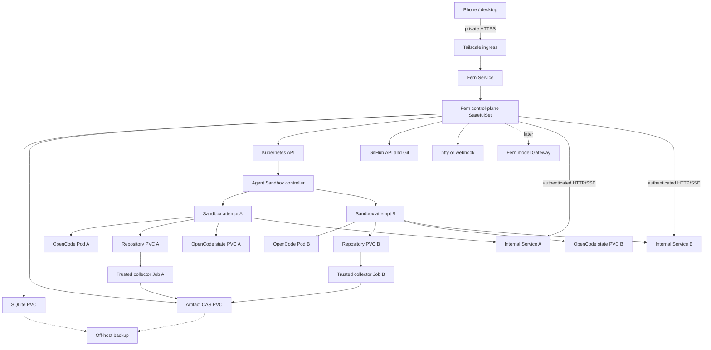

# Conditional Kubernetes Backend Architecture

**Status:** deferred backend proposal; not the selected product architecture

**Date:** 2026-08-30

**Primary profile:** one trusted owner on one Ubuntu k3s cluster
**Growth profiles:** dedicated managed instances, shared managed Kubernetes, and customer-owned runners

This document preserves a possible Kubernetes-based Fern architecture in enough
detail to evaluate or implement if a concrete trigger appears. It is not on the
current OpenCode Background Mode critical path; that experiment uses disposable
Docker environments. [Architecture](./ARCHITECTURE.md) remains authoritative
for the current Docker implementation, [Durable Task Model](./TASK_MODEL.md)
remains normative for implemented task invariants, and
[Background Mode TODO](../todo/opencode-background-mode.md) owns current work.

## Goal

Fern should let a person submit several coding tasks from a phone or desktop,
run each in an isolated retained environment on infrastructure they control,
close their laptop, and return to questions, logs, exact Git results,
verification evidence, previews where configured, and draft pull requests.

```text
Choose repository -> describe outcome -> run
       |
       v
Queued -> Setting up -> Working -> Checking -> Review ready
                         |
                         +-> Needs you -> answer -> Working
       |
       v
Diff + tests + artifacts + optional preview + draft PR
```

The hidden execution path is:

```text
Fern task
  -> Kubernetes Agent Sandbox
  -> OpenCode server
  -> exact Git result
  -> trusted collector and verifier
  -> GitHub draft PR
  -> notification
  -> bounded retention and cleanup
```

## Non-Goals

Fern does not need to become:

- an editor or replacement for the OpenCode UI;
- an agent framework or model reasoning loop;
- a Kubernetes scheduler;
- a custom Kubernetes operator or sandbox CRD;
- a public generic sandbox API;
- a model-provider catalog;
- a general CI system;
- a public multi-tenant SaaS in its first release;
- a hostile-code boundary merely because it uses Kubernetes;
- an exactly-once system for provider, tool, Git, or GitHub effects.

## Principles

### Fern Owns Product Semantics

Kubernetes owns workload placement and observed resources. Agent Sandbox owns
environment reconciliation. OpenCode owns conversations and tool execution.
Fern owns task intent, completion policy, cancellation fences, retained results,
verification, user attention, publication, and cleanup policy.

### One Attempt, One Environment

A task may have several attempts. Every attempt receives a new immutable attempt
ID and distinct Sandbox, storage, OpenCode state, runtime identity, and result
boundary. Retry never silently reuses a failed attempt's authority.

### Compute Is Disposable; Results Are Durable

The OpenCode Pod and Sandbox may be deleted. Before deletion Fern preserves the
Git objects and evidence required to reconstruct the selected result. A commit
hash without retained object bytes is not a durable artifact.

### The Agent Does Not Certify Itself

OpenCode reports conversation state and the agent describes its work, but
neither is sole authority for a Fern result. Fern combines a characterized
execution contract with an externally fenced repository observation. Trusted
collection and verification occur after agent writers stop.

### Intent Is Persisted Before Mutation

Fern persists intent before creating a Sandbox, interrupting a session,
exporting a result, pushing a branch, creating a pull request, sending a
notification, or deleting retained state. External work happens outside the
database transaction. Fern then reads authoritative state and commits it.

### Identity Is Exact

Names and labels locate resources. Authority uses immutable identities:

- Fern task and attempt IDs;
- Kubernetes object UIDs;
- resource versions and observed generations where relevant;
- Pod UID and runtime-observed image ID;
- GitHub numeric repository ID and exact base commit;
- exact OpenCode version, session ID, and message ID;
- artifact SHA-256 digest;
- Git commit and tree IDs;
- GitHub numeric pull-request identity.

### The Safe Path Is Easy

The owner should not need to understand Pods, PVCs, Services, Jobs,
NetworkPolicies, or CRDs. `fern init`, `fern doctor`, project defaults, and
product states turn Kubernetes into an implementation detail.

## Deployment Profiles

### Personal k3s

| Property | Choice |
| --- | --- |
| Owner | One trusted person |
| Cluster | Single-node k3s on Ubuntu |
| Fern replicas | One |
| Database | SQLite on a local RWO PVC |
| Artifacts | Local CAS PVC plus off-host backup |
| Agent environment | One Agent Sandbox per attempt |
| Runtime | Default runtime initially; gVisor after tests |
| Ingress | Tailscale only |
| Repositories | Explicitly owner-approved |
| GitHub | Repository-scoped GitHub App |
| Model access | Direct credential initially; Gateway later |
| Availability | Process/Pod restart recovery, not node-loss HA |

### Dedicated Managed Instance

One selected user or trust domain receives a dedicated VM or cluster deployment
from the same chart. This is the safest early service because kernel, database,
storage, and credentials are not shared with another customer.

### Shared Managed Kubernetes

This later profile uses managed Kubernetes, Postgres, object storage, stronger
runtime isolation, tenant namespaces, quotas, public identity, billing, and
abuse controls. It is not obtained merely by increasing Fern replicas.

### Hosted Control Plane With Customer Runner

Fern hosts task intent, UI, notifications, and metadata. A customer-owned runner
connects outbound and provisions Sandboxes in the customer's cluster. Source,
private-network access, tools, and most execution credentials remain customer
owned. This requires a separately specified runner protocol.

## k3s And Kubernetes

k3s is a lightweight, conformant Kubernetes distribution maintained by
SUSE/Rancher. It packages the API server, scheduler, controllers, containerd,
DNS, networking, and a local storage provisioner for small clusters.

```text
Direct Docker
  Fern -> Docker Engine -> container

Target Kubernetes
  Fern -> Kubernetes API -> controller/scheduler -> kubelet -> containerd
```

OCI images remain portable. Kubernetes adds desired-state reconciliation,
scheduling, Services, Jobs, PVCs, RBAC, quotas, and network policy. It also adds
cluster, CNI, storage, CRD, and upgrade failure modes Fern must diagnose.

Single-node k3s is not high availability. If the node and local PVCs are lost,
active environments are lost. Database replication, artifact backup, Git
bundles, GitHub branches, and clean-host recovery remain necessary.

## Kubernetes Agent Sandbox

Fern consumes Kubernetes SIG Agent Sandbox instead of defining a Fern sandbox
CRD or operator.

```text
Project release: v1.0.0 at the time of this design
API group:       agents.x-k8s.io
API version:     v1beta1
Kind:            Sandbox
```

Core Agent Sandbox provides a stateful singleton workload, backing Pod, optional
headless Service, optional PVC templates, running/suspended intent, and shutdown
lifecycle. Fern uses that contract but remains task authority.

### Use Initially

- one core `Sandbox` per attempt;
- a Fern-controlled Pod template;
- Sandbox-managed Pod and internal Service;
- repository and OpenCode-state PVCs;
- task, attempt, and specification labels;
- resource requests and limits;
- Kubernetes reads and watches from Fern;
- `spec.operatingMode: Suspended` to request writer stop;
- exact backing-Pod absence proof before trusted collection.

Agent Sandbox condition state can be stale around resume. Fern must not treat a
`Suspended` condition alone as a result fence.

### Defer Initially

- `SandboxTemplate` as a product concept;
- `SandboxClaim` and `SandboxWarmPool`;
- `sandboxd` command/file APIs;
- optional Sandbox Router and Gateway integration;
- memory snapshots and cross-cluster placement;
- a Fern CRD or controller.

Warm pools follow measurements. Task-specific PVC or environment injection can
force cold starts and erase the expected benefit.

## Topology



## Kubernetes Resources

### Namespaces

```text
agent-sandbox-system   upstream controller
fern-system            Fern control plane and trusted helpers
fern-workloads         agent Sandboxes
```

Personal mode uses one workload namespace. Hosted mode should use namespace per
tenant or trust domain so quota, RBAC, storage, network, and incidents align.

### Cluster Resources

- pinned Agent Sandbox CRD/controller;
- CNI with tested NetworkPolicy support;
- selected StorageClass;
- optional tested gVisor `RuntimeClass`;
- optional pinned Tailscale Kubernetes Operator;
- Pod Security admission policy;
- registry and image policy where supported.

### Fern Control Plane

```text
StatefulSet/fern                       one SQLite writer
Service/fern
ServiceAccount/fern-controller
ConfigMap/fern-config
Secret references                     GitHub App, session, backup, provider
PersistentVolumeClaim/fern-state
PersistentVolumeClaim/fern-artifacts
NetworkPolicy/fern-control-plane
```

One replica is intentional. Two replicas against one RWO SQLite PVC are not HA.
A PodDisruptionBudget is added only if its maintenance behavior is accepted.

### Workload Namespace

```text
ResourceQuota
LimitRange
default-deny NetworkPolicy
Role and RoleBinding                  bind fern-system/fern-controller
ServiceAccount/fern-attempt            automount token false, no RBAC
trusted helper ServiceAccounts         no API access unless required
Pod Security restricted policy
```

### Per Attempt

```text
PersistentVolumeClaim/fern-<attempt>-repo
PersistentVolumeClaim/fern-<attempt>-agent
Secret/fern-<attempt>-source           short lived
Job/fern-<attempt>-source
Secret/fern-<attempt>-opencode         task scoped
Secret/fern-<attempt>-model            or Gateway token
Sandbox/fern-<attempt>
Service/fern-<attempt>-opencode        Sandbox-created when supported
NetworkPolicy/fern-<attempt>
Job/fern-<attempt>-collect
Job/fern-<attempt>-verify
```

Two PVCs create a cleaner boundary: collection mounts the repository but not
conversation state or provider material.

### Ownership

| Object | Owner | Lifetime |
| --- | --- | --- |
| Fern StatefulSet/PVC/Service | Helm | release managed |
| Sandbox | Fern attempt coordinator | through stop/export decision |
| Sandbox Pod/Service | Agent Sandbox controller | upstream owner references |
| Attempt PVCs | Fern retention coordinator | never before export decision |
| Source Secret/Job | Fern source coordinator | delete after checkout proof |
| Runtime Secrets | Fern environment coordinator | after writer termination |
| Collector/verifier Jobs | Fern result coordinators | until evidence committed |
| Artifacts | Fern artifact coordinator | CAS retention, not Kubernetes GC |

Kubernetes GC or Job TTL is never the only cleanup mechanism. Do not configure
a Sandbox TTL that can fire before result export.

## Planes And Authority

### Trusted Control Plane

Fern contains authenticated APIs, task admission, SQLite journals, Kubernetes
coordination, GitHub App key/token minting, artifact policy, verification,
publication, notifications, retention, cleanup, and later the model Gateway.

### Agent Data Plane

Each Sandbox contains one pinned OpenCode server, one exact checkout,
task-specific OpenCode state, approved setup tools, bounded resources, and only
task-scoped credentials/network. It receives no Fern DB, App private key,
Kubernetes token, container socket, host path, artifact store, or peer volume.

### Trusted Helper Plane

Source preparation, collection, verification, and materialization run outside
the agent Sandbox. They use pinned images and narrow inputs. Collector mounts
only repository PVC. Agent and collector never write concurrently.

### Authority Matrix

| Concern | Authority | Fern evidence |
| --- | --- | --- |
| Human identity | Fern ingress | actor snapshot |
| Task command/idempotency | Fern DB | receipt, hash, event |
| Repository identity | GitHub numeric ID | repository row |
| Base content | exact Git commit | task base SHA |
| Desired environment | Fern DB | specification digest |
| Environment existence | Kubernetes | Sandbox UID |
| Process state | kubelet/runtime | Pod UID, state, image ID |
| Environment reconciliation | Agent Sandbox | status and generation |
| Conversation/tools | pinned OpenCode | exact IDs and finite reads |
| Execution completion | Fern policy | terminal observation and fence |
| Active bytes | repository PVC | no result claim before export |
| Retained bytes | artifact store | digest, size, key |
| Git result | trusted collector | commit, tree, manifest |
| Verification | trusted policy/Job | result, policy, output digests |
| Remote branch/PR | GitHub | repository ID, SHA, PR number |
| Publication | Fern journal | prepared phase and remote reads |
| Notification | Fern outbox | event key and delivery state |
| Model usage | provider; later Gateway | provider request/attempt IDs |

Kubernetes Ready is not task success. OpenCode idle is not independently task
success. A GitHub timeout is not proof that no mutation occurred.

## Trust Boundaries

### User To Fern

The browser authenticates to Fern, not OpenCode, Kubernetes, or GitHub. Fern
creates a server-owned actor snapshot, enforces CSRF and origin policy, strips
spoofable credentials/forwarding headers, and authorizes one operation.

### Fern To Kubernetes

Fern uses an in-cluster ServiceAccount with minimum verbs in the workload
namespace. It is not cluster-admin. Agent workloads cannot exercise this
authority.

### Fern To OpenCode

Every attempt has a random backend credential. The browser never receives it.
Fern injects canonical auth only after authorizing the actor and resolving the
exact Service and environment UID.

### Agent To Repository

Agent modifies only its repository PVC. It cannot mount owner home, another
attempt, Fern state/source, App keys, or artifact storage.

### Agent To GitHub

App-broker mode gives the agent no GitHub write credential. Source preparation
gets a short-lived read token. Fern publication gets a short-lived write token.
Trusted direct `gh` mode is an explicit weaker boundary whose effects cannot be
fully journaled by Fern.

### Agent To Model Provider

Initial personal mode may mount a provider key, meaning repository code can read
and exfiltrate it. The stronger target is:

```text
OpenCode -> private Fern Gateway -> provider
          scoped Fern token        real key outside Sandbox
```

Gateway claims are valid only after direct bypasses are removed or explicitly
allowed and tested.

### Agent To Network

Default-deny policy must be enforced by the installed CNI. Standard
NetworkPolicy is mostly IP/port policy, not domain policy. Host/method-aware
control later requires a capable CNI or egress proxy.

### Verifier To Agent

Fern commits no-resume, requests `operatingMode: Suspended`, proves exact backing
Pod absence, and only then starts collection. Condition text alone is not a
writer fence.

### Tenant To Tenant

Personal mode has one tenant. Hosted mode needs tenant identity, namespaces,
quotas, storage, Secrets, network policy, artifact authorization, and gVisor,
Kata, dedicated nodes, or dedicated VMs according to threat model. Namespace
alone is not a separate kernel.

## User Interaction

### Installation

```text
1. Install pinned k3s on Ubuntu.
2. Install pinned Agent Sandbox core.
3. Install Fern Helm chart.
4. Expose only Fern through Tailscale.
5. Pair owner device.
6. Install Fern GitHub App on selected repositories.
7. Configure one OpenCode/model profile.
8. Optionally configure ntfy.
9. Run read-only diagnostic task.
10. Run write, collect, verify, artifact, and draft-PR acceptance task.
```

```text
fern init kubernetes
fern doctor kubernetes
fern doctor github
fern doctor opencode
fern debug attempt <attempt-id>
```

`doctor kubernetes` checks versions, CRDs, controller, storage, CNI,
RuntimeClass, RBAC, DNS, image pull, scheduling, and negative networking. It
never silently upgrades active infrastructure.

### Repository Onboarding

Owner installs GitHub App on selected repositories. Fern records numeric
installation/repository identity, display name, allowed refs, environment
recipe, verification/publication policy, resources, network, and retention.
Names and checkout remotes do not authorize effects.

### Task Submission

Normal form asks for repository, title/instructions, base branch, optional
attachments, optional permission/plan mode, and draft-PR preference. Image,
model, setup, checks, resources, network, and retention are server-owned project
defaults. User cannot inject arbitrary Pods, mounts, Secrets, or networks.

### Inbox And Detail

```text
Needs attention
Active
Ready for review
Archived
```

Each row answers what, where, elapsed time, activity, attention, verification,
and delivery. Kubernetes phases live under diagnostics.

| Detail section | Content |
| --- | --- |
| Activity | milestones and bounded logs/events |
| Changes | summary, commits, diff, exact Git IDs |
| Verify | checks, logs, screenshots, artifacts, preview |
| Context | prompt, base, image, permissions, network, retention |

Actions are explicit: cancel, answer, retry as new attempt, fork, retain, open
agent, download artifact, open PR, archive, and permanent delete. Stop, cancel,
archive, environment deletion, artifact deletion, and task deletion are distinct.

### Mobile And Notifications

Mobile prioritizes capture, attention, cancel, bounded answers, checks, small
diffs, screenshots, and GitHub. Notification outbox commits with the source
event. `ntfy` or webhook is at least once; event state remains authority.

```text
input required
review ready
no changes
verification failed
task failed or timed out
draft PR created
cleanup or recovery required
```

## End-To-End Flow

```mermaid
sequenceDiagram
    participant U as User
    participant F as Fern
    participant DB as Fern DB
    participant GH as GitHub
    participant K as Kubernetes
    participant AS as Agent Sandbox
    participant OC as OpenCode
    participant C as Collector/Verifier
    participant A as Artifact Store

    U->>F: Submit repository, base, prompt
    F->>GH: Resolve repository ID and base SHA
    GH-->>F: Numeric ID and exact commit
    F->>DB: Commit task, attempt, receipt, IDs, inputs
    F->>DB: Commit source intent
    F->>K: Create attempt PVCs
    F->>GH: Mint short-lived read token
    F->>K: Create source Secret and Job
    K->>GH: Fetch exact commit
    F->>DB: Commit Sandbox create intent
    F->>K: Create Sandbox, Secrets, policy
    AS->>K: Reconcile OpenCode Pod/Service
    K-->>F: Ready, Pod UID, image ID, endpoint
    F->>OC: Create session and submit message
    OC-->>F: Status, messages, events, questions
    F-->>U: Live state and attention
    F->>DB: Commit terminal and no-resume intent
    F->>AS: Request Suspended
    AS-->>F: Exact writer Pod absent
    F->>K: Start trusted collector/verifier
    C->>A: Store bundle, logs, manifest, evidence
    C-->>F: Exact result and verification tuple
    F->>DB: Commit result/verification
    F->>GH: Push branch and create/reconcile draft PR
    GH-->>F: Remote ref and PR identity
    F->>DB: Commit publication and notification
    F-->>U: Review-ready notification
    F->>K: Delete compute; retain/delete PVCs by policy
```

## Admission And Environment Specification

Before compute, one transaction persists task/attempt/receipt IDs, request hash,
actor, repository ID, base SHA, prompt hash, OpenCode IDs, execution contract,
environment digest, model/image/budget/policy snapshots, deadline, and events.

Conceptual strict server-owned specification:

```yaml
version: fern.environment.v1
attemptId: att_...
repository:
  id: 123456
  baseSha: 0123456789abcdef...
runtime:
  provider: agent-sandbox
  image: ghcr.io/fern/opencode@sha256:...
  runtimeClass: gvisor
  resources:
    cpu: "2"
    memory: 8Gi
    pids: 512
agent:
  backend: opencode-server
  version: 1.18.25
  contract: fern.opencode-server.v1
network:
  profile: package-build
retention:
  workspace: 168h
  artifacts: 720h
```

The real schema has closed enums, limits, canonical serialization, and digest
stored before resource creation.

## Repository And OpenCode

### Source Preparation

Fern resolves base ref through GitHub App to exact commit. Trusted source Job
gets a short-lived repository-scoped token mounted only there, fetches exact
commit into repo PVC, disables hooks for trusted operations, verifies `HEAD`,
writes bounded evidence, exits, and loses Secret before agent starts.

Submodules and Git LFS are explicit capabilities because they expand credentials,
network, and storage. Git bundle does not automatically preserve LFS content or
submodule repositories.

### One OpenCode Server Per Attempt

Do not share servers initially. Shared servers couple configuration, plugins,
permissions, cancellation, process failure, and upgrades.

Candidate stable operations:

```text
GET  /global/health
POST /session
GET  /session/{id}
GET  /session/status
GET  /session/{id}/message
POST /session/{id}/prompt_async
POST /session/{id}/abort
POST /session/{id}/permissions/{permissionID}
GET  /event
```

Pin OpenCode source/version and API hash. SSE gives responsive UI but is not
durable V1 replay. Recovery uses finite session/message/status reads.

### Candidate Completion

Only an exact-version spike can establish:

```text
exact prompt admitted
AND active work observed
AND target session subsequently idle
AND assistant parts drained
AND no unresolved question or permission
AND no session error
AND no cancellation intent
AND repository writers can be fenced
```

Initial idle, missing activity, SSE EOF, server disappearance, Pod exit, or
heartbeat timeout is not success.

### Questions And Cancellation

Answers bind task, attempt, session, native ID, context/revision where available,
actor, response, expiry, and cancellation epoch. Add answer API only after
pinned OpenCode proves restart-safe one-shot behavior.

Cancellation commits intent first, fences new Fern effects, calls OpenCode
abort, requests Sandbox suspension, and proves exact writer inactive. It does
not roll back provider charges, tools, filesystem changes, or external effects.

### OpenCode UI

Fern is primary task UI. `Open agent` proxies official UI only after asset/API
paths, SSE, WebSocket, cookies, and refresh are characterized. Hosted mode can
use per-attempt origin; private mode can use authenticated Fern routing.
OpenCode Service stays internal and backend credential never reaches browser.

## Result, Verification, And GitHub

### Stop And Fence

Fern commits no-resume, closes interaction admission, identifies exact
Sandbox/Pod UID, requests `Suspended`, proves writer Pod absent, prevents
recreation, then admits collector.

### Trusted Result

Collector mounts only repository PVC and uses pinned Git, sanitized environment,
disabled hooks, bounded output, and fixed Fern identity. If policy preserves a
dirty tree, it snapshots after writers stop and records whether agent committed.

Evidence includes:

```text
repository ID
base commit
result commit and tree
worktree-clean observation
changed-path manifest and digest
Git bundle digest and size
execution specification digest
OpenCode IDs
terminal classification
bounded log/evidence digests
completion authority
```

Collector verifies bundle and object integrity. Verification materializes bundle
into fresh storage independent of worker PVC and proves commit/tree/manifest.

### Artifact CAS

```text
/var/lib/fern/artifacts/sha256/ab/cd/<full-digest>
```

Ingestion streams to same-filesystem temporary file, hashes and bounds it,
fsyncs, atomically renames to digest path, fsyncs parent, then commits metadata.
Hosted mode uses private object storage with immutable keys.

### Verification

Policy records name/version, shell-free argv, work directory, environment
allowlist, timeout, output bound, verifier image, exact result, and artifact.
Verifier has no Kubernetes token, model/OpenCode credentials, or GitHub write
authority. Production verification is separate from hidden Labs evaluation.

### GitHub Publication

App key stays in Fern. Recommended permissions: metadata read, contents
read/write, pull requests read/write, and optional checks read/write.

Before mutation Fern persists repository/base/result, deterministic branch,
expected remote head, policy, and receipt. Suggested branch:

```text
fern/task-<task-id>
```

Publication materializes exact artifact, mints short-lived token, reads remote
state, pushes with lease, verifies branch SHA, queries exact head/base PRs,
creates draft only when absent, and reconciles lost responses through reads.
Never use mutable current `HEAD`, blind force, or token in argv/log/remotes.

UI keeps these claims separate:

```text
Execution finished
Verification passed
Draft PR created
```

## Preview Architecture

Preview is an explicit project recipe, not an automatic guess:

```yaml
preview:
  command: ["npm", "run", "dev", "--", "--host", "0.0.0.0"]
  port: 3000
  readinessPath: /
  lifetime: 24h
```

It runs separately from terminal agent process, derived from exact result. Fern
routes by server-owned preview ID to recorded Service/port. Client cannot supply
upstream URL. Preview is private, expires, strips Fern credentials, and receives
no agent/provider/GitHub Secrets. Public previews need a separate abuse and
security design.

## State And Data Model

```text
execution: queued | preparing | provisioning | running | stopping | exporting | verifying | stopped
attention: none | input_required | approval_required | operator_required
outcome:   unknown | review_ready | no_changes | failed | canceled | recovery_required
retention: active | archived | deletion_pending | deleted

environment desired:  absent | running | suspended | deleted
environment observed: unknown | pending | ready | stopping | suspended | failed | missing
```

Durable phases:

```text
admitted
  -> source_started
  -> source_complete
  -> sandbox_create_started
  -> ready
  -> execution_started
  -> input_required | execution_terminal | runner_lost
  -> stop_started
  -> stopped_and_fenced
  -> export_started
  -> result_exported
  -> verification_started
  -> verified | rejected
  -> publication_started
  -> published | publication_recovery_required
  -> retention_active
  -> cleanup_started
  -> cleaned | cleanup_required
```

Every client-visible transition appends one event in same transaction. Heartbeat
proves recent liveness only.

### Proposed Environment Records

```text
Environment:
  id, attempt_id, provider, desired_state, observed_state
  specification_sha256, cluster_id, namespace
  resource_name, resource_uid, generation, observed_generation
  runtime_class, requested_image_digest, observed_image_id
  service_name, repo_volume_id, agent_volume_id
  created_at, observed_at, stopped_at, retention_until, revision

EnvironmentResource:
  environment_id, kind, namespace, name, uid, resource_version, role, observed_at

Artifact:
  id, attempt_id, result_id, kind, sha256, size, media_type
  storage_key, state, created_at, delete_after

Notification:
  id, event_key, channel, destination_reference, state
  attempt_count, next_attempt_at, last_error, delivered_at

CleanupItem:
  id, attempt_id, resource_kind, resource_identity, state
  not_before, attempt_count, last_error
```

Large logs, source, bundles, diffs, and Kubernetes payloads stay outside SQLite.

## Reconciliation

Fern is a database-backed coordinator, not Kubernetes operator. It needs no Fern
CRD. Inputs are DB desired state, Kubernetes LIST/WATCH, Sandbox/Pod status,
OpenCode finite reads, artifact integrity, GitHub reads, and deadlines.

Watches disconnect or compact with `410 Gone`; Fern relists and rebuilds. Watch
delivery is accelerator, never durable task authority.

Create pattern:

```text
commit create intent
-> GET deterministic name
-> CREATE if absent
-> on conflict GET object
-> adopt only when labels, attempt, spec digest, and UID policy match
-> persist UID
-> observe readiness
```

Never delete unexpected same-name object to progress.

Identity rules:

- name locates;
- UID identifies one object lifetime;
- resourceVersion orders API mutations, not business events;
- generation is desired-spec change;
- observedGeneration means controller processed it;
- Pod UID identifies one writer generation;
- replacement Pod is not silent continuity.

Startup lists nonterminal attempts and managed resources, matches exact UIDs and
specs, adopts valid environments, quarantines contradictions, resumes safe work,
and never replays prompts merely because response was lost.

## Failure Semantics

| Failure | Behavior |
| --- | --- |
| Fern restarts while agent runs | reconnect Service; finite-read OpenCode/Kubernetes |
| Agent Sandbox controller restarts | retain intent; relist and await reconciliation |
| Watch disconnects | relist and resume watch |
| Sandbox create response lost | locate deterministic name and validate spec/UID |
| Pod replaced in flight | new writer UID; recovery-required unless contract proves recovery |
| OpenCode dies | runner lost; retain repo; no prompt replay |
| PVC pending | show storage diagnosis; timeout by policy |
| Image pull fails | show pinned image/reason; no fallback tag |
| Agent OOM | runtime failure; retain partial result if policy permits |
| Cancel response lost | inspect OpenCode, Sandbox, and exact Pod inactivity |
| Verifier fails | retain result; verification fails, no execution retry |
| Artifact file without DB row | quarantine and reconcile |
| DB row without artifact | corrupt/unavailable; block verify/publish |
| Push response lost | read exact remote branch |
| PR response lost | query exact head/base and adopt unique PR |
| Notification response lost | retry may duplicate with stable event key |
| Cleanup interrupted | retry exact UID; missing exact resource is success |
| k3s node reboots | controllers/Fern restart and reconcile |
| k3s node destroyed | restore DB/artifacts; active local-PVC runs interrupted |

## Security Profile

### Pod Security

```text
runAsNonRoot: true
allowPrivilegeEscalation: false
capabilities.drop: [ALL]
seccompProfile: RuntimeDefault
readOnlyRootFilesystem: true where compatible
automountServiceAccountToken: false
hostNetwork/hostPID/hostIPC: false
privileged: false
no hostPath or host devices
resource and ephemeral-storage limits
```

Use `restricted` Pod Security unless accepted incompatibility is documented.
Writable repository, OpenCode state, cache, and temporary paths are explicit.

### Runtime Isolation

Default runtime is honest trusted-owner boundary. Stronger profile uses gVisor
after OpenCode/toolchain/filesystem/network/performance tests. Kata or dedicated
VM applies when separate guest kernel is required. Namespace plus runc is not
hostile multi-tenancy.

### RBAC And Network

Fern gets required namespace verbs only. Agent/source/collector/verifier/preview
have no API authority by default.

Policy intent:

```text
default deny ingress
allow Fern -> OpenCode Service
allow approved DNS
allow OpenCode -> configured provider or Gateway
allow approved Git/package destinations by profile
deny peers, Fern DB/artifacts/control, node/control/metadata/private/tailnet destinations
```

Test IPv4/IPv6 and actual CNI behavior. NetworkPolicy is not FQDN policy.

### Secrets

Personal mode may use SOPS plus age and Kubernetes Secrets. App key stays in
`fern-system`; tokens are short-lived; OpenCode credential unique per attempt;
provider direct access is explicit; names/versions may be audited, never values;
no Secret enters image, argv, log, Git remote, artifact, or preview. Hosted mode
needs managed custody/envelope encryption and rotation.

## Concurrency, Recipes, And Caches

Fern controls business admission; Kubernetes controls resource scheduling.
Initial global and per-repository concurrency is two or three, with CPU, memory,
PID, storage, output, and deadline bounds. Fern stops claims when capacity,
disk, PVC, artifact, or cleanup thresholds are exceeded. ResourceQuota and
LimitRange are defense in depth, not the user-visible queue.

Users select approved capabilities, not selectors, tolerations, RuntimeClasses,
or privilege:

```text
linux-standard
gvisor-standard
gpu
mac-remote-action
```

Project recipe:

```yaml
version: 1
image: ghcr.io/example/project-agent@sha256:...
setup: ["./script/fern-setup"]
verify: ["./script/fern-verify"]
resources:
  cpu: "2"
  memory: 8Gi
networkProfile: package-build
retention:
  workspace: 168h
  artifacts: 720h
```

Setup runs inside attempt and is separately logged/timed. Caches are disposable:
OCI layers, BuildKit registry cache, and optional package caches keyed by project,
image, platform, and lock digest. No shared checkout or OpenCode state. Cache
loss changes latency only. Dev Container support is a later policy-filtered
adapter; never accept privilege, host mounts, sockets, devices, or hooks blindly.

## Service Routing And Ingress

Fern is the only user-facing gateway. Generic ingress handles transport, not
task authorization. Target resolution binds actor, task, attempt, environment
UID, service, port, request intent, and expiry. Proxy revalidates identity,
strips credentials and forwarding headers, supports SSE/WebSocket, and never
accepts a client upstream URL. OpenCode and preview Services stay internal.

Personal mode uses Tailscale for private TLS/reachability and retains Fern
pairing, revocation, CSRF, origin, and actor boundaries. Use either a pinned
Tailscale Kubernetes Operator or host Serve path, not both. Hosted mode adds
OIDC/passkeys, organizations, edge protection, and abuse controls; Tailscale
remains operator/BYOC connectivity, not complete customer identity.

## Observability

Correlate task, attempt, environment, Sandbox UID, Pod UID, contract, image,
result, and publication IDs. Keep them out of unbounded metric labels. Prompts,
source, credentials, output, and artifacts stay out of telemetry by default.

Use structured `slog`, OpenTelemetry Go, bounded task-log artifacts, and metrics
for queue age, capacity, phase durations, outcomes, OOM, relists, cleanup,
artifact bytes, notifications, and publication recovery. Kubernetes Events are
diagnostics, not durable task history. One failed task does not fail Fern
readiness; inability to reconcile authority does.

## Backup, Recovery, And Upgrade

Personal state:

- Litestream replicates SQLite off-host;
- daily coordinated SQLite online backup is an independent checkpoint;
- restic backs CAS, configuration, audit, and snapshots;
- exported bundles are durable; active PVCs are not promised results;
- k3s datastore/token are backed up for selected datastore mode.

Clean-host recovery installs pinned Ubuntu, k3s, CNI, storage, RuntimeClass, and
controllers; restores Secrets; validates DB; restores artifacts; installs Fern;
then reconciles an empty cluster. Old local-PVC runs become interrupted or
recovery-required, never successful.

Compatibility matrix pins Fern/schema, Go, k3s/Kubernetes, Agent Sandbox CRD and
controller, CNI, StorageClass, RuntimeClass, OpenCode/API hash, images, Git,
GitHub assumptions, and chart.

Upgrade blocks admission, handles active attempts explicitly, backs up, tests
skew in staging, upgrades upstream CRDs/controller in supported order, upgrades
Fern, runs contract tests, and resumes only after reconciliation. Agent Sandbox
`v1.0.0` has an upstream migration constraint for sufficiently old pre-`v0.5.0`
installations; runbooks follow upstream paths. No floating auto-upgrades.

## Go Package Architecture

Names below are proposed, not implemented.

### Existing Packages To Retain

| Package | Goal responsibility |
| --- | --- |
| `internal/task` | typed identities and enums |
| `internal/taskstore` | schema, transactions, claims, revisions, events |
| `internal/taskapi` | authenticated commands/read projections |
| `internal/opencodeapi` | pinned OpenCode HTTP/finite reads |
| `internal/proxy` | ingress, auth, streaming, service routing |
| `internal/taskresult` | Git manifest/result primitives |
| `internal/taskresultcoord` | result selection/sealing |
| `internal/verification` | deterministic check runner |
| `internal/taskverification` | verification coordination |
| `internal/githubapp` | App signing/tokens/repository API |
| `internal/taskpublication` | immutable Git/GitHub operations |
| `internal/taskpublicationcoord` | write-ahead publication reconciliation |
| `internal/observability` | status, retries, metrics, tracing |

### Proposed Packages

| Package | Responsibility |
| --- | --- |
| `internal/environment` | environment IDs, spec, state, service contracts |
| `internal/environment/agentsandbox` | Sandbox CRUD/watch/relist/UID/stop/delete |
| `internal/taskenvironment` | source, environment, stop, cleanup phases |
| `internal/taskartifact` | CAS ingestion, integrity, authorization, GC |
| `internal/gitmaterial` | source bootstrap, bundle export/materialization |
| `internal/tasknotification` | outbox, adapters, retries |
| `internal/taskattention` | durable questions and bounded decisions |
| `internal/taskretention` | retention and cleanup journal |
| `internal/taskpreview` | preview recipe/lifecycle/routing |
| `internal/kubeclient` | client construction, schemes, identities |
| `internal/modelgateway` | later model auth/stream/policy/usage |
| `cmd/fern-job` | minimal trusted source/collect/verify helper |

Do not create package per Kubernetes kind. Provider owns Kubernetes mechanics;
coordinator owns product policy.

### Core Interfaces

```go
type Provider interface {
    Ensure(context.Context, Spec) (Observation, error)
    Inspect(context.Context, EnvironmentID) (Observation, error)
    ResolveService(context.Context, EnvironmentID, ServiceName) (ServiceTarget, error)
    Suspend(context.Context, EnvironmentID) (Observation, error)
    Delete(context.Context, EnvironmentID) error
}

type Backend interface {
    Admit(context.Context, ServiceTarget, AgentTask) (Run, error)
    Observe(context.Context, ServiceTarget, Run) (AgentObservation, error)
    Interrupt(context.Context, ServiceTarget, Run) error
}
```

`Ensure` is idempotent only for same attempt/spec. Observation includes provider
UID and writer generation. Endpoint is transient. Suspend does not itself grant
collection. Delete retries; already-absent exact resource is success.
Environment state does not decide agent completion.

### Go Modules And Toolchain

```text
k8s.io/api
k8s.io/apimachinery
k8s.io/client-go
sigs.k8s.io/agent-sandbox/api/v1beta1
```

Fern declares Go 1.27. Agent Sandbox `v1.0.0` declares Go 1.26 and Kubernetes
libraries `v0.36.4`, so its toolchain floor does not require a separate module.
Compatibility still must be established in a pinned backend spike before these
dependencies enter Fern's main module.

Prefer typed APIs and direct `client-go` watches. High-level Agent Sandbox SDK
is oriented toward Router/Claims and is not primary lifecycle interface.
`controller-runtime` is unnecessary merely to consume Kubernetes. If typed
module is incompatible during spike, dynamic client against pinned CRD can be
temporary; hand-coded unstructured fields are not final.

Later hosted dependencies may include `github.com/jackc/pgx/v5` and
`github.com/aws/aws-sdk-go-v2/service/s3`, not personal floor.

## Repository And Deployment Layout

```text
cmd/fern/
cmd/fern-job/
internal/environment/
internal/environment/agentsandbox/
internal/taskenvironment/
internal/taskartifact/
internal/gitmaterial/
internal/tasknotification/
internal/taskattention/
internal/taskretention/
internal/taskpreview/
deploy/helm/fern/
deploy/k3s/
integration/kubernetes/
integration/opencode-attempt-contract/
```

Fern chart owns Fern resources. Install pinned Agent Sandbox separately; do not
silently vendor upstream CRD lifecycle into application reconciliation.

Minimal values:

```yaml
image:
  repository: ghcr.io/fern/fern
  digest: sha256:...
state:
  storageClass: local-path
  size: 10Gi
artifacts:
  storageClass: local-path
  size: 100Gi
runs:
  namespace: fern-workloads
  maxConcurrent: 2
  runtimeClassName: ""
opencode:
  image: ghcr.io/fern/opencode@sha256:...
ingress:
  mode: tailscale
notifications:
  ntfyEnabled: false
```

Secrets never live in committed values.

## Testing

### Unit And OpenCode Contract

Fake providers/stores cover phases, claims, cancellation races, stale
observations, artifacts, notifications, and publication ambiguity. Exact
OpenCode image fixture covers health, negative auth, admission, activity/idle,
errors, questions, SSE loss, Fern/server restart, signals, nested-process
cancellation, mutation before failure, and state-volume recovery.

### Kubernetes Integration

Use pinned k3d for primary local/CI because target is k3s. Install exact Agent
Sandbox and deterministic fake OpenCode. Real integration covers owner refs,
Services, PVCs, NetworkPolicies, Jobs, and Pod replacement. Fake client covers
only pure rendering/transition logic.

Inject lost create response, watch compaction, controller restart, Pod
replacement, PVC pending/mount failure, image pull failure, network denial,
Fern restart at each phase, verifier failure, interrupted cleanup, concurrent
same-repo attempts, API outage, DNS denial, disk exhaustion, OOM, node reboot,
and cross-task negative access.

gVisor and real k3s require Linux acceptance on pinned Ubuntu. Release images
are multi-architecture, digest pinned, and checked for SBOM/provenance/signature.

## Hosted And BYOC Evolution

### Selected Users

First service uses dedicated VM/cluster per user or trust domain. Automation
provisions cluster, Secrets, storage, backups, quotas, and chart. Measure setup,
support, success, cost, incidents, repeat usage, and willingness to pay before
shared tenancy.

### Shared Hosted

Requires OIDC/passkeys, organizations, Postgres, object storage, managed
Kubernetes, autoscaled pools, tenant scope on every row/artifact/route/claim,
gVisor/Kata/dedicated nodes, Gateway/budgets, secret rotation, billing, abuse,
support, audit, deletion, incident, privacy, and legal processes.

### BYOC

Customer runner connects outbound with mTLS/workload identity, namespace-scoped
RBAC, lease-bound signed attempt specs, capability profile IDs rather than
arbitrary PodSpecs, customer-owned model Secrets/Gateway, exact artifact upload,
stale-runner fencing, enrollment/revocation/drain/upgrade/capacity status.

Fencing controls Fern state, result selection, and publication. It cannot stop a
stale runner from repeating unbrokered provider, MCP, or network effects.

### Personal To Hosted

| Personal | Hosted |
| --- | --- |
| single-node k3s | managed Kubernetes/dedicated clusters |
| one Fern replica | stateless replicas |
| SQLite PVC | managed Postgres |
| local CAS | object storage |
| local-path task PVC | CSI/disposable volumes plus artifacts |
| Tailscale owner ingress | public edge/OIDC; Tailscale operations |
| trusted owner | tenant authorization |
| direct provider key | Gateway/task identity |
| default runtime/gVisor | gVisor/Kata/dedicated nodes/VMs |
| fixed concurrency | quotas/admission/autoscaling |

Task, attempt, result, verification, publication, artifact, and effect journal
retain authority during migration.

## Implementation Order

### G0: OpenCode Contract

Pin and black-box completion, cancellation, and restart before Kubernetes code
depends on them.

### G1: Substrate Spike

Install k3s/Agent Sandbox; create one Sandbox with two PVCs; reach OpenCode
Service; suspend/delete; restart Fern/controller; record UIDs/transitions.

### G2: Serial End-To-End

Build admission, source Job, Sandbox, OpenCode execution, no-resume fence,
collector, Git bundle, CAS, verification, cleanup, and restart reconciliation.

### G3: Parallel Product

Add bounded concurrency, inbox/detail, notifications, draft PR, retention, disk
pressure, and three concurrent tasks against one repository.

### G4: Security And Recovery

Add enforced NetworkPolicy, restricted Pods, no API tokens, gVisor acceptance,
backup/restore, node reboot, controller upgrade, and clean-host recovery.

### G5: Selected-User Service

Deploy dedicated design-partner instances before shared multi-tenancy.

## Acceptance Criteria

1. Three same-repository attempts run with distinct Sandboxes, PVCs, OpenCode
   identities, and credentials.
2. No task reads peers, Fern state, Kubernetes credentials, App key, or CAS.
3. Fern/controller/watch/node restart reconciles without duplicate prompt or
   GitHub mutation.
4. Idle, EOF, Pod exit, and Sandbox disappearance never independently succeed.
5. Cancellation acknowledges only after exact writer inactive.
6. Collector cannot run concurrently with writer.
7. Fresh bundle materialization reproduces commit, tree, and manifest.
8. Verification/publication consume artifact, not mutable checkout.
9. Ambiguous push/PR converges through GitHub reads.
10. Cleanup survives interruption and preserves active/unexported work.
11. Phone submits, gets attention, cancels, reviews, and opens PR without K8s.
12. Clean-host restore recovers authority/artifacts and marks lost runs honestly.
13. CNI, Pod Security, and RuntimeClass pass enforcement tests.
14. Documentation never calls personal profile hostile multi-tenancy.

## Architectural Traps

- Treating Sandbox Ready, condition Suspended, or Pod exit as task success/fence.
- Sharing OpenCode server, checkout, PVC, or credentials across attempts.
- Replaying prompts after Pod/controller restart.
- Deleting Sandbox/PVC before portable export.
- Mounting live checkout in verifier and calling it independent.
- Giving agent GitHub or Kubernetes credentials.
- Assuming commit ID preserves bytes without bundle/remote ref.
- Ignoring Git LFS and submodule content.
- Using names, labels, or Pod IP instead of UID and durable intent.
- Accepting client Service/upstream and creating SSRF proxy.
- Assuming NetworkPolicy is FQDN control or namespace is separate kernel.
- Assuming Tailscale replaces Fern authorization.
- Installing warm pools before measuring cold path.
- Letting TTL/GC delete evidence before Fern commits.
- Building a Fern operator that duplicates Agent Sandbox.
- Importing optional Sandbox SDK and accidental Router/Claim/toolchain scope.
- Attempting replicas while retaining one RWO SQLite database.
- Treating local-path PVC as node-loss resistant.
- Exposing private Fern UI publicly for GitHub webhooks.
- Moving hosted/BYOC before tenant identity, artifact custody, stale-runner
  fencing, abuse, and support boundaries.

## Summary

```text
Fern database
  owns task intent, effects, selection, policy, and user-visible state

Kubernetes plus Agent Sandbox
  owns current execution resources and observed lifecycle

Git, artifact, and GitHub stores
  own retained code bytes, result identity, and remote delivery state
```

OpenCode is runtime inside one attempt. It owns conversation/tool behavior, not
Fern outcome. Kubernetes makes environments declarative and scalable, not
product semantics. Fern connects systems through exact identities, effect
journals, trusted result boundaries, and attention/review UX.

## Primary References

- [Current Fern architecture](./ARCHITECTURE.md)
- [Fern durable task model](./TASK_MODEL.md)
- [Fern strategy](./STRATEGY.md)
- [Fern roadmap](./ROADMAP.md)
- [Personal task-computer research](../research/fern-personal-task-computers-2026-08-30.md)
- [Kubernetes Agent Sandbox](https://github.com/kubernetes-sigs/agent-sandbox)
- [k3s](https://k3s.io/)
- [Kubernetes API concepts](https://kubernetes.io/docs/reference/using-api/api-concepts/)
- [Kubernetes Jobs](https://kubernetes.io/docs/concepts/workloads/controllers/job/)
- [Kubernetes persistent volumes](https://kubernetes.io/docs/concepts/storage/persistent-volumes/)
- [Kubernetes NetworkPolicy](https://kubernetes.io/docs/concepts/services-networking/network-policies/)
- [Kubernetes Pod Security](https://kubernetes.io/docs/concepts/security/pod-security-standards/)
- [gVisor](https://gvisor.dev/docs/)
- [OpenCode server API](https://opencode.ai/docs/server/)
- [Git bundle](https://git-scm.com/docs/git-bundle)
- [GitHub App installation authentication](https://docs.github.com/en/apps/creating-github-apps/authenticating-with-a-github-app/authenticating-as-a-github-app-installation)
- [Palana Part 1](https://engineering.grab.com/palana-part-1-secure-platform-for-ai-agents)
- [Palana Part 2](https://engineering.grab.com/part-2-palana-architecture)
