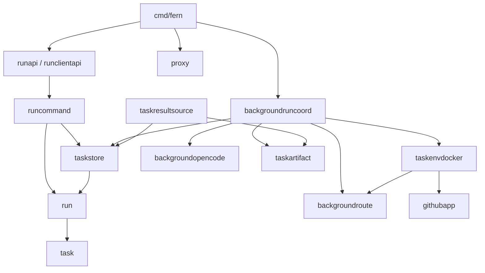
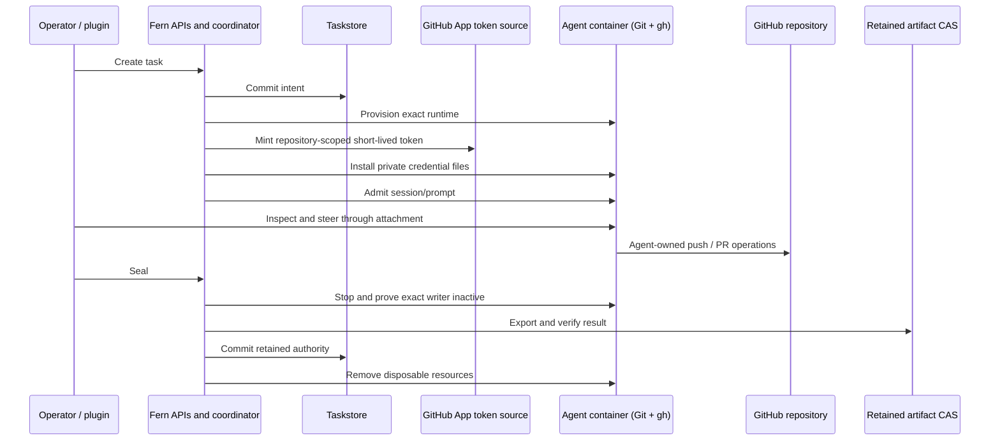

# Go package guide

This index covers all **28 packages returned by `go list ./...`** in the root
Go module. Each linked README explains its responsibility, concrete entrypoints,
representative internal calls, dependencies/callers, lifetime rules, naming
review, and performance considerations. These are source-reviewed diagrams,
not exhaustive generated call graphs: interfaces, callbacks, HTTP dispatch, and
platform-specific files make an exhaustive static diagram misleading.

Start with [the product architecture](../ARCHITECTURE.md), then the composition
root and the boundary relevant to your change. See [review findings](go-review.md)
and [local performance measurements](performance.md) for the audit results.

## Runtime and application path

| Package | Responsibility |
| --- | --- |
| [`cmd/fern`](../cmd/fern/README.md) | CLI, startup/shutdown, credentials, offline backup |
| [`config`](../internal/config/README.md) | One current configuration, strict decoding, bootstrap/execution validation |
| [`runapi`](../internal/runapi/README.md) | Plugin run HTTP protocol and result availability projection |
| [`runclientapi`](../internal/runclientapi/README.md) | Operator/terminal discovery and attachment |
| [`runcommand`](../internal/runcommand/README.md) | Create/stop/seal intent, admission, replay and notification |
| [`run`](../internal/run/README.md) | Lifecycle classification and resource/runtime identities |
| [`task`](../internal/task/README.md) | Typed identifiers, actors, immutable result vocabulary |
| [`taskstore`](../internal/taskstore/README.md) | SQLite schema 3, durable run/result authority and fencing |
| [`backgroundruncoord`](../internal/backgroundruncoord/README.md) | Capacity-one effect coordination and recovery |
| [`taskenvdocker`](../internal/taskenvdocker/README.md) | Resource-spec 10 Docker lifecycle and scoped GitHub credential delivery |
| [`backgroundopencode`](../internal/backgroundopencode/README.md) | Pinned OpenCode session/prompt observation protocol |
| [`backgroundroute`](../internal/backgroundroute/README.md) | Exact runtime routing and bounded session-scoped attachment |
| [`taskartifact`](../internal/taskartifact/README.md) | Git snapshots, bundle integrity, CAS and owned checkouts |
| [`taskresultsource`](../internal/taskresultsource/README.md) | Durable-result binding to freshly verified artifact bytes |

## Security and infrastructure

| Package | Responsibility |
| --- | --- |
| [`proxy`](../internal/proxy/README.md) | Operator/remote ingress, pairing, browser security and routing |
| [`control`](../internal/control/README.md) | Control schema 2, device identities and revocation |
| [`pluginauth`](../internal/pluginauth/README.md) | Fixed-scope plugin authorization and credential persistence |
| [`githubapp`](../internal/githubapp/README.md) | Host App onboarding, keys, repository binding and scoped token issuance |
| [`credentialbundle`](../internal/credentialbundle/README.md) | Protected environment and credential staging/rotation |
| [`hostlease`](../internal/hostlease/README.md) | Host-local exclusive ownership |
| [`observability`](../internal/observability/README.md) | Readiness, health, metrics and retry timing |
| [`gitref`](../internal/gitref/README.md) | Git ref/repository name validation |
| [`jsoncanon`](../internal/jsoncanon/README.md) | Strict JSON validation, duplicate-key and malformed-Unicode rejection |
| [`compatibility`](../internal/compatibility/README.md) | Test-only current schema/release-contract qualification |

## Qualification and embedded tools

| Package | Responsibility |
| --- | --- |
| [`integration/background-run-docker`](../integration/background-run-docker/README.md) | Real Docker lifecycle and container GitHub credential handoff |
| [`integration/background-run-opencode`](../integration/background-run-opencode/README.md) | Real pinned runtime, response loss, attachment and retention scenarios |
| [`integration/upgrade`](../integration/upgrade/README.md) | Current-schema initialization/reopen and offline restoration checks |
| [`scripts`](../scripts/README.md) | Embedded Python backup implementation used by Go, plus surrounding shell/release scripts |

## Representative dependency directions

Solid arrows below denote selected **Go imports**, not every runtime call.
Consult individual READMEs for callback and interface interactions.

## Runtime ownership is different from the import graph

There is intentionally no host publication or host test-verification package.
Fern preserves exact work; the harness owns testing and GitHub delivery. A later
sealed artifact is not necessarily the commit last pushed by the agent.
