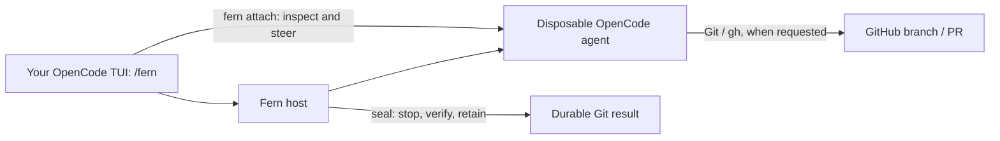

# How to use Fern

Fern lets you hand work to an OpenCode agent running on a separate Linux host,
inspect and steer it while it runs, and retain its Git work when you finish.
The agent can run tests, push a branch, and open a PR. Fern itself does not
publish PRs or certify that tests passed.

## Read this first: current availability

**This checkout is a pre-release tool, not yet a turnkey deployment.** Before a
real run, an operator must resolve these requirements:

- Native Linux amd64/arm64, kernel 5.14 or newer, with a local Docker daemon.
  Docker Desktop is not a Fern execution host. Your client laptop can be macOS.
- An operator-provisioned XFS runtime project with enforced byte **and inode**
  hard quotas, on a different filesystem from durable Fern state.
- Permission for Fern to read project hard limits. The current implementation
  requires host `CAP_SYS_ADMIN` for this query. **The stock unprivileged systemd
  service cannot execute it unchanged.** Fern does not install a privileged
  helper or grant this capability. Resolve that security decision explicitly;
  do not blindly run the server as root to work around an error.
- Actual byte/inode exhaustion and recovery qualification on that Linux host.
  The local Docker smoke tests do not establish XFS quota enforcement.
- A usable credential-free model provider/model for the pinned runtime. The
  current profile rejects arbitrary environment injection, including provider
  API keys. **The GitHub App token authenticates GitHub, not a model provider.**
  No ready-to-use paid model-provider credential setup is supplied here.

If you do not have these prerequisites, you can build Fern and read/test its
components, but do not expect the example below to execute a real agent yet.
The precise storage contract is in [Runtime storage contract](#runtime-storage-contract).

## 1. Understand the two machines

| Location | What runs there |
| --- | --- |
| **Fern host** | Fern server, repository clone, Docker, quota-backed runtime storage, durable database/CAS, GitHub App private key |
| **Your client** | OpenCode 1.18.16 with the Fern plugin; optionally the Fern CLI for remote attachment |

Fern has capacity for one executing run at a time. It is not a fleet scheduler.
Repository code and the host network must be trusted; Docker bridge isolation
is not a hostile-code sandbox.



## 2. One-time host setup

These commands assume you have cloned this Fern repository. Replace example
paths, repository IDs, hostnames, and model IDs with your real values.

### Build the CLI and image

From the Fern source root:

```sh
go build -o ./fern ./cmd/fern

# Use a separate tag instead of overwriting an existing qualified image.
docker build -t fern/opencode-background-source:local images/opencode-background-source
BACKGROUND_IMAGE_ID=$(docker image inspect fern/opencode-background-source:local --format '{{.Id}}')
```

The image build verifies the exact OpenCode source commit against the pinned
GitHub web-flow signing key. Image IDs depend on the build and architecture;
do not copy an ID from someone else's host.

Building is not full host qualification. See the
[Docker lifecycle harness](../integration/background-run-docker/README.md) and
[OpenCode integration harness](../integration/background-run-opencode/README.md).
They require `FERN_RUNTIME_STORAGE_ROOT` pointing to provisioned quota storage.
Do not use production run directories for destructive qualification scenarios.

### Runtime storage contract

`runtimeStorageRoot` must be an existing absolute XFS project directory that the
operator provisions on native Linux amd64/arm64 (kernel 5.14+), used by the
same-host Docker daemon over its local Unix socket with the same mount namespace
as Fern. Docker Desktop, remote daemons, other filesystems, accounting-only
quotas, project zero, missing `PROJINHERIT`, unlimited byte or inode hard limits,
and XFS realtime inheritance all fail admission.

- Provision a nonzero project ID with `PROJINHERIT` set recursively, enable XFS
  project accounting **and enforcement**, and set both block and inode hard
  limits. Fern only reads the quota (`FSGETXATTR`, `Q_XGETQSTATV`,
  `Q_XGETQUOTA`); it never mounts, assigns projects, or changes quotas.
- Reading project hard limits with `Q_XGETQUOTA` requires host `CAP_SYS_ADMIN`.
  Directory ownership, ACLs, `CAP_CHOWN`, or Docker group membership do not
  grant it, so the stock unprivileged `fern:fern` service cannot execute runs
  until you make that security decision explicitly.
- The runtime root must be on a different filesystem from durable `StateRoot`
  (admission checks device IDs). Keep the task database, CAS, and recovery
  exports outside the quota, and size hard limits below filesystem capacity:
  a large finite quota does not prevent ENOSPC from other writers.
- One shared project bounds all runs, including retained failed runs. Clone
  trees and per-run OpenCode volume backing directories live under
  `<runtimeStorageRoot>/background-runs`; the authoritative host key stays in
  `StateRoot/background-runs/host.key`. Do not change provisioned storage while
  workers run.
- An empty `runtimeStorageRoot` permits cleanup of older resources under
  `StateRoot/background-runs` only. To migrate, drain legacy runs with the old
  configuration first; do not move existing clone trees, because their
  path/inode authority would change.

Quota admission happens before any clone, volume, or container effect;
cleanup does not need quota availability. macOS and local Docker smoke tests do
not qualify XFS quota enforcement. To smoke-test the worker seccomp,
read-only-root, and tmpfs policy against an image (without quota backing):

```sh
FERN_STORAGE_POLICY_SMOKE_IMAGE=fern/opencode-background-source:signed \
  go test ./internal/taskenvdocker -run TestLiveWorkerStoragePolicy -count=1 -v
```

### Prepare the repository and storage

- Put the bound repository on the host, for example `/srv/fern/repository`.
- Ensure its canonical GitHub remote and numeric repository ID match the binding.
- Ensure the exact revision you will submit exists and is reachable in the host
  repository. Fern does not accept arbitrary uploaded working-tree edits.
- Provision `/var/lib/fern-runtime` according to the [storage contract](#runtime-storage-contract).
  Keep durable SQLite/CAS and recovery exports outside the runtime filesystem.
- Reserve space for metadata, Docker images/logs, and retained results. A finite
  project quota does not guarantee that unrelated host writers cannot fill disk.

Fern's `init` command writes configuration; it does **not** provision XFS or quotas.

### Generate configuration

```sh
./fern init \
  --config fern.yaml \
  --env-file fern.env \
  --repo /srv/fern/repository \
  --runtime-storage-root /var/lib/fern-runtime \
  --repository owner/repository \
  --repository-id 123456789 \
  --model-provider YOUR_CREDENTIAL_FREE_PROVIDER \
  --model YOUR_MODEL_ID \
  --background-image fern/opencode-background-source:local \
  --background-image-id "$BACKGROUND_IMAGE_ID" \
  --remote-origin https://fern-host.example.ts.net \
  --background-origin https://fern-host.example.ts.net:8443
```

The model placeholders are not working example model names. Keep `fern.env`
private and out of version control; it contains the generated control password.
Configuration YAML is limited to 1 MiB. See [the complete example](../fern.example.yaml).

### Set up private HTTPS and GitHub App onboarding

The control and attachment origins must share a hostname; attachment uses an
explicit non-443 port. For example, on an already configured Tailscale host:

```sh
tailscale serve --bg http://127.0.0.1:8080
tailscale serve --bg --https=8443 http://127.0.0.1:8443

./fern up --config fern.yaml --env-file fern.env
```

**Never expose the operator listener, `127.0.0.1:8081`, through the remote edge.**
Access `http://127.0.0.1:8081/fern/control` locally on the host, or through an
operator-controlled SSH tunnel. Its Basic-auth username is `fern`; use the
generated control password from your protected environment file.

Follow the control page's GitHub App setup flow, install the App on only the
bound repository, and set its positive numeric installation ID in
`workspace.github.installationId`. Restart Fern after updating the configuration.
The private HTTPS callback route must already work for onboarding to complete.

Then check:

```sh
./fern doctor --config fern.yaml --env-file fern.env
curl --fail http://127.0.0.1:8081/fern/ready
```

Readiness and `doctor` are not substitutes for quota exhaustion qualification.
Missing App credentials/installation block run service; quota failures prevent
execution even if configuration syntax is valid.

## 3. Install the client plugin

The plugin requires **OpenCode 1.18.16** and a working OS keyring: macOS Keychain
or Linux Secret Service (`secret-tool`). A locked/unavailable keyring blocks
durable authorization instead of falling back to a plaintext token file.

`@fern/opencode` is **not published to npm yet**. Use a local built package, as
exercised by the repository's CLI installation smoke test:

```sh
# From the Fern source checkout on your client:
cd plugins/opencode
bun install --frozen-lockfile
bun run build

# Keep this directory available; use its absolute path below.
PLUGIN_PATH="$PWD"
cd /path/to/your/repository
opencode --version                 # must report 1.18.16
opencode plugin "$PLUGIN_PATH"
opencode .
```

If your pinned binary is named `opencode2`, use that name instead. The local
plugin installation changes OpenCode configuration; review those changes before
committing project files. See the [plugin README](../plugins/opencode/README.md)
for compatibility and packaging details.

In the TUI, enter **`/fern`**. On your first explicit Fern action:

1. Enter the private root origin, such as `https://fern-host.example.ts.net`.
2. Follow the displayed device-authorization URL and one-time code.
3. Complete approval in the authenticated Fern browser flow.

Do not put App private keys or installation tokens on the client. Fern supplies
short-lived GitHub credentials to the runtime automatically.

## 4. Submit a task

Start the client OpenCode TUI in the repository with a **clean, committed working
tree**. Commit your intended input first and synchronize the revision to the host
repository through your normal Git workflow.

Open `/fern`, choose **Run**, enter the task, review the repository/revision/profile
confirmation, and confirm. For example:

> Add pagination to the issue list. Run the relevant tests and report their
> results. Commit the change on a new branch, push it, and use `gh pr create
> --draft` to open a pull request. Do not merge it.

Use the dialog, not `/fern run ...`: slash arguments are unsupported. There is
also no `fern run` CLI command. Submission is plugin-based and requires the TUI's
local service; **Run refuses explicit `--server` mode**.

The plugin reports success only after Fern confirms durable admission. Admission
means the task was accepted, not that the agent has finished or passed tests.

## 5. Inspect and steer the live agent

Use `/fern` → **Runs** to follow the task. To open the live remote TUI, run the
Fern CLI on your client with the private control origin:

If the client is a different machine, build its own CLI from the Fern source
root with `go build -o ./fern ./cmd/fern`, and use that binary (or put it on your
`PATH`). A Linux host binary is not a macOS client binary.

```sh
fern runs --endpoint https://fern-host.example.ts.net
fern attach --endpoint https://fern-host.example.ts.net tsk_...
```

Replace `tsk_...` with the ID returned by the list. The CLI reuses the plugin
credential from the OS keyring. On the Fern host, with its local config/env file,
you can use `./fern runs` and `./fern attach` without `--endpoint`.

Attachment connects to the existing exact session: inspect progress, answer
questions, and steer the work there. It does not create another agent or transfer
filesystem ownership. Closing the attachment is not a stop or seal command.

## 6. Finish: choose Seal or Stop deliberately

| Action in `/fern` | Use it when |
| --- | --- |
| **Seal** | You want to stop the exact writer and retain its Git work as an immutable result. Confirm only when you are ready to end editing. |
| **Stop** | You want cancellation and cleanup. Do not treat Stop as a way to preserve unfinished work; choose Seal for retention. |
| **Result** | You want the retained commit/tree, change manifest, integrity metadata, and cleanup status after sealing. |
| **Disconnect** | You want to revoke/remove this client's Fern credential. It is not run cancellation. |

After Seal, poll **Result** until retention is complete. Export/recovery may take
time; a transport error does not prove the seal did not happen. Inspect the run
before issuing another mutation.

The result action returns metadata, **not an artifact download URL**. There is
currently no end-user `fern result download` command. For an ordinary code-review
workflow, use the branch/PR the agent pushed and your usual Git checkout workflow.
Local retained artifacts remain Fern's durable recovery product.

Sealing does not push or open a PR. A PR pushed before the final edits may differ
from the sealed commit. Fern does not guarantee exactly-once PR creation or
independently certify repository test success. Review the PR and CI yourself.

## 7. When something goes wrong

- **Dirty repository / revision rejected:** commit the intended input, check the
  canonical remote, and ensure the bound host repository has that revision.
- **Quota/permission admission error:** fix host provisioning/privileges. There
  is no supported Docker Desktop or unbounded-storage bypass.
- **`needs_you`:** attach to inspect and answer the agent's current question.
- **`uncertain`:** inspect first. Restart/response loss is not proof that the
  previous prompt had no effect; do not blindly resubmit the task.
- **`cleanup_required` / export recovery:** retain the state and resources for
  diagnosis. Do not delete the database, clone, volume, or host key to clear it.
- **GitHub authorization failure inside the run:** inspect App installation and
  repository permissions on the host. Do not try `gh auth login` in the runtime;
  Fern owns credential refresh and the wrapper blocks `gh auth` commands.

## 8. Shut down and protect the work

Seal any work you want to preserve, wait for result/cleanup completion, then stop
the foreground Fern server normally. Offline backup/credential commands require
Fern to be stopped because they acquire the repository lease:

```sh
./fern backup create --output /secure/fern-backup
./fern credentials export --recipient age1... --output /secure/credentials.age
```

Replace `age1...` with a real recipient. Protect backup artifacts as secret
material. Credential bundles use format 2 and do not overwrite an existing
destination. Existing older database/bundle formats may be rejected: preserve
backups rather than deleting files to make startup succeed.

## Where to read next

- [Root README](../README.md): requirements and supported commands.
- [Plugin README](../plugins/opencode/README.md): client behavior and limitations.
- [Architecture](../ARCHITECTURE.md): persistence, execution, and recovery boundaries, plus the package map and suggested code-reading order.
