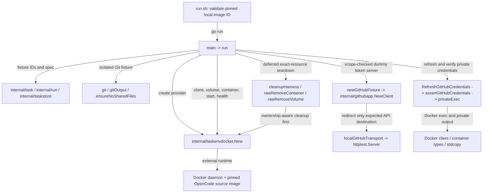

# Disposable Docker runtime contract harness

See the [Go package map](../../docs/go-packages.md) and [maintenance review](../../docs/go-review.md).

This `main` package exercises `taskenvdocker` against a **real local Docker
daemon and an already-built, operator-pinned source image**. It is integration
evidence for runtime ownership and credential handling, not a production daemon
or a benchmark. The direct caller is `run.sh` (or `go run` from the repository root).

## Dependencies and representative path



Direct Go dependencies are the internal packages shown, Docker client/container
types and stream demultiplexing, plus standard-library HTTP, process, filesystem,
and synchronization facilities. `taskstore` supplies run models here; this harness
does not open a durable task database. Host Git and image-provided `git`/`gh`
helpers are external executables.

## Running and safety

From the repository root, with the qualified image already present:

```sh
export FERN_OPENCODE_BACKGROUND_SOURCE_IMAGE=fern/opencode-background-source:dev
export FERN_OPENCODE_BACKGROUND_SOURCE_IMAGE_ID="$(docker image inspect "$FERN_OPENCODE_BACKGROUND_SOURCE_IMAGE" --format '{{.Id}}')"
sh integration/background-run-docker/run.sh
```

Use a disposable test host with sufficient Docker resources. The wrapper rejects
missing/noncanonical IDs and tag/ID disagreement; it does not build or pull an
image. The Go harness checks the pin again and uses a three-minute overall
deadline, with operation-specific bounds. It creates private temporary state
and a fixture repository, and arranges cleanup of exact harness-owned resources.
Cleanup errors contribute to failure rather than being treated as success.

## Assertions

- Unknown clone contents are quarantined without deleting the unknown data.
- The run clone has an independent `.git`, no alternates, and no shared regular
  files with the source repository.
- Resource-spec-10 identities drive provider checks; container UID `1001:1001`,
  CPU/memory/PID limits, dropped capabilities, mounts, log bounds, labels, and
  loopback endpoint observations match the configured profile.
- Unprovisioned `gh` fails closed. Scoped dummy GitHub tokens are delivered to
  private mode-`0600`, UID-1001 files, not container environment or host state.
- The Git helper returns the current token only for the configured repository;
  `gh auth token` is denied. Captured secret output is never printed.
- Repeated refresh uses the in-process credential lease; reconstructing the
  provider refreshes credentials with the second dummy token.
- Stop proves writer inactivity. Manually restarting the same container changes
  runtime identity and is rejected. Final clone/volume/container removal is checked.

The fake GitHub transport only targets `httptest`; it does not mint real GitHub
tokens or create a real PR. The production container harness owns Git/PR work;
this harness validates the credential delivery boundary, not a host publisher.

## Naming and performance review

The directory name correctly distinguishes the Docker contract from the richer
OpenCode/coordinator harness. `privateExec` describes secret-sensitive output
handling, not a sandbox beyond Docker. `rawRemove*` are exact-name test cleanup
fallbacks, not production authority APIs. Repeated identity fixture construction
is a maintenance consideration, not a demonstrated performance problem.

Docker startup, Git cloning, exec inspection, and filesystem leak scans dominate
elapsed time. Polling intervals are contract-test responsiveness choices; do not
treat total harness duration as runtime throughput. Docker/Git/GitHub-helper
performance is unmeasured. Focused fixture unit tests
can be run with `go test ./integration/background-run-docker` without invoking
the executable's full Docker scenario.
