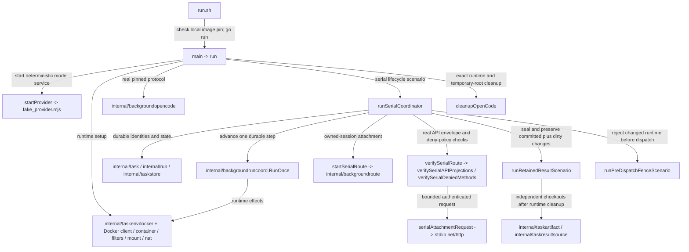

# Pinned OpenCode Background Run harness

See the [package map](../../ARCHITECTURE.md#19-package-map).

This `main` package checks the real pinned OpenCode server together with Fern's
Docker provider, serial coordinator, attachment route, and retained artifacts.
`run.sh` is its shell caller; `fake_provider.mjs` is a deterministic model-provider
fixture, not another Go package. Real OpenCode/Docker behavior is tested against
that fake provider rather than a paid remote model.

## Dependencies and representative call paths



The internal packages above are direct imports. Third-party imports are Docker's
client/type packages and `github.com/docker/go-connections/nat`; remaining imports
are standard-library crypto, JSON, HTTP, filesystem, process, and timing helpers.
SQLite enters through `taskstore`, not a direct driver import. Host Git, Docker,
the pinned source image, and its Node/OpenCode runtime are external dependencies.

## Running

From the repository root, on a disposable Docker-capable host:

This must be **native Linux** with a local Docker daemon sharing the host's
filesystem paths; Docker Desktop (also on Linux) is unsupported. An operator
must supply an existing absolute `FERN_RUNTIME_STORAGE_ROOT` on XFS with project
quota accounting and enforcement enabled, inherited project ID, and nonzero
hard **byte and inode** limits. The provider verifies the quota contract with no
integration bypass. Neither this harness nor its wrapper mounts filesystems or
administers quotas.

```sh
export FERN_RUNTIME_STORAGE_ROOT=/operator/provisioned/fern-project
export FERN_OPENCODE_BACKGROUND_SOURCE_IMAGE=fern/opencode-background-source:dev
export FERN_OPENCODE_BACKGROUND_SOURCE_IMAGE_ID="$(docker image inspect "$FERN_OPENCODE_BACKGROUND_SOURCE_IMAGE" --format '{{.Id}}')"
sh integration/background-run-opencode/run.sh
```

The image must already be built/qualified. The wrapper and executable reject
tag/ID disagreement rather than pulling a replacement. The top-level scenario
uses a four-minute context; individual network, health, clone, and cleanup
operations also have bounds. The fake provider runs in a container, while Fern
creates real disposable run containers and temporary repositories/state.
Each invocation uses a unique private mode-0700 child of the quota root and
passes its `state` directory as `Config.RuntimeStorageRoot`. Clones and persistent
local-bind-backed OpenCode storage inherit the shared project budget. Cleanup
deletes only that invocation's disposable tree after compute removals and checks
for remaining container/volume references; ambiguous cleanup retains it for the
operator, never deleting the provisioned parent.

## Evidence boundaries

No live Linux quota qualification has been performed on the current macOS
development machine. Expected rejection there establishes only negative
unsupported-platform preflight behavior, not live runtime/storage qualification.

The harness exercises real pinned-server authentication, session/prompt/history
behavior, lost-response reconciliation, and serial restart/admission fencing.
Transport wrappers count prompt dispatches and simulate a lost response; they
are test fault injection, not production retry behavior.

Attachment verification checks actual API envelopes, not just status 200: the
session list and active map must expose exactly the owned session. Cross-session
paths and management writes must return forbidden. Requests use scoped Basic
credentials, refuse redirects, cap response reads, and avoid printing bodies or
raw credential-bearing diagnostics.

The retained-result scenario admits durable work, advances `RunOnce` to working,
adds committed and dirty fixture changes, seals with revision/identity checks,
and advances to `result_ready` plus `cleanup_complete`. It checks that retained
artifact/result tuples agree, resolves through `taskresultsource`, and materializes
two independent checkouts containing both changes. Those checkouts must not reuse
the disposable clone and must disappear when closed.

These fixtures use the current task-store schema **7** and runtime resource spec
**10**. Control-state schema **2** is a host control-plane contract, not a store
opened by this harness. There is no host publication or verification pipeline.
The fixture's direct Git writes create retention test data; they do not imply
that production Git/PR operations moved out of the container harness. GitHub
credential refresh is separately exercised by `background-run-docker`.

Cleanup verifies runtime resources and temporary-root residue. Test fallback
cleanup is bounded to the harness's identities; it is not a general-purpose
production garbage collector. Passing this harness does not prove live GitHub
PR behavior, arbitrary model behavior, or production host topology.

## Naming and performance review

The directory name captures the real-server focus. `main.go` holds several
substantial scenarios; splitting by protocol, serial lifecycle, retention, and
fencing would improve navigation if further cases accumulate. The newer
`attachment_contract.go` already demonstrates concern-based organization.
`verify*` names here mean test assertions, not the removed host verification
subsystem. Keep that distinction explicit in future docs and reports.

Total elapsed time includes image startup, model fixture startup, Git, SQLite,
HTTP polling, artifact export/materialization, and teardown. Bounded fixture
loops diagnose convergence failures, not coordinator throughput. External
dependency performance is unmeasured. Use
`go test ./integration/background-run-opencode` for focused local helper tests;
the shell entrypoint runs the real integration scenario.
