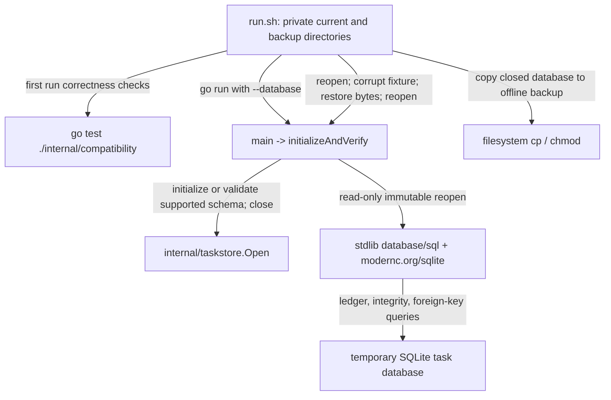

# Current-schema initialization and offline restoration harness

See the [package map](../../ARCHITECTURE.md#19-package-map).

Despite the historical directory name, this `main` package does **not** migrate
an old supported release. Fern currently declares no first supported baseline.
The harness validates initialization/reopen of task-store schema **5** and an
offline byte-restoration exercise. It must not be cited as historical upgrade
compatibility or cross-service transactional rollback evidence.

## Dependencies and representative flow

The executable directly imports `taskstore`, the SQLite driver, and standard
context/SQL/flag/filesystem packages. Shell `cp`, `chmod`, and temporary-directory
management are wrapper dependencies, not Go imports. The caller is the shell
harness or an operator explicitly invoking the command; no Go package imports
this command.

## Checks and ownership

`main` requires exactly `--database PATH` with no positional arguments, reports
usage failures with exit code 2, and reports verification failures with exit
code 1. `initializeAndVerify` first delegates to the production store's admission
and schema-ledger checks, then closes the store before immutable inspection.

It verifies `user_version` equals the current version, there is one migration
entry with a nonempty name and 64-character checksum, `integrity_check` is `ok`,
and `foreign_key_check` yields no violations. It intentionally does not duplicate
the production checksum value: `taskstore.Open` owns exact ledger validation.

`run.sh` creates private temporary directories, invokes compatibility tests,
initializes a database, copies it after close, reopens the current database,
replaces that fixture with invalid bytes, restores the backup, and verifies again.
Its exit trap removes only its own temporary tree. This is an isolated fixture,
not a command to corrupt real operator state.

The broader compatibility manifest declares control-state schema **2** and
GitHub credential schema **1**, but this executable inspects only the task store.
Resource spec **10** governs runtime identity and is not a migration version.
Obsolete development state is rejected rather than silently migrated or removed.

## Naming and performance review

`initializeAndVerify` accurately names the implemented behavior. The path
`integration/upgrade` is broader than its present contract; a future coordinated
rename to a current-schema/restore name would prevent accidental overclaiming,
but would need to update release manifests and script references together.

SQLite initialization, integrity checks, and filesystem copies dominate runtime.
These correctness operations are not suitable evidence of migration throughput.
SQLite/filesystem performance is unmeasured by this harness.

Run `bash integration/upgrade/run.sh` from the repository root for the full local
exercise, or `go run ./integration/upgrade --database PATH` for explicit schema
initialization/verification. Use a dedicated private test path, not live state.
