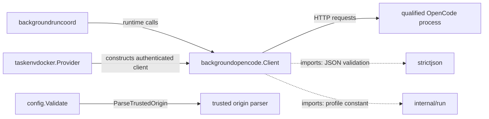
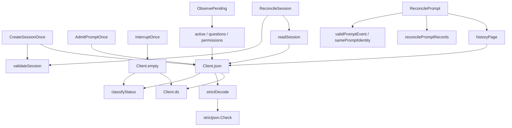

# backgroundopencode

See the [Go package map](../../docs/go-packages.md) and [maintenance review](../../docs/go-review.md).

Narrow authenticated HTTP client for the qualified disposable Background Run
OpenCode source profile, not the persistent workspace OpenCode API.
`Profile` aliases `internal/run.SourceProfile`; source compatibility is deliberate,
not a promise to accept arbitrary newer OpenCode responses.

## Place in the architecture

The coordinator owns durable intent and retry policy. This client owns bounded
wire decoding and evidence interpretation. The Docker provider supplies a
loopback endpoint and credentials after the coordinator's runtime health checks.
This client does not itself inspect Docker before every HTTP request. Nothing here writes
taskstore state, starts containers, publishes GitHub changes, or decides a run
has completed successfully.

Solid edges are selected runtime calls/construction; dotted edges are imports.
These diagrams are representative, not exhaustive static callgraph analysis.

## Entrypoints and ownership

| Entry | Contract |
| --- | --- |
| `New` | Requires canonical HTTP loopback endpoint, credentials, and bounded HTTP client. |
| `CreateSessionOnce` | At most one explicit POST; validates returned stable session tuple. |
| `readSession` (private) | Reads and validates one exact session identity for reconciliation. |
| `AdmitPromptOnce` | At most one explicit POST; validates prompt admission and sequence semantics. |
| `InterruptOnce` | One mutation; requires exactly empty 204 response. |
| `ReconcileSession` | Read-only comparison against the caller-selected session tuple. |
| `ReconcilePrompt` | Finite durable-history scan for exact admission/promotion evidence. |
| `ObservePending` | Reads positive active/question/permission observations. |
| `ParseTrustedOrigin` | Syntax/canonical-origin validation, not DNS reachability or TLS verification. |

`New` copies the supplied `http.Client` and disables redirects on that copy.
Its transport is shared; this package has no `Close` method or transport ownership.
Callers must supply a context with a deadline for every HTTP operation.
HTTP timeout must be positive and no greater than 30 seconds.
Mutation request bodies have `GetBody` disabled; the client contains no retry loop.
An arbitrary injected transport still has its own behavior: this is not a global
exactly-once network or server execution guarantee.

## Representative internal callgraph

`origin.go` is a separate pure-validation path through `canonicalDNSName`.
`errors.go` keeps protocol and transport errors free of response bodies and secrets.
`types.go` separates caller specs, public evidence enums, and private wire structs.

## Bounds and evidence semantics

- Encoded requests: 128 KiB; responses: 1 MiB, read with a one-byte overflow probe.
- Prompt text: 64 KiB; IDs: 256 bytes; credentials: 4096 bytes.
- Strict JSON validation: maximum depth 64, duplicate-key/canonical checks through
  `strictjson`, unknown-field rejection, and no trailing JSON value.
- Content type must be exactly `application/json`, without parameters.
- History page limit: at most 100; scan limits: at most 1000 pages and 10,000 events.
- Active/question/permission collections: at most 1000 entries each, plus nested bounds.
- Durable event type/version, aggregate, sequence, identity, and timestamp are checked.
- History scan exhaustion is uncertainty (`ErrScanBound`), never proof of absence.
- `ReconcileExact` for a resumed prompt requires both admission and later promotion.
- `ReconcileAdmitted` means admitted but not durably promoted; it is not completion.
- Unknown durable event types/versions fail closed rather than being silently skipped.
- Only exact typed 404/409 bodies for an authorized resource produce not-found/conflict
  errors. An arbitrary HTTP status is not trusted as equivalent evidence.

`ObservePending` performs three sequential reads, so the combined result is not
an atomic server snapshot. Owned questions or permissions take precedence over
active execution. No positive evidence yields `WorkUnknown`, not idle, success,
completion, or permission to export a repository.

Transport failure after dispatch is ambiguous. It does not authorize prompt replay.
Reconciliation and durable dispatch fencing belong to `backgroundruncoord` and
`taskstore`, not to the methods suffixed `Once`.

## Imports and callers

Production internal imports are `strictjson` and `run`; standard-library dependencies
provide HTTP, URL/IP parsing, JSON, deadlines, and UTF-8/numeric validation.
There is no Docker, database, or GitHub client import.

Production importers are `backgroundruncoord`, `taskenvdocker`, `config`, and
`cmd/fern`. The coordinator invokes session/prompt/observation methods; the
provider calls `New`; config calls `ParseTrustedOrigin`; CLI composition supplies
`HistoryBounds`. `integration/background-run-opencode` exercises the real profile.
An importer that uses a type or constant is not necessarily making an HTTP call.

## Naming review

- Keep `CreateSessionOnce`, `AdmitPromptOnce`, and `InterruptOnce`: their names
  make mutation/replay risk visible and match the explicit implementation policy.
- Keep `Reconcile*` versus `ObservePending`: durable identity evidence and
  process-local activity are intentionally different concepts.
- `readSession` is private: its only production consumer is reconciliation, and
  the private wire model is not part of the caller-facing API.
- `active`, `questions`, `permissions`, `json`, and `do` are locally understandable
  receiver helpers; `readActiveSessions`/`readQuestions` would improve isolated search
  results but are not necessary sweeping renames.
- `TrustedOrigin` has no public accessor today and is used as validation evidence;
  its name must not be read as a network trust or ownership proof.

## Performance: local measured vs unmeasured

Package performance is unmeasured.
The source shows bounded linear history scans with per-scan identity maps and
multiple decode/validation passes. Pending-list duplicate checks marshal entries
again; possible allocation savings are unmeasured and must preserve strictness.
HTTP latency and history page count are likely more important than helper names,
but that is a hypothesis, not a benchmark conclusion.

Run focused correctness checks with `go test ./internal/backgroundopencode`.
Future benchmarks should use a local deterministic HTTP fixture and separate
wire/JSON cost from pagination latency; never use real credentials or model calls.
