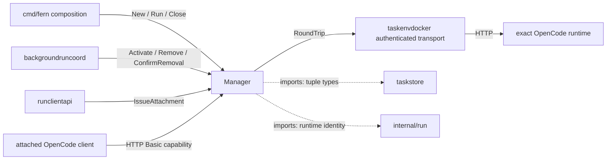
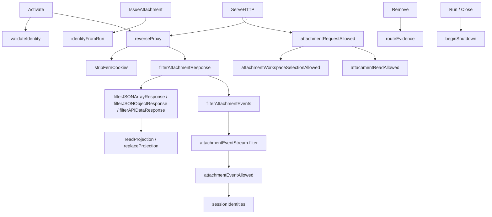

# backgroundroute

See the [Go package map](../../docs/go-packages.md) and [maintenance review](../../docs/go-review.md).

Owns the fixed loopback listener and one exact disposable-run-to-OpenCode binding.
It issues short-lived attachment capabilities and proxies a constrained OpenCode
surface. It is neither a generic reverse proxy nor a durable routing database.

## Place in the architecture



Solid edges are selected runtime calls; dotted edges identify imports.
Diagrams are representative, not exhaustive static callgraph analysis.
The public origin is HTTPS configuration; `Run` serves HTTP on an already-bound
loopback listener. TLS/private ingress is supplied by composition, not this package.

## Entrypoints and binding lifetime

| Entry | Responsibility |
| --- | --- |
| `New` | Validate loopback listener and configured private HTTPS origin. |
| `NewTarget` | Provider-facing canonical `http://127.0.0.1:port` target constructor. |
| `Run` / `Close` | Serve once; fence ingress before shutting down the listener. |
| `Activate` | Install one complete immutable identity, or recognize the same binding. |
| `Remove` | Unpublish exact binding, cancel admitted requests, and wait for drain. |
| `ConfirmRemoval` | Clear local reuse fence after caller commits durable removal. |
| `Active` / `ActiveOrigin` | Check current process-local binding, not future availability. |
| `IssueAttachment` | Mint capability only for the durable tuple naming the active runtime. |
| `ServeHTTP` | Authenticate, apply policy, account inflight requests, and proxy. |

Identity includes workspace/task/attempt, generation, writer generation, session,
container ID, start time, runtime token, and epoch. Writer generation is currently 1.
Binding equality is not just endpoint equality: a restarted process is a new runtime.
Repeated activation of the same identity and endpoint preserves the existing handler.

Removal has two stages. `Remove` leaves a pending fence even if draining times out;
replacement remains blocked until the same identity is drained and confirmed.
`ConfirmRemoval` does not query SQLite itself: the coordinator must order its call
after durable `route_removed` evidence. This process-local fence is not a transaction.

`Run` has a 10-second read-header timeout and a five-second graceful shutdown
budget. `Close` force-closes serving and the listener. Composition must close routes
before closing their provider/Docker transports.

## Representative internal callgraph



## Attachment policy and limits

- Password: 32 random bytes encoded as unpadded URL-safe base64; only SHA-256
  digests are retained in memory. Capabilities are not persisted across restart.
- Maximum 16 active attachments; lifetime two hours. Expired entries are pruned
  on issuance and on authentication; removal/shutdown clears capabilities.
- Each request inherits capability expiration as a deadline and binding cancellation.
- Missing route returns 404, bad credentials 401, denied operations 403,
  shutdown 503, and proxy failures use a generic 502 response.
- Requests drop supplied authorization/cookies and forwarded headers before proxying;
  the provider transport supplies runtime credentials. Fern device response cookies
  are removed; this is not a blanket removal of all upstream cookies.
- Encoded/ambiguous paths, foreign session path segments, `/fern`, WebSockets,
  and workspace selectors outside `/home/user/workspace` are denied.
- Reads use `attachmentReadPaths` plus bounded session/project path rules.
- Allowed mutations include owned-session prompting/control and selected
  question/permission replies and logging. This is not a read-only attachment.
- File path checks reject lexical escape and backslashes; they are not filesystem
  symlink resolution. The qualified upstream remains responsible for file semantics.

Session lists/status responses are projected to the attached session, with a 4 MiB
input cap. Other allowed response paths are not all rewritten or schema-validated.
SSE frames are filtered individually: any recognized foreign session identity drops
the frame, and session/message/permission/question/todo event types require an
owned identity. Malformed JSON drops; no-data keepalives and unrelated event types
without a foreign identity may pass. This is a profile-specific heuristic, not a
universal future-event schema or information-flow proof.

SSE scanner lines and accumulated frames are bounded by 4 MiB, including normalized
newlines/comments. Total stream length is not capped. One filtering goroutine and
`io.Pipe` per stream provide backpressure; they do not buffer the whole stream.
`Close` releases blocked pipe writes, closes upstream once, and waits for the worker.
Upstream `Close` must interrupt an outstanding `Read`, as an HTTP body should.

## Imports and callers

Internal imports are `run` and `taskstore` for identity/tuple data. HTTP proxying,
crypto, synchronization, JSON, scanning, and deadlines use the standard library.
There is no reverse import of `taskenvdocker`: its `RoundTripper` is injected.

Production callers/importers are `cmd/fern`, `backgroundruncoord`, `taskenvdocker`,
and `runclientapi`. The provider constructs `Target`; the API uses the attachment
interface; only the coordinator drives durable-removal ordering.
`integration/background-run-opencode` exercises attachment and routing contracts.

## Naming review

- Keep `Activate`, `Remove`, `ConfirmRemoval`: the separate confirmation is a
  meaningful reuse fence, not redundant cleanup naming.
- Keep `filterAttachmentEvents` and `attachmentEventStream`: names describe both
  projection and owned streaming lifetime. `sessionIdentities` returns two booleans
  (`seen`, `foreign`), whose meaning should remain explicit at call sites.
- `relativePathEscapesWorkspace` names the lexical relative-path policy; it does
  not resolve filesystem symlinks.
- `attachmentReadAllowed` includes broad session subpaths; “allowed” means local
  path policy, not full upstream response validation or read-only global authority.

## Performance: local measured vs unmeasured

`BenchmarkAttachmentEventStream/Small16Events` and
`BenchmarkAttachmentEventStream/Large4096Events`. Each uses 50% owned and 50%
foreign events, validates exact output before timing, then includes stream creation,
JSON filtering, pipe handoff, drain, and close. Throughput counts input bytes;
allocation reports exclude fixture construction. No HTTP/Docker work is measured.

See the [central performance report](../../docs/performance.md) for benchmark
commands and results. JSON tree allocation/recursive identity walking and per-event pipe writes
are plausible costs, not measured bottlenecks. No pooling or concurrency rewrite is
justified by source inspection alone.

```sh
go test ./internal/backgroundroute
go test ./internal/backgroundroute -run '^$' -bench '^BenchmarkAttachmentEventStream$' -benchmem -count=3
```
