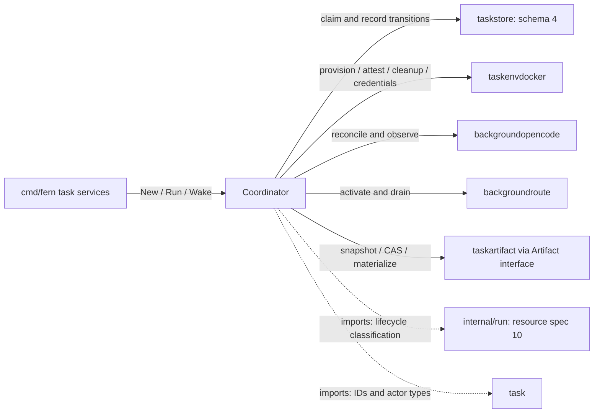
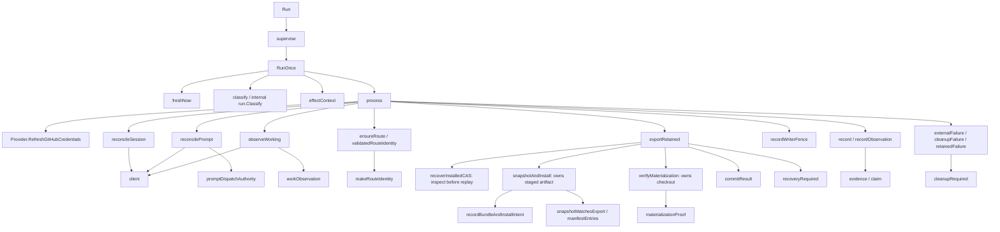

# backgroundruncoord

See the [Go package map](../../docs/go-packages.md) and [maintenance review](../../docs/go-review.md).

Serial coordinator for the one qualified disposable Background Run profile.
It connects durable taskstore claims to Docker, OpenCode, route, and retained
artifact effects. It intentionally does not provide a generic executor framework.

## Place in the architecture

Solid edges represent selected runtime calls; dotted edges are imports.
These diagrams are representative, not exhaustive static callgraph analysis.
Taskstore owns durable transition legality; provider observations are not themselves
database commits. The coordinator records evidence only under claim/revision fences.

## Entrypoints and lifetime

`New` requires concrete store/provider/route dependencies, an artifact boundary,
ID generator, system actor, clock, HTTP client, execution identity, and bounds.
`Run` supervises scans until cancellation or store corruption.
`Wake` sends to a capacity-one channel without blocking; multiple wakes coalesce.
`RunOnce` locks the local scan mutex, claims work, classifies lifecycle, checks
deadline/configuration, and processes one selected lifecycle phase.

`RunOnce` selects one run and processes its phase, not one network call.
A phase can inspect repeatedly,
create and start a container, refresh credentials, or advance several export steps.
There is no parallel execution lane or lease-renewal background goroutine here.

The operation timeout must be shorter than the lease; leases are at most five
minutes. `effectContext` bounds ordinary effects by operation timeout, claim expiry,
and (when execution policy requires it) attempt deadline. Cleanup can proceed after
the attempt deadline but still needs authority. Clock values are UTC, millisecond
truncated, and reject zero/negative timestamps; monotonic wall time is not enforced.

`supervise` terminates on `ErrCorruptStore` and cancellation, reports other errors
through `OnError`, and scans again on later ticks/wakes. `ErrNoWork` invokes
`OnSuccess`; that hook means scan health, not successful completion of a task.
The coordinator does not close its dependencies; composition stops it before
closing routes, artifact engine, provider, and store.

## Representative internal callgraph

## Phase progression and failure semantics

Provisioning observes clone, volume, container/runtime, health, and readiness.
Execution configuration includes current resource spec (10), image, environment
digest, agent, provider, and model. Mismatched active execution configuration
requests cleanup rather than silently adopting changed inputs.

At readiness the route is attested/activated and the session is reconciled.
An absent session may be created once in that path and then read again.
A same-ID conflicting session or inconclusive creation requests cleanup.

Prompt dispatch differs from ordinary reconcilable resource creation:

1. Durable prompt intent precedes dispatch.
2. `RecordBackgroundRunPromptRequestAttempted` commits the no-replay fence.
3. Context, clock, lease, and attempt authority are rechecked before the call.
4. `AdmitPromptOnce` is followed by a fresh bounded history reconciliation.
5. Only exact admission plus promotion records admitted; all other outcomes
   record uncertainty. A lost response never triggers blind prompt replay here.

`AfterPromptFence` and `AfterPromptCall` are explicit test/interleaving hooks,
not an extension framework or reliable audit delivery channel.

Working scans observe clone usage and owned OpenCode pending/active evidence.
Questions/permissions take precedence over active work. Unknown observations
release the claim without declaring idle, success, or permission to export.
Resource identity/quarantine errors require cleanup; transient external failures
normally release the claim for retry. Cleanup failure retains cleanup-required state.

GitHub credentials refresh only in execution phases and only without cancellation
or timeout request. They are runtime inputs: refresh failures prevent new admission
and are retried; GitHub availability must not gate teardown. The agent's `gh`/Git
tools own remote publication. There is no host publisher or publication coordinator.

## Retained export and teardown

User sealing establishes a structured writer fence, then an export claim.
`exportRetained` owns the export attempt and, when a snapshot is needed, the
provider's exclusive clone lease through materialization, commit, and recovery
recording. `snapshotAndInstall` owns its staged capability and discards it unless
CAS storage consumes it. `verifyMaterialization` closes its checkout before
recording proof. Staged and checkout paths are opaque process capabilities, not
durable authority or fields stored in evidence.

The export replay path can recognize an already-installed matching CAS object.
Otherwise a repeated snapshot must match durable selection. Every transition uses
the export's current revision/phase claim. The attempt's `record` operation obtains
a fresh validated timestamp and adopts only successful SQL results, retaining the
last confirmed tuple on failure. A failed durable write is not treated as successful
merely because the filesystem effect happened.

Snapshot mismatch or export failure marks recovery required rather than accepting
different content. Recovery and final commit writes use
`context.WithTimeout(context.WithoutCancel(parent), OperationTimeout)` so caller
cancellation cannot interrupt them and detachment cannot make them unbounded.
SQL still checks export claim authority; ordinary `effectContext` bounds must not
be assumed to apply to every export write.
Materialization proof reduces a verified checkout path to a clean-state bit and
identity digest, not a host path or promise that a checkout remains live forever.

Teardown proves writer inactivity, removes/drains the route, durably records removal,
confirms the process-local route fence, then removes container, volume, and clone.
Only positive absence evidence permits final cleanup/terminal transitions.
Retained-result cleanup and ordinary failure terminalization are distinct paths.
This is recoverable ordered effects, not an atomic Docker/filesystem/SQLite transaction.

## Imports and callers

Internal imports: `backgroundopencode`, `backgroundroute`, `run`, `task`,
`taskartifact`, `taskenvdocker`, and `taskstore`. The standard library provides
contexts, HTTP client types, synchronization, evidence hashing/JSON, and time.
`cmd/fern/tasks.go` constructs the coordinator and wires wake/health callbacks.
`integration/background-run-opencode` is the direct end-to-end composition caller.
No internal package imports this coordinator to drive an independent execution lane.

## Naming review

- Keep `reconcileSession`, `reconcilePrompt`, `observeWorking`, and the distinct
  `externalFailure`/`retainedFailure`/`cleanupFailure` helpers: their recovery policies differ.
- `RunOnce` describes one claimed phase/scan, not literally one external call;
  create/start and export paths can perform multiple effects.
- `process` is broad but appropriate as the phase dispatcher; splitting its switch
  would be a design change, not a naming-only performance optimization.
- Receiver `validatedRouteIdentity` validates committed runtime; free
  `makeRouteIdentity` only constructs the tuple from that runtime.
- `materializationProof` is evidence derived after materialization, not a durable
  filesystem lease. Keep that limitation visible whenever the helper is reused.

## Performance: local measured vs unmeasured

No coordinator timings were collected here. Source-level candidates are repeated
health checks in `ensureRoute` and `client`, full clone usage walks during working
scans, and repeated artifact verification around CAS/export. Those checks are
authority boundaries; deleting them based on presumed overhead is unsafe.

The artifact acquisition benchmark in the [central performance report](../../docs/performance.md)
measures a real lower-level Git/filesystem
path, not coordinator scan or export latency. Docker, SQLite contention, GitHub
refresh, wake-to-claim latency, and large-repository export remain unmeasured.
Use `go test ./internal/backgroundruncoord` for focused transition/fencing tests.
