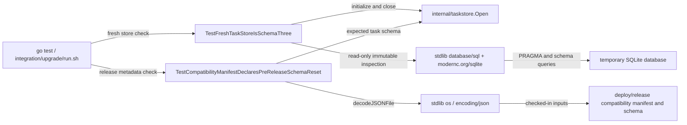

# compatibility

See the [Go package map](../../docs/go-packages.md) and [maintenance review](../../docs/go-review.md).

This directory is a **test-only Go package** (`compatibility_test`), not a runtime
compatibility library. It checks that a freshly opened task store and checked-in
release metadata agree on the current pre-release schema reset.

## Place in the system

`go test` is the caller; `integration/upgrade/run.sh` invokes these checks before
its current-schema initialization/reopen/offline-restoration exercise. Runtime
schema admission remains in `taskstore.Open`, not in this test package.

## What the tests assert

The fresh-store test creates a private temporary directory, initializes through
the production store, closes it, then independently inspects SQLite. It expects:

- Task schema **4**, also equal to `taskstore.CurrentSchemaVersion()`.
- One migration entry named `retained_result_task_store` and a SHA-256-shaped
  hexadecimal checksum.
- `integrity_check` equal to `ok` and no foreign-key violations.
- `background_runs` and `retained_artifacts` tables.
- No verification/publication tables and no `attempts.budget_snapshot` column.

The manifest test checks `first_supported_baseline: null`, disallowed additional
schema properties, and the task-store version in both manifest and JSON schema.
It does **not** implement full JSON Schema validation or verify every release
field. The release manifest also declares control-state schema **2** and GitHub
credential schema **1**; those are not independently exercised by these tests.
Resource spec **10** belongs to runtime identity, not a task-store migration.

There is no supported historical migration baseline. Old development state is
rejected by the owning stores, not silently upgraded or deleted by this package.

## Naming review

`compatibility` is reasonable for a cross-package release contract, but the
scope is narrower than general backward compatibility. Test names explicitly
describe the fresh schema and pre-release reset rather than claiming old-version
upgrade coverage. There are no production symbols to rename.

## Performance and running

Run `go test ./internal/compatibility` from the repository root. Relative manifest
paths rely on Go's package working-directory behavior. SQLite creation, integrity
checking, and filesystem durability dominate this correctness test; its runtime
is not a database throughput measurement.

`modernc.org/sqlite` and filesystem performance are
external to this package and unmeasured here; correctness coverage should not be
presented as a performance result.
