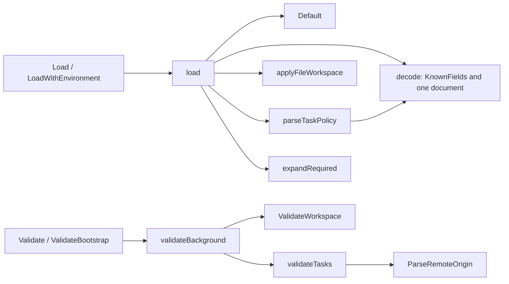
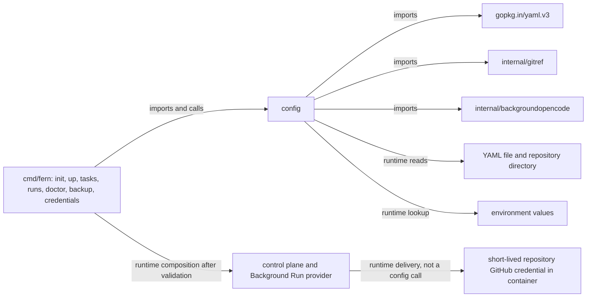

# config

See the [Go package map](../../docs/go-packages.md) and [maintenance review](../../docs/go-review.md).

`config` loads the single current Fern Background Run configuration shape.
It does not start servers, contact GitHub, inspect Docker images, or authorize a
run merely by returning a `Config`.

## Responsibilities

- Merge defaults, a strict YAML file, and explicitly supplied CLI overrides.
- Resolve repository paths and required environment references.
- Validate offline workspace identity separately from bootstrap and execution.
- Reject obsolete or unknown YAML fields instead of silently translating them.

`Config` contains `Workspace`, `Control`, `Tasks`, and listener/origin settings.
`Control` holds only the host control password.
`TaskPolicy` describes the disposable Background Run image, model, timing, and
private attachment route. There is no alternative legacy execution shape.

## Representative internal calls

These arrows represent calls, not execution authorization or runtime services.
`parseTaskPolicy` marshals the YAML node and decodes it again to apply strict
field checking to the nested task mapping.

## Imports, callers, and architecture

Standard-library dependencies include filesystem, URL/address parsing, text,
regular expressions, and durations. The diagram highlights nonstandard imports.
Configuration binds installation/repository IDs; it does not contain the App
private key. The host GitHub App signer retains that key while the execution
provider delivers repository-scoped short-lived installation tokens to compute.

## Loading and validation contract

1. `Default` supplies a workspace name and two loopback listeners, not an
   executable task policy.
2. Missing files are tolerated only when `required` is false and the error is
   specifically nonexistence.
3. Overrides replace name, repo, and listeners only when their pointers are set.
4. A file-supplied relative repository is relative to the config file directory;
   an overridden relative repository is relative to `defaultRepo`.
5. Only repository and control-password strings undergo environment expansion.
   `$$` escapes a dollar; any unset referenced variable is an error.
6. `LoadWithEnvironment` prefers provided values even when a value is empty,
   then falls back to the process environment.
7. Callers choose the necessary validation level after loading.

`ValidateWorkspace` checks name, GitHub repository ID/name, and that the local
path is a directory. It does not prove the directory is a Git checkout or that
its remote matches GitHub.

`ValidateBootstrap` permits an omitted installation ID, not an otherwise
unconfigured task policy. `Validate` additionally requires a positive installed
execution binding. Neither function verifies live installation access.

The task timeout is 1 minute–24 hours; leases are 1–5 minutes and no longer than
the attempt timeout. Image IDs require canonical lowercase SHA-256 spelling;
that syntax check is not evidence of an actually qualified local image.
Listeners require numeric loopback IPs and distinct ports. The background
origin uses the remote hostname and an explicit distinct non-443 HTTPS port.

## Naming review

- `Load` accurately says loading, not validation; keep the explicit validation
  call visible at composition sites.
- `decodeRequiredTaskString` is also used for workspace, proxy, and password
  fields. `decodeRequiredString` would describe its current general purpose.
- `validateBackground` is now the only top-level execution validator; a name
  such as `validateConfig` would avoid implying a second configuration shape.
- `ParseRemoteOrigin` validates exact spelling rather than normalizing arbitrary
  input. Its documentation correctly states this stricter contract.
- `ValidateWorkspace` is an offline shape/path check, not repository attestation.
  Avoid describing it as proving repository authority.

These naming alternatives are maintenance considerations, not additional APIs.

## Performance: static observations

`Load` reads the entire file without an explicit byte cap and constructs a YAML
tree. `parseTaskPolicy` performs an additional marshal/decode pass. Configuration
is a startup/CLI path, so this is not automatically a runtime bottleneck.
`Validate` performs `os.Stat`, string checks, and repeated origin parsing; it
does not invoke Git, Docker, DNS resolution, or GitHub.

Consider a file-size bound for defensive loading before optimizing tree parsing.
Avoid caching validation across filesystem or configuration changes without a
clear invalidation contract.

## Benchmarks and verification

Benchmarks in `benchmark_test.go`:

- `BenchmarkLoad`: real reads of an existing temporary YAML fixture.
- `BenchmarkParseTaskPolicy`: the nested YAML conversion path only.
- `BenchmarkValidate`: a preloaded valid configuration and existing directory.

Fixture creation and initial correctness checks are outside the timed loops.
Repeated reads may benefit from the OS page cache; these are not cold-disk tests.
Allocation reporting is enabled. See the [central performance report](../../docs/performance.md)
for benchmark commands, environment, and results.
