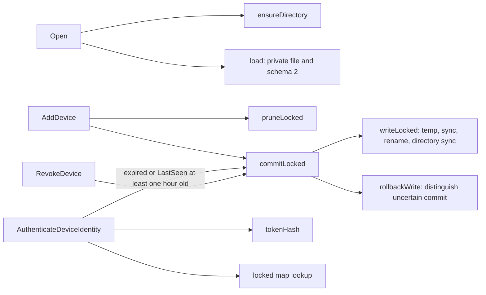
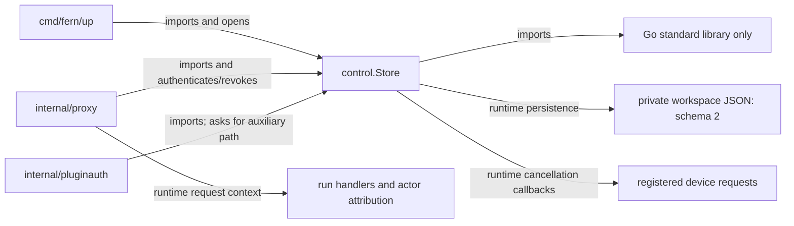

# control

See the [Go package map](../../docs/go-packages.md) and [maintenance review](../../docs/go-review.md).

`control` owns one workspace's durable browser-device identities and stable
operator credential identifier. It is a private JSON state store, not an HTTP
authentication middleware or a task database.

## State and ownership

The current control schema is **2**. It contains workspace, revision, operator
credential ID, and devices. Historical schemas are rejected without migration
or mutation; removed publication state is not part of this package.

`Open` derives the filename from SHA-256 of the workspace name inside a private
directory. A missing file starts an in-memory empty store; it is written on a
later mutation rather than eagerly created by `Open`.

Device map keys are SHA-256 bearer digests. A device's displayed ID is the first
16 hex characters of that digest. Raw bearer values are never persisted.
Operator credential IDs are independent random identifiers, not password hashes
and not bearer secrets. Their purpose is stable audit attribution.

## Representative internal calls

An ordinary successful authentication with fresh `LastSeen` performs no write.
Expiration here removes the matched credential, not all expired credentials.
`Devices` and `AddDevice` perform broader pruning.

## Imports, callers, and architecture

The plugin subsystem owns its own auxiliary schema; `AuxiliaryStatePath` does
not merge that data into control state. The proxy similarly owns pairing state.
GitHub App private keys and container installation credentials are outside this
store. Browser pairing authority is not a GitHub credential.

## Durability and admission

- The directory must be a private real directory.
- Existing state is opened with `O_NOFOLLOW`; file checks require a private,
  singly linked regular file.
- Reads and writes are capped at 4 MiB.
- Writes serialize the whole state under one mutex, use a mode-0600 temporary
  file, sync it, rename it, and sync its directory.
- Failures before replacement restore memory; a directory-sync failure after
  replacement is an uncertain commit and deliberately does not roll back.
- `AddDevice` admits at most 64 devices after pruning expired entries.
- `Devices` sorts unexpired devices oldest-first and may persist pruning.

`AuthenticateDeviceIdentity` checks token existence and expiry, then refreshes
`LastSeen` at most hourly. It can therefore return an I/O error, not just a
negative authentication result.

`RegisterDeviceRequest` fences registration against removal under the same
mutex. It checks ID presence, not current expiry; the caller first authenticates
and installs a request deadline. Always invoke the returned cleanup.

`RevokeDevice` only persists removal. The caller must subsequently invoke
`CancelDeviceRequests` to cancel already registered work. Cancellation callbacks
run outside the store mutex. A cancellation signal is not proof downstream
operations have already stopped.

## Naming and guarantee review

- `AuthenticateDeviceIdentity` now states the precise pruning behavior: only a
  matched expired credential is removed.
- `Devices` sounds read-only; it can prune and write. Preserve that fact in
  caller error handling, or consider `ListActiveDevices` with explicit docs.
- `RevokeDevice` does not itself cancel active requests. Keep the two-step
  proxy helper or consider an explicitly combined API in a future review.
- `AuxiliaryStatePath` validates restricted lowercase syntax, not a fixed
  enumeration of subsystem names; its comment now makes that distinction.
- `EnsureOperatorCredentialID` accurately signals possible durable mutation.

## Performance: static observations

Cached device authentication is a token hash, mutex acquisition, map lookup,
and time comparisons. Registration and revocation scan device values by ID;
the normal admission cap keeps those scans small.

Hourly refreshes, pruning, additions, and revocations hold the mutex across
full JSON encoding and filesystem syncs. Those uncommon paths can delay all
authentication on the same store; fsync latency is not represented by a cached
authentication microbenchmark. Loaded state is byte-bounded, but `load` does not
reapply the 64-device admission cap or exhaustively validate device records.

The lock is in-process. Separate Store instances/processes are not coordinated
by this mutex; do not infer multi-writer transactional safety from atomic rename.

## Benchmarks

`BenchmarkAuthenticateDeviceIdentityCached` runs with 1 and 64 real registered
devices. Setup uses a private temporary directory and production `AddDevice`.
Time is fixed one minute after creation, so successful hits do not refresh
`LastSeen`. A post-loop revision check detects accidental writes.

Setup/persistence are untimed and allocations are reported. The benchmark does
not measure contention, misses, expiry, revocation, or slow disks. See the
[central performance report](../../docs/performance.md) for commands and results.
