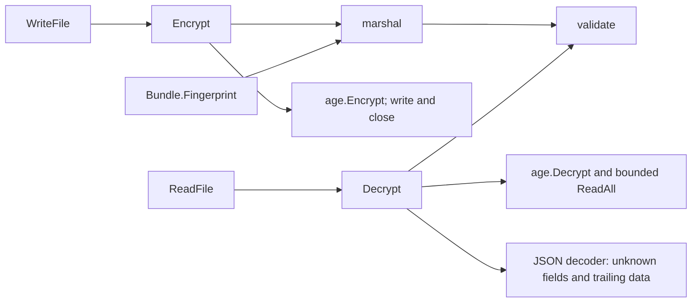
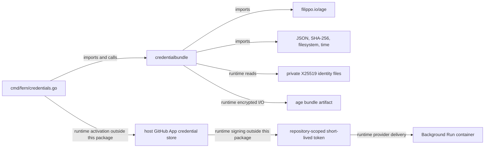

# credentialbundle

See the [Go package map](../../docs/go-packages.md) and [maintenance review](../../docs/go-review.md).

`credentialbundle` is the bounded, age-encrypted interchange format for Fern
credential export/import. It handles encrypted artifacts and structural bundle
validation, not credential activation or live GitHub authorization.

## Data model

`Bundle` version 2 records an epoch, UTC creation time, configuration `Binding`,
and a required `GitHubApp` JSON credential candidate. The removed `workspace_gh`
field is rejected. Version 1 bundles fail explicitly; export a new version 2
bundle from the current credential store. No files are migrated or deleted.
The underlying GitHub App credential JSON schema remains version 1.

`Binding` includes workspace, mode, hostname, App/installation IDs, and numeric
repository ID/full name. Validation requires basic nonempty bounded atoms and
positive App, installation, and repository IDs, and mode `github-app-broker`,
not equality with the running host configuration.
The importing CLI is responsible for compatibility and activation decisions.

## Representative internal calls

These are representative direct calls. Encryption and decryption use complete
in-memory plaintext buffers; encrypted output is streamed to the destination.

## Imports, callers, and architecture

The shared strict JSON scanner checks duplicate keys and nesting. The CLI coordinates this format
with `githubapp`; the bundle package itself does not call GitHub or Docker.
The host App private key may be included in an encrypted export, but ordinary
run delivery sends the short-lived installation token, not that private key.

## File and cryptographic contracts

- `ParseRecipients` accepts explicit X25519 recipient strings, trimming space.
- `LoadIdentities` reads private regular files containing X25519 identity lines;
  blank lines and comments are ignored. On Darwin/Linux, it and `ReadFile` open
  the leaf with no-follow/nonblocking flags and validate regular type and private
  mode on the opened descriptor. Other platforms fail closed.
- `RecipientsForIdentities` derives recipients only for supported identity
  implementations and silently skips others.
- `Encrypt` requires a destination and at least one recipient.
- `Decrypt` requires a source and at least one identity, authenticates the age
  stream, rejects duplicate keys (including nested/case variants), unknown JSON
  fields/trailing content, and validates the bundle. JSON nesting is capped at 64.
- `WriteFile` writes ciphertext to a mode-0600 temporary file in the destination
  directory, syncs and closes it, hard-links it to an absent destination, unlinks
  the temporary name, and syncs the directory. Concurrent destination creation
  fails without replacing that destination. A post-install cleanup/sync failure
  can return an error with the encrypted destination already installed.
- `ReadFile` decrypts in memory; it does not materialize a plaintext file.

`String` and `GoString` redact bundle contents. `Fingerprint` hashes the
validated JSON serialization plus its newline, not the randomized ciphertext.
Do not treat a fingerprint as a MAC, access credential, or semantic equality
proof across arbitrary alternate serializations.

## Bounds

| Input | Current bound |
| --- | --- |
| Bundle serialization / decrypted payload | 32 MiB |
| Encrypted source reader | 32 MiB plus one byte |
| One identity file | 64 KiB |
| App credential JSON | 256 KiB |
| Binding/epoch atoms | 512 bytes each |

Encrypted framing overhead and the separately bounded plaintext matter at the
edge of the limit. The number of identity paths and recipients is not explicitly
capped by this package.

## Naming and guarantee review

- `Encrypt` now explicitly documents its complete in-memory plaintext buffer;
  it is not streaming serialization, although no plaintext file is written.
- Callers must use trusted private parent directories. Leaf no-follow and
  descriptor checks do not fence ancestor replacement or defend against a hostile
  same-UID process modifying an opened file. Hard-link installation requires a
  filesystem supporting hard links; no overwrite-prone rename fallback is used.
- `Decrypt` does not validate the opaque candidate against live GitHub authority.
- `RecipientsForIdentities` is a filtering operation; document possible empty
  output rather than assuming every age identity has a public recipient.

Artifact paths are explicitly supplied through `--output`/`--input`; identity
paths through `--identity`. The CLI's active store is `<state-dir>/github-app`.
Rollback defaults to `<input>.rollback-<generation>.age` unless overridden.

## Performance: static observations and measurement scope

`Fingerprint` and `Encrypt` each serialize the bundle when called.
Export code requesting both fingerprint and encryption can therefore repeat
large JSON/base64 work. Decryption buffers the whole plaintext and then decodes
it, so the byte cap is not a claim that peak memory equals 32 MiB.

Age public-key work, payload size, recipient count, and file sync latency are
separate costs. Avoid reusing a plaintext serialization without reviewing its
lifetime and secret-handling implications.

Bundle performance is unmeasured. `bundle_test.go` covers format/file behavior,
not encryption throughput or filesystem latency.
