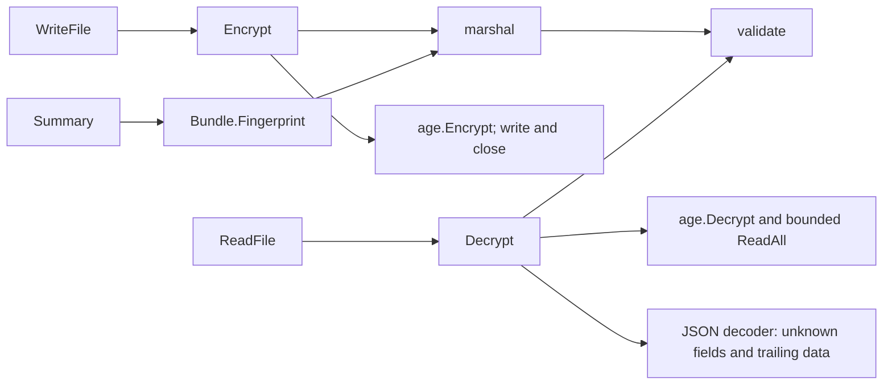
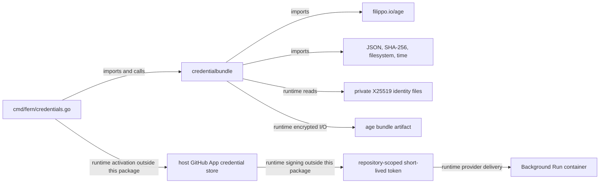

# credentialbundle

See the [Go package map](../../docs/go-packages.md) and [maintenance review](../../docs/go-review.md).

`credentialbundle` is the bounded, age-encrypted interchange format for Fern
credential export/import. It handles encrypted artifacts and structural bundle
validation, not credential activation or live GitHub authorization.

## Data model

`Bundle` version 1 records an epoch, UTC creation time, configuration `Binding`,
and serialized credential candidates. `GitHubApp` is JSON and `WorkspaceGH` is a
byte field. The latter remains in the format; its presence is not evidence of a
second currently supported execution/configuration mode.

`Binding` includes workspace, mode, hostname, App/installation IDs, and numeric
repository ID/full name. Validation requires basic nonempty bounded atoms and
positive repository ID, not equality with the running host configuration.
The importing CLI is responsible for compatibility and activation decisions.

## Representative internal calls

These are representative direct calls. Encryption and decryption use complete
in-memory plaintext buffers; encrypted output is streamed to the destination.

## Imports, callers, and architecture

There are no internal Fern package imports here. The CLI coordinates this format
with `githubapp`; the bundle package itself does not call GitHub or Docker.
The host App private key may be included in an encrypted export, but ordinary
run delivery sends the short-lived installation token, not that private key.

## File and cryptographic contracts

- `ParseRecipients` accepts explicit X25519 recipient strings, trimming space.
- `LoadIdentities` reads private regular files containing X25519 identity lines;
  blank lines and comments are ignored.
- `RecipientsForIdentities` derives recipients only for supported identity
  implementations and silently skips others.
- `Encrypt` requires a destination and at least one recipient.
- `Decrypt` requires a source and at least one identity, authenticates the age
  stream, rejects unknown JSON fields/trailing content, and validates the bundle.
- `WriteFile` writes ciphertext to a mode-0600 temporary file, syncs it, renames
  it, and syncs the containing directory.
- `ReadFile` decrypts in memory; it does not materialize a plaintext file.

`String` and `GoString` redact bundle contents. `Summary` returns epoch and a
SHA-256 fingerprint, or a generic invalid summary. `Fingerprint` hashes the
validated JSON serialization plus its newline, not the randomized ciphertext.
Do not treat a fingerprint as a MAC, access credential, or semantic equality
proof across arbitrary alternate serializations.

## Bounds

| Input | Current bound |
| --- | --- |
| Bundle serialization / decrypted payload | 32 MiB |
| Encrypted source reader | 32 MiB plus one byte |
| One identity file | 64 KiB |
| App credential JSON | 256 KiB |
| Workspace credential bytes | 16 MiB |
| Binding/epoch atoms | 512 bytes each |

Encrypted framing overhead and the separately bounded plaintext matter at the
edge of the limit. The number of identity paths and recipients is not explicitly
capped by this package.

## Naming and guarantee review

- `Encrypt` now explicitly documents its complete in-memory plaintext buffer;
  it is not streaming serialization, although no plaintext file is written.
- `WriteFile` now documents atomic rename with a prior existence check, not
  race-safe no-replace creation. Callers need serialized writers in a trusted
  directory; stronger concurrent no-clobber semantics would need another primitive.
- `ReadFile` and `LoadIdentities` use `Lstat` followed by `Open`; unlike descriptor
  based no-follow checks, that is not a complete path-replacement race fence.
- `Decrypt` is structurally strict but does not reject duplicate JSON keys via
  `jsoncanon`, nor validate the opaque candidate against live GitHub authority.
- `RecipientsForIdentities` is a filtering operation; document possible empty
  output rather than assuming every age identity has a public recipient.

These limitations matter when choosing a trusted file and concurrency boundary.

## Performance: static observations and measurement scope

`Fingerprint`, `Summary`, and `Encrypt` each serialize the bundle when called.
Export code requesting both fingerprint and encryption can therefore repeat
large JSON/base64 work. Decryption buffers the whole plaintext and then decodes
it, so the byte cap is not a claim that peak memory equals 32 MiB.

Age public-key work, payload size, recipient count, and file sync latency are
separate costs. Avoid reusing a plaintext serialization without reviewing its
lifetime and secret-handling implications.

Bundle performance is unmeasured. `bundle_test.go` covers format/file behavior,
not encryption throughput or filesystem latency.
