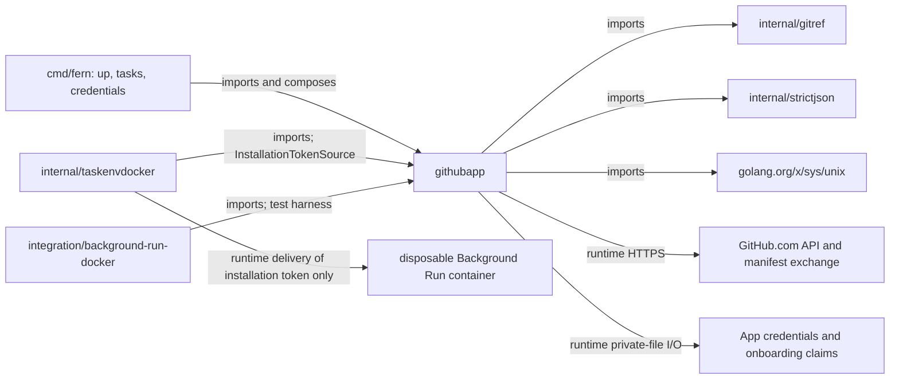

# githubapp

See the [Go package map](../../docs/go-packages.md) and [maintenance review](../../docs/go-review.md).

`githubapp` implements host-side GitHub App onboarding, private credential
storage, installation/repository discovery, and short-lived token minting.
It is not a general GitHub proxy or a host-side pull request publisher.

## Current credential boundary

The App RSA private key stays on the host. `JWTSigner` signs App JWTs, and
`Client.InstallationToken` requests one repository ID with `contents:write` and
`pull_requests:write`. `taskenvdocker.RefreshGitHubCredentials` delivers that
short-lived token to the attested Background Run container for its Git/GitHub
helpers. Token refresh and delivery caching belong to the provider, not here.

Installation-wide discovery tokens are a different type, used for operator
repository selection. They are not interchangeable with execution tokens.
Opaque token formatting is redacted, but `Value` intentionally returns the
secret after checking the supplied time and expiry margin.

## Representative internal calls

```mermaid
graph LR
  setup["OnboardingHTTP.setup"] --> begin["OnboardingStateStore.Begin"]
  constructor["NewOnboardingHTTPWithSetupOrigin"] --> manifest["GenerateAppManifest"]
  callback["OnboardingHTTP.callback"] --> claim["OnboardingStateStore.Claim"]
  callback --> exchange["ManifestClient.Exchange"]
  callback --> save["CredentialStore.Save"]
  callback --> close["Complete / Quarantine"]
  mint["Client.InstallationToken"] --> access["mintInstallationAccessToken"]
  access --> jwt["JWTSigner.AppToken via AppTokenSource"]
  mint --> permissions["ValidateRepositoryPermissions"]
  discover["InstallationClient list methods"] --> page["getPage"]
  discover --> decode["decodeGitHubJSON"]
  select["SelectRepository"] --> identity["NewRepositoryIdentity"]
```

Calls depend on branch outcomes: only an exchange-authorized claim may exchange
the one-time code. Completion follows saving credentials; ambiguous outcomes
are quarantined rather than blindly retried.

## Imports, callers, and larger architecture



The package also imports standard-library HTTP, RSA/SHA-256, JSON, context,
filesystem, synchronization, and time. HTTP handlers are injected into the
proxy as `http.Handler`; `proxy` does not import this package directly.

## Main APIs and guarantees

- `NewRepositoryIdentity` validates positive installation/repository IDs; it
  constructs a binding, not a live proof of repository access.
- `ParseRSAPrivateKeyPEM` validates supported RSA PEM material.
- `NewJWTSigner` validates the key and signs RS256 JWTs with a one-minute
  backdate and nine-minute forward expiry; it does not cache signed tokens.
- `Client.InstallationToken` requests a one-repository token and validates
  returned permissions/lifetime. It mints on every call, without a token cache.
- `ListAppInstallations` and `ListInstallationRepositories` perform bounded,
  validated pagination. `SelectRepository` validates matching observed authority.
- `CredentialStore` provides private-file protection, not encryption at rest.
  Encrypted export is composed separately through `credentialbundle`.
- `ManifestCode` copies share atomic consumption state. Durable callback claims
  add restart/replay fencing around the in-process at-most-once code object.

Network calls require bounded contexts where enforced by their operation.
Clients copy the supplied `http.Client` and disable redirect following, but
retain its underlying transport. Concurrency safety depends on dependencies.
Remote bodies and secrets are omitted from the package's public error vocabulary.

## Publication boundary

This package has no branch/PR observation or creation APIs for a host publisher.
Container-side GitHub operations are the current execution path.

Shared `decodeGitHubJSON`, `validAPIBase`, `firstError`, and `isNilInterface`
live in `http_helpers.go` for installation discovery/onboarding.
`ErrPaginationRefused` guards discovery pagination. Discovery transport tests
cover response validation, credential checks, redirects, and concurrency.

## Bounds and persistence

| Area | Current bound |
| --- | --- |
| Token/repository response body | 64 KiB |
| Manifest response body | 64 KiB |
| Access token bytes | 20–512 |
| Usable token margin / maximum accepted life | greater than 30 seconds / 65 minutes |
| Discovery pages | 10 pages of at most 100 entries |
| Credential file / onboarding file | 128 KiB each |
| Onboarding records / active records | 64 / 16 |
| Onboarding lifetime / replay window | up to 10 minutes / 1 hour |

Credential and onboarding stores use directory-descriptor-relative operations,
private-file checks, temporary writes, sync, and rename. Atomic visibility does
not make a failed post-rename directory sync a rolled-back write.
Onboarding transaction serialization is process-wide; it is not a distributed
or multi-process database lock.

## Naming review

- `Client` is specifically an installation-token minting client; its name is
  retained for existing callers.
- `InstallationTokenSource` now documents container credential delivery rather
  than the removed host publisher. `InstallationToken` documents repository
  scope rather than implying it never enters compute. Only the App private key
  remains host-only.
- `InstallationRepositoryObservation` proves an API response at observation time, not
  continued repository state or a Git result's correctness.
- `AppCredentials.PrivateKey` returns the underlying RSA pointer; unlike
  `PrivateKeyPEM`, it is not a defensive copy. Avoid promising deep immutability.

## Performance: static versus measured

Each token mint signs an RSA JWT, makes HTTP requests, buffers a bounded body,
and decodes JSON. Discovery calls obtain fresh credentials from their sources.
Discovery performs sequential pages; API latency/rate limits may dominate CPU.
`decodeGitHubJSON` checks duplicate keys/depth and then unmarshals, so it traverses
the payload twice. Token minting instead uses direct `json.Unmarshal`; do not
attribute the stricter discovery decoder's guarantees to every response path.

`CredentialStore.Save` validates credentials before calling
`MarshalStoredCredentials`, which validates again, including RSA key parsing.
This is repeated work on a cold persistence path, not a measured hot spot.
Onboarding persistence can serialize unrelated flows through its process-wide
transaction gate. Any optimization must preserve claim/replay guarantees.

`BenchmarkDecodeGitHubJSON` measures the shared decoder in `http_helpers.go` with
a representative installation response. It excludes HTTP, RSA, token minting,
filesystem I/O, and selection validation. Allocations and input bytes are
reported. See the [central performance report](../../docs/performance.md) for
benchmark commands and results.
