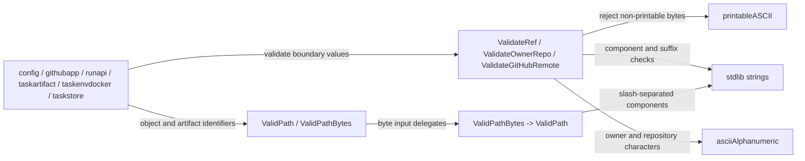

# gitref

See the [Go package map](../../docs/go-packages.md) and [maintenance review](../../docs/go-review.md).

`gitref` centralizes Fern's Git reference, SHA-1, GitHub repository-name,
canonical GitHub remote URL, and repository-relative path checks. It is a
standard-library-only, synchronous validation package: it does not invoke Git
or contact GitHub.

## Place in the system

Direct production callers are `config`, `githubapp`, `runapi`, `taskartifact`,
`taskenvdocker`, and `taskstore`. Sharing these rules prevents API routing, artifact paths, and
configuration from quietly accepting different identifier languages.

## Contracts

- `ValidateRef` accepts a conservative Fern reference language: 1–255 printable
  ASCII bytes, no leading hyphen, forbidden Git metacharacters, empty or dotted
  components, `..`, `@{`, or case-insensitive `.lock` suffixes. This is a Fern
  policy boundary, not a shell-out equivalence test against every Git version.
- `ValidateOwnerRepo` requires one slash, an owner of 1–39 characters, and a
  repository name of 1–100 characters. It rejects `.`, `..`, and `.git` suffixes
  and applies the documented ASCII owner/repository character restrictions.
- `ValidateGitHubRemote` accepts only `https://github.com/OWNER/REPOSITORY`
  spelled exactly (lowercase scheme and host, no userinfo, port, query,
  fragment, percent-encoding, trailing slash, or `.git` suffix) where the path
  is a `ValidateOwnerRepo` full name. It is the single remote-identity check for
  run admission, the run API, and the Docker run provider.
- `ValidPath` rejects empty paths, NUL, absolute/trailing slash paths, and empty,
  `.` or `..` components, with a 4096-byte limit. It does not resolve symlinks,
  inspect the filesystem, or claim that backslashes are separators.
- `ValidPathBytes` delegates through a string conversion.

The error-returning validators expose `ErrInvalidRef`, `ErrInvalidOwnerRepo`,
and `ErrInvalidGitHubRemote`; the remaining validators return booleans. Callers add
operation-specific context rather than copying these rules.

## Naming review

The package name is short and recognizable, though broader than refs alone.
The `Validate*` versus `Valid*` distinction currently corresponds to error versus
boolean results; preserve that distinction when extending the API. The 255-byte
ref limit is Fern policy rather than a universal Git limit.

## Performance review and tests

Checks are bounded linear scans over small inputs. `strings.Split` and
case-insensitive suffix checks are possible allocation sites; replacing them
with manual indexing is only justified by measured call-site pressure. SHA-1
validation already uses a direct byte loop. Keep safety checks explicit rather
than weakening accepted-input rules for speculative speed.

Run `go test ./internal/gitref`. No new benchmark is supplied, and no Git or
GitHub performance claim is made: those external dependencies are unmeasured.
