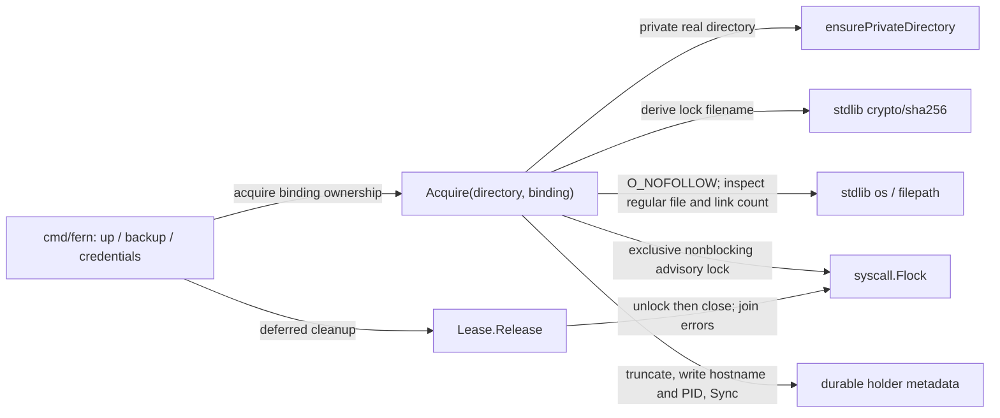

# hostlease

See the [Go package map](../../docs/go-packages.md) and [maintenance review](../../docs/go-review.md).

`hostlease` owns the exclusive host-process lock for a repository binding.
It is used by `cmd/fern` startup, backup, and credential operations so cooperating
Fern processes do not mutate one binding concurrently. It is not a distributed
lease, an expiring database claim, or a lock taken by the container agent.

## Dependencies and representative flow

The package has only standard-library imports. Its actual external dependency
is the host filesystem and Unix advisory-lock semantics. There is no network
service or third-party Go library involved.

## Ownership and failure behavior

`Acquire` creates or tightens a directory to mode `0700`, rejects a non-directory
or symlink at that directory path, and opens a SHA-256-derived lock filename
with mode `0600` and `O_NOFOLLOW`. The file must be regular and singly linked.
The code does not re-chmod an already existing lock file; the enclosing private
directory is part of the protection boundary.

Contention fails immediately with `LOCK_NB`, rather than waiting. The loser
reads at most 4 KiB of holder metadata for diagnostics. That text is descriptive;
the kernel-held lock, not a hostname or PID string, conveys ownership.

After acquiring the lock, the winner rewrites and syncs holder metadata. Failure
closes the file, releasing its lock. Successful callers must retain the returned
`Lease` and call `Release`. Release is nil-safe and idempotent after the file is
cleared, and joins unlock/close errors. It is not a concurrent-use API.

Lock files remain on disk after release. Removing one to “unlock” a live process
would undermine inode-based exclusion; use the owner's normal shutdown path.

## Naming review

`hostlease`, `Acquire`, and `Release` communicate lifecycle ownership well. The
word “lease” can imply expiry, but this implementation holds a non-expiring local
advisory lock until close/process exit. `Lease` documentation should retain that
distinction.

## Performance review and tests

Acquisition deliberately includes filesystem inspection and `Sync`, so storage
latency dominates the tiny binding hash. Contention is fail-fast rather than a
retry loop. Do not remove durability or path checks to optimize startup without
revisiting the ownership contract.

Run `go test ./internal/hostlease` on a supported Unix host. Filesystem and
locking performance are unmeasured.
