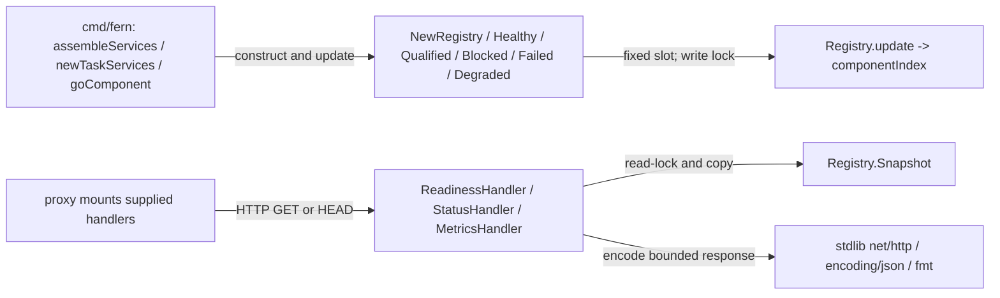

# observability

See the [Go package map](../../docs/go-packages.md) and [maintenance review](../../docs/go-review.md).

`observability` provides bounded in-process readiness state
and HTTP probe/metrics handlers. Current production imports come from
`cmd/fern`, which creates the registry, updates service states, and mounts the
handlers through `proxy`.

## Dependencies and representative paths

No third-party Go dependency or telemetry backend is required. State lives in
memory and is lost on restart; this is service health, not the durable run ledger.

## Readiness semantics

The three compile-time slots are `github-task-dependency`,
`background-run-profile`, and `background-run-serial`. There are no obsolete
host publication or verification slots. A new registry marks all slots disabled
and ready. Startup then marks required dependencies blocked or qualified.

Only `blocked` and `failed` make a component unready; `degraded` remains ready.
Updates to degraded/blocked/failed increment both consecutive and total failure
counters. Healthy/qualified updates reset consecutive failures. Transitions,
not repeated identical updates, change `LastTransition`.

Unknown components are rejected with `false`. Raw errors passed to status methods
are deliberately ignored; only fixed details are exported, preventing secret
leakage and unbounded labels. `Snapshot` returns a copy in fixed component order
under an `RWMutex`; callers cannot mutate the registry through the returned slice.

Handlers accept GET/HEAD only. Liveness is always true while the handler serves;
readiness returns 503 when any slot is unready. Status returns the full snapshot,
and metrics emit fixed-label OpenMetrics text. All set `Cache-Control: no-store`.

## Naming and performance review

`Registry` and `Snapshot` fit their role. `Qualified` means ready profile
qualification, not generic health.

Snapshot work is bounded by three components, with one copied-slice allocation.
The readiness handler currently copies the full snapshot to read one boolean.
A dedicated readiness accessor could avoid that allocation, but should only be
introduced if probe load warrants it; preserve coherent state and encapsulation.

`BenchmarkRegistrySnapshot` covers ready/blocked snapshots and concurrent readers,
excluding registry setup from timing. See the [central performance report](../../docs/performance.md)
for commands and results. It does not measure HTTP serving or an external metrics collector. Run
correctness tests with `go test ./internal/observability`.
