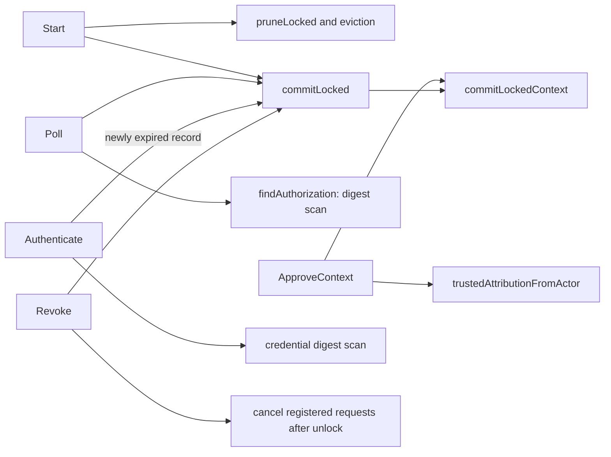
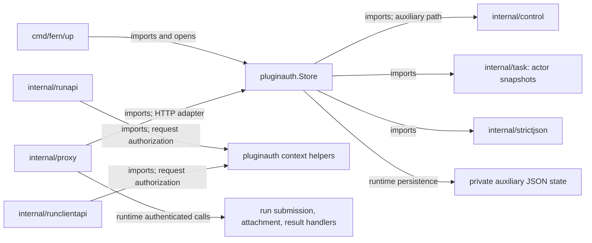

# pluginauth

See the [Go package map](../../docs/go-packages.md) and [maintenance review](../../docs/go-review.md).

`pluginauth` owns the fixed-scope OpenCode plugin device-authorization protocol
and durable grants. It does not implement HTTP routing or GitHub authentication.

## Authority model

The scope set is closed: `run:create`, `run:read`, `run:stop`, `run:attach`, and
`run:result`. `Scopes` returns a copy, not the package's backing array.
The plugin bearer is independent from paired-browser cookies and the operator
control password. Approval requires a valid device or operator actor snapshot.

`Start` creates independent device/user codes and an authorization ID. Only
domain-separated SHA-256 digests are persisted. On approval, `Poll` projects a
credential ID and expiry; the HTTP adapter returns the original device code as
the bearer. No new bearer is minted at poll time.

## Representative internal calls

The graph omits some validation/rollback branches. Authentication and request
registration are separate calls; the latter is the revocation admission fence.

## Imports, callers, and architecture

Other imports are standard-library crypto, context, filesystem, synchronization,
JSON, sorting, and time. The request-context helpers do not authenticate by
themselves: only trusted middleware should install them after bearer validation.
Run compute receives separate repository-scoped short-lived GitHub credentials
from the host provider; plugin grants do not contain the App private key.

## Lifecycle and bounds

| State/operation | Limit |
| --- | --- |
| Persisted state version | 1, separate from control schema 2 |
| State file | 256 KiB |
| Authorizations | 64 |
| Credentials | 32 |
| Invalid poll history | 64 entries in a 5-minute window |
| Authorization lifetime | 10 minutes |
| Credential lifetime | 90 days |
| Start / poll intervals | 1 second / 5 seconds |
| Terminal retention | 24 hours, best effort under capacity |

Pending and active authority are not evicted just to admit another request.
Terminal records are oldest-first eviction candidates. `Pending` projects
expiry without changing state. `Authenticate` persists a newly observed expired
credential, while a successful unexpired match does not write.

## Persistence and cancellation

`Open` derives an auxiliary path from `control.Store`, reads with `O_NOFOLLOW`,
and requires a private singly linked regular file. It enforces JSON duplicate
and depth checks, unknown-field rejection, and cross-record state invariants.
Missing state starts empty in memory.

Mutations clone state, validate it, encode full JSON, and write/sync a private
temporary file before rename and directory sync. These operations hold the
store mutex. Before rename, errors restore the previous snapshot. After rename,
directory-sync failure retains the new in-memory state and reports uncertainty.

`ApproveContext` and `DenyContext` check cancellation before committing and just
before rename; they cannot promise rollback after replacement. `RegisterRequest`
checks active state and expiry under the mutex and returns idempotent cleanup.
`Revoke` durably transitions first, then cancels registered contexts outside the
mutex. The HTTP layer also supplies expiry deadlines.

## Naming review

- `Poll` is a durable protocol operation, not a read: even valid pending polls
  update timing, and canonical unknown codes can record limiter state.
- `Authenticate` can persist expiration; callers must handle its error result.
- `Credentials` may expire and persist records before sorting them. A list-like
  name must not lead callers to assume the method is free of I/O.
- `WithRequestAuthorization` trusts its caller; it is not a bearer verifier.
- `AttributionFromActor` validates snapshot shape, while the private
  `trustedAttributionFromActor` additionally restricts approval actor types.
- `HasScope` answers against a fixed global set, not credential-specific grants.

## Performance: static observations

Authentication scans up to the credential cap using constant-time digest
comparisons; the full operation is not constant-time because it returns on a
match and has state-dependent branches. Poll scans authorizations and clones
state before several rejection paths. Commits encode and sync under one mutex,
so frequent polling or expiry writes can delay cached authentication.

Active request maps have no explicit per-credential concurrency cap. Their size
depends on HTTP admission and prompt cleanup, not just the persisted grant cap.
The mutex provides in-process safety, not multi-process writer coordination.

Package performance is unmeasured. The `internal/control` benchmark in the
[central performance report](../../docs/performance.md) isolates fresh-LastSeen device authentication;
it is not a measurement of this package's digest scan, polling, or fsync costs.
