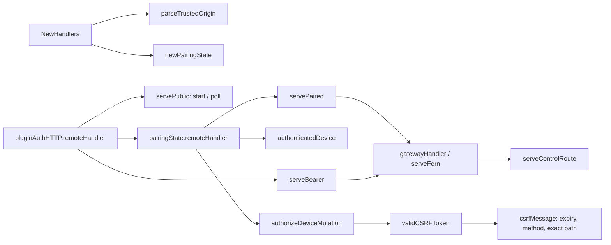
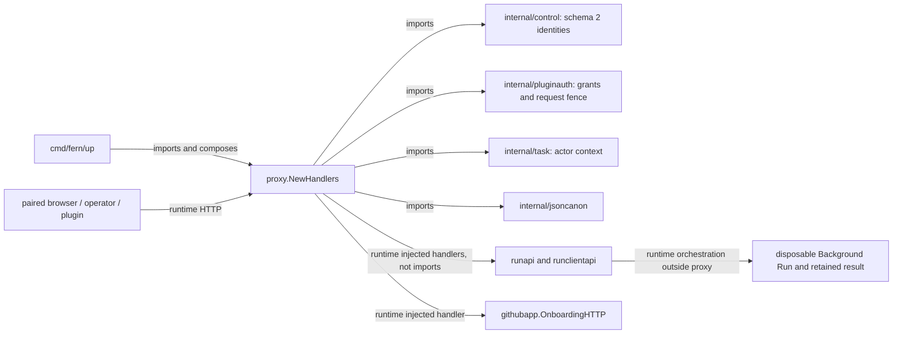

# proxy

See the [Go package map](../../docs/go-packages.md) and [maintenance review](../../docs/go-review.md).

`proxy` assembles Fern's remote and loopback operator HTTP control surfaces.
Despite the package name, neither surface reverse-proxies a persistent OpenCode
runtime. Live Background Run attachment is owned by the separate route/runtime
packages, and run handlers are injected into this gateway.

## Surfaces and ownership

`NewHandlers` returns `Handlers.Remote` and `Handlers.Operator`; it does not bind
listeners. `cmd/fern/up` supplies origins, durable stores, and handlers.

- Remote browser requests use durable pairing cookies, with CSRF protection
  for mutations and actor/request attribution for admitted work.
- Plugin bearer requests use `pluginauth`, with a fixed scope set, expiry
  deadlines, revocation registration, and route restrictions.
- The operator surface accepts explicit Basic credentials for user `fern`,
  rejects plugin bearer attempts, and strips incoming authentication/cookies
  before dispatch to authenticated downstream handlers.
- Operator liveness/readiness probes are dispatched before Basic auth.

## Representative internal calls

The diagram shows representative request flow rather than all wrappers.
`mintCSRFToken` and `validCSRFToken` bind directly to the exact supplied path;
there is no retired task-cancel path normalization helper.

## Imports, callers, and larger architecture

Other imports are standard-library HTTP/templates, cryptography, JSON,
filesystem, synchronization, and time. No GitHub App key or repository token is
managed here. The host signer retains its private key; `taskenvdocker` delivers
short-lived repository-scoped installation credentials to run compute.

## Dispatch contract

`Controls.Runs` handles `/fern/api/runs` and descendants.
`Controls.RunClients` handles `/fern/api/v1/runs` and descendants.
There is no standalone result/publication API handler in `Controls`.
Retained-result access belongs to the current run handlers.

`serveControlRoute` also serves device listing/revocation and injected status
and metrics handlers. Selected retired workflow/publication control paths
return 410; this is a retirement response, not an active publication subsystem.
Escaped control paths are rejected where exact-path checks apply.

The remote gateway is constructed without the operator status/metrics handlers.
Browser route allowlists further restrict paired authority; plugin routes are
separately admitted by `serveBearer`. Onboarding callback and pairing endpoints
have narrowly scoped unauthenticated dispatch exceptions.

## Browser security and persistence

- Pairing codes live for 5 minutes, with at most 64 outstanding codes.
- Durable device credentials live for 30 days; the production remote HTTPS
  cookie is `__Host-fern_device`.
- CSRF tokens live for 10 minutes and bind credential, method, expiry, and path.
- Pairing issue/success intervals are 1 second; the global failure window is
  5 minutes, with 32 failures and 5 attempts per pairing code.
- Pairing auxiliary JSON is capped at 64 KiB and is owned by this package,
  separately from control schema 2 and plugin authorization state.
- Plugin authorization request bodies are capped at 4 KiB and checked with
  duplicate/depth validation plus strict JSON decoding.

`sameOrigin` rejects non-same-origin Fetch Metadata when present and compares a
present Origin with the configured trusted origin. Missing Origin is accepted
when other checks allow it; this is not a requirement that every request supply
an Origin header. Device mutations still require their CSRF token.

`trustedOriginHandler` installs configured origin metadata in context. It does
not itself validate every incoming Host header or perform TLS termination.
Deployment/listener composition remains part of the trust boundary.

Device revocation persists through `control.RevokeDevice` before the helper
invokes `CancelDeviceRequests`. Plugin authentication similarly registers a
request before dispatch and cleans it up afterward. Cancellation is cooperative,
not proof that a downstream side effect has been undone.

## Naming review

- `proxy` and `gatewayHandler` should not be described as forwarding OpenCode;
  the current implementation is a control-plane HTTP gateway.
- `Controls.RunClients` is the versioned run-client handler, not a removed
  standalone result API. Its missing-dependency error names
  plugin and terminal run handlers.
- `sameOrigin` is a browser policy predicate, not full request authentication.
- `trustedOriginHandler` attaches trusted configuration rather than validating
  request origin by itself; a name such as `withTrustedOrigin` would be clearer.
- `writeUnavailable` accurately exposes only a dependency-scope error family.

## Performance: static observations

Fresh paired authentication avoids control-file writes; hourly LastSeen updates
and expiration can introduce sync latency. Pairing and plugin poll/approval
paths can write auxiliary state under their own locks. These are distinct from
the inexpensive route and header checks on ordinary requests.

`serveFern` constructs a small plugin HTTP adapter for trusted dispatch, and
`writeJSONStatus` buffers output before committing the status. Neither is a
demonstrated bottleneck. Templates are parsed once at package initialization.
Active request registrations need prompt cleanup, especially for long-lived
attachment requests; durable credential caps do not bound active request count.

Proxy throughput is unmeasured. The `internal/control` cached-auth benchmark
described in the [central performance report](../../docs/performance.md) isolates only the device-store portion,
not HTTP middleware, TLS, CSRF, templates, routing, or downstream run work.
