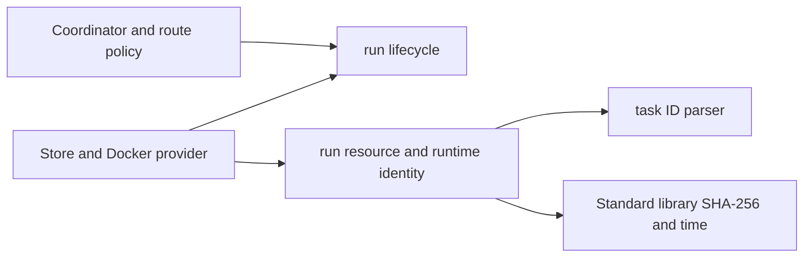
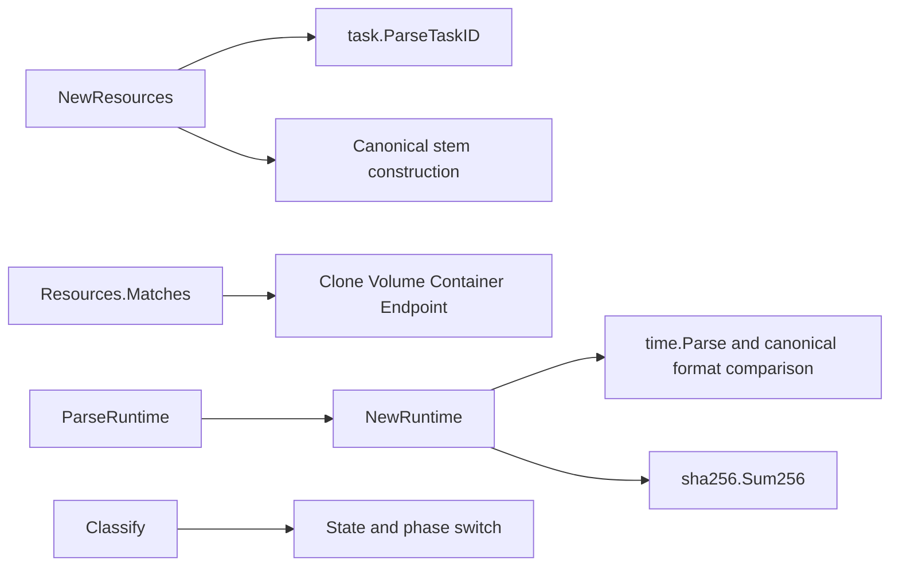

# run

See the [Go package map](../../docs/go-packages.md) and [maintenance review](../../docs/go-review.md).

`run` is the storage-independent owner of background execution vocabulary,
lifecycle classification, resource names, and exact process identity. It exists
so Docker providers, route fencing, orchestration, and storage use one policy
without introducing a dependency on the coordinator or SQLite.

## Domain boundary

`State` answers what a run is doing. `Phase` identifies its durable effect
boundary. `Classify` accepts a pair and returns policy; it neither transitions
the pair nor authorizes external I/O by itself. Claims, revisions, evidence,
and persistence belong to callers.

The current execution contract is resource spec **10**, with source profile
`source-39fb919a054190498f6d5b7985bde231f93ad7a6`. Recognizing an older provider
resource is not permission to start it under the current contract. The durable
store is schema 4. Workspace GitHub authority is App broker only; neither
credentials nor publication are owned here. Retained result integrity is not
a verification-job subsystem and does not certify agent pushes.

## Architecture and dependencies

The only internal import is `task`; there are no third-party imports or I/O
clients. Production callers include `backgroundopencode`, `backgroundroute`,
`backgroundruncoord`, `runapi`, `runcommand`, `taskartifact`, `taskenvdocker`,
and `taskstore`, plus the background-run integration programs.

## Entrypoints

| API | Contract |
| --- | --- |
| `Classify(state, phase)` | Validity, execution deadline/config enforcement, timeout eligibility, cleanup-step flag |
| `NewResources(taskID, generation)` | Validate ID and positive generation; derive the canonical namespace |
| `Resources.Clone`, `Volume`, `Container`, `Endpoint` | Return deterministic resource identity strings |
| `Resources.Matches` | Compare the complete supplied namespace, rejecting the zero value |
| `NewRuntime(containerID, startedAt)` | Construct identity from an exact canonical RFC3339Nano timestamp |
| `ParseRuntime(containerID, startedAt, token)` | Recompute and compare the boundary token |

Resources use the task UUID without hyphens and a generation suffix. Names do
not identify a particular restarted process: `Runtime` does. Its SHA-256 token
hashes container ID, a NUL separator, and the original timestamp bytes. Timestamp
offset/precision normalization would change persisted identity and is rejected
when it changes canonical spelling. `Epoch` is Unix nanoseconds, not a database
revision or a claim-generation counter.

## Lifecycle policy

Queued/absent and provisioning/session/prompt phases enforce the attempt deadline
and execution configuration. A queued run is not timeout-eligible yet. Invalid
pairs return no authority flags.

Recovery, seal/export, and cleanup can outlive the attempt deadline and changed
execution configuration. `CleanupStep` identifies retryable destructive cleanup
phases, not all post-execution phases: sealing, exporting, artifact commitment,
and cleanup completion are distinct. `ResultReady` is not synonymous with
cleanup complete. Parent task/attempt projection remains a store responsibility.

## Representative internal callgraph

Selected calls and policy paths only; this is not exhaustive.

## Errors, lifetime, and review

Constructors return errors rather than granting authority to malformed input.
Zero `Resources` accessors return empty strings and `Matches` is false; zero
`Runtime` is invalid. Neither type owns resources, starts goroutines, or needs
closing. Their unexported fields keep successful construction meaningful.

Naming findings: `Resources.Clone` is a name getter, not a cloning operation;
`CloneIdentity` would be less ambiguous if a future narrow API change is needed.
`Runtime.Epoch` uses Unix-nanosecond units. `Classify` advertises a policy
query rather than a transition engine; keep that distinction.

Performance is bounded string formatting/parsing and a short SHA-256 input.
Avoid caching identities across runtime restarts merely to save hashing. Enum
microbenchmarks would measure compiler simplification, not useful run latency;
the real SQLite claim/read benchmarks in `taskstore` are more representative.
