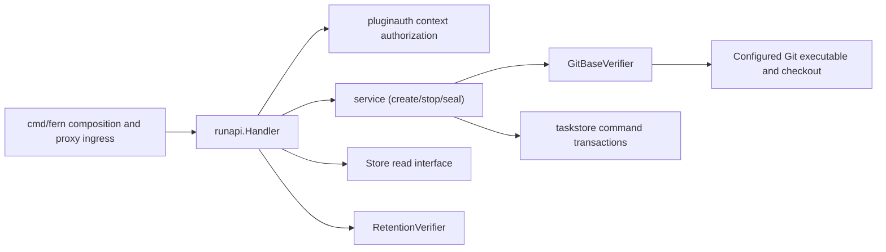
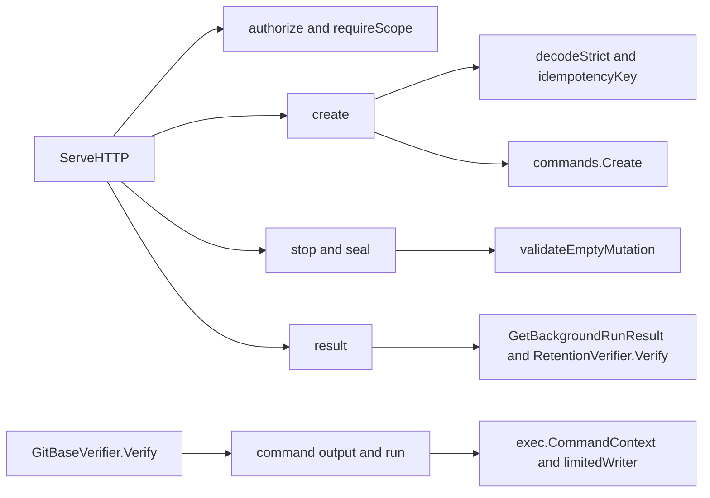

# runapi

See the [Go package map](../../docs/go-packages.md) and [maintenance review](../../docs/go-review.md).

`runapi` is the plugin-authenticated Background Run HTTP boundary at
`/fern/api/runs`. It owns routing, scope checks, strict wire DTOs, response/error
projection, the committed create/stop/seal commands, and the configured-checkout
Git base verifier. Durable SQL authority lives in `taskstore`.

The package is split by file: `runapi.go` is the HTTP boundary, `service.go` holds
the transport-independent commands (intent validation, private request hashing,
idempotent replay, admission, post-commit wake), and `gitverifier.go` holds
`GitBaseVerifier`. The HTTP layer converts wire DTOs into a private
`createIntent` so transport changes cannot silently change idempotency identity.

## Why this package exists

Plugin submission must not share the terminal-client discovery/attachment
surface. This package accepts only authenticated OpenCode plugin actors, binds
their identity to ingress credential authorization, and checks operation scopes.
`runclientapi` separately supports trusted operator/device discovery and attachment.
Neither handler is an alternative authentication middleware.

The current system uses schema 3, resource spec 10, and GitHub App broker
workspace authority only. The qualified source profile is
`source-39fb919a054190498f6d5b7985bde231f93ad7a6`; the API contract is
`fern.background-run.v1`. There is no publication or verification-job subsystem.
Retained-result integrity reports reconstructability, not tests passing or
approval of separate agent Git pushes/PRs.

## Architecture and dependencies

`cmd/fern` is the direct production importer and wires the handler into ingress.
Direct internal imports are `gitref`, `strictjson`, `pluginauth`, `run`, `task`,
and `taskstore`. Other imports are standard library. Git is an external
executable dependency of the optional concrete verifier, not a Go library.

## Entrypoints and routing

`New(Config)` checks dependencies, workspace/repository identity, canonical
GitHub HTTPS remote (`gitref.ValidateGitHubRemote`), timeout/model selection,
environment digest, seal policy, and paired qualified profile/image
availability. The command service shares the same validated `Config`; there is
no second configuration to keep in sync.

| Method and suffix | Scope | Operation |
| --- | --- | --- |
| `POST /fern/api/runs` | `run:create` | Strict create intent and durable acceptance |
| `GET /fern/api/runs` | `run:read` | Owned list, maximum 100 runs |
| `GET /fern/api/runs/{id}` | `run:read` | Owned run projection |
| `POST /fern/api/runs/{id}/stop` | `run:stop` | Durable stop acceptance |
| `POST /fern/api/runs/{id}/seal` | `run:result` | User-authorized retained seal acceptance |
| `GET /fern/api/runs/{id}/result` | `run:result` | Retained result and integrity/cleanup projection |

Escaped-path aliases are rejected. Actor ID and credential ID must match the
ingress authorization, with `fern_plugin_bearer` authentication. Store ownership
filtering is still required; a scope does not grant access to another plugin's
runs. Responses use no-store and nosniff headers.

Create requires exactly `application/json`, one valid `Idempotency-Key`, no query,
and at most 32 KiB. `strictjson.Check` checks JSON structure before decoding with
unknown fields disallowed. Stop/seal require a bounded empty JSON object, not an
absent body. Instruction/branch semantic validation belongs to the command
service.

## Typed projection and result integrity

Private HTTP DTOs have explicit JSON fields. They are converted into application
intent rather than reused as a hash schema. The command service preserves the
v1 typed payload encoding, field order, escaping, and null branch for SHA-256
identity: the digest is SHA-256 of command kind, newline, then those marshaled
bytes, and stop/seal hash a private `run_id` struct. Do not replace this
encoding with raw JSON hashing, map serialization, or another canonicalizer.
The store fences actual acceptance transactionally; HTTP replay sets
`Idempotency-Replayed: true` and returns 202 without duplicating work.

Run views omit prompt, internal evidence, runtime credentials, and host paths.
Result views expose exact commit/tree/base, outcome, manifest count/digests,
artifact bundle digest/size, retention booleans, and cleanup completeness.
`artifact.sha256` currently projects the artifact manifest digest; the bundle's
digest is separately `bundle_sha256`. These are not interchangeable hashes.

The result endpoint first requires result-ready authority and a linked store
projection. Export recovery is reported as 503; ordinary not-ready is 409.
The retention verifier is called on each ready-result read. A verifier error
produces 200 with both retention booleans false, not a claim that the retained
bytes were verified. Cleanup may still be incomplete while the result is ready.

## Commands

`Create` checks the exact repository/profile, the instruction (valid UTF-8, at
most `taskstore.MaxPromptBytes` bytes and `taskstore.MaxPromptRunes` runes, not
blank, no control characters other than newline and tab), the display branch,
and the exact lowercase base OID. It checks replay before current profile
availability, base verification, ID generation, or the clock, so a valid
previous acceptance can replay while execution is unavailable. First use
verifies the base, allocates all admission IDs, derives generation-1 resource
names, and calls `AdmitBackgroundRun`.

`Stop` hashes the run ID and looks up a prior receipt. Replay returns the
original committed acceptance state, not today's run state, after checking
target and stop-receipt linkage. `Seal` reads the owned run and parent
revisions, allocates seal/export/result IDs, and relies on store admission for
replay classification; expected revisions fence stale reads.

Claims include workspace, command kind, key, hash, and actor. Authority
mismatch takes precedence over hash conflict and is hidden as not-found. `Wake`
is synchronous, optional, and invoked only after a successful non-replayed
commit.

## Representative internal callgraph

Selected paths only; not an exhaustive callgraph.

## Git verifier, errors, and lifetime

`NewGitBaseVerifier` requires clean absolute paths to an existing checkout and
executable, plus a positive timeout no greater than one minute. `Verify` proves
the exact object is a commit and an ancestor of HEAD or an origin tracking ref.
It does not fetch, mutate refs, or treat a branch display name as authority.
Commands disable replacement objects, lazy fetch, global/system Git config,
interactive prompts, and optional locks; output buffers are capped at 64 KiB.
The parent context plus verifier timeout bounds the subprocess work.

`WriteJSON` and `WriteError` are exported so `runclientapi` encodes responses
and the `{"error":{"code","message"}}` envelope identically.

HTTP errors distinguish bad intent/JSON/key, unauthenticated/forbidden,
not-found, conflicts, unavailable profile, unreachable base, and unexpected
internal failure. Raw SQL/Git errors are not exposed. The handler starts no
background worker and does not own the store/verifier lifetime. Wake belongs to
the command service's post-commit path, not response encoding.

## Naming and performance review

`writeStoreError` also maps command errors, so `writeCommandError` or
`writeOperationError` would be more accurate in a future narrow cleanup.
`view` is a run projection; `projectRun` would improve searchability. `noBody`
checks body presence/content length rather than reading to EOF, unlike
`runclientapi.emptyBody`; this is a concrete validation difference, not a reason
to silently unify the functions during a naming review. `limitedWriter` consumes
all input while retaining a prefix; it does not report overflow to Git.

Performance review: Git base verification launches multiple processes and may
walk every allowed origin ref. Result reads include retention verification;
listing scans full durable run rows before producing a small DTO. Measure those
paths before optimizing JSON encoding or adding caching that could weaken fresh
integrity checks. The `taskstore` benchmarks isolate SQL costs, not full HTTP,
subprocess, or retention-check latency. No timings are asserted here.
