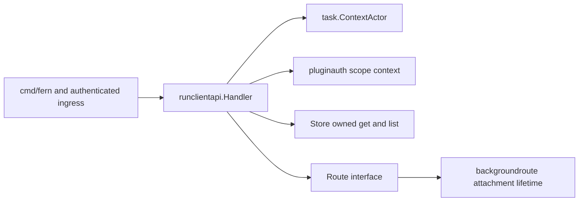
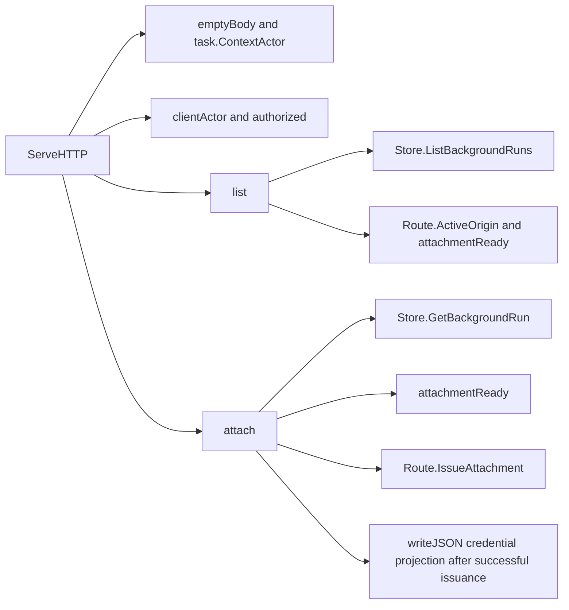

# runclientapi

See the [Go package map](../../docs/go-packages.md) and [maintenance review](../../docs/go-review.md).

`runclientapi` exposes terminal-client run discovery and attachment at
`/fern/api/v1/runs`. It exists separately from plugin-only `runapi` submission:
trusted operator/device clients need workspace-wide discovery and short-lived
attachment credentials without being permitted to create, stop, or seal runs
through this handler.

## Boundary and current system

Only GET list and GET attachment are supported. The handler reads durable run
state and consults `backgroundroute` through a narrow `Route` interface. It does
not provision a runtime, proxy the attached session itself, or decide a run's
durable transitions. Ingress must authenticate and install `task.ActorSnapshot`
before invoking it.

Current durable state is schema 3 with resource spec 10 execution and App-broker
GitHub authority only. These versions/policies belong to storage and composition,
not this transport. No publication or verification-job subsystem is exposed.
Attachment to an agent that can push Git work is separate from retained-result
sealing and subsequent integrity checks.

## Architecture and dependencies

The direct production importer is `cmd/fern`, which composes handler, store,
route manager, and ingress. Internal imports are `backgroundroute`, `pluginauth`,
`task`, and `taskstore`; all other imports are standard library. There is no
third-party HTTP client or direct network request in this package.

## Entrypoints and authorization

`New(Config)` requires a valid workspace ID and non-nil store/route dependencies.
It does not create them and has no `Close` operation.

`ServeHTTP` rejects escaped-path aliases, non-GET methods, query parameters, and
nonempty bodies as 404. `emptyBody` checks an actual one-byte read for EOF, so an
unknown content length is not treated as proof of an empty body. `ContextActor`
returns only a structurally valid ingress-installed actor.

| Path | Plugin scope | Response |
| --- | --- | --- |
| `/fern/api/v1/runs` | `run:read` | Up to 100 owned run projections |
| `/fern/api/v1/runs/{id}/attach` | `run:attach` | Short-lived route credentials and OpenCode session ID |

Operator/device actors pass the scope helper because their trust was established
by ingress. OpenCode actors must match both credential ID fields, bearer
authentication method, and requested scope in plugin authorization context.
Other actor types are rejected. Store reads preserve plugin ownership hiding;
trusted operator/device reads are workspace-wide.

## Attachment readiness and DTOs

List projections contain typed run ID, state, repository, base head, nullable
branch, and `attachable`. The flag requires both `Route.ActiveOrigin` and the
durable readiness predicate. That list result is advisory, not a reservation:
the runtime/route may change before a later attachment request.

Attachment requires an active state (`setting_up`, `working`, `needs_you`, or
`uncertain`), session/prompt phase, non-nil session observation, and zero cancel
epoch. `IssueAttachment` then checks/issues through the route manager; durable
readiness alone cannot mint access. Failure to issue is 409 not-ready, while an
issuance error is 503 unavailable.

The private attachment DTO returns URL, session ID, username, password, and
expiry. These are credentials: responses carry no-store and nosniff headers.
This package does not retain, log, refresh, or revoke them; route-manager policy
owns expiry and runtime fencing. It does not serialize the full store row,
prompt, host paths, evidence, or unrelated runtime authority.

Typed DTOs prevent accidental whole-record exposure, but string-backed IDs still
need parsing at ingress. This read-only boundary has no command hash or
idempotency protocol; those guarantees belong to `runcommand` and `taskstore`.

## Representative internal callgraph

Selected calls only; not an exhaustive callgraph.

## Errors, lifetime, and review

Missing/foreign runs are 404, invalid authentication is 401, and plugin scope
failure is 403. Unexpected store failures become a generic 500 without leaking
SQL details. Request context propagates to store reads; route interface methods
are synchronous and do not accept a context. The handler owns no workers or
leases. Composition must keep the store and route manager alive for requests.

Naming findings: `authorized` is a scope policy check for an already-authenticated
actor, not authentication; `authorizeClientScope` would make that distinction
clearer. `attachmentReady` checks only durable eligibility, not route availability;
`durableAttachmentReady` would prevent overreading its result. `emptyBody` consumes
a byte when a body exists, so it is not a metadata-only predicate.

Performance review: listing is bounded at 100 but performs a route lookup per
row after a full store scan. Attachment adds a scoped read and credential
issuance. Avoid caching attachability across stop/runtime changes. SQL benchmarks
in `taskstore` measure owned get/list costs, not attachment issuance or end-to-end
HTTP latency; constant state checks would not be meaningful latency benchmarks.
