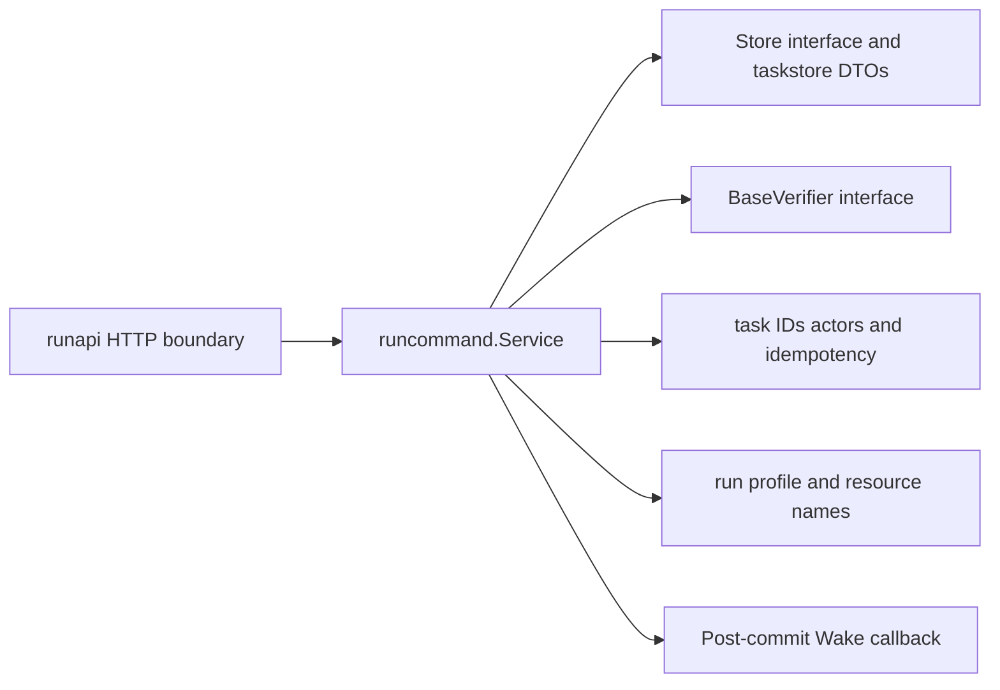
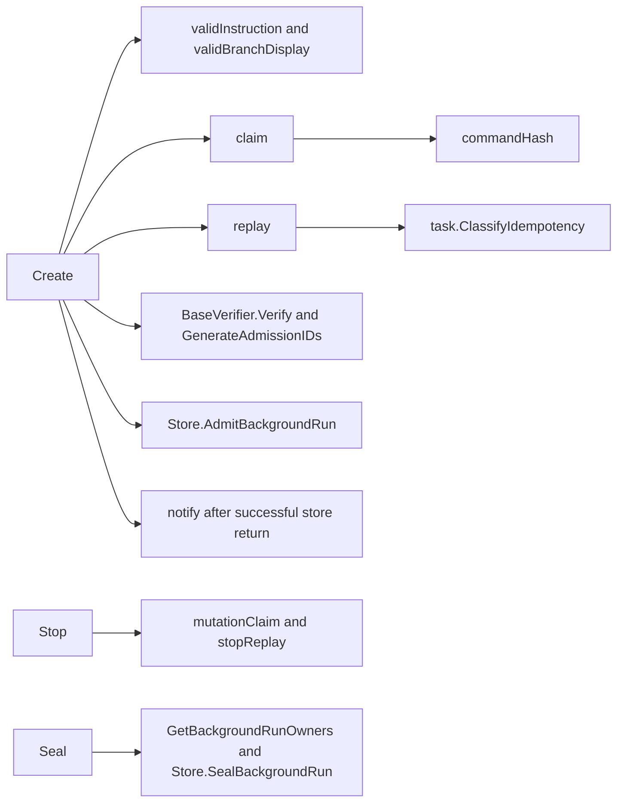

# runcommand

See the [Go package map](../../docs/go-packages.md) and [maintenance review](../../docs/go-review.md).

`runcommand` owns committed background-run application commands: `Create`,
`Stop`, and `Seal`. It separates intent validation, private request-hash encoding,
durable admission, and post-commit notification from authentication and HTTP.
This keeps transport DTO changes from silently changing idempotency identity.

## Boundary and current contract

The service accepts an already-authenticated actor and an idempotency key. It
requires an OpenCode actor, but does not authenticate bearer credentials or check
HTTP scopes. Its current production caller is `internal/runapi`, which performs
those ingress checks. The service does not provision containers or publish work.

Commands use API contract `fern.background-run.v1`, source profile
`source-39fb919a054190498f6d5b7985bde231f93ad7a6`, and `run` resource naming.
Current resource spec is 10; `taskstore` persists schema 3 and App-broker-only
workspace bindings. The service does not configure a second GitHub authority.
There is no publication or verification-job subsystem: retained-result sealing
is independent of agent Git pushes and their remote effects.

## Architecture and dependencies

Direct internal imports are `run`, `task`, and `taskstore`; other imports are
standard library. The service depends on the narrow `Store` method set, not
SQLite internals. `BaseVerifier` is injected; `runapi.GitBaseVerifier` implements
the repository reachability proof. Neither interface creates a new framework.

## Entrypoints and intent assembly

`New(Config)` captures dependencies and command policy. It checks the required
store/generator/verifier/clock, workspace ID, and bound remote. Full deployment
qualification, timeouts, image identity, and model configuration remain the
composition root/HTTP constructor's responsibility.

`Create` checks the exact repository/profile, bounded valid UTF-8 instruction,
display branch, and exact lowercase base OID. It checks replay before current
profile availability, base verification, ID generation, or the clock. A valid
previous acceptance can therefore replay when execution is currently unavailable.
First use verifies the base, allocates all admission IDs, derives generation-1
resource names, hashes instruction/profile, and supplies immutable image and
environment identity to `AdmitBackgroundRun`.

`Stop` hashes the run ID and looks up a prior receipt. Replay returns the original
committed acceptance state, not today's run state, after checking target and stop
receipt linkage. First use allocates receipt/event IDs and lets the store decide
queued failure versus active cancellation under a transaction.

`Seal` reads the owned run and parent revisions, allocates all seal/export/result
IDs, and submits the tuple to the store. Unlike create/stop it relies on store
admission for replay classification. Concurrent reads can become stale; expected
revisions fence the mutation. Acceptance means the request is durable, not that
the retained result or cleanup is already complete.

## Hash and DTO guarantees

`CreateInput` is application intent, not the wire/hash schema. A private typed
struct preserves v1 JSON field order, escaping, and a null branch; the digest is
SHA-256 of command kind, newline, then those marshaled bytes. Stop/seal use a
private `run_id` struct. Instruction whitespace is preserved. Do not replace
this encoding with raw JSON hashing, map serialization, or another canonicalizer.

Claims include workspace, command kind, key, hash, and actor. Authority mismatch
takes precedence over hash conflict and is hidden as not-found on the service
preflight path. The transaction still classifies races; preflight is not a lock.
Typed acceptance structs separate command results from HTTP projection fields.

## Representative internal callgraph

Selected paths only; not an exhaustive callgraph.

## Errors, lifetime, and review

Invalid intent/base, unavailable profile/base, and replay conflict have explicit
sentinels. Store, generator, and clock failures propagate without waking workers.
`Wake` is synchronous, optional, and invoked only after a successful non-replayed
commit. It should be a cheap notification, not the external execution itself.
The service starts no goroutines and owns no closable dependencies. The caller
keeps its store/verifier alive and handles request cancellation; seal storage
deliberately detaches cancellation after validation.

Naming findings: private `claim` constructs an idempotency claim, not an execution
lease; `idempotencyClaim` would clarify that distinction. `commandHash` accepts
`any` and ignores marshal errors, though all current call sites use supported
private typed payloads. Keep that closed set or make failures explicit if it
expands. `notify` is a post-commit wake, not event publication.

Performance review: replay avoids Git and ID allocation for create/stop; seal
still allocates IDs and reads parents on retries. Real base verification can
dominate fresh-create latency; JSON hashing alone is not admission latency.
Use `taskstore`'s real SQLite admission/claim/read benchmarks for persistence
cost. No constant-only enum benchmark or unmeasured timing claim is supplied.
