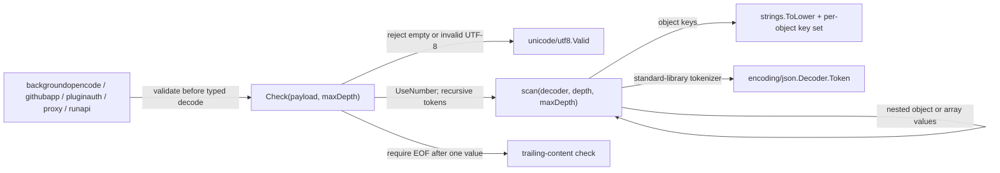

# strictjson

See the [Go package map](../../docs/go-packages.md) and [maintenance review](../../docs/go-review.md).

`strictjson` is Fern's strict JSON **validator**, not a canonical serializer or
digest implementation. It rejects ambiguous input before a caller decodes it
into security-sensitive application types. The package imports only Go's
standard library; it performs no I/O beyond reading the supplied bytes.

## Place in the system

Direct callers are `backgroundopencode`, `githubapp`, `pluginauth`, `proxy`, and
`runapi`. These boundaries retain responsibility for input-size limits, schema
validation, typed decoding, and mapping errors to their own public contracts.
Successful checking does not imply that a payload satisfies an application schema.

## Contract and representative path

`Check` first validates encoding, constructs a decoder with `UseNumber`, and
calls `scan` at depth zero. Objects allocate a fresh key set; lowercased keys
must be unique within that object. Arrays recurse without a key set. Closing
delimiters are checked explicitly, followed by an EOF check at the root.

- Case-insensitive duplicate rejection is intentionally stricter than JSON.
- Numbers are not converted to floating point during this validation pass.
- The depth check is `depth > maxDepth`, applied on entry to every value scan;
  callers should not assume a container-only depth count.
- Leading/trailing whitespace is allowed; multiple root values are not.
- Raw scanner errors and locally created structural errors may be returned.
  Error text is not a replacement for callers' stable API error mapping.

## Naming review

`Check` signals validation. The package was renamed from `jsoncanon` to
`strictjson` to avoid suggesting canonical output or hashing. There is no digest
operation or compatibility wrapper for the old internal import path.

## Performance review and tests

Work scales with input tokens and key lengths; live key-set memory scales with
the objects currently being scanned. Token decoding and lowercase-key creation
are plausible allocation contributors. The subsequent caller decode is another
pass, deliberately preserving a common ambiguity check. Removing it or weakening
duplicate detection requires security review, not just a throughput comparison.

`BenchmarkCheck` covers a small run-like request, a larger history-like array,
and late duplicate-key rejection. Fixtures are built outside timing; valid cases
report bytes processed and all cases report allocations. See the
[central performance report](../../docs/performance.md) for commands and results.
They measure local scanning, not HTTP, GitHub, OpenCode, or other external dependencies.

Run correctness tests with `go test ./internal/strictjson` from the repository root.
