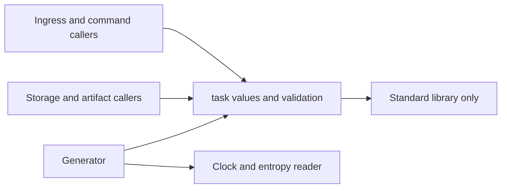
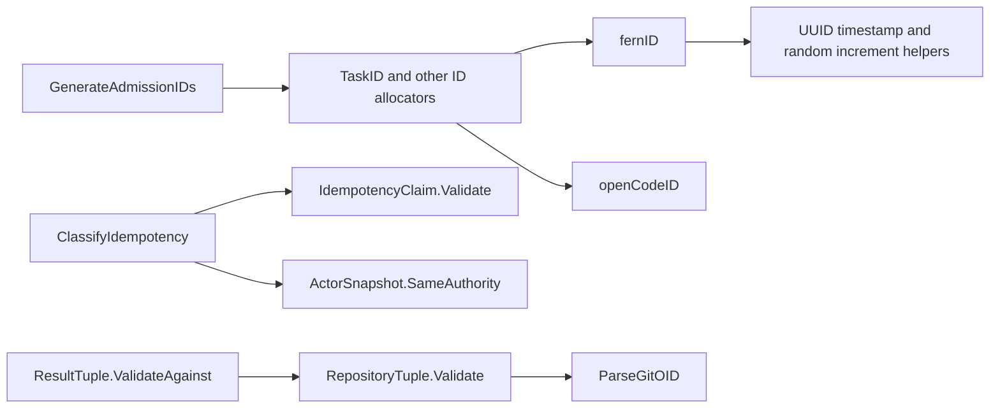

# task

See the [Go package map](../../docs/go-packages.md) and [maintenance review](../../docs/go-review.md).

`task` supplies shared durable-task value types, validation, actor attribution,
idempotency comparison, and ID generation. Keeping these contracts independent
of SQLite and HTTP lets ingress, commands, storage, and artifact code agree on
identities without depending on each other's implementation.

## Boundary and current model

- Fern entity IDs are typed, prefixed lowercase UUIDv7 strings.
- OpenCode session/message IDs are typed, prefixed 128-bit random hex strings.
- Git object IDs are exact lowercase SHA-1 values, not symbolic refs.
- Repository and installation IDs fit positive SQLite signed integers.
- Task/attempt states describe parent records; `internal/run` owns background
  execution state/phase classification. They are not interchangeable engines.
- Result tuples describe changed work or an explicit no-op against a base.
  They do not prove Git object existence, ancestry, or retained bundle integrity.

The current store is schema 4 and admits resource spec 10 runs. Those versions
are owned by `taskstore` and `run`, not this package. Workspace authority is
GitHub App broker only. Actor types are attribution vocabulary, not alternative
credential-provider configuration. There is no publication or verification-job
subsystem here; retained result integrity is separate from agent Git pushes.

## Architecture and dependencies

Production importers include `cmd/fern`, `pluginauth`, `proxy`, `run`,
`runcommand`, `runapi`, `runclientapi`, `backgroundruncoord`, `taskstore`,
`taskartifact`, `taskenvdocker`, and `taskresultsource`, plus the background-run
Docker/OpenCode integration programs. There are no third-party dependencies.

## Entrypoints and guarantees

| API | Responsibility |
| --- | --- |
| `ParseTaskID` and other `Parse*ID` functions | Validate boundary spelling before constructing typed values |
| `NewSecureGenerator`, `NewGenerator` | Supply secure defaults or injectable entropy/clock |
| `GenerateAdmissionIDs`, `GenerateBackgroundSealIDs` | Allocate complete identity sets before durable admission |
| `ActorSnapshot.Validate`, `SameAuthority` | Check bounded attribution and compare stable authority |
| `WithActor`, `ContextActor` | Carry already-authenticated ingress identity |
| `ClassifyIdempotency` | Distinguish first use, independence, replay, conflict, and owner mismatch |
| `ParseCursorWire`, `Cursor.MarshalJSON` | Handle exclusive event cursors without JSON-number precision loss |
| `ResultTuple.ValidateAgainst` | Check repository/base, clean-worktree, and changed/no-change invariants |

Typed string casts alone do not validate input. Boundary callers must use parsers.
`ContextActor` checks structure, not credentials; only authenticated ingress
should call `WithActor`. Display name and request ID are excluded from authority
equivalence, but credential rotation conservatively changes authority.

Request hashes are fixed 32-byte caller-computed values. This package does not
canonicalize or hash JSON. In particular, `runcommand` preserves the private v1
struct encoding, field order, escaping, and null branch in its command hash;
do not reinterpret that deployed encoding as arbitrary RFC 8785 JSON hashing.
Ownership comparison precedes hash comparison to avoid disclosing another
actor's request equality.

## Representative internal callgraph

These are selected paths, not an exhaustive callgraph.

## Errors, lifetime, and performance review

Validation uses sentinel errors, usually wrapped with field context. ID
generation returns a zero aggregate on partial failure; already-consumed entropy
or UUID positions are not rolled back. A generator mutex serializes entropy
reads and UUID ordering. A stalled/regressing clock increments the UUID random
portion; range exhaustion or entropy failure is explicit.

The generator owns no goroutines or closable resources. Injected readers/clocks
must remain valid for its lifetime. Large instructions and manifests belong in
higher-level packages, not these scalar validators.

Naming review: `Generator.TaskID` and sibling methods allocate rather than read
an ID; their receiver makes the convention reasonable, but callers should not
mistake repeated calls for stable getters. `ContextActor` follows a different
word order from the common `ActorFromContext` idiom. Secure ID generation is
part of this package's contract alongside validation.
Small state-table scans are bounded; replacing them with
new abstractions or benchmarking constant enum expressions would not establish
production latency. Focus performance measurement on admission and reads.
