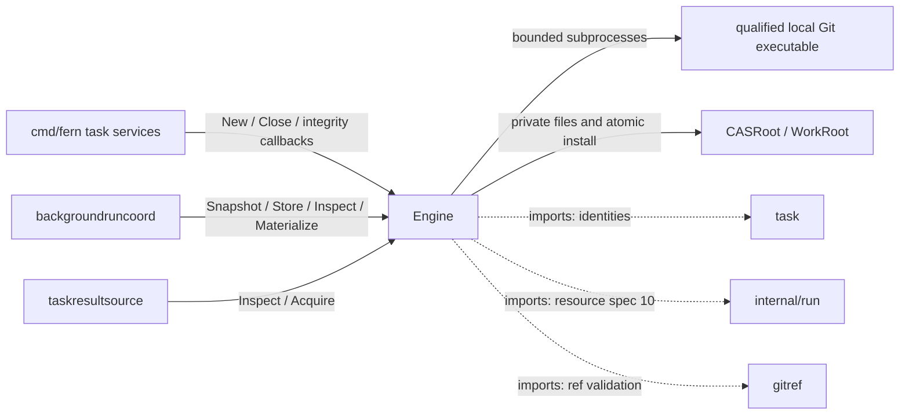
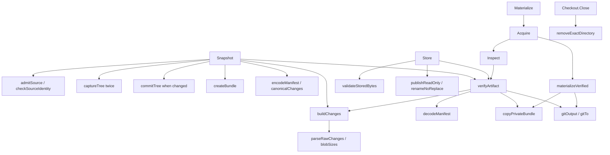

# taskartifact

See the [Go package map](../../docs/go-packages.md) and [maintenance review](../../docs/go-review.md).

Local retained-artifact engine: capture final nonignored Git state, independently
verify it, install immutable content-addressed bytes, and acquire owned checkouts.
It is not a remote artifact service, taskstore transaction manager, or GitHub publisher.

## Place in the architecture



Solid edges are selected runtime calls; dotted edges identify imports.
Diagrams are representative, not exhaustive static callgraph analysis.
Taskstore schema 4 binds retained results to the engine's digest/locator metadata;
this package does not import taskstore or determine durable result ownership.
The provider's writer fence and clone lease precede snapshot capture externally.

## Entrypoints and ownership

| Entry | Contract |
| --- | --- |
| `New` | Validate Git executable and disjoint private roots; reconcile interrupted temporary directories. |
| `NewSource` | Bind an exact absolute repository path to workspace/task/attempt IDs. |
| `Snapshot` | Capture and independently verify a staged artifact bound to the supplied execution/seal tuple. |
| `Store` | Verify stage and atomically install/deduplicate immutable CAS content. |
| `Discard` | Remove the exact owned staged capability. |
| `StagedManifest` | Return staged manifest bytes after integrity checks. |
| `Inspect` | Freshly verify CAS manifest, bundle, and independent Git object graph. |
| `Acquire` | Verify once, then return snapshot plus newly materialized owned checkout. |
| `Materialize` | Delegate to `Acquire`, returning only checkout. |
| `Checkout.Close` | Remove owned checkout using path/marker/device/inode checks. |
| `Engine.Close` | Remove still-live checkouts after users stop; preserve installed CAS. |

`StagedLocator` is an opaque engine capability, not a durable path to serialize.
`Locator` encodes a SHA-256 manifest address, not a host path. `Digest` and locator
constructors validate their formats. Every successful stage must be stored or discarded;
every successful checkout must be closed. Stages are not the same registry as live
checkouts, and `Engine.Close` does not promise to discard all outstanding stages.

Do not run separate engines against the same roots: startup reconciles reserved
temporary prefixes without a cross-process engine lock. Concurrent operations within
one constructed engine are supported; stop users before closing it. Private roots
and Unix ownership checks are part of the trusted-host boundary, not a sandbox
against a privileged or same-user process actively rewriting all host state.

## Representative internal callgraph



`security_*.go`, `rename_noreplace_*.go`, and `process_*.go` isolate platform
filesystem/process primitives. Unsupported platform paths fail rather than silently
claiming equivalent Unix ownership/no-follow guarantees.

## Capture and verification semantics

Capture admits a normal SHA-1 repository with controlled administrative state,
rejecting dangerous hooks/config/symlinks and unsupported transformations.
It uses private indexes, captures twice, and checks source identity stability.
The source HEAD, index, and worktree are not rewritten, but Git object creation
can add objects; “snapshot” does not mean absolutely no source filesystem writes.

The retained tree is final nonignored content, including tracked changes, untracked
nonignored files, deletions, executable mode, and symlinks under supported rules.
Committed agent changes reachable from the admitted base are included along with
dirty state. A changed result has a normalized commit with the admitted base as
parent and the supplied epoch; a no-change result is the base itself.
This preserves final content, not the agent's entire commit sequence as publication history.

Manifests bind repository/workspace/task/attempt/generation/seal, execution image/
profile/environment/resource spec, OpenCode identities, base/result/tree, and content
digests. Paths are base64 encoded so supported non-UTF-8 byte paths survive.
Canonical ordering/digests do not make arbitrary caller metadata trusted authority.

Verification copies and hashes the bundle to private work, imports into an independent
bare repository, checks exact refs, runs `fsck --strict --full`, verifies trees and
normalized commit bytes, and rebuilds changes/digests. No earlier `Inspect` result
is an integrity cache. `Acquire` runs full verification once and separately rehashes
the materialization copy, preventing a changed CAS source from bypassing the proof.

Materialization creates a fresh detached clean checkout with engine-owned Git data.
Failure returns no checkout/snapshot pair and attempts exact temporary cleanup.
`Checkout.Close` validates ownership before removal; a changed marker can still
produce an integrity error after removing the exact owned directory. Cleanup errors
must be handled, not interpreted as permission to delete an arbitrary replacement.

## Limits and failures

| Resource | Default | Maximum accepted configuration |
| --- | --- | --- |
| Git command timeout | 15 seconds | 2 minutes |
| Captured command/manifest output | 16 MiB | 64 MiB |
| Bundle bytes | 64 MiB | 512 MiB |
| Manifest files | 10,000 | 100,000 |
| Blob bytes | 64 MiB | 2 GiB |

Git commands use explicit configuration/environment and disabled network protocols.
The timeout is per command, not a whole-snapshot budget; caller context bounds the
larger operation. Unix process groups support cancellation cleanup, not containment
of arbitrary hostile programs escaping process groups.

Errors distinguish invalid configuration/spec/source/locator, unsafe source,
Git failure/timeout, output limits, verification, storage integrity, and checkout
integrity. Read-only CAS files are published with exact expected modes and no-replace
install. Existing addresses must match bytes; collisions are not blindly accepted.
Disk capacity, durability across every storage failure, and unlimited concurrent
temporary disk usage are not guaranteed by byte bounds alone.

## Imports and callers

Production internal imports are `task`, `run`, and `gitref`. `golang.org/x/sys/unix`
supplies Unix filesystem operations; standard-library packages cover Git subprocesses,
file IO, hashing, JSON, synchronization, and timers. Git is an external executable,
not an imported Go package. No HTTP/GitHub/Docker/database client is used here.

Direct production importers are `cmd/fern`, `backgroundruncoord`, and
`taskresultsource`; `integration/background-run-opencode` tests composition.
`taskresultsource` handles cross-record result ownership, whereas the coordinator
handles write fencing and durable export progression.

## Naming review

- Keep `Snapshot`, `Store`, `Inspect`, `Acquire`, and `Materialize`: capture, install,
  full proof, proof-plus-lease, and checkout-only wrapper are separate contracts.
- `Inspect` sounds cheap but intentionally performs full Git verification; callers
  should consult this contract before placing it in a hot loop.
- `materializeVerified` correctly remains private: accepting caller-supplied snapshots
  publicly would expose a verification bypass.
- `changesEqual` compares change-entry slices rather than whole artifact manifests.
- `oid` and `gitTo` are terse but local subprocess adapters; renaming them cannot
  remove process startup or filesystem cost.

## Performance: local measured vs unmeasured

`BenchmarkAcquireVerified` uses the real Git/filesystem fixture with
a retained changed file. Repository setup, snapshot, and CAS installation are
untimed. Every timed iteration freshly acquires, checks identity/nonempty path,
and closes the detached checkout. Go allocations omit Git child-process memory;
OS caches are warm and fixture history is small, not a large-repository workload.

The existing acquisition correctness test counts one full `fsck` and one detached
checkout; it also tests corruption after a prior acquisition. That is a structural
assertion, not a latency measurement. Test helpers accept `testing.TB` to share
the real fixture with the benchmark.

See the [central performance report](../../docs/performance.md) for benchmark commands and results.
Large history, cold storage, failure cleanup, Snapshot, and CAS deduplication remain
unmeasured. Preserve revalidation boundaries when evaluating future optimizations.

```sh
go test ./internal/taskartifact
go test ./internal/taskartifact -run '^$' -bench '^BenchmarkAcquireVerified$' -benchmem -count=3
```
