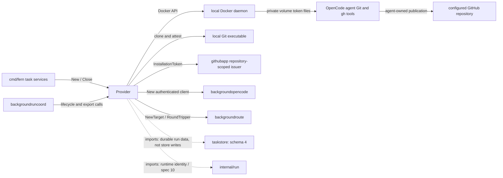

# taskenvdocker

See the [Go package map](../../docs/go-packages.md) and [maintenance review](../../docs/go-review.md).

Provider for one serial disposable Docker Background Run. It owns exact resource
attestation, clone/volume/container lifecycle effects, runtime transport, and scoped
GitHub credential delivery. It neither schedules work nor mutates taskstore state.

## Place in the architecture

Solid edges represent selected runtime calls/data delivery; dotted edges are imports.
Diagrams are representative, not exhaustive static callgraph analysis.
Current resource spec is 10. There is no host publisher, publication journal, or
host-side PR creation path in this provider. Credentials enable the agent's tools;
they are not Fern durable publication authority or a promise that publication occurs.

## Entrypoints and lifetime

| Entry family | Responsibility |
| --- | --- |
| `New` / `Close` | Validate trusted policy, private root/host key, qualified image, and owned clients. |
| `EnsureClone`, `EnsureVolume`, `EnsureContainer` | Create or positively attest the exact intended resource. |
| `StartContainer` | Start the expected container and return observed runtime identity. |
| `CommittedRuntime` | Validate the immutable container/start-time tuple in durable state. |
| `Health` | Bounded readiness probe with runtime attestation. |
| `OpenCodeClient`, `BackgroundRouteTarget` | Construct runtime-fenced authenticated HTTP access. |
| `RefreshGitHubCredentials` | Refresh/deliver an exact-repository token to the running process. |
| `ObserveUsage` | Attest and observe clone usage against configured bounds. |
| `StopContainer`, `ProveWriterInactive` | Prove the intended writer stopped/absent/never started. |
| `RemoveContainer`, `RemoveVolume`, `RemoveClone` | Remove only under explicit writer authority. |
| `AcquireExportSource` | Acquire exclusive filesystem clone lease after fresh inactivity proof. |
| `EnvironmentSHA256` | Deterministic environment digest; every current run records `EnvironmentSHA256(nil)`. |

Provider construction copies configuration and can own a Docker client if
one is not injected. Close marks lifecycle closed and closes owned client resources;
it is not a substitute for ordered run cleanup and does not delete all Docker state.
Stop coordinator/route users before provider shutdown. Do not copy provider state
or live `ExportSource` leases; lease `Close` is mandatory and idempotent.

## Representative internal callgraph

```mermaid
flowchart TD
  new["New"] --> root["prepareRoot / loadExistingRoot"]
  new --> config["validateConfig / qualifyImage"]
  clone["EnsureClone"] --> lock["acquireCloneAuthority / acquireCloneLock"]
  clone --> attestclone["attestClone / attestRepository"]
  attestclone --> git["git"]
  ensure["EnsureContainer / StartContainer"] --> attest["attestContainer / requireRuntime"]
  health["Health"] --> once["healthOnce / requestHealth"]
  transport["routeTransport.RoundTrip"] --> fence["routeTransport.attest"]
  fence --> attest
  refresh["RefreshGitHubCredentials"] --> validate["validateRun / committedRuntimeFromRun"]
  refresh --> attest
  refresh --> token["InstallationToken / CopyToContainer / ContainerExec calls"]
  export["AcquireExportSource"] --> lock
  export --> fs["attestExportRoot / readExportClone"]
  export --> inactive["requireExportWriterInactive"]
  stop["ProveWriterInactive"] --> stopping["StopContainer"]
  remove["RemoveContainer / RemoveVolume / RemoveClone"] --> authority["validateCleanupAuthority"]
  remove --> absence["requireContainerAbsent / requireVolumeAbsent / deletion attestation"]
```

## Identity, clone, and resource policy

Private root state includes a host key and exact clone markers tied to run/spec
digest and filesystem device/inode identity. Initialization and recovery reject
unsafe links/modes or ambiguous authority instead of adopting a similarly named
resource. Git clone/config checks reject executable configuration and unsafe
administrative symlinks. Clone locking covers provider operations and export leases.

The source admission/disk-free and observed-clone limits are checks, not a kernel
filesystem quota. `ObserveUsage` walks files; bytes can grow between observations.
Execution additionally requires kernel-enforced storage as described below.
Git operations have configured time/output limits and controlled environment.
Clone recovery/deletion validates exact marker/path identity, including interrupted
rename/deletion cases; ambiguous trees are quarantined, not recursively guessed away.

Containers use the qualified image ID and expected labels/config, UID/GID 1001,
workspace bind mount, and private OpenCode named volume. The server port is exposed
only on loopback with an observed host port. Basic authentication derives from
host key and immutable run identity; credentials do not enter observation evidence.

Policy checks include bridge networking, private IPC/cgroup namespace, memory/swap,
fixed CPU/PID limits (2 CPUs and 512 PIDs, constants rather than configuration),
init, restart disabled, all capabilities dropped, and
`no-new-privileges`. The root filesystem is read-only. Explicit tmpfs mounts bound
`/tmp` and `/home/user/.cache` to 256 MiB/65,536 inodes each and
`/home/user/.config` and `/home/user/.local/state` to 16 MiB/4,096 inodes each;
`/dev/shm` is 64 MiB.
These memory-backed writes are also subject to container memory/swap limits.
A fixed default-deny seccomp profile permits ordinary worker syscalls and a small
terminal/pipe ioctl allowlist; it does **not** permit XFS project-ID/inheritance
changes, unrestricted ioctl, io_uring, or unknown file-attribute APIs. Dropping
capabilities alone does not prevent an inode owner from changing XFS project IDs.
Bridge egress is unrestricted. This is not an egress allowlist or defense against a hostile
Docker administrator. There is no host environment injection because the worker
has unrestricted egress; `Config` has no environment field.

### Required Linux quota storage

`Config.RuntimeStorageRoot` is an existing, exact absolute operator-provisioned
XFS project directory on Linux amd64/arm64, kernel 5.14 or newer. Docker Desktop,
other operating systems/filesystems, remote Docker transports, missing quota-query
permission, accounting-only quotas, project zero, missing project inheritance,
unlimited byte/inode hard limits, and XFS realtime inheritance fail admission.
Use the same-host Linux Docker daemon over its local Unix socket, with the same
host path/mount namespace as Fern (no socket relay or remote daemon proxy).

The operator must provision nonzero project ID and `PROJINHERIT` recursively,
enable XFS project accounting **and enforcement**, and set both block and inode
hard limits. Fern only reads `FSGETXATTR`, `Q_XGETQSTATV`, and `Q_XGETQUOTA` via
`quotactl_fd`; it never mounts, assigns projects, changes quotas, or starts a
privileged helper. **On stock Linux, reading a project quota with `Q_XGETQUOTA`
requires `CAP_SYS_ADMIN` in the initial user namespace.** Owning the project
directory, filesystem ACLs, `CAP_CHOWN`, or being a member of the Docker group
does not grant that syscall permission. `Q_XGETQSTATV` alone is unprivileged but
does not report the project's hard limits. Consequently the stock unprivileged
`fern:fern` service **cannot execute this provider**. This implementation does
not grant `CAP_SYS_ADMIN`, install a helper, or quietly replace the query with
an unenforced assertion; deployment must explicitly resolve this privilege
requirement before production execution. Granting that broad capability to the
server needs a separate operator security decision, not a hidden service tweak.

The server also needs permission to create its own directories. Volume leaves
are server-owned mode 0777 beneath a
server-owned private mode-0700 parent, so UID/GID 1001 can write through its leaf
mount without granting Fern `CAP_CHOWN`. Host users cannot traverse that parent.
Permission failure is fatal to
execution, not silently replaced by polling or a disk-free check.

One fixed shared project bounds all serial capacity-one runs, including retained
failed runs. The authoritative host key remains at
`StateRoot/background-runs/host.key`, outside the quota and in the existing
durable backup location. `RuntimeStorageRoot/background-runs` holds clone
authority and clone trees, plus a private copy of that same host key for root
validation. Initialization atomically publishes that copy; reconstruction rejects
an existing runtime root whose key differs from the durable authoritative key.
Both key files remain mode 0600 under private mode-0700 roots. Named Docker volumes use the exact local-driver bind
of `background-runs/opencode-volumes/<volume identity>`, under the same project.
The parent remains private/server-owned; the worker sees only its leaf. Docker
volume removal is followed by backing-tree deletion after the existing writer
fence and container-absence checks. Operator provisioned storage must not be
changed while workers run. Keep the durable task database and recovery exports
outside this quota and reserve sufficient host space for them and bounded Docker
logs; project exhaustion must not exhaust the durable recovery filesystem.
Admission enforces different filesystem device IDs for `RuntimeStorageRoot`
and durable `StateRoot`. Operators must also place recovery exports outside the
runtime filesystem. Hard limits must be sized below runtime filesystem capacity
with reserve for filesystem metadata and other writers: an arbitrarily large
finite quota does not prevent ENOSPC. There is no admission calculation comparing
remaining quota allowance to available blocks/inodes, and no protection against
other host writers exhausting either filesystem. The guarantee is bounded
worker project allocation, **not** universal host-free-space preservation.

Admission occurs before clone, volume, container, or start effects. Construction
and cleanup do not require quota availability. Legacy option-free volumes and
writable-root containers remain cleanup-attestable, but cannot be newly adopted
for execution. No resource-spec bump is needed. An empty runtime root selects the
old `StateRoot/background-runs` **for cleanup only**. To recover old resources,
retain that old root and durable host key; do not move existing clone trees to the new
root (their path/inode authority would change). Drain legacy runs with the old
cleanup configuration before selecting a new runtime root.

Hermetic tests inject storage attestation privately or through an explicitly
injected Docker fake's `VerifyRuntimeStorage(string) error` method. The production
Docker client does not implement that method; there is no YAML/config bypass.
The fixed seccomp/tmpfs profile and actual EDQUOT behavior require qualification
on the provisioned Linux host; macOS tests are not live quota qualification.

`FERN_STORAGE_POLICY_SMOKE_IMAGE=fern/opencode-background-source:signed go test
./internal/taskenvdocker -run TestLiveWorkerStoragePolicy -count=1 -v` separately
launches a disposable raw Docker container with the exact seccomp, read-only-root,
and tmpfs policy. It checks authenticated health, unauthenticated rejection,
session creation, a local Git commit, and gh version/missing-credential rejection.
It removes only its generated container and volumes. Those managed smoke volumes
are deliberately not quota-backed: this is neither an XFS/EDQUOT qualification
nor a model/prompt or credentialed GitHub API contract test.

Health and route transports re-attest runtime identity, not merely container name
or port. A restarted process changes start-time/token/epoch identity and must not
inherit previous authority. Individual Docker/Git/health operations are bounded by
configured timeouts; overall workflow deadlines and retry scheduling belong upstream.

## GitHub credential refresh

The injected `githubapp.InstallationTokenSource` must mint for the configured
installation/repository ID and exact `https://github.com/owner/repo` remote.
Contents and pull-request permissions must both be `write`. Tokens must have more
than five minutes left, be at most 4096 bytes, and contain no NUL/CR/LF.
Nil token sources are permitted for hermetic setup/tests, not production credentials.

Refresh is serialized by `githubMu`. A successful in-memory lease records only spec
digest, runtime token, repository identity, and expiry—not the secret itself.
Even a lease hit first inspects/attests the exact live container. Refresh is due
five minutes ahead of expiry; failed refresh invalidates the lease and is not cached.
Provider restart has no durable credential cache and therefore mints afresh.

Token/repository staging files are tar-copied as mode 0600, UID/GID 1001, into the
private OpenCode volume at `/home/user/.local/share/opencode`. Docker exec renames
repository then token staging files into place. Each rename is per-file atomic,
not a two-file transaction. Runtime is re-attested around mutations, writes address
the immutable container ID, and exec completion/exit/container identity are checked.
Token bytes are not passed in exec arguments, labels, durable evidence, or error text.
Transient host memory/tar buffers necessarily contain token bytes; explicit zeroing
or protection against privileged Docker/host readers is not guaranteed.

The qualified image's `gh` and Git credential helpers read these private files.
A refresh failure prevents new prompt admission through the coordinator, but a
running agent may use its prior token until GitHub expiry. Stopping/deleting a local
container is not token revocation. Credentials have repository scope, not branch,
particular command, or individual PR scope; unrestricted egress permits exfiltration
by code entrusted with that token. No global rate-limit or publication guarantee exists.

## Writer fencing and export

`WriterFence` distinguishes never-created, created-never-started, and stopped exact
runtime authority. Constructors encode the variant; provider operations still
validate/prove current Docker state rather than trusting a name or constructor alone.
Cleanup may accept old execution resource policy where needed to safely remove
the exact old object; current execution policy is not silently adopted for running it.

`AcquireExportSource` validates root/marker/inode, holds the exclusive clone lock,
proves inactivity including exact-labeled replacement-container checks, and rechecks
filesystem authority immediately before returning. It performs no Git reads and
grants neither cleanup nor provider-root authority. Snapshot Git validation belongs
to `taskartifact`; the lock coordinates provider operations, not arbitrary host writers.
`Close` releases the lease and does not remove the clone.

`IdentityError` unwraps to both `ErrIdentityMismatch` and `ErrQuarantined`.
Failure to prove identity means operator/recovery attention, not permission to
adopt/delete a similarly named resource. `ErrProviderClosed` rejects relevant new
work after closure; cleanup sequencing remains the composition layer's responsibility.

## Imports and callers

Internal imports: `backgroundopencode`, `backgroundroute`, `githubapp`, `run`,
`task`, and `taskstore`. External imports: Docker API/client/errdefs, Docker NAT
types, OCI image spec, and `golang.org/x/sys/unix` for platform filesystem primitives.
Standard-library HTTP/exec/filesystem/crypto/tar facilities implement local effects.
Imports of taskstore record types do not mean runtime store method calls.

Direct production callers are `cmd/fern` and `backgroundruncoord`.
`integration/background-run-docker` and `integration/background-run-opencode`
exercise provider lifecycle, credential delivery, and composed runtime behavior.

## Naming review

- Keep `Ensure*` versus `attest*` versus `Remove*`: create-or-prove, pure observation,
  and destructive effects have meaningfully different authority requirements.
- `RefreshGitHubCredentials` accurately covers mint/delivery/lease reuse; it must not
  be called publication or revocation. `githubCredentialLease` deliberately holds metadata.
- `AcquireExportSource`/`ExportSource.Close` communicate ownership better than a raw
  path getter. `ProveWriterInactive` may stop a runtime; “prove” is not read-only here.
- `RuntimeCleanupAuthority` constructs a fence variant but is not itself a fresh
  inactivity proof. Keep callers using provider verification before destructive work.
- `password`, `git`, and `specDigest` are locally scoped implementation vocabulary;
  longer names would not improve security or remove external IO cost.

## Performance: local measured vs unmeasured

Provider performance is unmeasured. Credential tests use hermetic fakes;
fake-call timings would not measure Docker/GitHub latency.
Potential costs include clone walks, repeated Docker attestation, Git subprocesses,
and 10 ms exec-completion polling. A lease hit saves mint/copy/exec, not all IO.
These are source observations, not measured bottlenecks or optimization approval.

Run `go test ./internal/taskenvdocker` for local fake-Docker/filesystem tests.
Real daemon/image/credential integration requires the dedicated integration harness;
unit success alone does not establish runtime throughput or network isolation.
