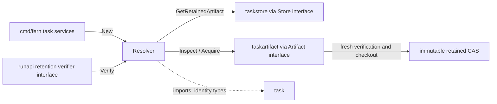
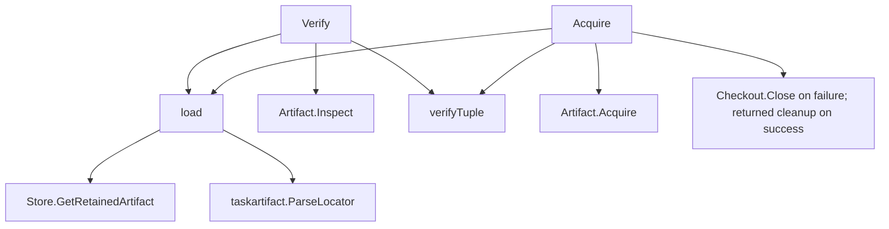

# taskresultsource

See the [Go package map](../../docs/go-packages.md) and [maintenance review](../../docs/go-review.md).

Resolves immutable retained result Git state. A disposable Background Run clone
is never post-result authority, even if it still exists on disk.

## Place in the architecture



Solid edges are selected runtime calls; dotted edges are imports. Diagrams are
representative, not exhaustive static callgraph analysis. Interface injection
does not imply that this package opens SQLite or executes Git directly.

## Entrypoints and lifetime

- `New(Store, Artifact)` validates required dependencies, without acquiring resources.
- `Verify` loads retained metadata, parses its locator, freshly inspects CAS, and
  checks the result/artifact/snapshot tuple. It creates no returned checkout.
- `Acquire` loads the same metadata and calls artifact `Acquire` once, then checks
  the tuple and returns a fresh repository path plus mandatory cleanup function.
- Call the returned cleanup on every successful acquisition. It is backed by the
  owned checkout's idempotent `Close`, not deletion of a caller-selected path.

The resolver has no cache, worker, mutex, or `Close` method. Its dependencies own
database/filesystem lifetimes. A previous successful `Verify` is not an integrity
cache or authority to skip validation on a later acquisition.

## Representative internal callgraph



## Integrity and errors

Only `ResultSourceRetainedArtifact` is accepted; other source kinds return
`taskstore.ErrCorruptStore`. Store and artifact errors propagate. Tuple validation
checks result/export/materialization/artifact IDs, repository/workspace/task/attempt,
generation/seal, base/result/tree OIDs, OpenCode session/message, changes/manifest/
bundle digests, and bundle size across the relevant durable and artifact records.

A mismatch is corruption, not a request to recreate content from the disposable
clone. If acquisition materialized a checkout before detecting mismatch, it is
closed and any cleanup error is joined with the original error. An empty acquired
path also fails as corruption and triggers cleanup.

No package-local size or timeout configuration exists: context, store policy, and
artifact engine limits govern the work. The concrete engine performs fresh full
verification once per acquisition and rehashes the copied materialization bundle.
The resolver trusts injected implementations to honor the artifact interface's
successful non-nil checkout contract; it is not a generic hostile-plugin boundary.

## Imports and callers

Internal imports are `task` (IDs), `taskstore` (records/errors), and `taskartifact`
(locators/snapshots/checkouts). Standard-library imports are only `context` and
`errors`. There is no Docker, HTTP, GitHub, or direct Git subprocess import.

`cmd/fern/tasks.go` constructs the resolver and supplies it as `runapi`'s
retention verifier; this runtime interface call does not require `runapi` to
import `taskresultsource`. `integration/background-run-opencode` also constructs
and exercises it. There is no host result-publication consumer in the current design.

## Naming review

`Acquire`, `Verify`, `load`, and `verifyTuple` accurately distinguish lease creation,
fresh integrity proof, metadata lookup, and cross-record equality. Keep them.
`Verify` directly composes lookup, inspection, and binding validation.

## Performance: local measured vs unmeasured

Resolver performance is unmeasured. `verifyTuple` is a fixed-field
comparison; real acquisition includes store lookup, full artifact Git verification,
filesystem copy, detached checkout, and mandatory cleanup. A fake-interface timing
would not represent those costs.

`taskartifact.BenchmarkAcquireVerified` measures the real lower boundary,
excluding store lookup and resolver tuple comparison. See the
[central performance report](../../docs/performance.md) for commands and results.
Run correctness checks with:

```sh
go test ./internal/taskresultsource
```
