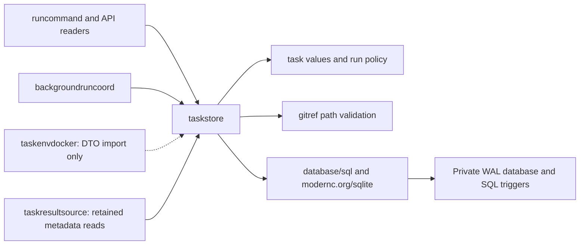
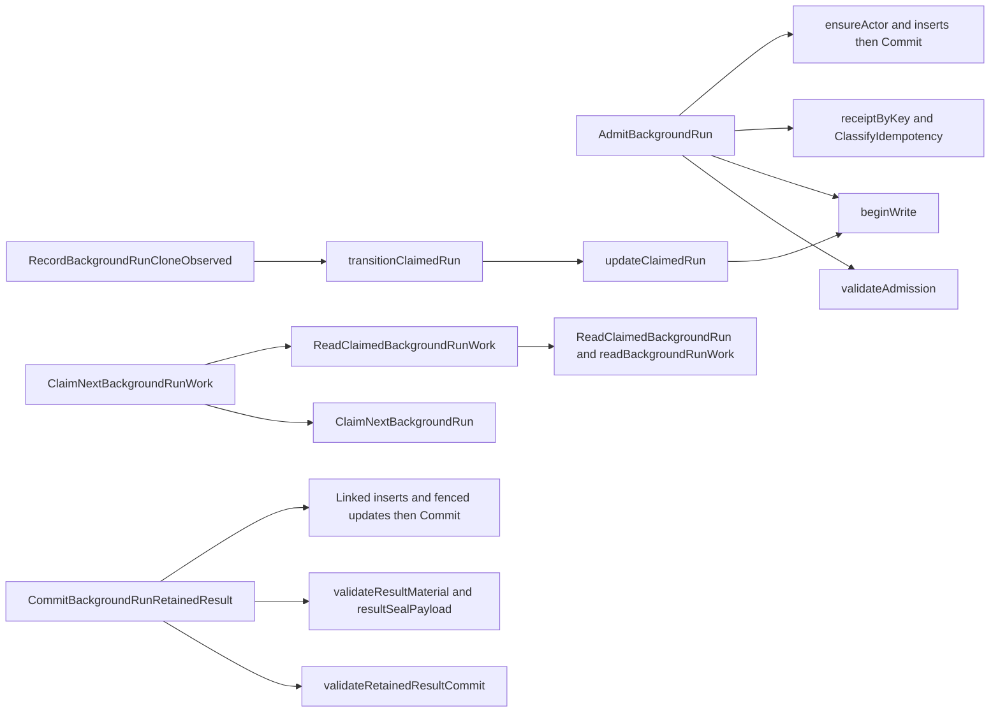

# taskstore

See the [Go package map](../../docs/go-packages.md) and [maintenance review](../../docs/go-review.md).

`taskstore` owns durable SQLite authority for workspaces, background-run admission,
claims, effect observations, user sealing, exports, materialization, and retained
results. It exists to commit related records and their fences together, rather
than asking HTTP handlers or external-effect providers to coordinate SQL.

## Current model and boundary

- **Schema 3** is one complete pre-release schema, not a migration chain from
  development schemas 1 or 2. `Open` rejects incompatible versions; it does not
  upgrade them or delete data. Re-creation is an explicit operator decision.
- Workspace GitHub authority accepts only `github-app-broker` and a positive
  installation/repository binding.
- New background runs require **resource spec 10**, the exact source profile,
  immutable image/environment digests, and canonical generation resource names.
- `run` owns state/phase vocabulary and classification; SQL owns durable
  representation, transition constraints, and effect authority.
- There is no publication or verification-job subsystem. Bundle verification
  records and retained-result authority are integrity mechanisms, not agent
  push/PR approvals. Agent Git pushes are separate external actions.
- IDs, timestamps, authenticated actor snapshots, and external evidence come
  from callers. This package does not call Docker, Git, OpenCode, or GitHub.

## Architecture and dependencies



`modernc.org/sqlite` is the sole directly imported third-party library. Internal
dependencies are `task`, `run`, and `gitref`. Other production importers are
`cmd/fern`, `backgroundroute`, `runapi`, `runclientapi`, the background-run
integration programs, and `integration/upgrade`. Provider callers consume
durable DTOs/proofs; their presence does not move external I/O into this store.

## Entrypoints and domain ownership

| Area | Representative entrypoints |
| --- | --- |
| Lifetime and binding | `Open`, `Close`, `EnsureWorkspace`, `GetWorkspace` |
| Admission and command receipts | `AdmitBackgroundRun`, `FindReceiptByIdempotency`, `StopBackgroundRun`, `SealBackgroundRun` |
| Actor-scoped reads | `GetBackgroundRun`, `ListBackgroundRuns`, `GetBackgroundRunOwners`, `GetBackgroundRunResult` |
| Effect authority | `ClaimNextBackgroundRunWork`, `ClaimActiveBackgroundRun`, `ReadClaimedBackgroundRun`, `RenewBackgroundRunClaim`, `ReleaseBackgroundRunClaim` |
| Execution observations | `RecordBackgroundRunCloneObserved`, session/prompt observations, `RequestBackgroundRunTimeout` |
| Retention | `RecordBackgroundRunWriterFence`, `ClaimBackgroundRunExport`, snapshot/bundle/CAS records, `RecordArtifactMaterializationReady` |
| Result commitment | `CommitBackgroundRunRetainedResult`, `HasRetainedResultAuthority` |
| Cleanup | Removal observations, `MarkBackgroundRunCleanupRequired`, `FinalizeBackgroundRunFailure`, `CompleteBackgroundRunResultCleanup` |

Plugin reads filter creator authority in SQL before list bounds. Trusted
operator/device readers get a workspace-wide projection. `GetBackgroundRunOwners`
first applies that ownership-hiding check, then reads parent revisions; those
reads are not one snapshot, so subsequent mutations must compare revisions.
`ListEvents` excludes background-owned records; use the actor-scoped background APIs.
Unscoped result/artifact reads are internal primitives, not authenticated APIs.

## Transactions and fencing

Admission checks the receipt under an immediate write transaction. First use
inserts task, sequence-1 attempt, actor snapshot, receipt, run, and ordered initial
events. Deferred foreign keys permit the circular ownership links to become
complete at commit. Replay returns the original IDs/events; a conflicting request
or actor cannot insert a second accepted command.

Claims identify workspace/task/attempt/generation, expected revision/state/phase,
cancel epoch, owner, claim generation, and expiry. Mutations compare the applicable
tuple in SQL and require exactly one affected row. Recovery of an existing effect
is preferred over queue admission. A partial unique index permits one effecting
background run per workspace. A lease does not itself prove resource absence.

Prompt intent is durable before dispatch. `RecordBackgroundRunPromptRequestAttempted`
is a one-way pre-I/O fence: a replacement claimant cannot silently resend the
prompt. Observations and immutable timestamps distinguish uncertainty from an
effect that never started. Stop wins either before any effect, terminalizing the
parents, or commits stop intent and revokes the active claim. Timeout uses a system
actor and ordered events without manufacturing a plugin receipt.

Seal admission races transactionally against stop/timeout and persists all export,
artifact, materialization, result, and event IDs before external collection.
Writer fencing precedes export. Export phases advance through snapshot selection,
bundle verification, CAS installation, and materialization with exact claim checks.
Only the retained-result commit can establish `result_ready`; the old
`RecordBackgroundRunResultReady` entrypoint intentionally always rejects.

The result commit links artifact/export/materialization/writer proof and ordered
events, completes the task, marks its prepared attempt superseded, and finishes
the export atomically. SQL triggers independently guard immutable authority,
revision progression, phase order, event linkage, and cleanup gating. Physical
state/phase columns plus `result_authority_phase` are projected into public
seal/export/artifact phases by `scanBackgroundRun` and translated back for fences.

## Typed DTOs and hash authority

Parameter structs carry typed IDs and explicit expected revisions rather than
opaque maps. Parsers and scanners check key shapes, digest lengths, and persisted
invariants, but a typed cast alone is not validation. Admission recomputes the
prompt/profile digests; claimed work recomputes plaintext SHA-256 against both
parent records and the run before returning the prompt.

The retained changes digest belongs to `taskartifact`'s canonical nested change
encoding. `ManifestEntry` is a lossless relational projection, not an alternative
hash schema. Paths are canonical base64, strictly byte-sorted, with closed
mode/blob/size combinations and at most 10,000 entries. Artifact manifests and
sanitized evidence are bounded and checked for forbidden sensitive field names.
These checks do not guarantee arbitrary strings contain no secrets: providers
must supply sanitized evidence. Writer proof hashes exclude their own digest.

Stored bundle hashes/proofs are supplied evidence, not a filesystem read.
`HasRetainedResultAuthority` checks the committed ownership tuple; the separate
retention verifier must prove the retained bytes remain reconstructable. CAS
locators and materialization details must not be serialized wholesale to users.

## Representative internal callgraph

Selected paths only, not an exhaustive callgraph or all SQL-trigger invocations.



## Errors and lifetime

`Open` requires an existing private immediate parent, rejects symlink database
files/parents, and checks current-user ownership on Unix. It enables WAL,
foreign keys, FULL synchronization, and a pool of up to eight connections.
Initialization checks the migration checksum ledger, integrity, foreign keys,
and connection policy. On initialization failure the pool is closed.

Write helpers shorten the five-second busy wait for caller deadlines and restore
connection policy before release. Transactions defer rollback and release;
row iterators are closed and checked. Seal admission and retained-result commit
explicitly use `context.WithoutCancel` after validation: request cancellation does
not abort those durable operations. Callers must reconcile their outcome via
durable IDs/receipts. Other operations generally preserve caller cancellation.

Errors distinguish invalid input/state, not-found, lease/revision conflict,
idempotency conflict, unsafe paths, unsupported schema, drift, and corruption.
Ownership-hiding APIs intentionally return not-found instead of foreign details.
Cleanup/export failures preserve recoverable phase/evidence rather than asserting
success. The composition root must stop users of the store before `Close`.

## Naming and performance review

`GetBackgroundRunOwners` is the background parent path. Bundle proof recording
has one entrypoint, `RecordBackgroundRunBundleVerified`, whose comment makes
clear that it records supplied evidence rather than reading/verifying bytes.
Seal admission has one entrypoint, `SealBackgroundRun`, used by `runcommand`.
Snapshot selection, materialization, and export recovery use the coordinator's
`SelectBackgroundRunSnapshot`, `RecordArtifactMaterializationReady`, and
`MarkBackgroundRunExportRecoveryRequired` APIs. Artifact GC uses
`ReferencedArtifactManifestSHA256`; unused forwarding names are removed.
`retainedResultEvidencePayload` and `validateRetainedResultEvidence` describe
retained-result evidence, not delivery. Persisted attempt delivery columns,
phases, constraints, and existing lease-error text remain unchanged; this is
not a schema or event-encoding migration. The `run.State` and `run.Phase` type
aliases remain the shared policy boundary rather than duplicate store types.

The wide background-run select still scans evidence and attribution even for
short list projections; no narrower query or public model change is introduced.
`ListBackgroundRuns` now explicitly doubles capacity when full, starting at one
after the first successfully scanned row and capping growth at the validated
limit (at most 100). This avoids runtime growth overshooting the query bound
without eagerly reserving space for sparse lists. Empty results remain nonnil
with zero capacity. SQL ownership filtering, ordering, and input validation are
unchanged. Growth still copies existing rows; this is not a single-allocation
list. Admission
cost includes triggers/indexes and FULL WAL commits; claim selection includes
recovery priority and capacity checks. Do not infer these costs from enum tests.

`benchmark_test.go` measures fresh admission into a growing real database,
same-owner recovery claims, owned get/list of 100 seeded runs, receipt lookup,
and sparse lists of 0, 1, or 10 rows requested with a limit of 100.
Setup/migration is excluded. Fresh admission includes fixture parameter assembly
but not secure ID generation; recovery is not first provisioning. Benchmarks are
serial and retain production durability settings; they do not model contention,
Docker, Git, or network latency.

Focused capped-growth measurements on Apple M4 Pro, darwin/arm64,
Go 1.27.0, `-cpu 1 -count 3 -benchmem` (median of three samples, original
append growth → capped doubling):

| Workload | ns/op | B/op | allocs/op |
| --- | ---: | ---: | ---: |
| `OwnedList100` | 1,167,755 → 1,136,957 | 958,330 → 900,985 | 16,029 → 16,029 |
| `Rows0Limit100` | 178,763 → 187,497 | 10,544 → 10,544 | 121 → 121 |
| `Rows1Limit100` | 191,584 → 196,076 | 17,945 → 17,945 | 281 → 281 |
| `Rows10Limit100` | 274,205 → 280,805 | 109,253 → 109,253 | 1,716 → 1,716 |

The full-list workload saves 57,345 allocated bytes (about 6.0%) with unchanged
allocation count; its measured median time falls about 2.6%. Empty, single-row,
and ten-row allocation totals are unchanged. Their median times rise about
2–5%; timing differences are local observations, not statistical claims. The
remaining wide SQL scan dominates allocation counts.

An initial experiment reserved all 100 slots after the first row: it reduced
full-list allocation to 750,066 B/op and 16,022 allocs/op, but raised single-row
allocation from 17,945 to 131,485 B/op and ten-row allocation from 109,253 to
187,720 B/op. Capped doubling deliberately gives up some full-list savings to
avoid that sparse-list regression. Capacities grow 1, 2, 4, 8, 16, 32, 64, 100
when the limit is 100; a ten-row result retains capacity 16, not 100. Reproduce
all four workloads with:

```sh
go test ./internal/taskstore -run '^$' -bench '^BenchmarkBackgroundRun(Read|ListSparse)$/^(OwnedList100|Rows.*)$' -benchmem -cpu 1 -count 3
```

See the [central performance report](../../docs/performance.md) for the shared
benchmark command, environment, and results. The focused commands below select
individual workloads:

```sh
go test ./internal/taskstore -run '^$' -bench '^BenchmarkBackgroundRunAdmissionFresh$' -benchmem
go test ./internal/taskstore -run '^$' -bench '^BenchmarkBackgroundRunClaimRecovery$' -benchmem
go test ./internal/taskstore -run '^$' -bench '^BenchmarkBackgroundRunRead$' -benchmem
```
