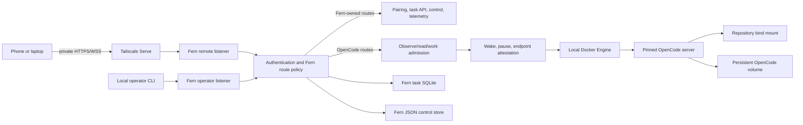
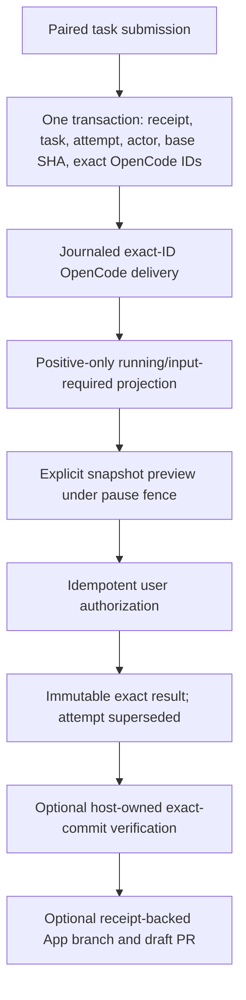

# Fern And Fern Labs: Internet Research Prompt

> Status: research input, not a product or architecture contract.
>
> This prompt summarizes Fern's working-tree documentation as of 2026-08-28.
> The repository code and `docs/ARCHITECTURE.md` remain authoritative for
> implemented behavior. `docs/REMOTE_PRODUCT.md` owns product direction and
> `docs/ROADMAP.md` owns the current execution order.

## How To Use This Document

Give this entire document to a research-capable Claude model with web browsing
enabled. The requested output is a new, evidence-backed strategy report. Do not
ask Claude merely to summarize this prompt. The important work is to verify,
correct, challenge, and extend it through current Internet research.

## Role

Act as a principal engineer, technical product strategist, and skeptical
Internet researcher specializing in:

- coding-agent runtimes and control planes;
- long-running and background agent work;
- reproducible software-engineering evaluations;
- LLM gateways, streaming protocols, identity, metering, and capacity policy;
- self-hosted developer infrastructure;
- distributed systems, failure recovery, and tamper-evident evidence;
- open-source positioning and senior-backend portfolio evaluation.

You are advising one experienced engineer building Fern on weekends. Optimize
for the smallest sequence that produces genuine daily utility, technically
credible public evidence, and strong backend-AI engineering material. Do not
optimize for fundraising, market-size theater, or feature-count parity.

## Assignment

Research where Fern and Fern Labs should head next, using the supplied repository
context as a hypothesis rather than a conclusion.

Answer these top-level questions:

1. Is **Fern Labs** the right destination, or is it an attractive-sounding layer
   that distracts from Fern's stronger durable-agent-control-plane identity?
2. Is **Fern Gateway** actually the minimum enabling subsystem for Labs, or can
   trustworthy experiments begin with a smaller measurement boundary?
3. Which capabilities are now commodity because Amp, Claude Code, Codex, T3
   Code, Cursor, GitHub Copilot, Devin, Jules, OpenCode, Coder, or sandbox
   providers already ship them?
4. Which narrow capability remains genuinely differentiated and useful for one
   self-hosting engineer?
5. What exact product, architecture, evaluation methodology, and public proof
   should be built over the next 2, 6, and 12 weekends?
6. What should explicitly not be built, and which observable changes would
   reverse that decision?

The final answer must distinguish:

- verified current facts;
- vendor claims;
- independent measurements;
- reasoned inferences;
- recommendations;
- unresolved unknowns.

## Research Date And Freshness Rules

Treat the current date as **2026-08-28**.

- Search the current web. Do not rely on model memory for product state,
  pricing, release status, repository activity, or API behavior.
- Prefer sources published or updated in the last 18 months, while retaining
  older primary sources where they define a still-current protocol or design.
- Record the publication or last-update date of every time-sensitive source.
- Check product changelogs, documentation, release notes, source repositories,
  issue trackers, pricing pages, security pages, engineering posts, and actual
  API references rather than relying on launch articles alone.
- If a page is inaccessible, state that. Do not fill the gap from snippets as
  though they were a verified page.
- Check whether features are generally available, preview, announced, removed,
  renamed, region-limited, plan-limited, or only demonstrated.
- For open-source products, inspect recent releases, default-branch activity,
  issue state, license, and maintainer status.
- Treat Fern's historical files under `product-docs/` only as search leads.
  Their market claims may already be stale.

## Source And Claim Discipline

Use the following labels throughout the report:

| Label | Meaning |
| --- | --- |
| `[OFFICIAL]` | Product documentation, official changelog, official engineering post, job posting, standards body, or project repository |
| `[CODE]` | Behavior established directly from source code, tests, schemas, or release artifacts |
| `[VENDOR]` | Performance, security, adoption, or economics claimed by the company selling the product |
| `[INDEPENDENT]` | Measurement or analysis by a party without an obvious sales interest |
| `[ACADEMIC]` | Peer-reviewed paper, preprint, or established research organization with methodology available |
| `[FIRST-HAND]` | Named practitioner report with direct experience but no controlled methodology |
| `[INFERENCE]` | Your conclusion from cited facts, clearly separated from those facts |
| `[NOT FOUND]` | Searched for but could not verify |

Requirements:

- Put a direct URL beside every load-bearing external claim.
- Never cite a search-results page, AI-generated summary, affiliate comparison,
  or SEO listicle as primary evidence.
- Use archived pages only when the live source is gone, and label them.
- When sources disagree, show the disagreement and explain which source should
  carry more weight.
- Separate benchmark methodology from benchmark marketing.
- Do not compare vendor latency numbers unless readiness definitions and warm
  versus cold conditions are comparable.
- Do not equate GitHub stars, social attention, or benchmark rank with product
  utility.
- Do not turn absence of a public feature into proof that an internal feature
  does not exist. Say "not publicly documented."

## Supplied Project Context

### Repository Snapshot

As of the supplied snapshot:

- repository: `github.com/nebler/fern`;
- branch: `harden/production-readiness`;
- code HEAD: `ab945b5a00db3a310b3fcc30fe8bc99669598b6f`;
- implementation language: Go 1.24;
- persistence: CGO-free SQLite plus a bounded JSON compatibility store;
- runtime: one local Docker workspace running a digest-pinned OpenCode V2 beta;
- pinned OpenCode version: `0.0.0-next-17444`;
- source shape: approximately 246 Fern Go files, 101 Go test files, and 28
  top-level internal packages, excluding the vendored/reference OpenCode tree;
- no verified public release or release tag is claimed by the current docs;
- no checked-in evidence proves the full physical Ubuntu, reboot, phone TLS/WSS,
  replacement-host restore, or independent ACL-negative journey;
- the current working tree contains a documentation refresh but no Gateway or
  Labs implementation.

If repository access is available, verify these statements rather than treating
the counts or commit as permanently current.

### One-Sentence Product Model

Fern treats OpenCode as volatile compute that may disappear at any time and
places a durable, journaled, fail-closed control plane around it.

The current user promise is:

> Submit coding work remotely, disconnect, return to the same durable task,
> authorize one exact repository snapshot, verify it under host-owned policy,
> and optionally publish a receipt-backed draft PR from a workspace that can
> stop, freeze, wake, reboot, and recover.

Fern does not own the model loop or coding UI. OpenCode owns conversations,
sessions, tools, files, terminals, diffs, permissions, forms, and provider
interaction. Fern owns the durable journey around that volatile runtime.

### Current Trust Model

Fern currently assumes one trusted owner, host, repository, image, Docker
daemon, and tailnet.

- It is not a hostile multi-tenant sandbox.
- Docker and host administration are root-equivalent trusted authority.
- Repository code and OpenCode tools are inside the trusted workspace boundary.
- Tailscale provides private reachability, not Fern-level human identity.
- Provider credentials may currently enter the trusted workspace environment or
  OpenCode storage.
- The planned Gateway credential boundary does not exist yet.
- Do not recommend accepting arbitrary hostile repositories on ordinary Docker
  while preserving the current security claim.

### Implemented Architecture

Fern is one Go binary supervising one OpenCode Docker workspace.



The two listeners have deliberately different policy:

- the remote listener is the only Tailscale Serve target and accepts pairing
  capabilities or digest-backed device grants;
- the operator listener is loopback-only and accepts distinct Fern and OpenCode
  Basic credentials;
- both Basic credentials are rejected remotely before workspace wake;
- `/fern/*` routes remain in Fern and do not wake OpenCode;
- OpenCode requests are classified as observe, read, or work;
- unknown upstream routes are treated as work;
- concurrent wakes coalesce;
- an endpoint is published only after image, loopback, health, negative-auth,
  and event-observer checks.

### Implemented Runtime And Idle Behavior

- One constrained container runs as UID/GID 1001 with bounded memory, CPU, and
  PIDs, dropped capabilities, and no restart policy.
- Fern supports idle `stop` and `freeze` modes.
- Fern writes lifecycle intent before stop or freeze so an intentional pause is
  distinguishable from crash, OOM, or failed start.
- Idle suspension requires a connected observation epoch that saw work and then
  drained.
- Fern closes admission and performs two complete all-idle passes across active
  sessions, shells, PTYs, permissions, forms, and questions.
- Unknown, malformed, unauthorized, disconnected, or newly active state keeps
  compute running.
- Historical stopped-to-ready measurements are roughly 2.8 to 3.1 seconds, but
  current physical and published evidence must be rerun.
- Freeze wake is implemented and has a phase-level tracing surface, but no
  current public measurement should be invented.

### Implemented Durable Task Path



Important semantics:

- Browser submission stores one exact request body and idempotency key before
  sending, then reuses both after reload or lost response.
- Fern creates task, attempt, receipt, actor snapshot, immutable base SHA, and
  caller-selected OpenCode session/message IDs before waking compute.
- Delivery persists phases before effects.
- After `prompt_started`, Fern never retries prompt mutation; it performs exact
  read-only reconciliation.
- Fern makes an exact-once-attempted claim about its own admission/delivery
  protocol, not an exactly-once claim about providers, tools, Git, or GitHub.
- Cancellation persists intent before interrupting and acknowledges from exact
  prompt reconciliation plus current active-session projection.
- Volatile SSE, idle state, an empty inbox, or process death never prove task
  success.
- The pinned OpenCode profile has no generic restart-safe terminal-success fact.
- Current completion therefore uses explicit user authority: preview and seal
  one exact clean Git snapshot under `AcquirePaused`.
- A user-sealed attempt becomes `superseded`, not `succeeded`; Fern is saying
  "accept this exact snapshot," not "OpenCode proved success."
- A stronger observer-authorized path exists as infrastructure but is not
  production-composed because no authoritative observer exists.

### Implemented Verification And Publication

- Verification starts only from a sealed result.
- Verification policy is host-owned, shell-free argv with a bounded environment,
  timeout, output cap, process-group teardown, and exact clean-commit checks
  before and after.
- Native executables are descriptor-pinned and unsafe writable/symlinked paths
  are rejected.
- `github-app-broker` keeps the App private key on the host and mints short-lived
  repository-scoped installation tokens.
- Publication admission is one receipt-backed SQLite transaction over the exact
  result, exact successful verification, current task ownership, and derived
  repository/ref/commit/branch tuple.
- Push and draft-PR mutation-start phases commit before each external effect.
- Lost responses trigger exact GitHub reads, never blind mutation retries.
- `workspace-gh` is an explicit mutually exclusive mode that gives trusted
  workspace code an authenticated `gh`; its direct effects are outside Fern's
  receipt journal.

### Implemented Stores, Recovery, And Release Machinery

- Task SQLite schema 6 uses WAL, foreign keys, `synchronous=FULL`, checksummed
  migrations, state-machine triggers, receipts, effect journals, results,
  verification, and publication records.
- A separate JSON store retains device grants, pairing limiter support, operator
  credential identity, and read-only legacy audit records.
- Backup create/restore/rollback is offline and lease-protected.
- Backup exports exact managed volumes and separates detected credentials and
  opaque volume exports, but Fern does not encrypt the backup archive itself.
- GitHub credential export/import/rotation uses age X25519 encryption and local
  rollback; external GitHub revocation remains an operator obligation.
- Local release builds are reproducible and checksummed.
- The tag workflow requires a signed annotated tag, builds Linux amd64/arm64
  assets and a multi-architecture OCI image, generates an SPDX SBOM, records
  provenance, keylessly signs the image with Cosign, verifies attestations, and
  only then creates a GitHub release.
- These automated gates do not substitute for physical deployment evidence.

### What Is Not Implemented

Do not accidentally describe any of these as current:

- no Fern LLM Gateway;
- no scoped model-access token;
- no host-side provider-key custody for model requests;
- no provider translation or fallback;
- no request/token/cost/concurrency budget enforcement;
- no model usage or cost ledger;
- no experiment, case, arm, run, or evaluation service;
- no disposable benchmark-run provider;
- no hidden evaluator or Labs report;
- no generic authoritative OpenCode completion observer;
- no durable Fern approval-answer table/API;
- no notification outbox, PR/CI continuation, or review digest;
- no supported hostile multi-tenancy;
- no multi-workspace scheduler or fleet;
- no native Fern mobile application;
- no public sandbox API;
- no Kubernetes production requirement;
- no public release, physical deployment proof, or demo recording claimed by
  the supplied docs.

### Current External Acceptance Gaps

The next real-world proof still needs:

- a signed tagged release and verified artifacts;
- Ubuntu 24.04/systemd deployment on a replaceable VM;
- real Tailscale HTTPS, SSE, and WSS from a physical phone;
- a real reboot and service recovery;
- physical device revocation during a stream or terminal;
- one provider-funded task;
- one exact seal, verification, and draft-PR journey;
- separate stop and freeze wake measurements;
- encrypted off-host custody of the backup;
- replacement-host restore and old-host fencing;
- a genuinely independent tailnet ACL denial;
- an honest incident log from ordinary dogfooding.

## Current Product Direction To Evaluate

### Proposed Destination

The current direction is:

> **Fern Labs is the product. Fern Gateway is the enabling credential,
> enforcement, and measurement subsystem.**

Fern Labs is intended to be a self-hosted laboratory for running the same
versioned coding task against multiple agent/model configurations in fresh,
bounded environments, evaluating each exact result, and comparing quality,
cost, latency, intervention, and recovery evidence.

This is deliberately different from:

- a coding editor;
- a generic harness manager;
- a hosted sandbox provider;
- an LLM proxy with a dashboard;
- a public model leaderboard;
- a multi-agent orchestration framework;
- an autonomous merge bot.

### Proposed Gateway Sequence

The current roadmap divides Gateway work into three slices.

#### G0: Prove The OpenCode Boundary

- characterize exact OpenCode base-URL and credential configuration;
- capture every path and request shape crossing the boundary;
- prove token/header preservation;
- prove private container-to-host transport;
- verify streaming through OpenCode, Fern, and the private TLS edge;
- verify cancellation on caller disconnect;
- use a fake provider and pin the contract to the exact image digest.

#### G1: One-Provider Vertical Slice

- OpenAI-compatible chat-completions endpoint;
- streaming and non-streaming passthrough to one compatible upstream;
- hashed, expiring, revocable workspace/run tokens;
- one model allowlist and explicit route;
- host-held provider credential;
- bounded bodies, headers, timeouts, and redacted errors;
- upstream cancellation propagation;
- one idempotent SQLite request/usage/cost record with a pricing version;
- request, first-token, completion, token, and cost telemetry;
- fake-provider fault tests before paid acceptance.

G1 intentionally omits provider translation, fallback, Redis, PostgreSQL, and
Kubernetes.

#### G2: Translation, Budgets, And Safe Fallback

- one Anthropic translation target;
- request, token, concurrency, and cost budgets;
- static ordered routing and fallback only before output is externally
  committed;
- OpenTelemetry traces and normalized failure classes;
- protocol and translation fault tests.

The current safety rule is that Gateway must not silently replay through another
provider after response headers or stream bytes become visible to the caller.
Such a retry can produce duplicate output and duplicate billable work.

The personal deployment should remain one process with in-memory limits and a
SQLite ledger. Redis, PostgreSQL, multiple replicas, and Kubernetes are reserved
for a separate measured scale profile, not imposed on the daily single-owner
installation.

### Proposed Fern Labs Model

| Entity | Proposed purpose |
| --- | --- |
| Experiment | Versioned comparison definition and evaluator policy |
| Case | Repository, exact base commit, task text, setup, and expected contract |
| Arm | Agent, provider, model, parameters, image, and budget configuration |
| Run | One isolated attempt of one case/arm pair |
| Evaluation | Deterministic checks, hard failures, scores, and failure tags |
| Report | Row-level records plus aggregate quality/cost/latency comparison |

The comparison unit is one `case x arm` run. Aggregate ranking must never hide
the row-level result or failure reason.

### Proposed Labs MVP

- one trusted owner;
- one fixed synthetic or explicitly approved benchmark repository;
- 5 to 10 versioned coding cases;
- two model/provider arms;
- serial execution first;
- fresh OpenCode session, state volume, and checkout for each run;
- exact base commit and image digest;
- duration, turn, token, and cost budgets;
- deterministic visible tests;
- evaluator-owned hidden tests never mounted into the agent workspace;
- hard failures for test tampering, secret discovery, or out-of-policy paths;
- row-level JSON plus a Markdown report;
- no automatic publication of experiment results;
- no arbitrary hostile repositories or multi-tenant claim.

### Labs Completion Blocker

The current pinned OpenCode server cannot prove generic terminal completion.
Labs must not convert inactivity, empty inbox, stopped process, or disconnected
stream into a completed benchmark row.

Research and rank these options:

1. A pinned OpenCode batch/CLI mode whose process exit, exact message identity,
   and repository result can be bound to one run.
2. A new or changed OpenCode API primitive that provides an exact restart-safe
   terminal result.
3. A Labs-specific adapter around a different authoritative execution mode while
   the interactive Fern product remains OpenCode-server based.
4. An explicitly manual-seal pilot that validates schema, Gateway accounting,
   and evaluation but makes no autonomous-completion claim.
5. Any safer smaller option discovered during research.

Do not recommend an observer that merely renames an idle heuristic.

### Proposed Evaluation Contract

Prefer mechanical evaluation:

- visible and evaluator-owned hidden tests;
- exact API/schema compatibility;
- changed-path and repository-state policy;
- test-tampering and case-leakage checks;
- secret scans;
- cleanup checks;
- duration, token, cost, and intervention budgets.

Use an LLM judge only for properties that cannot be checked mechanically. If a
judge is used, store its model, prompt/version, parameters, input digest, output,
and cost. A judge must never override a deterministic hard failure.

Proposed minimum metrics:

- contract success;
- pass at one;
- duration;
- first-token latency;
- input/output/cached/reasoning token usage where providers expose it;
- priced cost under a versioned pricing snapshot;
- human interventions;
- recovery events;
- policy violations;
- changed files and lines, reported without treating smaller as automatically
  better.

### Proposed Portable Evidence

After Labs records stabilize, Fern may export a self-contained evidence bundle
that can be verified without the original host. Candidate contents include:

- experiment, case, arm, run, task, and attempt identities;
- exact base and result Git objects;
- image, release, evaluator, and policy digests;
- Gateway route, token, usage, cost, latency, and failure facts;
- verification evidence;
- publication receipts where applicable;
- redacted chronology;
- cryptographic manifest.

Research whether this is a useful differentiator, premature schema design, or a
reinvention of an existing provenance/evaluation format.

## Preliminary Internet Findings To Recheck

The following findings came from a preliminary 2026-08-28 scan. They are
included so the final researcher starts beyond a blank market survey. Reopen the
sources, verify current wording and dates, and place any correction in the
required correction register.

### Coding-Agent And Control-Surface Findings

| Preliminary finding | Strategic implication | Starting evidence |
| --- | --- | --- |
| Amp's Orbs are durable managed machines that can sleep and wake with workspace state, services, terminal state, and proof-oriented artifacts. Amp also exposes web/mobile control and fleet-oriented coordination. | Wake-on-request and remote background compute are not sufficient differentiation. Compare Fern's exact durable task/effect semantics with Amp's actual guarantees rather than marketing either as unique. | [Amp Orbs](https://ampcode.com/docs/markdown/orbs), [Amp pricing](https://ampcode.com/pricing), current Amp manual/news/security pages |
| Claude Code now spans terminal, hosted/cloud sessions, mobile monitoring, Remote Control, GitHub integration, and self-hosted execution environments. A cloud review mode reportedly uses independent reviewer workers that attempt to reproduce findings. | Claude is no longer merely a local CLI. Research whether independent verification is now a product primitive that overlaps Fern Labs and evidence receipts. Distinguish hosted session recovery from exact execution-state recovery. | [Claude Code docs](https://code.claude.com/docs/en/overview), [self-hosted environments](https://code.claude.com/docs/en/self-hosted-environments), locate and verify current official review documentation |
| Codex reportedly has the broadest single-vendor surface across CLI, IDE, desktop/app, cloud tasks, worktrees, scheduled work, subagents, mobile remote control, and integrations. Cloud environments are retained for bounded periods rather than acting as indefinite durable machines. | Fern should not compete on surface count, generic delegation, worktrees, or task-to-PR. Research exact local/cloud handoff, mobile-host requirements, environment lifetime, verification artifacts, and API-key limitations. | [Codex docs](https://developers.openai.com/codex/), [Codex repository](https://github.com/openai/codex), current OpenAI Codex announcements/changelog |
| Cursor emphasizes IDE-to-cloud handoff, run/PR artifacts such as screenshots, video, and logs, plus a live environment the user can take over. | Fern Labs reports should prioritize reproducible artifacts and a replay/takeover path rather than only diffs and aggregate scores. Verify current availability and limits. | [Cursor](https://www.cursor.com/), current Cursor docs, changelog, cloud-agent and pricing pages |
| GitHub Copilot coding agent uses issues, branches, PRs, checks, policy, Mobile, Actions runners, and third-party agent delegation. GitHub is the durable system of record while workers can remain ephemeral. | Fern must explain why its separate durable ledger, exact seal authority, and private repository experiments add value beyond GitHub-native task-to-PR workflows. | [GitHub Copilot](https://github.com/features/copilot), current GitHub coding-agent and GitHub Mobile documentation |
| Devin emphasizes delegated-engineer workflows, explicit stages, resumability, environment blueprints, broad integrations, enterprise identity, and customer-infrastructure execution. | Typed stage outputs and deterministic orchestration around model decisions are useful prior art. Fern should not claim that resumable workflows or customer-hosted agents are unoccupied. | [Devin docs](https://docs.devin.ai/), current Outposts, workflow, security, identity, and billing documentation |
| T3 Code is a polished MIT-licensed control plane over existing authenticated CLIs, with desktop/web/mobile surfaces and remote pairing. It reportedly supports Claude Code, Codex, Cursor, Grok Build, and OpenCode, but does not provide managed durable compute or a distinct verification/evidence system. | Thin multi-harness management is crowded. Fern should copy interaction lessons but preserve deep runtime-specific guarantees instead of racing T3 Code on clients and harness count. | [T3 Code](https://t3.codes/), [official repository](https://github.com/pingdotgg/t3code), [releases](https://github.com/pingdotgg/t3code/releases) |
| OpenCode remains a strong open, provider-neutral local/server foundation, but its core does not appear to supply a managed durable execution/evaluation layer equivalent to Amp or the proposed Fern Labs. | OpenCode-first depth may remain rational, but beta protocol churn and the absence/presence of new terminal primitives must be rechecked against current code, not old reports. | [OpenCode](https://opencode.ai/), [repository](https://github.com/anomalyco/opencode) |
| Background cloud tasks, task-to-PR, worktree parallelism, subagents, setup scripts, MCP/skills, mobile dispatch, and dashboards are converging toward baseline features. | None should be Fern's primary claim. A recommendation to build one must tie it to Fern's proof/recovery workflow rather than parity. | Verify across the products above, Jules, Copilot, Devin, and active OSS orchestrators. |

The preliminary competitive recommendation was **evidence-native durable
execution**, not another harness UI:

> Work survives sessions and machines, completion claims are bound to exact
> reproducible evidence, and humans can supervise the process from anywhere.

One candidate object is a **claims-to-evidence graph**. For an assertion such as
"the migration is backward compatible" or "login works in Safari," it would
record:

- the bounded claim and scope;
- environment, image, repository, dependency, network, and policy identity;
- command/test/browser/static evidence;
- original worker, independent verifier, deterministic checker, or human
  authority;
- freshness and invalidation after later edits;
- skipped checks, flaky outcomes, assumptions, and exceptions;
- a replay path.

The final report must test whether this is a useful core abstraction, a layer
inside Labs reports, or unnecessary architecture. It must compare it with
Claude's current review mechanisms, Cursor artifacts, CI attestations, existing
evaluation records, and provenance standards.

Features tentatively worth copying are durable machine lifecycle, fact-derived
status rather than agent self-report, explicit workflow stages with typed
outputs and retry points, independent find-then-verify roles, artifact-first
review, human takeover/replay, and short-lived scoped credential brokering.
Features tentatively worth avoiding are thin harness multiplexing, generic
ticket-to-PR positioning, "more agents" as value, chat history as the system of
record, static broad secrets, self-reported completion, opaque subscription-like
costs, and automatic merge before evidence gates.

### Gateway And Agent-Infrastructure Findings

| Preliminary finding | Why it matters to Fern | Starting evidence |
| --- | --- | --- |
| Grab's published Gateway uses central credential replacement, routing, request audit, and cost attribution, while Palana adds identity-derived proxy policy, default-deny egress, external lifecycle control, and placeholder credentials. | This validates Gateway as an enforcement boundary but not Palana's Kubernetes complexity for one owner. | [Grab AI Gateway](https://engineering.grab.com/grab-ai-gateway), [Palana Part 1](https://engineering.grab.com/palana-part-1-secure-platform-for-ai-agents), [Palana Part 2](https://engineering.grab.com/part-2-palana-architecture) |
| LiteLLM already offers broad translation, virtual keys, routing, retries, fallback, budgets, Redis, and PostgreSQL integration. Its documentation warns that post-response TPM accounting can overshoot under concurrency. | Fern should not rebuild provider breadth or claim hard token enforcement from counters known only after generation. Its value must be the exact Fern workload/run boundary and stronger stream/evidence semantics. | [LiteLLM architecture](https://docs.litellm.ai/docs/proxy/architecture), [dynamic rate limits](https://docs.litellm.ai/docs/proxy/dynamic_rate_limit), [repository](https://github.com/BerriAI/litellm) |
| Anthropic now documents both self-hosted Claude Code environments and a Claude apps gateway. Self-hosted execution still uses Anthropic's hosted queue/control plane and inference. The gateway adds OIDC, short-lived client identity, policy, telemetry, PostgreSQL, and ordered upstream fallback. | These are stronger and closer competitors than a generic Claude Code CLI comparison. Research the exact self-hosting, inference, service-token, fail-open, and trust limitations before claiming Fern has unique BYOC or gateway behavior. | [Self-hosted environments](https://code.claude.com/docs/en/self-hosted-environments), [production deployment](https://code.claude.com/docs/en/self-hosted-environments-deploy), [session identity](https://code.claude.com/docs/en/self-hosted-environments-identity), [Claude apps gateway](https://code.claude.com/docs/en/claude-apps-gateway), [gateway threat model](https://code.claude.com/docs/en/claude-apps-gateway-deploy) |
| Coder AI Gateway and Agent Firewall combine coding-workload identity, key pools, cost controls, OTel/Prometheus, and process-scoped network policy. Coder explicitly documents Agent Firewall isolation limits. | Fern must compare against coding-specific infrastructure, not only general gateways, and must not present a process firewall as hostile sandboxing. | [Coder AI Gateway](https://coder.com/docs/ai-coder/ai-gateway), [monitoring](https://coder.com/docs/ai-coder/ai-gateway/monitoring), [Agent Firewall](https://coder.com/docs/ai-coder/agent-firewall) |
| Daytona documents an opaque-placeholder secret design where an egress proxy substitutes plaintext only for allowed HTTPS destinations and rewrites echoed values. Runloop and Vercel document related credential-brokering patterns. | Provider-key custody is only meaningful if direct egress cannot bypass it. Fern should research destination/method/path-bound proxy credentials for tools after the dedicated LLM path works. | [Daytona secrets](https://www.daytona.io/docs/en/secrets/), [Daytona network limits](https://www.daytona.io/docs/en/network-limits/), [Runloop Agent Gateways](https://docs.runloop.ai/docs/devboxes/agent-gateways), [Vercel Sandbox firewall](https://vercel.com/docs/sandbox/concepts/firewall) |
| OpenTelemetry GenAI conventions remain under active development in a dedicated repository. | Fern should pin an internal record schema and map to telemetry conventions rather than treating current semantic names as durable database fields. | [GenAI semantic conventions repository](https://github.com/open-telemetry/semantic-conventions-genai) |
| Public gateway documentation rarely gives a strong cross-provider guarantee for fallback after stream commitment. | Fern should own and fault-test the rule that retries/fallback are allowed only before response bytes become externally visible. | Compare [Kong AI Gateway streaming](https://developer.konghq.com/ai-gateway/streaming/), [Envoy AI Gateway](https://github.com/envoyproxy/ai-gateway), LiteLLM, Portkey, Cloudflare, Anthropic, and provider protocols. |

One promising Gateway ledger shape uses one row per upstream attempt, not only
one request total:

```text
request_id, provider_attempt_id, workload_id, task_attempt_id, labs_run_id
route, provider, requested_model, resolved_model
admitted_at, first_byte_at, ended_at
state, error_class, canceled_by, stream_committed, delivered_to_client
input_tokens, output_tokens, cache_read_tokens, cache_write_tokens
usage_source, usage_complete
price_version, estimated_cost, provider_cost
```

The final report should decide whether this is the right minimum. It must
distinguish provider-consumed cost from content delivered to the caller and
retain failed, canceled, and fallback attempts.

### Evaluation And Fern Labs Findings

| Preliminary finding | Why it matters to Fern Labs | Starting evidence |
| --- | --- | --- |
| Public coding benchmarks provide executable tasks and runner infrastructure, while observability/evaluation products provide traces, datasets, scorers, and experiment ledgers. Neither category automatically proves relevance to one private repository. | The plausible Fern Labs wedge is repository-specific task construction, sealed verification, exact receipts, and decision-quality comparisons, not another generic runner or trace UI. | [SWE-bench](https://www.swebench.com/), [Terminal-Bench](https://www.tbench.ai/), [Inspect AI](https://inspect.aisi.org.uk/), and the observability products below |
| RepoBench appears to be the closest direct comparator: own-repository agent comparisons with isolated worktrees, deterministic checks, budgets, and reports. Its repository was reportedly extremely new in the preliminary scan. | The final report must inspect RepoBench directly and test whether ordinary RepoBench plus CI already supplies most of Fern Labs' proposed value. | [RepoBench repository](https://github.com/Atomics-hub/RepoBench) |
| SWE-bench-style public tasks face contamination and evaluator-validity problems. OpenAI's 2026 audit reported material specification/test problems in at least 59.4 percent of a selected 138-task failure sample, not 59.4 percent of the full benchmark. | Fern must state denominators correctly, audit evaluators, verify fail-before/pass-after, and avoid claiming that hidden tests alone eliminate contamination. | [OpenAI SWE-bench Verified audit](https://openai.com/index/why-we-no-longer-evaluate-swe-bench-verified/), [SWE-rebench](https://arxiv.org/abs/2505.20411), [SWE-bench Live](https://swe-bench-live.github.io/) |
| Harbor and Inspect already offer serious execution/evaluation infrastructure, including sandboxes, repeated rollouts, sample records, epochs, confidence intervals, clustered standard errors, and pass@k support. | Fern should investigate adapters before building a generic evaluation engine. | [Harbor](https://github.com/harbor-framework/harbor), [Inspect AI](https://inspect.aisi.org.uk/) |
| Braintrust, LangSmith, Langfuse, Phoenix, and Weave preserve row-level traces, datasets, scores, and experiments. Langfuse has a self-hosted path; Phoenix emphasizes transparent judge inputs; Weave exposes repeated trials. | Fern's differentiated records must concern repository reconstruction, clean verifier isolation, exact environment/result identity, and interventions, not generic traces and dashboards. | [Braintrust evals](https://www.braintrust.dev/docs/guides/evals), [LangSmith evaluation](https://docs.smith.langchain.com/evaluation), [Langfuse evaluation](https://langfuse.com/docs/evaluation/overview), [Phoenix evals](https://arize.com/docs/phoenix/evaluation/llm-evals), [Weave evaluations](https://weave-docs.wandb.ai/guides/core-types/evaluations) |
| OpenAI's hosted Evals product was reportedly announced for read-only status on 2026-10-31 and shutdown on 2026-11-30, while the older OSS repository is not a strong agent-evaluation foundation. | Verify the deprecation and do not choose a disappearing managed surface. | [OpenAI API deprecations](https://developers.openai.com/api/docs/deprecations), [OpenAI Evals repository](https://github.com/openai/evals) |
| Grab Bench uses versioned cases, one row per case/model pair, deterministic checks where possible, hidden certification artifacts, weak baselines, canaries, anti-gaming gates, and token/latency facts. Grab explicitly distinguishes synthetic evaluation from production impact. | This is close methodological prior art for the proposed Labs shape, but it is a first-party article rather than a public reusable platform. | [Grab Bench](https://engineering.grab.com/grab-bench-evaluating-ai) |
| A 5-to-10-case serial pilot can prove Fern's schema and mechanics but is too small to support a strong general ranking. A decision-quality private bakeoff may require roughly 30 to 50 representative tasks and repeated paired attempts, depending on cost and heterogeneity. | The report must separate an engineering MVP from a statistically defensible selection study and avoid false precision at both stages. | Derive a recommendation from Inspect, SWE-rebench, Anthropic guidance, METR methodology, and statistical sources rather than accepting this range blindly. |

A plausible differentiated Labs pipeline to test is:

1. Compile a private task from a known base commit and a separately retained
   post-change evaluator.
2. Run each agent arm in a disposable execution environment.
3. Export only the patch/result into a separate clean verifier environment with
   network disabled by default.
4. Produce a content-addressed receipt over inputs, environment, agent/model
   configuration, commands/events, result, evaluator, usage, cost,
   interventions, and failure classification.
5. Run paired repeated trials and retain every rollout.
6. Report strict success, pass@1, a reliability measure such as pass^3, cost per
   verified success, wall time, human active time, review burden, and row-level
   failures.
7. Validate experiment rankings against prospective PR acceptance, review
   rounds, escaped defects, cycle time, or rollback rather than assuming an
   offline score creates production value.

The final report must decide which parts Fern should own and which should be
delegated to Harbor, Inspect, CI, OpenTelemetry, or an observability backend.

### Preliminary Falsifiers Worth Preserving

Research and refine these kill criteria:

- RepoBench plus ordinary CI reproduces at least 90 percent of Fern Labs' value
  in less than one engineer-day.
- Fewer than 95 percent of accepted task environments replay with identical gold
  grading after 30 days.
- Private rankings do not predict prospective repository outcomes better than
  public benchmark scores.
- Repeated trials and uncertainty intervals rarely change a model/agent choice,
  making the statistical layer unnecessary.
- Human audit finds more than 5 percent of strict failures are valid solutions
  incorrectly rejected by the evaluator.
- Instrumentation adds more than 10 percent cost or runtime without changing a
  decision.
- The owner will not maintain task definitions and hidden evaluators.
- Users primarily need generic prompt/trace evaluation, where existing products
  are already stronger.

## Hypotheses You Must Challenge

Do not preserve these merely because the current docs prefer them.

### H1: Durable Proof Is The Differentiator

Hypothesis: hosted coding-agent products optimize sessions and convenience,
while Fern can uniquely own durable intent, exact snapshot authority,
verification, effect receipts, recovery, and portable proof.

Test whether major competitors now provide equivalent durable task identities,
environment identity, evidence, evaluation, or publication reconciliation.

### H2: Labs Is More Defensible Than Fleet Orchestration

Hypothesis: Amp, Claude Code, Codex, T3 Code, Cursor, Copilot, Devin, and OSS
orchestrators make generic remote/fleet management crowded, while
repository-specific reproducible experiments remain less solved.

Test whether Fern Labs is actually differentiated from Braintrust, LangSmith,
Langfuse, Phoenix, Weave, Inspect AI, Harbor, SWE-bench tooling, Terminal-Bench,
METR-style task harnesses, or vendor-specific agent eval products.

### H3: Gateway Must Precede Labs

Hypothesis: without host-held provider identity and an idempotent cost/latency
ledger, Labs comparisons cannot make trustworthy provider, model, budget, or
routing claims.

Test whether an initial Labs pilot could obtain sufficient facts directly from
OpenCode/provider responses, or whether doing so would create evidence debt that
must immediately be discarded.

### H4: OpenCode-First Is A Strength

Hypothesis: a pinned OpenCode contract permits deep guarantees that a shallow
multi-harness abstraction cannot provide.

Test whether OpenCode's beta churn or market position makes this too fragile.
Recommend explicit criteria for adding a second runtime adapter, and name which
runtime should be second if those criteria fire.

### H5: The Phone Is A Triage Surface, Not The Product

Hypothesis: phones are useful for dispatch, small decisions, revocation, status,
and escalation, but not deep steering or large-diff review.

Research competitor mobile behavior and evidence on review/attention limits.
Decide whether Fern should keep the embedded web surface, add notifications, or
ever invest in native mobile software.

### H6: This Should Remain A Portfolio-Grade Daily Tool

Hypothesis: Fern can be excellent OSS and a strong backend-AI engineering
artifact without being a venture-scale company.

Challenge this with market evidence, but do not manufacture a business case.
If you see a credible user wedge, define it narrowly and identify who pays,
switching costs, acquisition channel, support burden, and existing alternative.

## Mandatory Competitive Research

Do not flatten all products into one table. Separate coding harnesses, control
surfaces, evaluation systems, gateways, and sandbox infrastructure. A product
may occupy more than one category, but explain why.

### A. Coding Agents And Harnesses

Research at minimum:

- Amp;
- Anthropic Claude Code, including web, mobile, Remote Control, background/cloud
  execution, GitHub integration, self-hosted environments, and any fleet or
  scheduled-run features;
- OpenAI Codex, including CLI, cloud tasks, app/web surfaces, environments,
  background work, handoff/remote behavior, SDK, and review/evaluation tooling;
- OpenCode V2 and its current release status;
- Cursor local and cloud agents;
- GitHub Copilot coding agent, CLI, delegation, agentic workflows, and mobile;
- Google Jules;
- Devin and related Cognition products;
- OpenHands where relevant.

For each, determine:

- authoritative unit: chat, session, task, run, workspace, branch, PR, or
  experiment;
- local, hosted, BYOC, or genuinely self-hosted execution;
- supported model/provider strategy;
- background and long-running behavior;
- restart and reconnect semantics;
- mobile/remote-control behavior;
- environment persistence and snapshot behavior;
- concurrency and subagent/fleet behavior;
- credential boundary and workload identity;
- verification, tests, artifacts, or evidence shown to the user;
- publication/PR semantics;
- evaluation or experiment support;
- pricing and limits only where they alter strategy;
- explicit gaps or failure semantics.

### B. Harness Managers And OSS Orchestrators

Research at minimum:

- T3 Code;
- Coder and its AI-related products;
- Conductor;
- Nimbalyst;
- Sculptor;
- container-use;
- amux;
- any active successor or stronger project discovered during research.

For T3 Code specifically, establish from official code/docs:

- what "manage your harnesses" means in current releases;
- which harnesses are actually supported now;
- desktop, web, backend, and mobile architecture;
- remote-host and self-hosting behavior;
- worktree/workspace model;
- task durability and crash recovery;
- whether it verifies outcomes or only presents harness state;
- whether it owns provider credentials, metering, budgets, evaluations, or
  evidence;
- what Fern should learn from its UX without chasing feature parity.

### C. Agent Evaluation And Experiment Systems

Research at minimum:

- SWE-bench and SWE-bench Verified;
- current contamination-resistant or continuously refreshed SWE-bench variants;
- Terminal-Bench and its execution/evaluation tooling;
- Harbor or the current canonical harness around Terminal-Bench, if applicable;
- OpenAI Evals and any Codex-specific evaluation tooling or published methods;
- Anthropic's current evaluation guidance and agent-evaluation methods;
- Inspect AI;
- Braintrust;
- LangSmith;
- Langfuse;
- Arize Phoenix;
- Weights & Biases Weave;
- METR task methodology;
- Grab Bench;
- any credible repository-specific coding-agent evaluation product.

For each, determine:

- primary abstraction: dataset, task, scorer, trace, experiment, trial, or
  benchmark environment;
- support for arbitrary coding agents rather than plain model calls;
- reproducible environment/image and repository pinning;
- hidden tests and leakage controls;
- deterministic scorers versus LLM judges;
- row-level evidence and artifact retention;
- model/provider/token/cost/latency capture;
- human-intervention capture;
- repetitions, randomization, confidence intervals, and pass@k treatment;
- offline and self-hosted support;
- whether it can answer "which configuration works best for this repository?";
- what it would cost Fern to integrate rather than implement.

### D. LLM And AI Gateways

Research at minimum:

- Grab AI Gateway and all published follow-up architecture;
- Grab Palana and Grab's agent platform;
- LiteLLM;
- Portkey;
- Kong AI Gateway;
- Envoy AI Gateway;
- Cloudflare AI Gateway;
- Coder AI Gateway;
- any OpenTelemetry or OpenInference conventions relevant to stable records.

Compare:

- OpenAI-compatible surfaces and provider-native translation;
- SSE framing, unknown events, tool-call deltas, final usage, and error behavior;
- cancellation propagation and deadline policy;
- fallback before and after first externally visible output;
- retries and idempotency;
- model aliases, allowlists, and route policy;
- API keys, OIDC, workload identity, and scoped tokens;
- provider-key custody and placeholder-token replacement;
- request, token, cost, concurrency, and capacity limits;
- distributed rate-limiter algorithms and failure posture;
- usage normalization, pricing versions, idempotent cost rows, and reconciliation;
- trace/metric semantic conventions and sensitive-payload policy;
- Redis/PostgreSQL/Kubernetes assumptions versus what a single-host Fern needs;
- build-versus-integrate implications for G0, G1, and G2.

### E. Sandboxes And Agent Substrates

Research at minimum:

- E2B;
- Daytona;
- Runloop;
- Modal;
- Vercel Sandbox;
- Cloudflare Sandbox/Containers;
- Fly.io Sprites or current equivalent;
- GKE Agent Sandbox;
- `kubernetes-sigs/agent-sandbox`;
- Google/Solo agent-substrate;
- Anthropic self-hosted environments;
- Alibaba OpenSandbox;
- gVisor, Kata, or Firecracker only where they inform a real Fern trigger.

Separate these questions:

- hostile-code isolation;
- environment startup/resume latency;
- filesystem and memory snapshots;
- pause billing;
- wake-on-request routing;
- persistence and maximum lifetime;
- self-hosted/BYOC availability;
- credentials and egress policy;
- orchestration API;
- independent versus vendor measurements.

Then decide whether any sandbox should replace, complement, or remain outside
Fern's trusted single-owner Docker model.

## Required Technical Research Questions

### 1. Authoritative Run Completion

- What exact terminal contracts do current OpenCode CLI/server versions expose?
- Is there now a durable `wait`, terminal result, run object, message status, or
  replayable event primitive?
- Can a batch process exit be bound to exact task/message/repository identity?
- What failure states survive process restart and container replacement?
- How do Claude Code, Codex, Amp, T3 Code, and evaluation harnesses define a run
  as finished?
- Which definition is strong enough for a benchmark row?
- What should Labs record when the runner crashes, times out, is canceled,
  requires input, loses provider contact, or leaves an ambiguous tool effect?

### 2. Experiment Reproducibility

- What must be pinned: repository commit, submodules, LFS objects, image digest,
  runtime version, agent configuration, tool versions, environment, locale,
  clock, network policy, model alias, provider region, pricing, random seed,
  prompt template, evaluator, and hidden tests?
- Which inputs cannot be made deterministic and must instead be observed?
- How should run manifests represent mutable hosted models?
- Should repeated trials be paired, randomized, interleaved, or blocked by case?
- What minimum repetitions are useful for 5 to 10 cases without pretending to
  have statistical power that does not exist?
- When are pass@1, pass@k, majority vote, best-of-n, or mean score misleading?
- How should confidence intervals and uncertainty be presented in a small report?

### 3. Evaluation Integrity

- How are hidden evaluators kept inaccessible to agent tools and repository
  search?
- How should Fern detect test deletion, fixture leakage, evaluator probing,
  symlink/path escape, generated snapshots, and broad out-of-scope changes?
- Which checks must be hard failures?
- Which metrics should be descriptive rather than optimization targets?
- How should evaluator version changes invalidate or branch historical results?
- How should an LLM judge be calibrated, blinded, repeated, and audited if used?
- How should baseline agents and deliberately weak submissions test whether an
  evaluator is meaningful?

### 4. Gateway Correctness

- What is the smallest protocol surface OpenCode truly needs?
- Should G1 start as raw passthrough, OpenAI Chat Completions compatibility,
  Responses API compatibility, or a provider-specific proxy?
- How should streaming usage be recorded when usage appears only in a final
  chunk, appears cumulatively, or is absent after interruption?
- What is the correct write-once definition of time to first token?
- How should disconnect, upstream cancel, timeout, and partial output be
  represented?
- What exact conditions permit safe fallback?
- Should a cost row be written for failed, canceled, fallback, and ambiguous
  requests?
- How should pricing snapshots and overrides be versioned?
- Which IDs bind Gateway request, provider attempt, Fern task attempt, Labs run,
  and trace without using unbounded telemetry labels?
- Is SQLite enough for the personal profile, and what measured threshold would
  justify Redis/PostgreSQL?

### 5. Secret And Identity Boundary

- How can the workspace use a scoped Fern model token without retaining the
  provider credential in environment, OpenCode auth/config, logs, argv, task
  records, evidence, or storage?
- What is the token subject: workspace, task attempt, Labs run, process, or
  device?
- What scopes, models, budgets, audience, expiry, revocation, and replay controls
  are required?
- Can Tailscale identity participate without being mistaken for application
  identity?
- When would OIDC/SPIFFE-style workload identity be justified?
- What egress remains available to the trusted workspace, and does Gateway
  custody have value if direct provider egress is still allowed?

### 6. Run Isolation

- Is a fresh Docker volume plus checkout sufficient for trusted benchmark cases?
- What state must be destroyed between arms to prevent contamination?
- Can model/provider caches create unfair order effects?
- Should setup produce a reusable immutable image or snapshot?
- How are hidden evaluators run outside the agent workspace?
- What cleanup proof is required after timeout or crash?
- Which trigger would justify gVisor, a remote sandbox provider, or a separate VM?
- Should serial execution remain a deliberate MVP constraint?

### 7. Evidence And Provenance

- Which existing standards can represent inputs, outputs, attestations, SBOMs,
  traces, evaluations, and Git objects?
- Should Fern use in-toto/SLSA/DSSE, OCI artifacts, OpenTelemetry, OpenInference,
  RO-Crate, or another format, or only borrow selected ideas?
- What information can be public without leaking prompts, source, credentials,
  provider payloads, or hidden tests?
- Can an independent verifier prove the exact result and evaluator identity
  without replaying the paid model call?
- Is a `.fern-evidence` bundle useful before external consumers exist?

### 8. Human Supervision And UX

- Which competitor mobile actions are genuinely used: dispatch, approve, deny,
  cancel, inspect, notification, live steering, review, merge?
- What belongs in Fern's embedded web UI versus OpenCode's UI versus a
  notification action?
- Should Labs have a UI at all in the MVP, or are versioned files plus CLI and
  Markdown reports stronger?
- How should human interventions be counted without penalizing an agent for
  policy-required approvals?
- What is the right escalation-to-desk artifact for changes too large for phone
  review?

## Strategic Decisions The Report Must Make

Do not return a menu without a recommendation. Make and defend decisions on:

1. Fern's primary category and one-sentence positioning.
2. Whether the name **Fern Labs** should describe the whole destination, one
   subsystem, or an experiment mode inside Fern.
3. The primary user and their concrete recurring job.
4. Whether the first benchmark repository should be Fern itself, a synthetic
   repository, an extracted fixture suite, or an external project.
5. Whether Labs should compare models, providers, agent runtimes, prompts,
   policies, or only a smaller subset first.
6. Whether Gateway G0/G1 must precede the first Labs experiment.
7. Whether Gateway belongs in the Fern process, a separate process in the same
   repository, or a separately deployable service.
8. Whether Labs belongs in the existing task store or a separate database and
   package boundary.
9. Whether to stay OpenCode-only through the MVP.
10. The exact terminal-completion approach.
11. The exact evaluation and hidden-test approach.
12. The exact artifact/report format.
13. What to integrate rather than build.
14. What public demo and written evidence would be most convincing.
15. Which work is product-critical, which is portfolio-critical, and which is
    both.

## Candidate Positioning Options To Test

Evaluate at least these, then propose a better option if evidence supports it.

### Option A: Durable Self-Hosted Agent Control Plane

> Run OpenCode remotely on your own host with durable task intent, exact result
> authorization, verification, safe publication, and recovery.

Strength: grounded in implemented behavior. Risk: remote/background execution is
increasingly commodity and the visible workflow still needs manual sealing.

### Option B: Repository-Specific Agent Laboratory

> Determine which agent/model/policy works for your repository using exact,
> reproducible, cost-aware runs and mechanically verified outcomes.

Strength: clear Labs destination. Risk: evaluation platforms may already solve
enough of this, and maintaining task cases can be labor-intensive.

### Option C: Evidence Plane For Long-Running Agents

> Make agent work independently verifiable: durable intent, exact environment
> and result identity, evaluator proof, model/cost records, and publication
> receipts.

Strength: combines current Fern and Labs. Risk: "evidence plane" may be too
abstract to create daily user pull.

### Option D: Self-Hosted OpenCode Operations Appliance

> A private, production-shaped appliance for running and operating OpenCode from
> any device, with lifecycle, recovery, credentials, and task automation.

Strength: immediately understandable. Risk: too dependent on one upstream and
too close to generic self-hosting.

For each option, score:

- user pain and frequency;
- evidence of demand;
- current implementation fit;
- differentiation from named competitors;
- build cost;
- maintenance burden;
- dependency risk;
- demo clarity;
- Grab/backend-AI relevance;
- credible falsifiers.

## Required Output Structure

Produce one long but decision-oriented report in this exact order.

### 1. Executive Verdict

- One sentence: what Fern should become.
- One sentence: what Fern should not become.
- The next three build milestones.
- The strongest reason the proposed direction may be wrong.

### 2. Correction Register

List every supplied premise that current research disproves, weakens, renames,
or cannot verify.

| Supplied premise | Current evidence | Correction | Strategic consequence | Confidence |
| --- | --- | --- | --- | --- |

Include "no correction" only for particularly load-bearing claims you actively
verified.

### 3. Current Fern Baseline

Summarize what exists, what remains unproven externally, and what is only
planned. Preserve the distinction between user-authorized snapshot completion
and authoritative agent success.

### 4. Market Map By Category

Create separate maps for:

- coding agents/harnesses;
- harness managers/control surfaces;
- evaluation/experiment systems;
- gateways;
- sandboxes/substrates.

Do not call every adjacent product a direct competitor.

### 5. Competitor Capability Matrix

Use a detailed table with rows for the mandatory named products and columns for:

- execution location;
- self-hosting/BYOC;
- authoritative unit;
- background durability;
- reconnect/restart behavior;
- mobile/remote control;
- isolation/snapshot model;
- provider strategy;
- credential boundary;
- budgets/metering;
- verification/evaluation;
- evidence/provenance;
- publication semantics;
- direct relevance to Fern;
- source date and confidence.

Split the table if readability requires it.

### 6. Deep Dives: Amp, Claude Code, Codex, T3 Code, And OpenCode

Give each a standalone section containing:

- what it is now;
- what changed recently;
- the strongest current overlap with Fern;
- capabilities Fern should copy;
- capabilities Fern should deliberately not copy;
- the exact remaining gap Fern could own;
- primary sources.

### 7. Agent Evaluation Landscape

Compare benchmark harnesses and observability/evaluation products. Explain where
Fern Labs would sit in the stack and whether it should integrate an existing
tool or own its evaluator records.

Include a short technical explanation of:

- contamination and hidden tests;
- environment reproducibility;
- pass@1 versus pass@k;
- repeated stochastic trials;
- paired comparisons;
- confidence and small-sample honesty;
- deterministic scorers versus judges;
- row-level reporting;
- cost and human-intervention accounting.

### 8. White-Space Analysis

Identify the top three plausible gaps. For each:

| Gap | User | Current alternatives | Why still unsolved | Fern advantage | Required proof | Build cost | Kill criterion |
| --- | --- | --- | --- | --- | --- | --- | --- |

At least one gap should be allowed to conclude "not worth building."

### 9. Recommended Product Definition

Define:

- one primary user;
- one recurring job;
- one product promise;
- one minimum workflow;
- explicit boundaries;
- terminology for experiment/case/arm/run/evaluation/report;
- relationship among Fern core, Gateway, and Labs;
- whether current naming is good.

### 10. Architecture Options

Provide Mermaid diagrams for:

1. the smallest Labs pilot without premature distributed infrastructure;
2. the recommended personal production architecture;
3. a separate optional multi-replica Gateway scale profile.

For each diagram, identify authorities, trust boundaries, durable stores,
external effects, cancellation propagation, and sensitive-data boundaries.

### 11. Gateway Technical Recommendation

Specify the recommended G0/G1/G2 surface, or replace that sequence with a better
one. Include:

- endpoint choice;
- token model;
- provider custody;
- streaming state machine;
- cancellation and timeout model;
- safe fallback boundary;
- usage/cost ledger keys and schema fields;
- price versioning;
- metrics/traces;
- sensitive-payload policy;
- fake-provider fault matrix;
- acceptance tests;
- build versus integrate decision.

### 12. Labs Technical Recommendation

Specify:

- experiment manifest format;
- run identity and state machine;
- terminal-completion contract;
- fresh environment lifecycle;
- case setup and hidden-evaluator boundary;
- deterministic hard failures;
- optional judge protocol;
- repetition/randomization policy;
- statistical reporting appropriate to 5 to 10 cases;
- cleanup and crash recovery;
- row-level JSON schema outline;
- Markdown report outline;
- acceptance tests.

### 13. Security And Threat Model Delta

Explain how Gateway and Labs change the current trusted-workspace boundary.
Cover:

- provider credential exfiltration;
- direct provider egress bypass;
- scoped token theft/replay;
- malicious benchmark repository behavior;
- hidden-test discovery;
- evaluator tampering;
- cross-run state leakage;
- task/evidence poisoning;
- telemetry/prompt leakage;
- cost denial of service;
- old-host split brain;
- when Docker stops being sufficient.

Do not claim hostile isolation without a corresponding runtime and acceptance
test.

### 14. Build Versus Borrow

For every major subsystem, choose build, integrate, or defer:

- provider translation;
- Gateway framework;
- rate limiting;
- pricing data;
- traces and metrics;
- experiment tracking;
- evaluator runner;
- sandbox/runtime;
- provenance bundle;
- reporting UI;
- notifications.

Name the dependency, license, operational cost, lock-in risk, and exit strategy
for each integration recommendation.

### 15. Ordered Roadmap

Provide three horizons:

#### Now: Next 2 Weekends

Include exact deliverables, tests, and evidence. Deployment and dogfooding must
be considered, not silently skipped for new architecture.

#### Next: Through Weekend 6

Include the minimum Gateway and first honest Labs experiment.

#### Later: Through Weekend 12

Include only work justified by measured failures or demonstrated value.

For every item provide:

| Order | Deliverable | Why now | Dependencies | Acceptance criteria | Public proof | Estimate | Stop condition |
| --- | --- | --- | --- | --- | --- | --- | --- |

Do not hide uncertainty in precise weekend estimates. Give optimistic, likely,
and failure-case ranges where appropriate.

### 16. Demo And Public Evidence Plan

Recommend the smallest compelling artifacts:

- phone/private deployment demonstration;
- exact wake measurements;
- Gateway streaming/cancellation/fallback fault demonstration;
- Labs comparison report;
- incident or recovery write-up;
- architecture article;
- portable evidence verification if justified.

Separate what persuades an ordinary user, an OSS maintainer, and a senior
backend-AI hiring manager.

### 17. Grab Role Mapping

Use the current official role if still live and current Grab engineering posts.
Map only demonstrated or recommended work to:

- Go/Python backend work;
- low-latency reverse proxying;
- OpenAI-compatible/provider-native translation;
- SSE streaming;
- fallback;
- Redis rate/capacity isolation;
- PostgreSQL usage/cost accounting;
- API key and workload identity;
- Kubernetes operations;
- testing and incident response.

Do not let keyword matching override Fern's product logic. Mark portfolio-only
scale-profile work separately from daily-product requirements.

### 18. Falsifiers And Decision Triggers

Give measurable conditions that would cause Fern to:

- abandon Labs;
- build Labs without Gateway;
- add a second agent runtime;
- add Redis/PostgreSQL;
- add multi-workspace scheduling;
- use a managed sandbox;
- adopt gVisor/Kata/Firecracker;
- build notifications;
- stop investing in phone control;
- remain a personal tool permanently;
- archive the project.

### 19. Final Recommendation

End with:

- a blunt go/no-go verdict for Fern Labs;
- the single best first experiment;
- the single best Gateway slice;
- the most dangerous distraction;
- the one claim Fern could credibly own after 12 weekends;
- the first irreversible decision that should be delayed.

### 20. Annotated Sources

Group sources by category. For every source include title, publisher/project,
date, URL, source label, and one sentence explaining what it proves. Put
unverified leads in a separate section rather than mixing them with evidence.

## Anti-Slop Rules

- Do not open with generic claims that AI agents are growing quickly.
- Do not recommend "add a dashboard," "use Kubernetes," "support more models,"
  or "build a community" without a concrete user problem and trigger.
- Do not present a feature inventory as strategy.
- Do not confuse hosted sandbox convenience with Fern's durable semantics.
- Do not confuse durable task intent with durable agent success.
- Do not call Docker a hostile multi-tenant sandbox.
- Do not infer success from idle, empty queues, disconnected streams, or process
  exit unless an exact characterized batch contract makes process exit
  authoritative.
- Do not recommend fallback after externally visible output without explicitly
  handling duplicate output and duplicate billing.
- Do not treat token counts as cost unless a versioned price and provider/model
  identity are recorded.
- Do not hide failed cases behind averages or leaderboard ranks.
- Do not let an LLM judge override deterministic hard failures.
- Do not recommend multi-harness support merely because competitors support it.
- Do not recommend native mobile software merely because competitors have apps.
- Do not recommend a custom sandbox control plane when existing infrastructure
  can satisfy the actual threat model.
- Do not turn Fern into LiteLLM, T3 Code, Amp, or SWE-bench with a different
  name.
- Prefer deleting scope to adding architectural layers.
- State when the correct answer is to deploy, dogfood, measure, and stop
  researching.

## Starting Source Map

These are starting points, not proof that the supplied interpretation is still
correct. Find current pages, changelogs, and replacements.

### Fern And OpenCode

- `docs/ARCHITECTURE.md`
- `docs/ARCHITECTURE_EXPLAINED.md`
- `docs/REMOTE_PRODUCT.md`
- `docs/ROADMAP.md`
- `docs/TASK_MODEL.md`
- `docs/SECURITY.md`
- `docs/DEPLOYMENT.md`
- `docs/RELEASE_POLICY.md`
- `integration/opencode-contract/README.md`
- <https://github.com/anomalyco/opencode>
- <https://opencode.ai/docs>

### Amp

- <https://ampcode.com/>
- <https://ampcode.com/manual>
- <https://ampcode.com/news>
- <https://ampcode.com/security>

### Anthropic And Claude Code

- <https://docs.anthropic.com/en/docs/claude-code/overview>
- <https://github.com/anthropics/claude-code>
- <https://www.anthropic.com/engineering>
- <https://docs.anthropic.com/en/api/messages-streaming>

Locate current official pages for Claude Code web/mobile, Remote Control,
background/cloud work, GitHub Actions, self-hosted environments, and evaluation.

### OpenAI Codex

- <https://developers.openai.com/codex/>
- <https://openai.com/index/introducing-codex/>
- <https://github.com/openai/codex>
- <https://platform.openai.com/docs/api-reference/chat/create>
- <https://platform.openai.com/docs/api-reference/responses>

Locate current official pages for Codex cloud tasks, app/web, environments,
remote connections or handoff, SDK/automation, and evaluation.

### T3 Code And Orchestrators

- <https://t3.codes/>
- Find the current official T3 Code repository and documentation from the site.
- <https://coder.com/>
- <https://github.com/dagger/container-use>
- Find current official sources for Conductor, Nimbalyst, Sculptor, amux, and
  any more active successor.

### Evaluation And Benchmarks

- <https://www.swebench.com/>
- <https://github.com/SWE-bench/SWE-bench>
- <https://www.tbench.ai/>
- <https://github.com/laude-institute/terminal-bench>
- <https://github.com/UKGovernmentBEIS/inspect_ai>
- <https://github.com/openai/evals>
- <https://metr.org/>
- <https://engineering.grab.com/grab-bench-evaluating-ai>
- Find current primary documentation for Braintrust, LangSmith, Langfuse,
  Phoenix, Weave, Harbor, and continuously refreshed coding benchmarks.

### Gateways, Identity, And Telemetry

- <https://engineering.grab.com/grab-ai-gateway>
- <https://engineering.grab.com/palana-part-1-secure-platform-for-ai-agents>
- <https://engineering.grab.com/part-2-palana-architecture>
- <https://engineering.grab.com/how-grab-builds-and-runs-ai-agents-at-scale>
- <https://github.com/BerriAI/litellm>
- <https://www.litellm.ai/>
- <https://www.portkey.ai/>
- <https://developer.konghq.com/ai-gateway/>
- <https://gateway.envoyproxy.io/docs/tasks/ai-gateway/>
- <https://developers.cloudflare.com/ai-gateway/>
- <https://opentelemetry.io/docs/specs/semconv/gen-ai/>
- <https://github.com/open-telemetry/semantic-conventions-genai>
- <https://spiffe.io/docs/latest/spiffe-about/overview/>

### Sandboxes And Agent Infrastructure

- <https://e2b.dev/docs>
- <https://www.daytona.io/docs/>
- <https://modal.com/docs>
- <https://vercel.com/docs/vercel-sandbox>
- <https://developers.cloudflare.com/sandbox/>
- <https://github.com/kubernetes-sigs/agent-sandbox>
- <https://cloud.google.com/kubernetes-engine/docs/concepts/agent-sandbox>
- <https://gvisor.dev/docs/>
- <https://firecracker-microvm.github.io/>
- Find current official sources for Runloop, Fly.io Sprites, agent-substrate,
  Anthropic self-hosted environments, and Alibaba OpenSandbox.

### Grab Role

- <https://www.grab.careers/en/jobs/744000137791699/senior-software-engineer-backend-ai/>

Confirm whether the role is still live and whether its wording changed. Use the
job only as one constraint on sequencing, not as evidence of user demand for
Fern Labs.

## Final Instruction

Research first, then decide. Be willing to conclude that the current direction
is wrong, that a competitor already owns it, or that deployment and dogfooding
are more valuable than another subsystem. Conversely, if Fern Labs is a strong
direction, define the smallest version that proves it without pretending to be
a fleet scheduler, hostile sandbox platform, universal gateway, or global
leaderboard.
