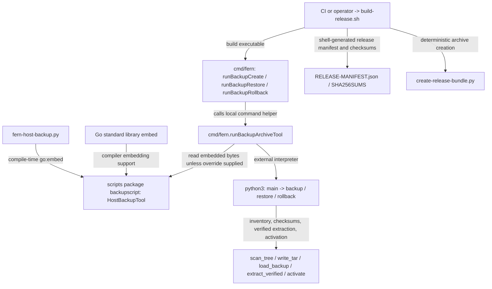

# Release, deployment, and backup tooling

See the [package map](../ARCHITECTURE.md#19-package-map) and [maintenance review](../docs/go-review.md).

This directory mixes one Go package with shell/Python operational tools. In the
current tree the Go package is **`backupscript`**, declared by `embed.go`; there
is no Go `release-metadata` main package here. Release metadata is currently
assembled by `build-release.sh`. This distinction matters when enumerating Go
packages or attributing benchmark results.

## Go package: backupscript

The package has one direct importer, `cmd/fern/backup.go`, and one standard-library
import, the blank `embed` import required by `go:embed`. It exports
`HostBackupTool []byte`, containing the canonical `fern-host-backup.py` source.
There are no runtime functions or internal Go call paths to profile: the compiler
embeds bytes, and the command package stages/executes them using Python.

The Python nodes are representative external call paths, not functions in the
Go package. No third-party Go modules are imported by `backupscript` itself.
The exported slice is mutable; callers should treat embedded source as read-only.

## Surrounding tools

| Tool | Responsibility |
| --- | --- |
| `build-release.sh` | Validate SemVer and clean source state, build Linux amd64/arm64 binaries, collect release/image provenance fields, hash assets, and package distribution. |
| `create-release-bundle.py` | Create the deterministic release tar/gzip bundle from staged assets. |
| `verify-release-tag.sh` | Validate release-tag inputs for the publication workflow. |
| `fern-host-backup.py` | Fail-closed backup/restore/rollback utility, both standalone asset and embedded source. |
| `test-release-workflow.sh` | Exercise release workflow contracts. |
| `test-deployment.sh` | Validate deployment assets and operator workflow assumptions. |
| `test-critical-coverage.sh` | Apply the repository's focused correctness/coverage checks. |

The release builder requires a clean tree and rechecks it before publishing its
local output. It records deterministic source time, Go version, checksums, and
explicit local-vs-published image metadata rather than fabricating attestations.
It stages systemd/configuration examples and release/backup/transaction schemas.
Read each script's usage/environment requirements before running it; a release
build is not a harmless compile command in an actively edited working tree.

## Current state and safety boundaries

The compatibility manifest declares task-store schema **4**, control-state schema
**2**, credential schema **1**, and no supported historical baseline. Runtime
resource spec **10** is a separate container identity contract. Release metadata
describes a pre-release reset, offline backup prerequisite, staged-filesystem
rollback, and **no runtime volume exports**.

Fern has one configuration model. The backup utility handles protected archive
inventory, checksums, generation/epoch validation, staged extraction, and rollback
receipts; it does not promise atomicity across filesystems, Docker, or GitHub.
The container harness owns run Git/PR work, and the removed host publisher and
verification services are not restored by these scripts.

## Naming and performance review

`backupscript.HostBackupTool` describes the current Go API well, though the import
path `scripts` hides that narrow role; use the established import alias. Moving
the embed package would require revisiting Go's relative embed-path restriction
and keeping the standalone/embedded utility identical. There is no benefit in
inventing a release-metadata package for documentation symmetry.

Run Git/PR operations belong to the container, not another host command.

Embedding contributes source bytes to binary size, not Python execution latency
at package initialization. Backup cost scales with inventory traversal, hashing,
archive I/O, and durability operations. Release cost includes cross-compilation,
checksumming, and compression. These require workload-specific measurements;
microbenchmarking access to `HostBackupTool` would not be meaningful.

External Python, Git, filesystem, archive, and release-service performance is
unmeasured. `go test ./scripts` compiles the embed
package; it does not execute or validate the shell/Python workflows.
