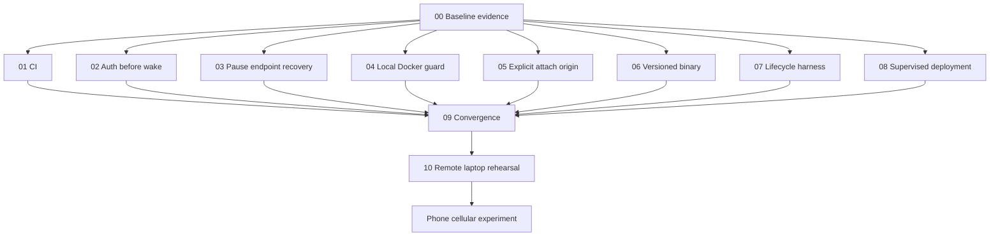

# Pre-Phone Parallel Work Plan

This directory splits pre-phone work into commit-sized tasks that can be developed in separate Git worktrees or by separate agents without editing the same files.

The objective is to make the first phone experiment secure, reproducible, deployable, and measurable. It is not to finish every possible Fern feature.

## Current Status

| Task | Status | Remaining evidence |
|---|---|---|
| `00` Baseline | Not run before implementation | Do not reconstruct or fabricate a pre-change baseline |
| `01` CI | Implemented and locally linted | First green GitHub-hosted run |
| `02` Authentication | Implemented; unit/race/vet pass | Real stopped-container scenario in task `07` |
| `03` Pause endpoint | Implemented; unit/race pass | Real/fault-injected lifecycle evidence |
| `04` Local Docker | Implemented; unit/race pass | Target-host local socket check |
| `05` Client origin | Implemented; unit tests pass | Actual Tailscale origin in task `10` |
| `06` Versioned binary | Implemented; cross-build/checksums pass | Install produced artifact on target host |
| `07` Harness | Implemented; syntax and unavailable-daemon path pass | Full run with Docker daemon |
| `08` Supervision | Implemented as reviewed examples | systemd verification and reboot on target Linux host |
| `09` Convergence | Implemented in worktree | Green hosted CI and Docker evidence |
| `10` Rehearsal | Not started | Requires target host and another network |

No task has been committed yet. The worktree contains pre-existing unrelated and research-document changes; preserve them when creating commits.

## Rules

1. Run task `00` first and start every Wave 1 branch from that baseline commit.
2. A task may edit only the files listed under **Owned files**.
3. Wave 1 tasks must not update `README.md`, `ROADMAP.md`, architecture documents, `Makefile`, or `fern.example.yaml`.
4. If implementation needs a file owned by another task, record the dependency instead of editing it.
5. Keep each task to one reviewable commit using its suggested commit message.
6. Rebase each branch onto the integration branch before merging and rerun its acceptance commands.
7. Task `09` is the only convergence commit allowed to update shared user-facing files.

## Dependency Graph



Tasks `01` through `08` are file-independent. Tasks `07` and `08` can be authored in parallel, but their final end-to-end verification happens after the relevant code branches merge.

## Waves

| Wave | Tasks | Execution |
|---|---|---|
| 0 | `00` | Run first and commit the known baseline |
| 1 | `01`-`08` | Develop in parallel from the Wave 0 commit |
| 2 | `09` | Merge, resolve semantic integration, update shared docs |
| 3 | `10` | Test through Tailscale from a laptop on another network |
| 4 | Phone experiment | Run only after task `10` passes |

## File Ownership Matrix

| Task | Owned existing files | Owned new paths |
|---|---|---|
| `00` Baseline | none | `evidence/pre-phone/baseline.md` |
| `01` CI | none | `.github/workflows/ci.yml` |
| `02` Authentication | `internal/proxy/proxy.go`, `cmd/fern/up.go` | `internal/proxy/auth.go`, `internal/proxy/auth_test.go` |
| `03` Pause endpoint | `internal/workspace/manager.go` | `internal/workspace/manager_pause_test.go` |
| `04` Local Docker | `cmd/fern/helpers.go` | `cmd/fern/docker_topology_test.go` |
| `05` Client origin | `cmd/fern/attach.go` | `cmd/fern/attach_origin_test.go` |
| `06` Versioned binary | `cmd/fern/main.go` | `cmd/fern/version.go`, `cmd/fern/version_test.go`, `scripts/build-release.sh` |
| `07` Harness | none | `integration/**`, `scripts/test-lifecycle.sh` |
| `08` Supervision | none | `deploy/systemd/**`, `docs/DEPLOYMENT.md` |
| `09` Convergence | shared docs/config/build files | no restriction within documented scope |
| `10` Rehearsal | none | `evidence/pre-phone/laptop-rehearsal.md`, `evidence/pre-phone/results/**` |

New test files are intentionally used instead of appending to existing test files. This reduces textual merge conflicts and makes each task's evidence easy to review.

## Suggested Worktrees

After task `00` is merged:

```bash
git worktree add ../fern-ci -b pre-phone/ci
git worktree add ../fern-auth -b pre-phone/auth
git worktree add ../fern-pause -b pre-phone/pause-endpoint
git worktree add ../fern-docker-local -b pre-phone/local-docker
git worktree add ../fern-origin -b pre-phone/origin
git worktree add ../fern-release -b pre-phone/release
git worktree add ../fern-integration -b pre-phone/integration
git worktree add ../fern-systemd -b pre-phone/systemd
```

Do not create worktrees from a dirty working tree without first preserving existing changes.

## Merge Order

The Wave 1 branches should have no textual conflicts. Use this semantic merge order:

1. `02-auth-before-wake`
2. `03-pause-endpoint-recovery`
3. `04-local-docker-only`
4. `05-explicit-client-origin`
5. `06-versioned-binary`
6. `07-lifecycle-harness`
7. `08-supervised-deployment`
8. `01-ci`
9. `09-convergence`

CI is merged late so it evaluates the integrated tree, although it can be developed first.

## Phone Entry Gate

- Missing or wrong credentials cannot wake a stopped workspace.
- Ambiguous pause outcomes cannot leave a trusted stale endpoint.
- Unsupported remote Docker topology fails before lifecycle mutation.
- Local and remote client origins are explicit.
- CI passes from a clean checkout.
- The release binary and immutable image identity are recorded.
- The lifecycle harness passes and retains raw timing/failure evidence.
- The supervised service survives reboot.
- A laptop on a different network can wake, attach, resume, disconnect, and observe idle stop.

## Explicitly Deferred

- setup/resume hooks;
- broad `doctor --json`;
- lifecycle ledger or quiescence seal;
- previews, artifacts, receipts, and webhooks;
- OpenCode V2 integration;
- Kubernetes and multiple workspaces;
- hosted control-plane features.
